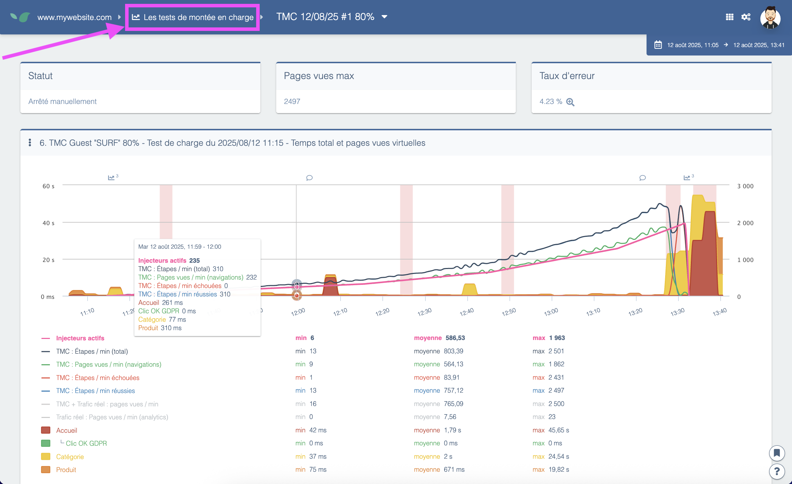

---
id: load-tests
title: Les tests de montée en charge
description: Introduction à la simulation de trafic important avec les tests de montée en charge
---

Les **Tests de montée en Charge** génèrent un trafic intense sur votre site afin d'évaluer sa réponse.
Ils vous permettent de voir comment votre site gère un grand nombre d'utilisateurs et d'identifier les points de congestion.

> Notez que les tests de charge génèrent réellement du trafic sur le site web, ce qui peut impacter les utilisateurs s'ils sont effectués sur un site en production. Les tests de charge peuvent également être réalisés dans des environnements de test.

Consultez notre [article dédié](../how-to-articles/performing-load-tests.md) pour en savoir plus sur ce module.

