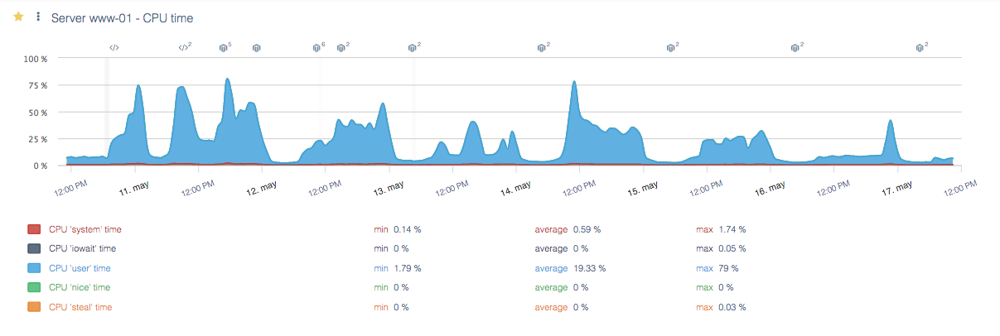

---
id: system-view
title: Les Données Système
--- 

Le module **Données Système** vous permet de surveiller la santé de l'infrastructure physique hébergeant votre application web.

Il est utile pour mesurer la capacité de vos serveurs et l'impact des modifications de votre site sur la charge de votre architecture.
Il peut également être utilisé pour comprendre comment les métriques d'hébergement (disque, RAM, réseau, etc.) influencent le temps de chargement des pages de votre site.

Consultez notre [article dédié](../performance-analysis/system-tab-indicators.md) pour en savoir plus sur ce module.

