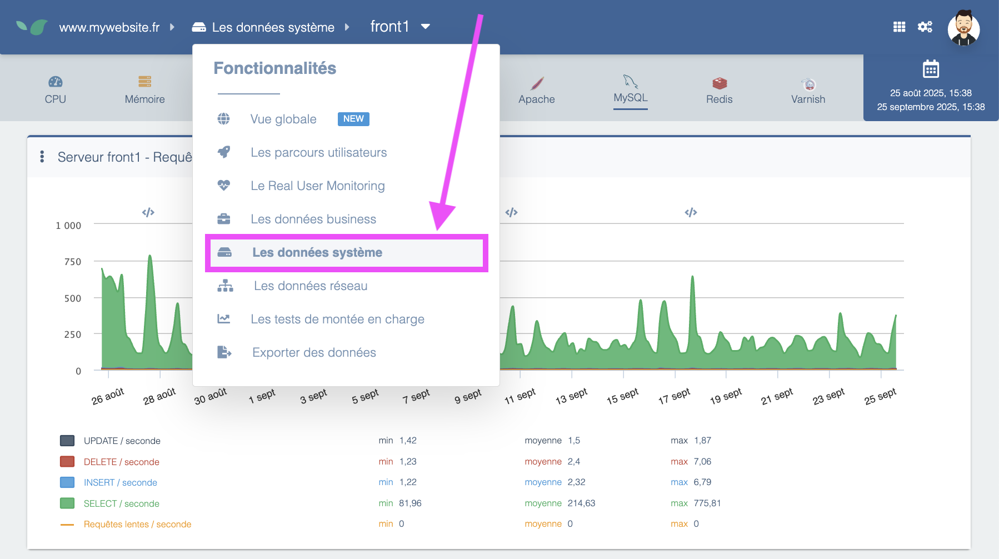

---
id: system-view
title: La vue Système
--- 

La section **Données système** permet l’analyse de **la bonne santé de la plateforme** qui héberge votre application Web. Pour y accéder, rendez-vous dans le menu principal, puis **Les données système**.

Pré-requis d’utilisation :

- avoir une licence Experience Monitoring **OPS**, **Full** ou **Enterprise**.
- utiliser une plateforme d’hébergement vous permettant d’installer des packages Linux, ce qui exclu les plateformes “full SaaS” comme Salesforce ou Shopify. Dans ces derniers cas, la visibilité offerte sur la plateforme est non pertinente car il est du ressort du prestataire SaaS de maintenir en bon fonctionnement l’application qu’il vous fournit.
- avoir installé les agents systèmes Experience Monitoring. Ils sont disponibles sous forme de packages Linux et nécessitent quelques minutes d’opération par un administrateur système afin d’être installés.

Les **bénéfices clés** apportés par la vue Système sont :

- une mesure précise et historisée de **la “charge serveur”**, soit l’activité générée par le site Internet sur la plateforme (pourcentage d’occupation CPU et mémoire). Cet indicateur est un élément essentiel à surveiller afin de s’assurer que la capacité d’accueil du site n’est pas en péril.
    

    
- des mesures d’**indicateurs “système”**, soit des états des espaces disques, bande passante réseau ou tout autre élément dont les limites peuvent mener à une potentielle panne du serveur.
- des mesures spécifiques à des applications installées sur l’architecture et nécessaire au fonctionnement de l’application : Apache, Nginx, MySQL, Redis, Memcached. Pour ces applications, Experience Monitoring propose **des indicateurs spécifiques** (ex: nombre de requêtes reçues par Redis, dont % de requêtes en cache ou hors cache, etc.).
    

    
Plutôt dédiée à un publique technique ou technophile, la vue Système se révèle particulièrement utile pour anticiper et comprendre d’éventuels dysfonctionnements de la plateforme d’hébergement, et pour vérifier que celle-ci est idéalement optimisée pour garantir le bon fonctionnement de votre application web. Ces informations système, mises en commun avec les autres mesures d'Experience Monitoring (temps de réponse des pages, trafic du site, etc.), vont se révéler très utiles pour **effectuer des corrélations** entre un problème sur la plateforme et un impact sur l’expérience du site.
