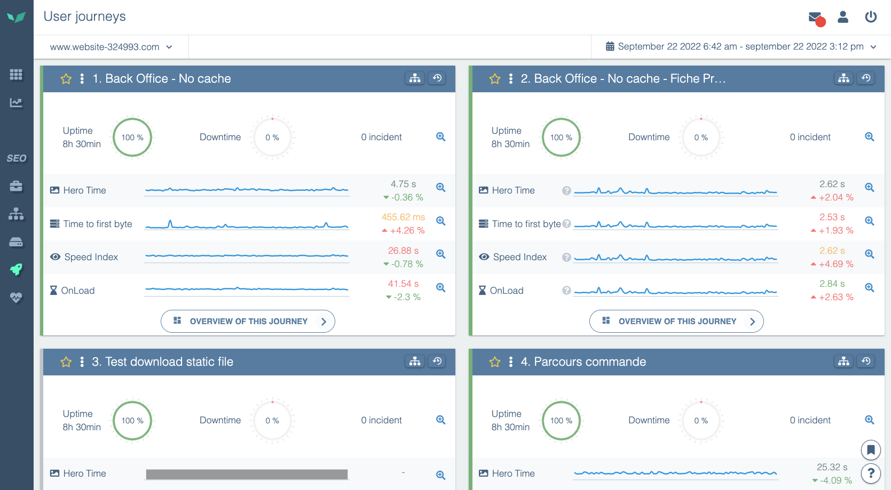

---
id: user-journey-screen
description: Parcourir l'écran de synthèse des parcours et ses actions
title: L’écran Parcours Utilisateurs
--- 

Sur la page "Parcours utilisateurs" vous retrouvez tous les scénarios qui ont été créés pour votre site.

Cette première page est une vue d'ensemble de tous vos scénarios. Elle vous permet d'analyser de manière rapide et efficace la performance de votre site.

Vous y trouverez d'abord, la **disponibilité** (uptime, downtime) ainsi que le nombre incidents par scénario sur la période que vous avez sélectionnée.

Puis on y voit apparaître la **moyenne** et la **variation** pour les 4 métriques de performance suivantes :

[Hero Time](../performance-analysis/metrics/hero-time.md)

[TTFB (”Time To First Byte”)](../performance-analysis/metrics/time-to-first-byte.md)

[Speed Index](../performance-analysis/metrics/speed-index.md)

[OnLoad](../performance-analysis/metrics/on-load.md)
