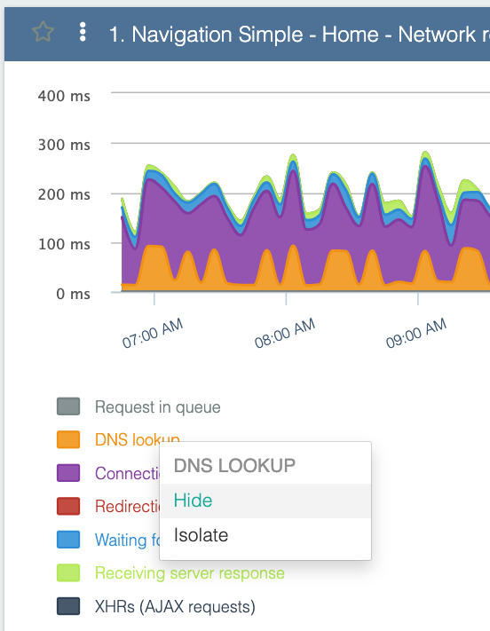
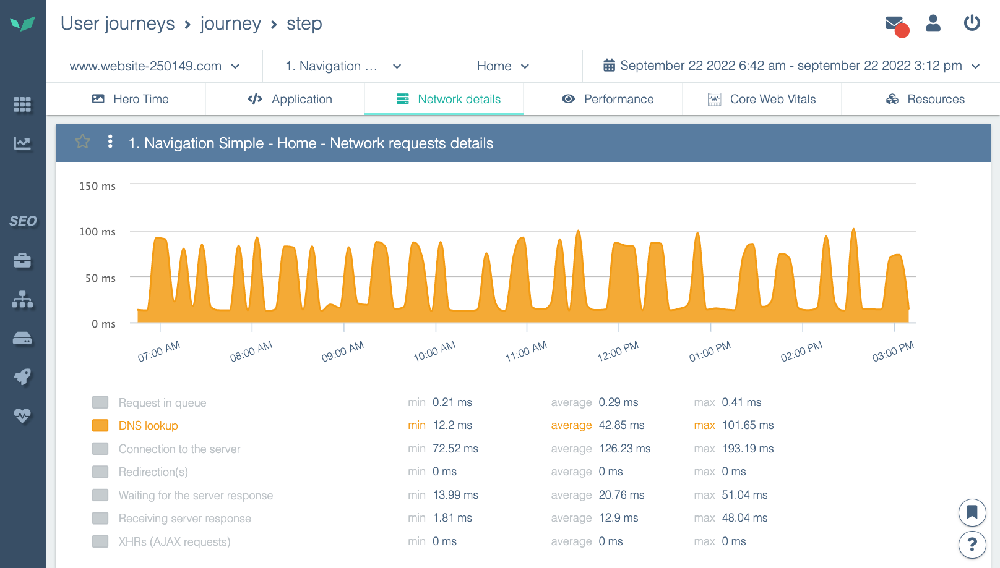

---
id: using-charts
title: Utiliser les graphiques
--- 

## Zoomer sur les graphs

Les graphs Experience Monitoring sont interactifs. Zoomez facilement sur la période qui vous intéresse : en utilisant l’action « glisser/déplacer » de la gauche vers la droite sur le graphique (et inversement pour dézoomer).

## Isoler et cacher les statistiques dans un graphique

Un graphique peut être composé de plusieurs statistiques qui se cumule. Par exemple, ici, on retrouve les détails des temps réseaux du chargement d’une page:

Pour y voir plus clair, vous pouvez:

- cacher une statistique (ne pas l’afficher)
- isoler une statistique (cacher toutes les autres)

Pour se faire, cliquer sur la statistique que vous voulez isoler ou cacher dans la légende, ou sur le graphique.

Choisissez ce que vous souhaitez faire avec cette statistique. Dans cet exemple, si l’on isole la statistique, nous verrons:

Rendez-vous dans l'article suivant pour aller plus loin:

[Accélérez votre site: applicatif ou configuration serveurs ?](../performance-analysis/speed-up-website-with-applications-or-server-configuration.md)
