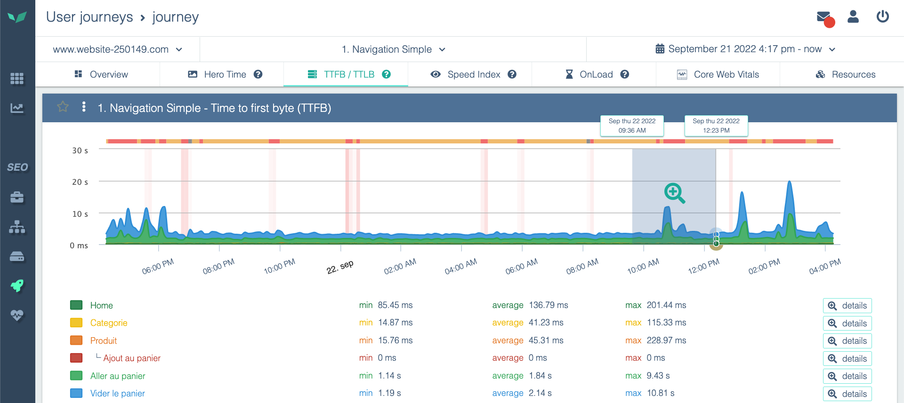

---
id: using-charts
title: Utiliser les graphiques
---

Une grande partie des informations collectées par Experience Monitoring est convertie en graphiques pour en faciliter la lecture.
Tous les graphiques sont interactifs et vous permettent de zoomer et de laisser des commentaires.

Les graphiques se trouvent dans les pages de vue d'ensemble de chaque module, ainsi que dans vos [tableaux de bord](../performance-analysis/dashboards.md) personnalisés.

Chaque graphique peut être téléchargé au format .png pour faciliter le partage des informations. Pour ce faire, cliquez sur l'icône appareil photo dans l'en-tête du graphique.

## Couleurs utilisées dans les graphiques

En plus de la couleur attribuée à chaque métrique dans un graphique, vous pouvez voir des zones rouges ou des zones grises.

- Les zones grises indiquent qu'aucune information n'est disponible pour cette période. C'est normal si vous venez de configurer votre [parcours utilisateur](../getting-started/synthetic-monitoring.md), par exemple, car il n'y a aucune donnée antérieure au démarrage de la sonde. Des zones grises isolées ne sont pas préoccupantes.
- Les zones rouges indiquent qu'Experience Monitoring a tenté de collecter les données pour ce graphique, mais a échoué. Des pics rouges isolés peuvent être dus à une grande variété de raisons et ne doivent pas être préoccupants. En revanche, des zones rouges étendues indiquent un problème sur une période donnée. Votre site est peut-être en panne ou l'a été.

## Manipuler et annoter les graphiques

### Zoom

Les graphiques d'Experience Monitoring sont interactifs.
Vous pouvez zoomer sur une période en cliquant et en faisant glisser de gauche à droite sur le graphique, et de droite à gauche pour dézoomer.

### Filtrage

Un graphique peut être composé de plusieurs statistiques cumulées. Vous pouvez choisir de masquer une métrique ou de l'isoler (afficher uniquement cette métrique) pour rendre le graphique plus lisible.

Pour ce faire, cliquez sur la métrique dans la légende du graphique ou directement sur le graphique.

### Annotations

Lorsqu'un changement survient en production — un nouveau déploiement, une mise à jour de configuration, une tâche planifiée — cela peut directement affecter vos données de supervision.
L'annotation avec des [marqueurs d'événements](../installation/monitor-production-events.md) vous permet de voir facilement si un changement dans vos métriques coïncide avec un déploiement ou une mise à jour de configuration.

### Commentaires

Vous pouvez laisser un commentaire sur les graphiques pour transmettre des informations à vos collègues ou vous laisser un rappel.
Pour ce faire, cliquez à l'intérieur du graphique, mais en dehors de toute métrique.

Si vous avez du mal à cliquer sur le moment précis où vous souhaitez laisser un commentaire, essayez de [zoomer](#zoom) ou d'utiliser les flèches latérales de la fenêtre de commentaire pour modifier l'heure minute par minute.

## Interagir avec les graphiques via l'API

Notre API est déclenchée par un appel HTTP à l'URL **https://app.quanta.io/api/events/push**. Les paramètres à fournir sont :

- **type** : Le type d'événement. Il peut prendre l'une des valeurs suivantes :
    - **code_deploy** (déploiement de code)
    - **config_change** (modification de la configuration système)
    - **comment** (commentaire)
    - **cron** (tâche planifiée)
    - **custom** (événement générique)
- **content** : Le message associé à l'événement. Ce champ est libre ; utilisez-le pour des informations telles que la version de l'application ou une description des modifications apportées.

## Authentification et génération de token

Vous devez également fournir un token API pour authentifier la requête. Ce token peut être généré depuis la section **Intégrations** des paramètres de votre site dans Experience Monitoring.

- Soit dans l'en-tête HTTP « Authorization » sous la forme `Authorization: Token <votre_token>`
- Soit directement dans la requête en ajoutant le paramètre `?auth_token=<votre_token>` à la fin de l'URL.

 Vous pouvez également ajouter une icône personnalisée.
