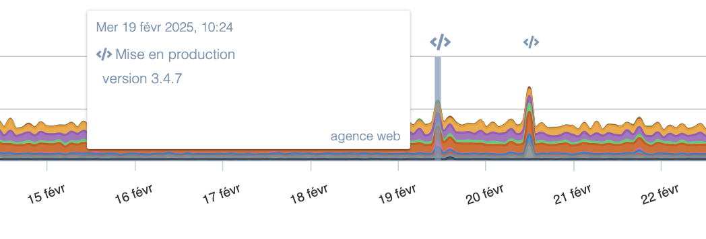

---
id: monitor-production-events
title: Ajouter des marqueurs d'évènements aux graphes
--- 

Lorsqu'un changement intervient en production — un nouveau déploiement, une mise à jour de configuration, une tâche planifiée —, cela peut avoir un impact direct sur vos données de supervision. La corrélation de ces événements avec les indicateurs de performance vous aide à déterminer si une hausse des erreurs ou une baisse de la disponibilité est liée à un changement récent.

Vous pouvez afficher des marqueurs sur tous vos graphiques afin de voir instantanément si une variation de vos indicateurs coïncide avec un déploiement ou une mise à jour de configuration.



Ces événements peuvent être créés **automatiquement** via notre API. La meilleure pratique consiste à intégrer un appel à notre API dans vos scripts de déploiement et dans vos outils de gestion de configuration, le cas échéant.

## Fonctionnement API

Notre API s’enclenche via un simple appel HTTP sur l'URL `https://app.quanta.io/api/events/push`, les paramètres à renseigner sont les suivants:

- *type*: Le type de l'évènement. Il peut avoir comme valeur au choix:
    - *code_deploy* (déploiement de code)
    - *config_change* (modification de configuration système)
    - *comment* (commentaire)
    - *cron* (tache planifiée)
    - *custom* (évènement générique)
- *content*: **Le message associé à l'évènement. Cela peut-être la version de l'application ou les modifications effectuées. Ce champ est libre.

## Authentification et génération de token

Vous devrez également spécifier un token API pour authentifier la requête. Ce token peut être généré dans la section "Intégrations" des paramètres de votre site dans Experience Monitoring. Vous avez également la possibilité d'ajouter une icône personnalisée.


Ce token devra être au choix:

- Inséré dans le header HTTP "Authorization" sous la forme *Authorization: Token `<`votre_token`>`*
- Passé directement dans la requête en ajoutant un paramètre ?*auth_token=`<`votre_token`>`* à la fin de l'URL

## Exemples d’utilisation

Voici un exemple de requête avec cURL qui ajoute un évènement de déploiement de code avec le message "version 42.0". On notera la présence du header "*Content-Type*" qui est indispensable pour que notre API puisse prendre en compte la requête :

```bash
curl -L -m 10 -X POST -d '{"type": "code_deploy", "content": "version 42.0"}' -H 'Content-Type: application/json' -H 'Authorization: <your_token_here>' https://app.quanta.io/api/events/push
```

Si vous souhaitez intégrer des évènements via un autre service qui ne permet pas d'effectuer de requêtes POST, vous pouvez également utiliser l'API via une requête GET. Par exemple, la commande suivante ajoute un évènement générique ("custom") en utilisant cURL :

```bash
curl -L -m 10 https://app.quanta.io/api/events/push?content=bonjour&type=custom&auth_token=<your_token_here>
```

>Dans les 2 commandes ci-dessus, l'option *-m* de cURL permet de positionner un timeout à 10 secondes afin de ne pas bloquer vos scripts en cas d'une indisponibilité éventuelle de notre API.

Notre API renverra un code HTTP 200 en cas de succès et un code 5xx ou 4xx en cas d'erreur. La réponse contiendra un contenu JSON avec le champ "error" en cas d'erreur ou "success" en cas de réussite.
