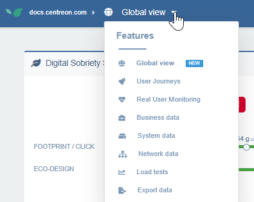
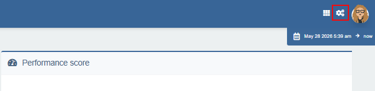

---
id: navigate-in-experience-monitoring
title: Naviguer dans Experience Monitoring
---

Dans l'interface Centreon Experience Monitoring, vous pouvez :

1. [Changer de site](#changer-de-site).
2. [Changer de module](#changer-de-module) (parcours utilisateurs, RUM...).
3. Accéder à la page des [tableaux de bord](../dashboards.md), à la page de configuration du module dans lequel vous vous trouvez, ou à votre profil [utilisateur](../../configuration/manage-users-and-rights.md).
4. [Modifier la période couverte par les données affichées](#modifier-la-période-couverte-par-les-données-affichées).

## Organisations et sites

La plateforme vous permet d'organiser et de superviser plusieurs sites web depuis un seul compte.

* Les organisations contiennent un ou plusieurs sites — par exemple, des organisations distinctes pour différentes unités métier ou différents clients. Les [droits utilisateurs](../../configuration/manage-users-and-rights.md) sont définis au niveau de l'organisation.
* Les sites sont des sites web individuels au sein d'une organisation. Une configuration courante consiste à avoir des sites distincts pour différents environnements, tels que la production et la pré-production.

### Changer de site

* Survolez le nom du site dans la barre de navigation supérieure pour ouvrir le panneau **Sites**, puis cliquez sur n'importe quel site de la liste pour y accéder.
* Si nécessaire, utilisez le champ de recherche pour filtrer les sites par nom.

   

Les comparaisons multi-sites ne sont possibles qu'à partir des [tableaux de bord](../dashboards.md). Vous pouvez comparer les données de performance de plusieurs sites côte à côte, ou agréger les métriques de plusieurs sites en une vue unique.

### Ajouter un site à une organisation

1. Survolez le nom du site dans la barre de navigation du haut pour ouvrir le panneau **Sites**, puis cliquez sur **Accéder à la page de l'organisation** pour l'organisation souhaitée.

   

   Vous pouvez également accéder à la page de l'organisation en cliquant sur votre icône de profil en haut à droite, puis sur **Organisations**.

2. Cliquez sur l'onglet **Licences & Sites**. Le nombre de sites dans cette organisation est affiché à droite.
3. Cliquez sur **Créer un site**.
4. Saisissez l'URL de la page d'accueil, puis cliquez sur **Créer** et confirmez. Le site apparaît dans la liste des sites de la page ainsi que dans le sélecteur de sites.

## Changer de module

La barre de navigation horizontale (en haut à gauche) vous permet de basculer entre les modules d'Experience Monitoring ([**Parcours utilisateurs**](../../getting-started/synthetic-monitoring.md), [**Système**](../../getting-started/system-view.md), [**Real User Monitoring**](../../getting-started/real-user-monitoring.md), etc.).

## Modifier la période couverte par les données affichées

Un sélecteur de plage temporelle (en haut à droite) vous permet de modifier à tout moment la période analysée. Cette période affecte tous les indicateurs et tableaux de bord (à l'exception du widget **Live** dans RUM). Cela est utile pour observer l'évolution des temps de réponse d'un site sur des jours, des semaines ou des mois. Par défaut, Experience Monitoring affiche les dernières 24 heures et se rafraîchit toutes les minutes pour afficher les dernières mesures en temps réel.

Un zoom sur une période dans un graphique (par un cliquer-glisser) met automatiquement à jour le sélecteur de plage temporelle.

## Personnaliser la page Vue globale

Lors de votre première connexion à Experience Monitoring, vous arrivez par défaut sur la page **Vue globale**. Sélectionnez le site souhaité, puis cliquez sur **Paramètres** en haut à droite pour affiner ce que la page affiche pour ce site.

### Parcours utilisateurs pris en compte dans les calculs

Cette section définit quels parcours utilisateurs sont utilisés pour calculer les scores dans la **Vue globale**, pour les widgets **Score de performance** et **Disponibilité des parcours**. Elle affecte également le widget **Score de sobriété numérique** [si les calculs sont basés sur les parcours utilisateurs](#source-de-données-des-calculs-pour-le-score-de-sobriété-numérique).

Deux modes sont disponibles :

- **Tous les parcours utilisateurs** — chaque parcours utilisateur configuré contribue aux calculs.
- **Uniquement les parcours sélectionnés** — sélectionnez manuellement les parcours utilisateurs à inclure à l'aide des cases à cocher. Cela est utile pour exclure les parcours de test ou les parcours qui ne sont pas représentatifs de l'expérience utilisateur réelle.

### Source de données des calculs pour le score de sobriété numérique

Sélectionnez si vous souhaitez que le widget **Score de sobriété numérique** affiche des données basées sur STM ou RUM.

### Référence de capture d'écran du site

Sélectionnez la capture d'écran que vous souhaitez voir apparaître dans la page **Vue globale** pour ce site : choisissez parmi les miniatures de vos parcours utilisateurs.
