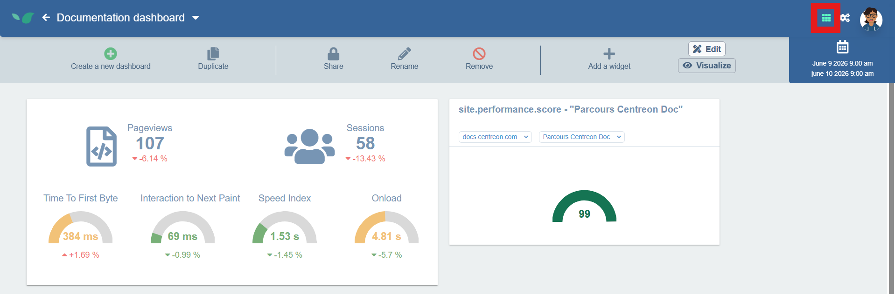

Les tableaux de bord sont un espace personnalisable avec des widgets permettant de regrouper en un seul endroit les informations dont vous avez besoin depuis Experience Monitoring.
Tandis que la **Vue globale** offre un aperçu des performances générales du site, les **tableaux de bord** permettent d'obtenir des informations spécifiques et détaillées.
Les widgets peuvent être librement déplacés, redimensionnés et configurés pour afficher différents ensembles de données.

Les tableaux de bord sont accessibles à tout moment via le bouton en haut à droite de votre écran.

Dans Experience Monitoring, vous pouvez appartenir à plusieurs organisations, et chaque organisation peut inclure la supervision de plusieurs applications web.
Les tableaux de bord sont utiles pour afficher les informations de plusieurs organisations plutôt que de naviguer de l'une à l'autre pour vérifier leur état et leurs performances.

Les tableaux de bord sont créés pour votre usage privé par défaut, mais peuvent être partagés avec les autres membres de votre organisation.

Utilisez la barre de navigation pour passer d'un tableau de bord à l'autre.

## Créer des tableaux de bord

1. Sur la page **Tableaux de bord**, cliquez sur **Créer un nouveau tableau de bord**.
2. Choisissez un nom pour le tableau de bord et cliquez sur **Enregistrer**.
3. Une fenêtre s'ouvre pour vous permettre de sélectionner les widgets à ajouter à ce tableau de bord ; un aperçu du widget est affiché à droite. Vous pouvez sélectionner plusieurs widgets à la fois.
Il s'agit simplement d'un point de départ ; vous pourrez ajouter d'autres widgets ultérieurement.
4. Cliquez sur **Créer le(s) widget(s)**.

Notez que pour créer des widgets, le tableau de bord doit être en mode **Édition**. Vérifiez que c'est bien le cas en haut à droite : le bouton **Édition** doit être plus lumineux que le bouton **Visualiser**.
**Visualiser** supprime la possibilité de modifier ou de déplacer les widgets pour une meilleure prévisualisation de votre tableau de bord.

Une fois les widgets créés, vous pouvez les redimensionner librement depuis leur coin inférieur droit. Vous pouvez également les faire glisser pour les repositionner dans le tableau de bord.
Les modifications de taille et de position des widgets sont automatiquement enregistrées.

### Configurer les widgets

Chaque widget ajouté au tableau de bord possède une zone d'en-tête.

Cette zone indique le site auquel le widget est associé et, dans certains cas, la configuration et la métrique concernées.
Vous pouvez cliquer sur le menu déroulant correspondant pour modifier le site, la configuration et la métrique affichés par le widget.

De plus, grâce aux boutons situés en haut à droite du widget, vous pouvez masquer l'en-tête pour gagner de la place, dupliquer le widget ou le supprimer du tableau de bord.

Sur la même ligne que le bouton **Créer un nouveau tableau de bord**, vous trouverez des boutons permettant de dupliquer le tableau de bord que vous consultez actuellement. Cela dupliquera également tous les widgets avec leur configuration actuelle.

Vous pouvez également choisir de partager ce tableau de bord avec votre organisation, de le renommer ou de le supprimer entièrement.
