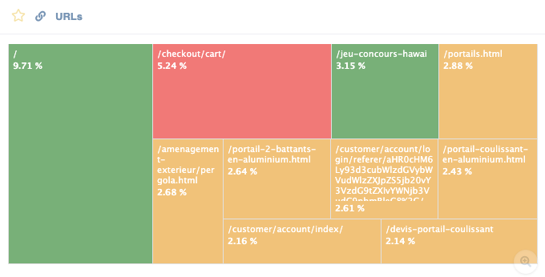

Le RUM vous permet d'analyser en temps réel l'expérience réelle des utilisateurs sur votre site. Les données RUM capturent 100 % du trafic réel d'un site : ainsi, chaque fois qu'un utilisateur charge une page ou clique sur un lien, une donnée de performance est enregistrée.

C’est ce qui le distingue fondamentalement du [monitoring synthétique](../getting-started/synthetic-monitoring.md), qui ne teste qu’un ensemble prédéfini de pages ou de parcours utilisateur selon un planning fixe. Avec RUM, vous ne choisissez pas à l’avance ce qu’il faut mesurer : les données couvrent naturellement toutes les pages que les utilisateurs visitent réellement, pondérées en fonction de la fréquence à laquelle ils les consultent.

## Comment ça marche ?

RUM fonctionne grâce à [un tag léger et asynchrone ajouté à la page](../installation/real-user-monitoring-installation.md), qui renvoie des données à Centreon Experience Monitoring.

* Cela ne ralentit pas la navigation de l'utilisateur sur le site.
* Les données collectées sont purement techniques (aucun identifiant personnel), ce qui les rend conformes au RGPD et permet une segmentation par type de navigateur sans suivre les utilisateurs individuellement.

## Quels sont les principaux avantages ?

* Mesure objective des performances : comme la mesure s'effectue à partir des navigateurs des utilisateurs réels, les problèmes spécifiques à certains navigateurs ou appareils (par exemple, des performances médiocres sur Safari) sont immédiatement visibles et quantifiables en fonction de leur impact sur le trafic.

   

* Couverture exhaustive des pages : contrairement au [monitoring synthétique](../getting-started/synthetic-monitoring.md) qui ne teste que des pages ou des parcours prédéfinis, le RUM capture automatiquement les indicateurs de performance (TTFB, Speed Index, temps de chargement complet de la page, etc.) à chaque visite de page, offrant ainsi une vue d’ensemble complète et en temps réel des performances sur l’ensemble du site.

   

En résumé, RUM ne vous oblige pas à anticiper ce qu’il faut surveiller : il établit automatiquement un tableau des performances de l’ensemble de votre site, en fonction des actions réelles de vos utilisateurs.
