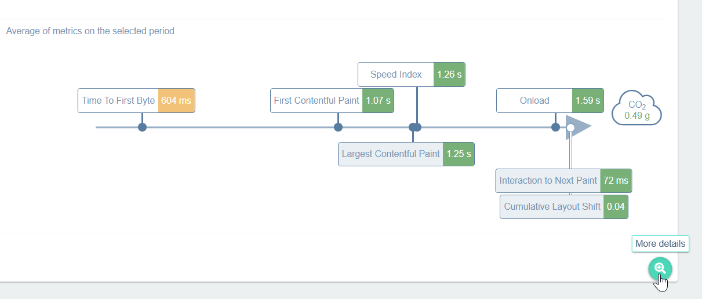
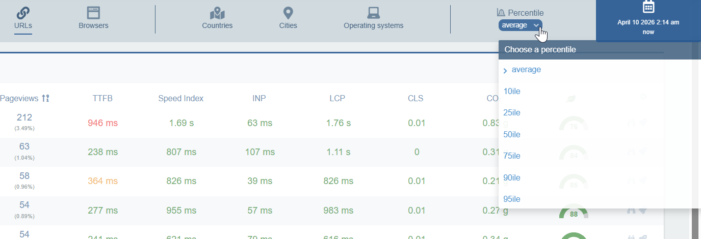

Une fois RUM [configuré](../installation/real-user-monitoring-installation.md), cliquez sur **Real User Monitoring** dans la barre de navigation en haut de l'écran. Cliquez sur les onglets situés sous la barre de navigation pour afficher les données qui vous intéressent.

## Ce que RUM peut vous apprendre

Les [indicateurs de surveillance de l’expérience utilisateur](../performance-analysis/metrics/overview-of-metrics.md) et les [données de sobriété numérique](../digital-sobriety/digital-sobriety-concepts.md) sont détaillés dans chaque onglet et présentés sous forme de visuels, de graphiques ou de tableaux, agrégés selon différents critères.

* Un aperçu de la situation au cours des 30 dernières minutes est présenté dans la section **LIVE**. Cas d’utilisation typique : un collègue ou le service client signale que le site est lent. Accédez à la vue **Live** pour vérifier immédiatement si les données s’écartent de la normale.

   > Attention : seule la section **Live** affiche les 30 dernières minutes. Toutes les autres données de la page correspondent à la période définie dans le filtre (encadré bleu dans le coin supérieur droit).

* **Pages les plus visitées** :
   * Dans l'onglet **Récapitulatif et live**, une carte arborescente présente une vue graphique de vos pages les plus visitées. En cliquant sur une URL dans la carte arborescente, vous affichez les données détaillées relatives à cette URL (sous le tableau), dans l'onglet **URL**.
   * Pour obtenir un tableau détaillé de toutes les URL, utilisez l’onglet **URL**.
   * Dans l’onglet **URL**, cochez la case à gauche pour afficher des graphiques relatifs à une URL spécifique ou pour comparer les données de plusieurs URL (cliquez sur le bouton **Comparer** situé sous le tableau).
* **Données géographiques** :
  * Dans l’onglet **Récapitulatif et live**, vous pouvez voir une carte indiquant où se trouvent vos utilisateurs. Cliquez sur un pays pour afficher les données détaillées le concernant.
  * Consultez les onglets **Pays** et **Villes** pour obtenir des données agrégées plus détaillées.
* **Données de sobriété numérique** : les scores agrégés d’éco-conception et les émissions de CO2 sont inclus dans tous les onglets.
* **Données système** : consultez les informations relatives aux navigateurs et aux systèmes d’exploitation de vos utilisateurs dans les onglets **Navigateur** et **Système d’exploitation**. L’onglet **Vue globale** affiche un graphique en anneau représentant l’utilisation totale des navigateurs.

<!---->

## Filtrage des données RUM

Par défaut, les données RUM sont présentées sous forme de moyennes. Vous pouvez utiliser les centiles pour vous concentrer sur des segments spécifiques des données.

Les centiles allant de 10ile à 95ile illustrent la distribution des valeurs, de « rapide/faible » à « lent/élevé » :

* 10ile = affiche uniquement les meilleures expériences
* 50ile = affiche l'expérience utilisateur typique (médiane)
* 95ile = affiche uniquement les expériences les plus lentes.

> Le 75e centile est le plus important. C'est le centile que Google utilise pour évaluer la vitesse des sites web dans le cadre de son propre programme mondial de supervision des utilisateurs réels (Real User Monitoring). L'évaluation complète par Google des performances d'un site web repose sur le 75e centile.
