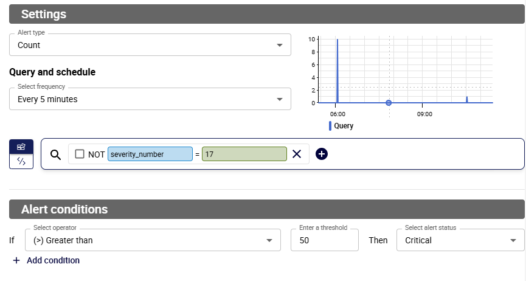
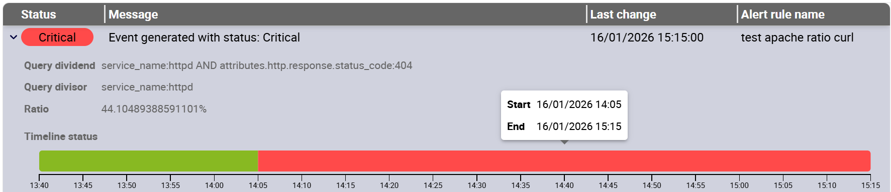

import Tabs from '@theme/Tabs';
import TabItem from '@theme/TabItem';

## Des logs aux évènements d'alerte

Les logs ont un [niveau de sévérité](./resources/glossary.md#sévérité) (c'est-à-dire un niveau de log) qui indique la sévérité d'un évènement. Cependant, le niveau de sévérité ne vous renseigne que sur la nature d'un seul log. Un seul log ne suffit pas. Les logs doivent souvent être analysés ensemble.

Par exemple, une entrée de log INFO peut simplement enregistrer qu'un utilisateur a tenté de se connecter. Mais si vous constatez 300 tentatives de connexion (et donc 300 entrées INFO) en 10 secondes, cela suggère un problème.

Pour détecter ce type de problème, vous devez créer des règles d'alerte.

Une règle d'alerte évalue des critères spécifiques sur une période et à une fréquence données. Chaque fois que ces critères sont évalués, un [évènement d'alerte](./resources/glossary.md#évènement-dalerte) est généré, avec un [statut](#statuts-dévènements-dalerte). Par exemple, une règle d'alerte peut être décrite comme suit :
"Si cette requête renvoie plus de 50 résultats au cours des 5 dernières minutes, un évènement d'alerte avec le statut CRITIQUE doit être enregistré."

* type d'alerte : count
* fréquence : 5 minutes
* conditions d'alerte : si > 50, alors statut d'alerte = CRITICAL

### Statuts d'évènements d'alerte

Les différents statuts d'évènements d'alerte possibles sont les suivants :

* **CRITICAL**
* **ERROR**
* **WARNING**
* **OK**
* **UNKNOWN**

## Définir une règle d'alerte

<!--Pour le programme BETA, vous pouvez créer jusqu'à 10 règles d'alerte.-->

1. Allez à la page **Alerts & notifications > Alert rules**.
2. Cliquez sur **Add**.
3. Dans la fenêtre qui s'affiche, entrez un nom et une description pour votre règle d'alerte, puis définissez les critères souhaités.
   * **Alert type**: 
      * **Count** signifie que la requête renverra le nombre d'entrées de log correspondant à la requête.
      * **Ratio** signifie que vous divisez les résultats d'une requête par les résultats d'une autre requête.
   * **Frequency**: ce champ définit à la fois la fréquence des contrôles et la période couverte par chaque contrôle. Par exemple, si vous sélectionnez **Every 5 minutes**, un contrôle sera effectué toutes les 5 minutes sur les données des 5 dernières minutes.
   * **Query**: utilisez la [syntaxe de requête](query-syntax.md) correcte.
   * **Conditions**: définit quel [statut d'alerte l'évènement d'alerte doit avoir](#statuts-dévènements-dalerte).
4. Enregistrez votre règle d'alerte. La fenêtre se ferme et votre règle d'alerte apparaît dans la liste des règles d'alerte. La règle commence à être évaluée et à générer des évènements d'alerte.

## Afficher le dernier évènement d'alerte pour chaque règle

Allez à la page **Alerts & notifications > Alert events**. Utilisez la barre de recherche et son bouton de filtre pour trouver les évènements d'alerte désirés.

Vous pouvez développer chaque évènement d'alerte pour afficher plus d'informations à son sujet, notamment l'historique de l'évaluation de la règle d'alerte. Passez la souris sur le graphique pour afficher les dates de début et de fin de chaque période passée dans un statut.

