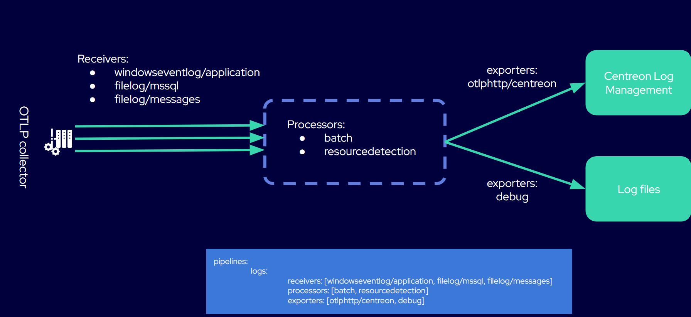

import Tabs from '@theme/Tabs';
import TabItem from '@theme/TabItem';

Voici deux exemples de configurations simples. Si vous souhaitez collecter plusieurs types de logs à partir d'un même hôte, utilisez la page [Configuration complète de collecteur (sources de logs multiples)](collector.md).

## Exemple 1 : Configuration rapide pour commencer à collecter les logs de l'Observateur d'événements Windows

1. Sur une machine Windows, [installez l'OpenTelemetry Collector](https://github.com/open-telemetry/opentelemetry-collector-releases/releases/download/v0.147.0/otelcol-contrib_0.147.0_windows_x64.msi).

2. Dans Centreon Log Management, [générez un jeton pour authentifier l'hôte auprès de votre plateforme Log Management](../administration/tokens.md).

3. Sur votre machine Windows, modifiez le fichier **config.yaml** qui a été créé dans le répertoire où vous avez installé OpenTelemetry Collector. Par défaut, il se trouve ici :

   ```shell
   C:\Program Files\OpenTelemetry Collector\config.yaml
   ```

4. Remplacez le contenu du fichier par l'extrait ci-dessous (remplacez **mytoken** par votre jeton). Veillez à enregistrer le fichier en tant qu'administrateur.

   ```yaml
   # Copyright 2025 Centreon.
   # SPDX-License-Identifier: Apache-2.0

   exporters:
     otlphttp/centreon: # The exporter that will send logs to Log Management
       endpoint: "https://api.euwest1.obs.mycentreon.com/v1/ingress/otlp"
       headers:
         "X-Api-Key": "mytoken" ## Replace mytoken by your actual token
     debug: # The exporter that will write debug info to log files
       verbosity: detailed
   
   processors:
     batch: # This processor optimizes performance.
     resourcedetection: # This processor enriches ALL logs with the information defined below.
       detectors: ["system"]
       system:
         resource_attributes: # Each log entry will include the 4 attributes listed below.
           host.name:
             enabled: true
           os.name:
             enabled: true
           os.type:
             enabled: true
           os.version:
             enabled: true
   
   receivers:
     windowseventlog/application:
       channel: application
       operators:
         - type: severity_parser
           parse_from: body.level
           overwrite_text: true
           mapping:
             fatal:
               - Critical
               - Critique
             error:
               - Error
               - Erreur
             warn:
               - Warning
               - Avertissement
             info:
               - Informational
               - Information
         - type: copy
           from: body.execution.process_id
           to: attributes["process.pid"]
         - type: copy
           from: body.provider.name
           to: resource["event.provider.name"]
         - type: copy
           from: body.provider.guid
           to: resource["event.provider.guid"]
           if: "body.provider.guid != ''"
         - type: copy
           from: body.event_id.id
           to: attributes["event.id"]
         - type: copy
           from: body.record_id
           to: attributes["event.record.id"]
         - type: copy
           from: body.task
           to: attributes["event.task"]
         - type: move
           from: body.message
           to: body
         - type: add
           field: resource["service.version"]
           value: "1.0.0"
         - type: add
           field: resource["service.name"]
           value: "windows-event-log"
         - type: add
           field: resource["service.namespace"]
           value: "application"
   
   service:
     pipelines: # This defines the order in which the collector runs its components.
       logs:
         receivers: [windowseventlog/application]
         processors: [batch, resourcedetection]
         exporters: [otlphttp/centreon]
   ```

5. redémarrez le service OpenTelemetry Collector.

   ```shell
   net stop otelcol-contrib
   net start otelcol-contrib
   ```

   Vous devriez commencer à recevoir des logs dans Centreon Log Management.

## Exemple 2 : Un fichier de configuration avec 3 sources de logs

Dans l'exemple suivant, nous recevons des données provenant de trois sources différentes sur le même serveur Windows. Les logs transitent par un seul pipeline. Toute la configuration est regroupée dans le fichier **config.yaml** du collecteur. (Suivez la même procédure que pour l'exemple 1 et adaptez le fichier de configuration ci-dessous.)



```yaml
# Copyright 2025 Centreon
# SPDX-License-Identifier: Apache-2.0

exporters:
  otlphttp/centreon: # The exporter that will send logs to Log Management
    endpoint: "https://api.euwest1.obs.mycentreon.com/v1/ingress/otlp"
    headers:
      "X-Api-Key": "mytoken" ## Replace mytoken by your actual token
  debug: # The exporter that will write debug info to log files
    verbosity: detailed

processors:
  batch: # This processor optimizes performance.
  resourcedetection: # This processor enriches ALL logs with the information defined below.
    detectors: ["system"]
    system:
      resource_attributes: # Each log entry will include the 4 attributes listed below.
        host.name:
          enabled: true
        os.name:
          enabled: true
        os.type:
          enabled: true
        os.version:
          enabled: true

receivers:

  windowseventlog/application: # You will receive logs from the Windows Application Event Log.
    channel: application
    operators:
      - type: severity_parser
        parse_from: body.level
        overwrite_text: true
        mapping:
          fatal: [Critical, Critique]
          error: [Error, Erreur]
          warn: [Warning, Avertissement]
          info: [Informational, Information]
      - type: move
        from: body.message
        to: body
      - type: add
        field: resource["service.namespace"]
        value: "application"
      - type: add
        field: resource["service.name"]
        value: "windows-event-logs"

  filelog/mssql: # You will receive logs from Microsoft SQL Server log files.

    include: 
      - 'C:\Program Files\Microsoft SQL Server\MSSQL16.MSSQLSERVER\MSSQL\Log\ERRORLOG'
    encoding: utf-16le
    start_at: end
    multiline:
      line_start_pattern: '^\d{4}-\d{2}-\d{2}' 
    operators:
      - type: regex_parser
        regex: '^(?P<time>\d{4}-\d{2}-\d{2} \d{2}:\d{2}:\d{2}\.\d+)\s+(?P<source>[^\s]+)\s+(?P<msg>(?s).*)'
        timestamp:
          parse_from: attributes.time
          layout: '%Y-%m-%d %H:%M:%S.%f'
      - type: add
        field: resource["service.name"]
        value: "mssql-server"  

  filelog/messages: # You will receive logs from the system log files specified in the "include" attribute.
    include:
      - /var/log/messages
    include_file_path: true
    operators:
      - type: regex_parser
        regex: '^(?P<ts>\w{3}\s\d{2}\s\d{2}:\d{2}:\d{2})\s(?P<hostname>[\w_-]+)\s(?P<process>[\w_-]+)(\[(?<pid>\d+)\])?:\s(?<body>.*)$'
        timestamp:
          parse_from: attributes["ts"]
          layout: '%b %d %H:%M:%S'
      - type: move
        from: attributes["pid"]
        to: attributes["process.pid"]
      - type: move
        from: attributes["process"]
        to: resource["service.name"]
      - type: remove
        field: attributes["ts"]
      - type: move
        from: attributes["body"]
        to: body
      # Add a service version, the template version
      - type: add
        field: resource["service.version"]
        value: '1.0.0'
      # Remove the hostname, use the resource detectors
      - type: remove
        field: attributes["hostname"]

service:
  pipelines: # This defines the order in which the collector runs its components.
    logs:
      receivers: [windowseventlog/application, filelog/mssql, filelog/messages]
      processors: [batch, resourcedetection]
      exporters: [otlphttp/centreon, debug]

```
