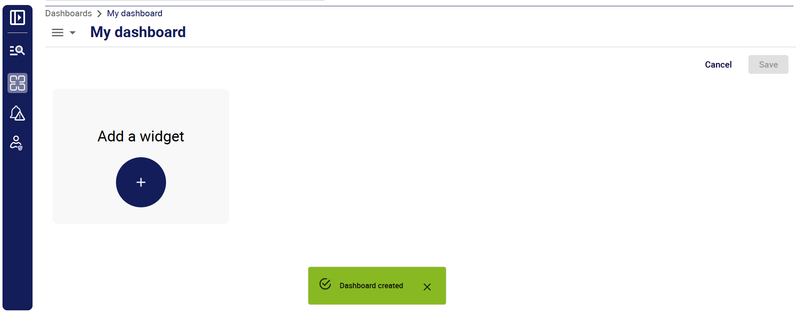
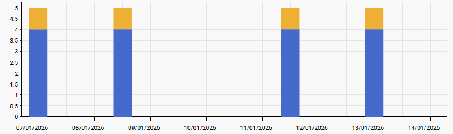

import Tabs from '@theme/Tabs';
import TabItem from '@theme/TabItem';

Les tableaux de bord sont créés à l'aide de widgets. Ils vous permettent d'afficher du [texte](#generic-text) et des [graphiques](#metrics-graph) qui présentent le nombre de logs reçus en fonction de paramètres spécifiques.

## Créer un tableau de bord

1. Pour créer un tableau de bord, dans la page **Dashboards**, cliquez sur **Add**.
2. Dans la fenêtre qui s'ouvre, entrez un nom (obligatoire) et une description (facultative), puis cliquez sur **Create**. Un tableau de bord vierge apparaît.

3. [Ajoutez des widgets](#ajouter-un-widget-à-un-tableau-de-bord) à votre tableau de bord.
4. Enregistrez chaque widget au fur et à mesure que vous le créez ou le modifiez, puis enregistrez le tableau de bord lui-même. Le tableau de bord apparaît dans la liste des tableaux de bord.

## Ajouter un widget à un tableau de bord

1. Si vous n'êtes pas déjà dans votre tableau de bord, [éditez-le](#éditer-un-tableau-de-bord).
2. Dans le tableau de bord, cliquez sur **Add a widget** : l'écran affiche l'écran de création de widget.
2. Sélectionnez un type de widget : le reste de l'écran est mis à jour pour afficher les paramètres de ce type de widget.
3. [Utilisez les paramètres disponibles pour configurer votre widget](#widgets-disponibles).
4. Lorsque vous avez terminé de configurer votre widget, cliquez sur **Enregistrer** dans le coin inférieur droit. Cela enregistre uniquement le widget : veillez à également enregistrer votre tableau de bord avant de faire quoi que ce soit d'autre.

## Éditer un tableau de bord

À la page **Dashboards**, cliquez sur le nom du tableau de bord que vous souhaitez modifier. Le tableau de bord s'ouvre. Cliquez sur **Edit dashboard** dans le coin supérieur droit pour passer en mode édition.

Modifiez chaque widget souhaité, en enregistrant vos modifications pour chaque widget. Enregistrez ensuite le tableau de bord lui-même.

## Éditer un widget

Lorsque vous modifiez un tableau de bord, cliquez sur les trois points situés dans le coin supérieur droit d'un widget pour passer en mode édition.
Une fois que vous avez modifié votre widget, enregistrez-le, puis enregistrez le tableau de bord lui-même.

## Widgets disponibles

### Generic text

Utilisez ce widget pour insérer des titres, des informations ou des liens dans vos tableaux de bord. Utilisez la barre d'outils pour mettre en forme la description.

### Log viewer

Utilisez ce widget pour afficher la liste des logs correspondant à une requête spécifique au cours des n dernières minutes. Dans le tableau généré, cliquez sur **Show in context** à droite pour afficher un log dans la page **Log explorer**, ainsi que les logs des 2 minutes précédentes et suivantes correspondant à la requête.

### Metrics graph

Ici, "metrics" désigne le nombre d'entrées de logs correspondant à une requête spécifique, ou le rapport obtenu en divisant une requête par une autre requête. Le nombre de logs obtenu peut être ventilé en fonction d'un autre paramètre. Dans l'exemple ci-dessous, chaque barre représente le nombre de logs INFO et ERROR pour un service pendant une période donnée.

Sélectionnez les paramètres souhaités dans la partie gauche de l'écran.

* Le type de widget (ici, **Metrics graph**).
* Un titre et une description. Ceux-ci seront affichés en permanence dans le widget.
* Configurez l'aspect du graphique à l'aide de la section **Display settings**.
* La période que vous souhaitez voir couverte par le graphique.

#### Dataset selection

Dans la partie droite de l'écran, définissez les données que vous souhaitez afficher. Le graphique peut afficher plusieurs séries de données.  Chaque série est définie par un "dataset" (jeu de données). Un dataset possède les paramètres suivants :

* **Name** : ce sera le nom de la série de données dans la légende du graphique.
<!-- * **Datasource** : **Centreon Log Management** signifie que le graphique utilisera [les données envoyées à Centreon Log Management par vos collecteurs OpenTelemetry](./collector/collector.md). -->
* **Query** : utilisez la [syntaxe de requête](query-syntax.md) correcte.
* **Operation** :

   * **Count** signifie que la requête renverra le nombre d'entrées de log correspondant à la requête.
   * **Ratio** signifie que le nombre de résultats d'une requête sera divisé par le nombre de résultats d'une autre requête.
  
Si vous affichez le graphique en mode **Line**, chaque dataset produira une courbe. Si vous affichez le graphique en mode **Bar**, chaque dataset produira une barre. À l'intérieur de chaque barre, les données seront empilées selon le paramètre **Group by**.
