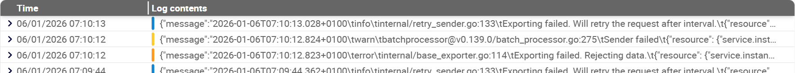

## Que sont les logs ?

Centreon Log Management gère des logs. Les logs contiennent des informations détaillées sur les événements, les erreurs et les performances de votre système informatique.

## À quoi ressemble une entrée de log dans Log Management ?

Tous les logs reçus par Log Management sont listés à la page **Log explorer**, où vous pouvez les filtrer. Dans Log Management, chaque entrée de log a une [sévérité (c'est-à-dire un niveau de log)](../resources/glossary.md#sévérité), indiqué par une ligne colorée.



## Que peut faire Centreon Log Management avec les logs ?

Voici les principales fonctionnalités de Centreon Log Management :

1. Log Management [collecte](../collector/collector.md) et centralise des logs provenant de diverses sources (serveurs, applications, bases de données, dispositifs réseau, etc).

3. Log Management vous permet d'[analyser ces logs en temps réel](../explore-analyze.md), à l'aide de filtres, de [requêtes](../query-syntax.md) ou de [tableaux de bord](../dashboards.md). Cela vous aide à détecter les anomalies, les erreurs, les incidents de sécurité ou les comportements inattendus : consultez les [**cas d'utilisation**](use-cases.md) pour des exemples détaillés.

4. Log Management crée des [évènements d'alerte](../resources/glossary.md#évènement-dalerte) (alert events) en cas de problème ou de dépassement des seuils critiques, conformément aux [règles d'alerte](../alerts.md) (alert rules) que vous avez définies.

5. Log Management vous permet de stocker les logs en toute sécurité pendant de longues périodes (à des fins de conformité, de sécurité ou d'analyse historique).

## Qu'est-ce qu'OpenTelemetry et comment Centreon Log Management l'utilise-t-il ?

Les logs sont un type de données de [télémétrie](../resources/glossary.md#télémétrie). Centreon Log Management peut lire les logs au format OpenTelemetry. OpenTelemetry est un protocole permettant d'envoyer ce type de données.

Les données OpenTelemetry sont structurées (souvent en JSON ou en Protobuf), standardisées selon des [conventions sémantiques](https://opentelemetry.io/docs/concepts/semantic-conventions/) (avec les mêmes champs et le même format partout) et fournissent un contexte riche sur les événements, tels que le service, l'environnement, la version et les attributs personnalisés.

Les logs OpenTelemetry ne sont pas seulement du texte : ce sont des données que vous pouvez analyser. Et Log Management vous permet de [définir des alertes dynamiques sur celles-ci](../alerts.md).

* Vous pouvez envoyer des logs au format OpenTelemetry directement à Centreon Log Management.
* Si un dispositif produit des logs dans un format autre que OpenTelemetry, [utilisez un collecteur OpenTelemetry pour convertir les données](../collector/collector.md). Le collecteur peut fonctionner comme un agent sur l'hôte ou en mode passerelle pour recevoir, enrichir, traduire et transférer les logs vers Centreon Log Management.

## À quoi ressemble une entrée de log au format OpenTelemetry ?

Une entrée de log au format OpenTelemetry comporte toujours un timestamp et un nom de [service](../resources/glossary.md#service) (pour le service qui a produit le log). En général, elle indique également la [sévérité](../resources/glossary.md#sévérité) du journal : <span style={{color:"#1ebeb3"}}>**DEBUG**</span>, <span style={{color:"#1588d1"}}>**INFO**</span>, WARN (<span style={{color:"#ffca34"}} >**WARNING**</span> dans Log Management), <span style={{color:"#fd9b27"}}>**ERROR**</span> ou <span style={{color:"#ff4a4a"}}>**FATAL**</span>. Toutes les autres informations contenues dans le log dépendent de [la manière dont vous avez configuré votre collecteur OpenTelemetry](../collector/collector.md).

Voici un exemple d'entrée de log brute envoyée par l'Observateur d'évènements Windows, collectée par un collecteur OpenTelemetry, puis convertie en syntaxe interne Log Management :

```json
{
  "attributes": {
    "event.id": 16394,
    "event.record.id": 226535,
    "event.task": "0",
    "process.pid": 0
  },
  "body": {
    "message": "La migration de bas niveau hors connexion a réussi."
  },
  "observed_timestamp_nanos": 1763648218788360200,
  "resource_attributes": {
    "event.provider.guid": "{XXXXXXXX-XXXX-XXXX-XXXX-XXXXXXXXXXXX}",
    "event.provider.name": "Microsoft-Windows-Security-SPP",
    "host.name": "MyLaptop",
    "os.name": "Microsoft Windows 10 Pro",
    "os.type": "windows",
    "os.version": "22H2",
    "service.namespace": "application",
    "service.version": "1.0.0"
  },
  "service_name": "windows-event-log",
  "severity_number": 9,
  "severity_text": "INFO",
  "timestamp_nanos": 1763648218609230600,
  "trace_flags": 0
}
```

* Les **attributs** du log décrivent le contenu du log (détails du message, code d'erreur, etc.).

* Les **attributs de ressource** indiquent le contexte du log, c'est-à-dire ce qui a généré ce log. Voici quelques exemples d'attributs de ressource courants pour les logs :

  * **service_name** : nom du service émettant le log.
  * **service.version** : version du service.
  * **host.name** : nom d'hôte ou nom de machine.
  * **cloud.region** : région cloud (par exemple, us-east-1).
  * **k8s.container.name** : nom du conteneur Kubernetes.
  * **deployment.environment** : environnement tel que prod ou staging.

Dans Log Management, vous pouvez filtrer vos données en utilisant ces attributs dans les [requêtes](../query-syntax.md), dans [**Log explorer**](../log-explorer.md) ou dans les [tableaux de bord](../dashboards.md).

## Quel attribut OpenTelemetry gère l'heure des logs?

La date et l'heure des logs sont basées sur l'attribut OpenTelemetry **observed_timestamp_nanos**.
