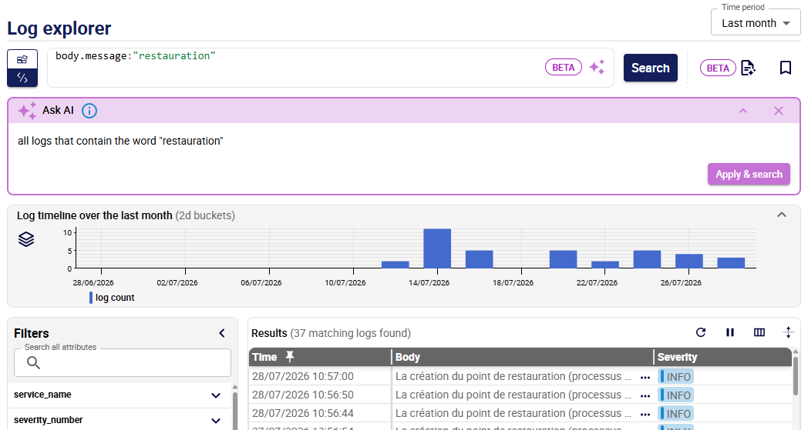
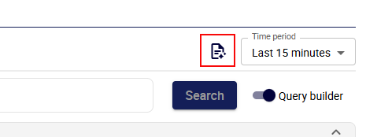

---
id: log-explorer
title: Utiliser log explorer
---
import Tabs from '@theme/Tabs';
import TabItem from '@theme/TabItem';

La page **Log explorer** page vous permet de rechercher et de filtrer les logs afin que vous puissiez investiguer les problèmes et effectuer une analyse de leurs causes profondes.

## Période de temps

* Utilisez la liste **Time period** en haut à droite de la page pour sélectionner la plage de logs à afficher.
* Naviguez dans vos données à l'aide de la chronologie : cliquez et faites glisser votre souris sur le graphique pour sélectionner une nouvelle plage de temps. Utilisez l'icône **Stacking** située à gauche du graphique pour choisir le mode d'affichage du volume des logs : sous forme de total, ou empilé par sévérité ou par nom de service.

## Rechercher des logs

### Panneau Filtres

Le panneau **Filters** liste tous les attributs OpenTelemetry présents dans vos logs pour la période sélectionnée. Il fonctionne en association avec [la barre de recherche](#barre-de-recherche).

* Développez un attribut pour afficher toutes ses valeurs et leur nombre d'occurrences. Cela vous donne un aperçu rapide de la répartition de vos données sans avoir à écrire la moindre requête.
* Le champ **Search all attributes** filtre tous les attributs en temps réel. Une fois qu'un attribut est développé, **Search values** vous permet de rechercher une valeur spécifique parmi toutes celles disponibles.
* Cliquez sur le **+** à gauche d'une valeur pour l'ajouter directement en tant que clause dans la barre de recherche (en mode éditeur de requêtes ou en mode Query builder).

### Barre de recherche

Utilisez la barre de recherche pour filtrer vos logs. La barre de recherche propose deux modes (utilisez le bouton à droite pour sélectionner celui de votre choix) :

* En mode **Query builder**, des blocs vous permettent de construire votre recherche étape par étape : ajoutez un bloc, sélectionnez des noms d'attributs et des valeurs, puis des éléments de syntaxe tels que AND, OR et NOT. Cliquez sur le signe **+** dans la barre de recherche pour ajouter un bloc vide.

   

* En mode éditeur de requête:

   * Saisissez directement votre recherche en utilisant la [syntaxe de requête](query-syntax.md). L'autocomplete et la détection d'erreurs vous aident à rédiger vos requêtes plus rapidement et à éviter les erreurs. Survolez une erreur signalée pour afficher des explications et des suggestions. Les erreurs (en rouge) indiquent que la requête ne fonctionnera pas. Les avertissements (en orange) indiquent que la requête peut fonctionner, mais que les résultats risquent de ne pas correspondre à ce que vous attendiez. Par exemple, si vous tapez **and** au lieu de **AND**, la requête recherchera la chaîne **and** dans le corps du message au lieu de l'utiliser comme opérateur booléen.
   * Cliquez sur le bouton **Ask AI** à droite dans la barre de recherche. Dans le champ qui s'affiche, saisissez votre requête avec vos propres mots et dans la langue de votre choix, puis cliquez sur **Apply and search**. Cela générera une requête avec la syntaxe correcte dans l'éditeur de requêtes : vous pouvez la modifier pour l'enrichir si vous le souhaitez. C'est un bon moyen d'apprendre la [syntaxe des requêtes](query-syntax.md).

      > Les réponses de l'IA peuvent être inexactes ou incomplètes. Vérifiez toujours les résultats.

      

### Lancer la recherche

Dans les deux modes, vous devez cliquer sur le bouton **Search** pour lancer la recherche.

## Informations détaillées sur les logs

Cliquez sur un log pour afficher toutes les informations associées dans le panneau **Log details**, y compris l'entrée brute de log OpenTelemetry.

* Vous pouvez ouvrir plusieurs logs dans le panneau.
* Copiez ou téléchargez l'intégralité du log au format JSON depuis la section **Raw OTel log**.
* La barre de recherche regarde dans les noms et les valeurs des attributs.

## Résumé automatique (Log summary)

Vous pouvez générer automatiquement un résumé de tous les logs correspondant à une requête. Le résumé identifie les problèmes récurrents, les regroupe par type, répertorie leurs causes probables et suggère les étapes suivantes pour les résoudre.

Cliquez sur le bouton **Log summary** situé à côté du sélecteur de plage horaire pour ouvrir le résumé dans un nouvel onglet.

* Les résumés ne sont disponibles que pour les requêtes renvoyant 2 000 lignes ou moins.
* Vous devrez peut-être autoriser l'ouverture de nouveaux onglets pour le même domaine dans votre navigateur.

## Réorganiser les colonnes

* Les colonnes par défaut sont **Time**, **Severity** et **Body**.
* Utilisez le bouton **Search and add column** en haut à droite des résultats pour choisir les colonnes/attributs que vous souhaitez afficher.
* Dans cette fenêtre, vous pouvez rétablir l'affichage par défaut de trois colonnes.
* La colonne **Time** s'affiche toujours en premier et ne peut pas être désépinglée. Vous pouvez épingler une seule autre colonne en deuxième position.
* *Vous pouvez faire glisser les colonnes vers une autre position dans le tableau.

   