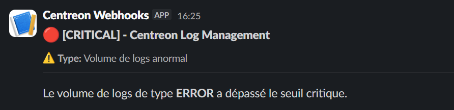

import Tabs from '@theme/Tabs';
import TabItem from '@theme/TabItem';

Des notifications peuvent être envoyées lorsqu'une [règle d'alerte](alerts.md) déclenche un [évènement d'alerte](./resources/glossary.md#évènement-dalerte) et que certaines conditions sont remplies. Vous pouvez configurer un webhook pour envoyer un message à une application tierce.

## Étape 1 : Créer un canal de notification

1. Allez à la page **Alerts and notifications > Notification channels**.

2. Cliquez sur **Add** ou **Create a notification channel** et entrez un nom et une description.

3. Dans la section **Settings** :
   * Saisissez l'URL du webhook que vous avez récupérée depuis votre application tierce. Vous devez inclure **https://**.
   * Sélectionnez la méthode HTTP que vous souhaitez que le webhook utilise.
   * Rédigez le corps du message à envoyer.
   * Définissez les en-têtes que vous souhaitez transmettre à votre application tierce, par exemple pour indiquer le format du corps du message.

      **Exemple**: Je souhaite publier un message sur un canal Slack.
         * L'URL du webhook est fournie par Slack.
         * Pour Slack, le corps du message doit être au format JSON (voir [exemple ci-dessous](#exemple)).
         * En-tête : key: **content-type**: value : **application/json**.

4. Cliquez sur **Create**. Le canal de notification apparaît dans la liste.

## Étape 2 : Associer une règle d'alerte à un canal de notification

1. Allez à la page **Alerts and notifications > Alert rules**.

2. Créez une nouvelle règle d'alerte ou modifiez une règle existante : dans la section **Notification channels**, cliquez sur **Add channel**.

3. Dans la section qui apparaît :

   * Définissez quels statuts d'évènements d'alerte doivent déclencher une notification.
   * Définissez quand les notifications doivent être envoyées : **On every status change/on every alert event**. (Chaque fois que le statut d'évènement d'alerte change, ou systématiquement chaque fois que la règle est évaluée.)
   * Sélectionnez le canal de notification que vous avez créé à l'étape 1.

4. Cliquez sur **Save**. Les notifications commenceront à être envoyées dès que les évènements d'alerte répondront aux conditions que vous avez définies. Utilisez les colonnes **Last trigger event** et **Last sent** pour suivre vos notifications.

## Exemple

### json

```json
{
  "blocks": [
    {
      "type": "header",
      "text": {
        "type": "plain_text",
        "text": "🔴 [CRITICAL] - Centreon Log Management",
        "emoji": true
      }
    },
    {
      "type": "context",
      "elements": [
        {
          "type": "mrkdwn",
          "text": "⚠️ *Type:* Volume de logs anormal"
        }
      ]
    },
    {
      "type": "divider"
    },
    {
      "type": "section",
      "text": {
        "type": "mrkdwn",
        "text": "Le volume de logs de type *ERROR* a dépassé le seuil critique."
      }
    }
  ]
}
```

### Message Slack 


