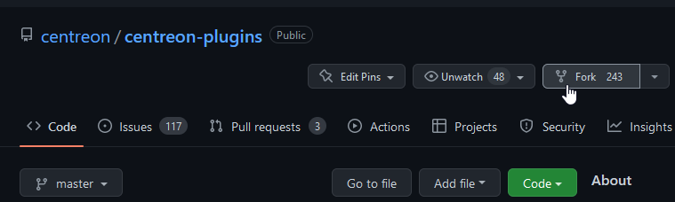

import Tabs from '@theme/Tabs';
import TabItem from '@theme/TabItem';


## Mise en place de l'environnement

Pour utiliser le framework centreon-plugins, vous aurez besoin de ce qui suit :

- Un système d'exploitation Linux, Debian 11 ou 12 ou RHEL/RHEL-like >= 8
- L'utilitaire de ligne de commande [git](https://git-scm.com/book/en/v2/Getting-Started-Installing-Git)
- Un compte [GitHub] (https://github.com/).

### Activer notre dépôt de plugins

Ce dépôt vous fournira nos plugins packagés ainsi que les dépendances qui ne sont pas disponibles dans **les dépôts de distribution standard.**

<Tabs groupId="sync">
<TabItem value="Alma / RHEL / Oracle Linux 8" label="Alma / RHEL / Oracle Linux 8">

```bash
cat >/etc/yum.repos.d/centreon-plugins.repo <<'EOF'
[centreon-plugins-stable]
name=Centreon plugins repository.
baseurl=https://packages.centreon.com/rpm-plugins/el8/stable/$basearch/
enabled=1
gpgcheck=1
gpgkey=https://yum-gpg.centreon.com/RPM-GPG-KEY-CES
module_hotfixes=1

[centreon-plugins-stable-noarch]
name=Centreon plugins repository.
baseurl=https://packages.centreon.com/rpm-plugins/el8/stable/noarch/
enabled=1
gpgcheck=1
gpgkey=https://yum-gpg.centreon.com/RPM-GPG-KEY-CES
module_hotfixes=1

[centreon-plugins-testing]
name=Centreon plugins repository. (UNSUPPORTED)
baseurl=https://packages.centreon.com/rpm-plugins/el8/testing/$basearch/
enabled=0
gpgcheck=1
gpgkey=https://yum-gpg.centreon.com/RPM-GPG-KEY-CES
module_hotfixes=1

[centreon-plugins-testing-noarch]
name=Centreon plugins repository. (UNSUPPORTED)
baseurl=https://packages.centreon.com/rpm-plugins/el8/testing/noarch/
enabled=0
gpgcheck=1
gpgkey=https://yum-gpg.centreon.com/RPM-GPG-KEY-CES
module_hotfixes=1

[centreon-plugins-unstable]
name=Centreon plugins repository. (UNSUPPORTED)
baseurl=https://packages.centreon.com/rpm-plugins/el8/unstable/$basearch/
enabled=0
gpgcheck=1
gpgkey=https://yum-gpg.centreon.com/RPM-GPG-KEY-CES
module_hotfixes=1

[centreon-plugins-unstable-noarch]
name=Centreon plugins repository. (UNSUPPORTED)
baseurl=https://packages.centreon.com/rpm-plugins/el8/unstable/noarch/
enabled=0
gpgcheck=1
gpgkey=https://yum-gpg.centreon.com/RPM-GPG-KEY-CES
module_hotfixes=1
EOF

```

</TabItem>
<TabItem value="Alma / RHEL / Oracle Linux 9" label="Alma / RHEL / Oracle Linux 9">

```bash
cat >/etc/yum.repos.d/centreon-plugins.repo <<'EOF'
[centreon-plugins-stable]
name=Centreon plugins repository.
baseurl=https://packages.centreon.com/rpm-plugins/el9/stable/$basearch/
enabled=1
gpgcheck=1
gpgkey=https://yum-gpg.centreon.com/RPM-GPG-KEY-CES
module_hotfixes=1

[centreon-plugins-stable-noarch]
name=Centreon plugins repository.
baseurl=https://packages.centreon.com/rpm-plugins/el9/stable/noarch/
enabled=1
gpgcheck=1
gpgkey=https://yum-gpg.centreon.com/RPM-GPG-KEY-CES
module_hotfixes=1

[centreon-plugins-testing]
name=Centreon plugins repository. (UNSUPPORTED)
baseurl=https://packages.centreon.com/rpm-plugins/el9/testing/$basearch/
enabled=0
gpgcheck=1
gpgkey=https://yum-gpg.centreon.com/RPM-GPG-KEY-CES
module_hotfixes=1

[centreon-plugins-testing-noarch]
name=Centreon plugins repository. (UNSUPPORTED)
baseurl=https://packages.centreon.com/rpm-plugins/el9/testing/noarch/
enabled=0
gpgcheck=1
gpgkey=https://yum-gpg.centreon.com/RPM-GPG-KEY-CES
module_hotfixes=1

[centreon-plugins-unstable]
name=Centreon plugins repository. (UNSUPPORTED)
baseurl=https://packages.centreon.com/rpm-plugins/el9/unstable/$basearch/
enabled=0
gpgcheck=1
gpgkey=https://yum-gpg.centreon.com/RPM-GPG-KEY-CES
module_hotfixes=1

[centreon-plugins-unstable-noarch]
name=Centreon plugins repository. (UNSUPPORTED)
baseurl=https://packages.centreon.com/rpm-plugins/el9/unstable/noarch/
enabled=0
gpgcheck=1
gpgkey=https://yum-gpg.centreon.com/RPM-GPG-KEY-CES
module_hotfixes=1
EOF
```

</TabItem>
<TabItem value="Debian 11 & 12" label="Debian 11 & 12">

```bash
wget -O- https://apt-key.centreon.com | gpg --dearmor | tee /etc/apt/trusted.gpg.d/centreon.gpg > /dev/null 2>&1
echo "deb https://packages.centreon.com/apt-plugins-stable/ $(lsb_release -sc) main" | tee /etc/apt/sources.list.d/centreon-plugins.list
apt-get update
```

</TabItem>
</Tabs>

Installez les dépendances suivantes :

<Tabs groupId="sync">
<TabItem value="Alma / RHEL / Oracle Linux 8" label="Alma / RHEL / Oracle Linux 8">

```bash
dnf config-manager --set-enabled powertools
dnf install -y git 'perl(Digest::MD5)' 'perl(Pod::Find)' 'perl-Net-Curl' 'perl(URI::Encode)' \
    'perl(LWP::UserAgent)' 'perl(LWP::Protocol::https)' 'perl(IO::Socket::SSL)' 'perl(URI)' \
    'perl(HTTP::ProxyPAC)' 'perl-CryptX' 'perl(MIME::Base64)' 'perl(JSON::XS)' 'perl-JSON-Path' \
    'perl-KeePass-Reader' 'perl(Storable)' 'perl(POSIX)' 'perl(Encode)'
```

</TabItem>
<TabItem value="Alma / RHEL / Oracle Linux 9" label="Alma / RHEL / Oracle Linux 9">

```bash
dnf config-manager --set-enabled crb
dnf install -y git 'perl(Digest::MD5)' 'perl(Pod::Find)' 'perl-Net-Curl' 'perl(URI::Encode)' \
    'perl(LWP::UserAgent)' 'perl(LWP::Protocol::https)' 'perl(IO::Socket::SSL)' 'perl(URI)' \
    'perl(HTTP::ProxyPAC)' 'perl-CryptX' 'perl(MIME::Base64)' 'perl(JSON::XS)' 'perl-JSON-Path' \
    'perl-KeePass-Reader' 'perl(Storable)' 'perl(POSIX)' 'perl(Encode)'
```

</TabItem>
<TabItem value="Debian 11 & 12" label="Debian 11 & 12">

```bash
apt-get install -y git 'libpod-parser-perl' 'libnet-curl-perl' 'liburi-encode-perl' 'libwww-perl' \
    'liblwp-protocol-https-perl' 'libhttp-cookies-perl' 'libio-socket-ssl-perl' 'liburi-perl' \
    'libhttp-proxypac-perl' 'libcryptx-perl' 'libjson-xs-perl' 'libjson-path-perl' \
    'libcrypt-argon2-perl' 'libkeepass-reader-perl'
```

</TabItem>
</Tabs>

### Créer un fork et cloner le dépôt centreon-plugins

Dans l'interface GitHub, en haut à gauche, cliquez sur le bouton **Fork** :



Utilisez l'utilitaire git pour récupérer la fourche de votre dépôt :

```bash
git clone https://<githubusername>@github.com/<githubusername>/centreon-plugins
```

Créer une branche :

```bash
cd centreon-plugins
git checkout -b 'my-first-plugin'
```

## Comprendre l'organisation du projet

### Mise en page et concepts

Le contenu du projet est constitué d'un binaire principal (`centreon_plugins.pl`), et d'une structure logique de répertoires
permettant de séparer les plugins et les fichiers de modes à travers le domaine auquel ils
se réfèrent.

Vous pouvez l'afficher en utilisant la commande `tree -L 1`.

```bash
.
├── apps
├── blockchain
├── centreon
├── centreon_plugins.pl
├── changelog
├── cloud
├── contrib
├── database
├── doc
├── example
├── hardware
├── Jenkinsfile
├── LICENSE.txt
├── network
├── notification
├── os
├── README.md
├── snmp_standard
├── sonar-project.properties
└── storage
```

Examinons plus en détail la disposition du répertoire contenant les modes de surveillance des systèmes Linux
en ligne de commande (`tree os/linux/local/ -L 1`).

```bash
os/linux/local/
├── custom      # Type: Répertoire. Contient du code qui peut être utilisé par plusieurs modes (par exemple l'authentification, la gestion des jetons, ...).
│   └── cli.pm  # Type: Fichier. *Mode personnalisé* définissant des méthodes communes
├── mode        # Type : Répertoire. Contient tous les **modes**.
[...]
│   └── cpu.pm  # Type : Fichier. **Mode** contenant le code pour surveiller le CPU
[...]
└── plugin.pm   # Type : Fichier. **Plugin** définition.
```

Notez le mot os/linux/**local**. Le projet propose d'autres moyens de surveiller Linux, SNMP par exemple. Pour éviter que
ne mélange des modes utilisant des protocoles différents dans le même répertoire et ne soit confronté à des collisions de noms, nous avons réparti
ces modes dans plusieurs répertoires en indiquant clairement le protocole sur lequel ils s'appuient.

Voyons maintenant comment ces concepts se combinent pour construire une ligne de commande :

```bash
# <perl interpreter> <main_binary> --plugin=<perl_normalized_path_to_plugin_file> --mode=<mode_name>
perl centreon_plugins.pl --plugin=os::linux::local::plugin --mode=cpu
```

### Répertoires partagés

Certains répertoires spécifiques ne sont pas liés à un domaine (os, cloud...) et sont utilisés par tous les plugins.

#### Répertoires **centreon**

Le répertoire **centreon** est spécifique, il contient :

- Les bibliothèques/paquets du projet. C'est tout le code qui vous aidera à développer plus rapidement
en évitant de coder des choses liées au protocole (SNMP, HTTPx, SSH...) ou des choses communes comme les options
ou la gestion du cache à partir de zéro. Vous pouvez lire les modules perl si vous êtes un développeur expérimenté
mais il y a très peu de chance que vous ayez à modifier quoi que ce soit.
- Fichiers communs partagés par plusieurs plugins. Cela permet d'éviter de dupliquer le code dans l'arborescence de
et de faciliter la maintenance du projet.

#### Répertoires **snmp_standard/mode**

Le **snmp_standard/mode** existe depuis le début, lorsque la surveillance SNMP était beaucoup plus utilisée
qu'elle ne l'est aujourd'hui. Tous les modes qu'il contient utilisent des OID standard, ce qui signifie que de nombreux plugins sont
en s'appuyant sur ceux-ci lorsque le fabricant prend en charge les MIB standard sur leurs appareils.

## Tutoriel - Comment créer un plugin pour *mon-application-awesome*

### Contexte : simple JSON health API


Dans ce tutoriel, nous allons créer une sonde très simple vérifiant la santé d'une application
affichée en JSON à travers une API simple.

Vous pouvez créer une API avec l'outil gratuit [mocky](https://designer.mocky.io/).
Nous en avons créé une pour ce tutoriel, testez-la avec `curl https://run.mocky.io/v3/da8d5aa7-abb4-4a5f-a31c-6700dd34a656`

Il renvoie la sortie suivante :

```json title="my-awesome-app health JSON"
{
    "health": "yellow",
    "db_queries":{
         "select": 1230,
         "update": 640,
         "delete": 44
    },
    "connections":[
      {
        "component": "my-awesome-frontend",
        "value": 122
      },
      {
        "component": "my-awesome-db",
        "value": 92
      }
    ],
    "errors":[
      {
        "component": "my-awesome-frontend",
        "value": 32
      },
      {
        "component": "my-awesome-db",
        "value": 27
      }
    ]
}
```

Tous les fichiers présentés dans ce tutoriel peuvent être trouvés sur le GitHub centreon-plugins dans la section
[tutorial](https://github.com/centreon/centreon-plugins/tree/master/contrib/tutorial/)
**contrib**.

> Vous devez déplacer le contenu de `contrib/tutorial/apps/` vers `apps/` si vous voulez l'exécuter à des fins de test.
>
> `cp -R contrib/tutorial/apps/* apps/`

### Comprendre les données

Il est très important de comprendre les données, car cela déterminera la manière dont vous concevrez
les internes du **mode**. C'est la **première chose à faire**, quel que soit le protocole que vous
utilisez.

Il existe plusieurs propriétés importantes pour un morceau de données :

- Type de données à traiter : string, int... Il n'y a pas de limite au type de données que vous pouvez traiter.
- Dimensions des données : sont-elles **globales** ou liées à une **instance** ?
- La disposition des données, en d'autres termes, anticiper le type de **structure de données** à manipuler.

Dans notre exemple, les éléments les plus courants sont présents. Nous pouvons le résumer ainsi :

- le noeud `health` est une donnée **globale** et est une chaîne de caractères. La structure est une simple paire *clé/valeur*.
- le nœud `db_queries` est une collection de valeurs entières **globales** concernant la base de données. La structure est un hachage contenant plusieurs paires clé/valeur.
- le noeud `connections` contient des valeurs entières (`122`, `92`) se référant à des **instances** spécifiques (`my-awesome-frontend`, `my-awesome-db`). La structure est un tableau de hachages
- `errors` est la même chose que `connections` sauf que les données elles-mêmes suivent les erreurs au lieu des connexions.

Il est important de comprendre cela pour coder correctement.

### Créer des répertoires pour un nouveau plugin

Créez les répertoires et les fichiers nécessaires à votre **plugin** et **modes**.

Allez dans votre git local centreon-plugins et créez les répertoires et fichiers appropriés :

```bash
# chemin vers le répertoire principal et le sous-répertoire contenant les modes
mkdir -p apps/myawesomeapp/api/mode/
# chemin vers le fichier principal du plugin
touch apps/myawesomeapp/api/plugin.pm
# chemin vers le(s) fichier(s) du (des) mode(s) spécifique(s)
touch apps/myawesomeapp/api/mode/appsmetrics.pm
```

### Créer le fichier plugin.pm

Le `plugin.pm` est la première chose à créer, il contient :

- Un ensemble d'instructions pour charger les bibliothèques requises et les options de compilation
- Une liste de tous les **mode(s)** et le(s) chemin(s) vers leurs fichiers/paquets Perl associés.
- Une description qui s'affichera lorsque vous listerez tous les plugins ou afficherez l'aide de ce plugin.

Voici la version commentée du fichier plugin.pm :

```perl title="my-awesome-app plugin.pm file"
[.. license and copyright things ..]

# Nom de votre paquetage perl
package apps::myawesomeapp::api::plugin;

# Utilisez toujours strict et warnings, cela garantira que votre code est propre et aidera à le déboguer.
use strict;
use warnings;
# Chargez la base de votre plugin, ici nous ne faisons pas de SNMP, SQL ou n'avons pas de répertoire personnalisé, donc nous utilisons la base _simple.
use base qw(centreon::plugins::script_simple);

# Sub global pour créer et retourner l'objet perl. Il n'est pas nécessaire de comprendre ce que fait chaque instruction.
sub new {
    my ($class, %options) = @_;
    my $self = $class->SUPER::new(package => __PACKAGE__, %options);
    bless $self, $class;

    # Une version, nous ne l'utilisons pas vraiment mais cela peut être utile si vous voulez versionner votre code.
    $self->{version} = '0.1';
    # Partie importante !
    # A gauche, le nom du mode tel que les utilisateurs l'utiliseront dans leur ligne de commande
    # A droite, le chemin du fichier (notez que .pm n'est pas présent à la fin)
    $self->{modes} = {
        'app-metrics' => 'apps::myawesomeapp::api::mode::appmetrics'
    };

    return $self;
}

# Déclarer ce fichier comme un module/package perl
1;

# Début de la documenation/help. `__END__` Spécifier à l'interpréteur que les instructions ci-dessous n'ont pas besoin d'être compilées
# =head1 [...] Spécifie le niveau de la section et l'étiquette lors de l'utilisation du plugin avec --help
# Check my-awesome [..] Aperçu rapide de ce que fait le plugin
# =cut Fermer la section head1

__END__

=head1 PLUGIN DESCRIPTION

Vérifier l'état de santé et les mesures de l'application my-awesome grâce à son API personnalisée

=cut
```

Votre premier plugin fictif fonctionne, félicitations !

Exécutez cette commande :

`perl centreon_plugins.pl --plugin=apps::myawesomeapp::api::plugin --list-mode`

Il produit déjà beaucoup de choses. Les lignes elliptiques sont en fait toutes les capacités standard
héritées de la base **script_custom**.

Vous avez probablement déjà reconnu des choses que vous avez définies dans votre module **plugin.pm**.

```perl

Description du plugin :
Vérifier l'état de santé et les métriques de l'application my-awesome via son API personnalisée

Options globales :
--mode Choisir un mode.
[..]
--version
Affiche la version du plugin.
[..]

Modes disponibles :
   app-metrics
```

### Créer le fichier appmetrics.pm

Le fichier `appmetrics.pm` contiendra votre code, en d'autres termes, toutes les instructions pour :

- Déclarer des options pour le mode
- Se connecter à **run.mocky.io** via HTTPS
- Obtenir le JSON du **/v3/da8d5aa7-abb4-4a5f-a31c-6700dd34a656** endpoint
- Extraire les informations et les formater pour qu'elles soient conformes à Centreon.

Construisons-le de manière itérative.

> Note importante : les noms des (sous) fonctions ne doivent pas être modifiés. Par exemple, vous ne pouvez pas
> choisir de renommer `check_options` en `option_check`.

#### Déclarations et sous-déclarations communes

```perl
# Chemin d'accès à votre paquet. '::' au lieu de '/', et pas de .pm à la fin.
package apps::myawesomeapp::api::mode::appmetrics;

# Ne les oubliez pas ;)
use strict;
use warnings;
# Nous voulons nous connecter à un serveur HTTP, utilisons le module commun
use centreon::plugins::http;
# Utilisez le module de comptage. Il vous épargnera beaucoup de travail et gérera beaucoup de choses pour vous.
# Considérez-le comme obligatoire lorsque vous écrivez un nouveau mode.
use base qw(centreon::plugins::templates::counter);
# Importer quelques fonctions qui vous faciliteront la vie
use centreon::plugins::templates::catalog_functions qw(catalog_status_threshold_ng);
# Nous allons devoir traiter du JSON, pas besoin de réinventer la roue, chargez la librairie que vous avez installée dans une section précédente
use JSON::XS;
```

Ajouter une fonction `new` (sub) pour initialiser le mode :

```perl
sub new {
    my ($class, %options) = @_;
    # Toutes les options/propéties de ce mode, ajoutez toujours force_new_perfdata => 1 pour activer le nommage des nouvelles données de métriques/performances.
    # C'est aussi là que vous pouvez spécifier que le plugin utilise un fichier de cache, par exemple
    my $self = $class->SUPER::new(package => __PACKAGE__, %options, force_new_perfdata => 1);
    bless $self, $class;

    # C'est ici que vous pouvez spécifier les options/arguments pris en charge par votre plugin.
    # Toutes les options ici correspondent à ce dont le module centreon::plugins::http a besoin pour établir une connexion
    # Il n'est pas nécessaire de spécifier toutes les options du module http, seulement celles que l'utilisateur peut vouloir modifier pour ses besoins.
    $options{options}->add_options(arguments => {
        # A gauche, c'est le nom de l'option qui sera utilisée dans la ligne de commande. Le ':s' à la fin sert à
        # définir que cette option prend une valeur.
        # A droite, c'est le nom de code de cette option, optionnellement vous pouvez définir une valeur par défaut pour que l'utilisateur # n'ait pas à la définir.
        # n'ait pas à la définir
         'hostname:s'           => { name => 'hostname' },
         'proto:s'              => { name => 'proto', default => 'https' },
         'port:s'               => { name => 'port', default => 443 },
         'timeout:s'            => { name => 'timeout' },
        # Ces options permettent de définir des conditions sur le statut que le plugin va renvoyer en ce qui concerne le code de réponse HTTP.
         'unknown-status:s'     => { name => 'unknown_status', default => '%\{http_code\} < 200 or %\{http_code\} >= 300' },
         'warning-status:s'     => { name => 'warning_status' },
         'critical-status:s'    => { name => 'critical_status', default => '' }
    });

    # Cela permet de créer une copie locale de centreon::plugins::http que nous allons manipuler.
    # %options écrase la valeur par défaut de http avec les paires clé/valeur des options ci-dessus pour instancier le module http
    # Ref https://github.com/centreon/centreon-plugins/blob/520a1f8c10cd434c6dedd1e342285eecff8b9d1b/centreon/plugins/http.pm#L59
    $self->{http} = centreon::plugins::http->new(%options);
    return $self;
}
```

Ajoutez une fonction `check_options`. Cette fonction s'exécutera juste après `new` et vous permettra de vérifier que l'utilisateur a passé
paramètre(s) obligatoire(s) et dans certains cas de vérifier que le format est correct.

```perl
sub check_options {
    my ($self, %options) = @_;
    $self->SUPER::check_options(%options);

    # Vérifier si l'utilisateur a fourni une valeur pour l'option --hostname. Si ce n'est pas le cas, afficher un message et quitter
    if (!defined($self->{option_results}-\{hostname\}) || $self->{option_results}-\{hostname\} eq '') {
        $self->{output}->add_option_msg(short_msg => 'Please set hostname option');
        $self->{output}->option_exit();
    }
    # Définir les paramètres pour le module http, notez que $self->{option_results} est un hachage contenant
    # toutes les paires clé/valeur de vos options.
    $self->{http}->set_options(%{$self->{option_results}});
}

1;
```

Beau travail, vous avez maintenant un mode qui peut être exécuté sans erreur !

Lancez la commande `perl centreon_plugins.pl --plugin=apps::myawesomeapp::api::plugin --mode=app-metrics`, qui
affiche ce message :

`UNKNOWN : Please set hostname option`

Maintenant, faisons un peu de monitoring grâce à centreon-plugins.

#### Déclarez vos compteurs

Cette partie consiste essentiellement à faire correspondre les données que vous souhaitez obtenir de l'API avec la structure interne du mode compteur de
.

Rappelez-vous comment nous avons catégorisé les données dans une [section] précédente (#understand-the-data).

La structure de données `$self->{maps_counters_type}` décrit ces données tandis que la structure `$self->{maps_counters}->{global}` définit
leurs propriétés comme les seuils et la façon dont elles seront affichées aux utilisateurs.

```perl
sub set_counters {
    my ($self, %options) = @_;

    $self->{maps_counters_type} = [
        # La santé et les requêtes sont des mesures globales, elles ne se réfèrent pas à une instance spécifique.
        # En d'autres termes, vous ne pouvez pas obtenir plusieurs valeurs pour health ou queries
        # C'est pourquoi le type est 0.
        { name => 'health', type => 0, cb_prefix_output => 'prefix_health_output' },
        { name => 'queries', type => 0, cb_prefix_output => 'prefix_queries_output' },      
        # app_metrics regroupe les connexions et les erreurs et chacun recevra une valeur pour les deux instances (mon-awesome-frontend et mon-awesome-db)
        # le type => 1 explique que
        # comme ci-dessus, vous pouvez définir une fonction callback (cb) pour gérer le préfixe de sortie. Cette fonction est appelée
        # chaque fois qu'une valeur est passée au compteur et peut être partagée entre plusieurs compteurs.
        { name => 'app_metrics', type => 1, cb_prefix_output => 'prefix_app_output' }
    ];

    $self->{maps_counters}->{health} = [
        # Ce compteur est spécifique car il traite d'une valeur de type chaîne de caractères
        {
            label => 'health',
            # Toutes les propriétés ci-dessous (avant et) sont liées à la fonction catalog_status_ng importée au début de notre mode.
            type => 2,
            # Ces propriétés permettent de définir des seuils par défaut pour chaque état, mais ne sont pas obligatoires.
            warning_default => '%\{health\} =~ /yellow/',
            critical_default => '%\{health\} =~ /red/',
            # Pour simplifier, gérer les choses liées à la manière d'obtenir une valeur dans le compteur, ce qu'il faut afficher et le seuil spécifique.
            # vérifier en raison du type de données (string)
            set => {
                key_values => [ { name => 'health' } ],
                output_template => 'status: %s',
                # Force à ignorer les données de perfdata car les données collectées sont des chaînes de caractères.
                closure_custom_perfdata => sub { return 0; },
                closure_custom_threshold_check => \&catalog_status_threshold_ng
            }
        }
    ];
    $self->{maps_counters}->{queries} = [
        # Le label définit le nom des options, un --warning-select et un --critical-select seront ajoutés au mode.
        # Le nlabel est le nom de votre donnée de performance / métrique qui apparaîtra dans votre graphique.
        {
            label => 'select',
            nlabel => 'myawesomeapp.db.queries.select.count',
            set => {
            # Le nom de la valeur de la clé est le nom que nous utiliserons pour transmettre les données à ce compteur. Vous pouvez en avoir plusieurs.
                key_values => [ { name => 'select' } ],
                # Le modèle de sortie décrit la façon dont la valeur sera affichée
                output_template => 'select: %s',
                # Le tableau Perfdata permet de définir les propriétés des mesures (min, max) et le format du modèle sprintf.
                perfdatas => [
                    { template => '%d', min => 0 }
                ]
            }
        },
        { label => 'update', nlabel => 'myawesomeapp.db.queries.update.count', set => {
                key_values => [ { name => 'update' } ],
                output_template => 'update: %s',
                perfdatas => [
                    { template => '%d', min => 0 }
                ]
            }
        },
        { label => 'delete', nlabel => 'myawesomeapp.db.queries.delete.count', set => {
                key_values => [ { name => 'delete' } ],
                output_template => 'delete: %s',
                perfdatas => [
                    { template => '%d', min => 0 }
                ]
            }
        }
    ];
    $self->{maps_counters}->{app_metrics} = [
        # The app_metrics has two different labels, connection and errors.
        { label => 'connections', nlabel => 'myawesomeapp.connections.count', set => {
                # Faites attention à l'affichage supplémentaire key_value. Il recevra la valeur de l'instance. (my-awesome-db, my-awesome-frontend).
                # le display key_value n'est pas obligatoire mais nous le montrons ici à des fins éducatives
                key_values => [ { name => 'connections' }, { name => 'display' } ],
                output_template => 'connections: %s',
                perfdatas => [
                    # nous ajoutons l'option label_extra_instance pour avoir une perfdata par instance
                    { template => '%d', min => 0, label_extra_instance => 1 }
                ]
            }
        },
        { label => 'errors', nlabel => 'myawesomeapp.errors.count', set => {
                key_values => [ { name => 'errors' }, { name => 'display' } ],
                output_template => 'errors: %s',
                perfdatas => [
                    { template => '%d', min => 0, label_extra_instance => 1 }
                ]
            }
        }
    ];
}

# Ceci devrait toujours être présent à la fin du script.
1;
```

> N'oubliez pas de toujours déplacer l'instruction finale `1;` à la fin du script lorsque vous ajoutez de nouvelles lignes au cours de ce tutoriel.

Le mode se compile. Exécutez la commande
en donnant une valeur à l'option `--hostname` pour voir ce qu'elle affiche :

```bash
perl centreon_plugins.pl --plugin=apps::myawesomeapp::api::plugin --mode=app-metrics --hostname=fakehost
OK: status : skipped (no value(s)) - select : skipped (no value(s)), update : skipped (no value(s)), delete : skipped (no value(s))
```

Vous pouvez voir certains de vos compteurs avec le `skipped (no value(s))`, c'est normal, c'est parce que nous
avons juste créé la définition et la structure des compteurs mais n'avons pas poussé de valeurs dedans.

#### Créer des fonctions de rappel de préfixe

Ces fonctions ne sont pas obligatoires mais permettent de rendre le résultat plus lisible pour un humain. Nous allons créer
maintenant mais comme vous l'avez remarqué le mode compile donc vous pouvez choisir de les garder pour le moment de polissage.

Lors de la définition des compteurs, nous avons associé une fonction de rappel à chacun d'entre eux :

- `cb_prefix_output => 'prefix_health_output'`
- `cb_prefix_output => 'prefix_queries_output'`
- `cb_prefix_output => 'prefix_app_output'`

Définissez ces fonctions en les ajoutant à notre fichier `appmetrics.pm`. Elles sont explicites.

```perl
sub prefix_health_output {
    my ($self, %options) = @_;

    return 'My-awesome-app:';
}

sub prefix_queries_output {
    my ($self, %options) = @_;

    return 'Queries:';
}

sub prefix_app_output {
    my ($self, %options) = @_;

        # Cette notation vous permet de renvoyer la valeur de l'instance (l'affichage clé_valeur)
        # pour apporter un peu de contexte à la sortie.
    return "'" . $options{instance_value}->{display} . "' ";
}

1;
```

Exécutez votre commande et vérifiez que la sortie correspond à celle ci-dessous :

```bash
perl centreon_plugins.pl --plugin=apps::myawesomeapp::api::plugin --mode=app-metrics --hostname=fakehost
OK: My-awesome-app: status : skipped (no value(s)) - Queries: select : skipped (no value(s)), update : skipped (no value(s)), delete : skipped (no value(s))
```

La sortie est plus facile à lire et les séparateurs sont visibles entre les compteurs globaux.

#### Obtenir des données brutes de l'API et comprendre la structure des données

C'est le moment d'écrire la sous-section principale (`manage_selection`) - la plus complexe, mais aussi celle qui
transformera votre mode en quelque chose d'utile et de vivant.

Pensez à la logique, ce que nous devons faire est :

- Se connecter à **run.mocky.io** via HTTPS
- Interroger un chemin spécifique correspondant à notre API
- Stocker et traiter le résultat
- Répartir ce résultat dans les définitions des compteurs

Commencez par écrire le code pour vous connecter à **run.mocky.io**. C'est là que le framework centreon-plugins
délivre sa puissance.

> Toutes les instructions d'impression sont disponibles sous forme de code commenté dans les ressources du tutoriel GitHub.

Ecrivez la requête et ajoutez un print pour afficher les données reçues :

```perl
sub manage_selection {
    my ($self, %options) = @_;
    # Nous avons déjà chargé tout ce qui est nécessaire pour le module http
    # Utiliser la méthode de requête du module pour exécuter la requête GET contre le chemin d'accès
    my ($content) = $self->{http}->request(url_path => '/v3/da8d5aa7-abb4-4a5f-a31c-6700dd34a656');
    print $content . "\n";
}

1;
```

Lancez cette commande `perl centreon_plugins.pl --plugin=apps::myawesomeapp::api::plugin --mode=app-metrics --hostname=run.mocky.io`.

Le résultat devrait être :

```perl title="Basic raw content print"
{
    "health": "yellow",
    "db_queries":{
         "select": 1230,
         "update": 640,
         "delete": 44
    },
    "connections":[
      {
        "component": "my-awesome-frontend",
        "value": 122
      },
      {
        "component": "my-awesome-db",
        "value": 92
      }
    ],
    "errors":[
      {
        "component": "my-awesome-frontend",
        "value": 32
      },
      {
        "component": "my-awesome-db",
        "value": 27
      }
    ]
}
OK: My-awesome-app: status : skipped (no value(s)) - Queries: select : skipped (no value(s)), update : skipped (no value(s)), delete : skipped (no value(s))
```

Ajoutez une structure `eval` pour transformer `$content` en une structure de données qui peut être facilement manipulée avec perl. présente la bibliothèque standard `Data::Dumper` qui peut vous aider à comprendre vos structures de données.

Nous chargeons la bibliothèque Data::Dumper et utilisons une de ses méthodes pour imprimer le JSON. Une deuxième ligne est ici pour imprimer
un simple message et vous familiariser avec la façon d'accéder aux données dans les structures de données perl.

```perl
sub manage_selection {
    my ($self, %options) = @_;
    # Nous avons déjà chargé tout ce qui est nécessaire pour le module http
    # Utiliser la méthode de requête du module importé pour exécuter la requête GET par rapport au chemin URL de notre API
    my ($content) = $self->{http}->request(url_path => '/v3/da8d5aa7-abb4-4a5f-a31c-6700dd34a656');

    # Déclarer un scalaire pour désérialiser la chaîne de contenu JSON dans une structure de données perl
    my $decoded_content;
    eval {
        $decoded_content = JSON::XS->new->decode($content);
    };
    # Attrape l'erreur qui peut survenir dans le cas où les données reçues ne sont pas JSON
    if ($@) {
        $self->{output}->add_option_msg(short_msg => "Cannot encode JSON result");
        $self->{output}->option_exit();
    }
    use Data::Dumper;
    print Dumper($decoded_content);
    print "My App health is '" . $decoded_content->{health} . "'\n";
}

1;
```

Exécutez la commande `perl centreon_plugins.pl --plugin=apps::myawesomeapp::api::plugin --mode=app-metrics --hostname=run.mocky.io`
à nouveau et voyez comment cela a changé.

Vous avez maintenant votre JSON désérialisé dans un `$VAR1` perl qui représente votre structure `$decoded_content`.

Vous pouvez aussi noter le résultat de la dernière impression et comment nous avons accédé à la valeur `yellow`.

```perl tile="Perl data structure from JSON"
$VAR1 = {
          'connections' => [
                             {
                               'component' => 'my-awesome-frontend',
                               'value' => 122
                             },
                             {
                               'value' => 92,
                               'component' => 'my-awesome-db'
                             }
                           ],
          'health' => 'yellow',
          'errors' => [
                        {
                          'value' => 32,
                          'component' => 'my-awesome-frontend'
                        },
                        {
                          'value' => 27,
                          'component' => 'my-awesome-db'
                        }
                      ],
          'db_queries' => {
                            'select' => 1230,
                            'update' => 640,
                            'delete' => 44
                          }
        };
My App health is 'yellow'
```

#### Envoi des données aux compteurs globaux (type => 0)

Maintenant que nous connaissons notre structure de données et que nous savons comment accéder aux valeurs, nous devons assigner cette valeur
aux compteurs que nous avons initialement définis. Faites attention aux commentaires ci-dessus
les assignations `$self->{health}` et `$self->{db_queries}`.

```perl title="Global counters (type => 0)"
sub manage_selection {
    my ($self, %options) = @_;
    # Nous avons déjà chargé tout ce qui est nécessaire pour le module http
    # Utiliser la méthode de requête du module importé pour exécuter la requête GET par rapport au chemin URL de notre API
    my ($content) = $self->{http}->request(url_path => '/v3/da8d5aa7-abb4-4a5f-a31c-6700dd34a656');
    # Décommentez la ligne ci-dessous lorsque vous avez atteint cette partie du tutoriel.
    # print $content ;

    # Déclarer un scalaire désérialiser la chaîne de contenu JSON dans une structure de données perl
    my $decoded_content;
    eval {
        $decoded_content = JSON::XS->new->decode($content);
    };
    # Attrape l'erreur qui peut survenir dans le cas où les données reçues ne sont pas JSON
    if ($@) {
        $self->{output}->add_option_msg(short_msg => "Cannot encode JSON result");
        $self->{output}->option_exit();
    }
    # Décommentez les lignes ci-dessous lorsque vous avez atteint cette partie du tutoriel.
    # use Data::Dumper ;
    # print Dumper($decoded_content) ;
    # print "La santé de mon application est '" . $decoded_content->{health} . "'\n" ;
    
    # C'est ici que la magie du compteur s'opère.
    
    # $self->{health} est la définition de votre compteur (voir $self->{maps_counters}->{<name>})
    # Ici, nous faisons correspondre la chaîne obtenue $decoded_content->{health} avec la valeur clé de la santé dans le compteur.
    $self->{health} = {
        health => $decoded_content->{health}
    };

    # $self->{requêtes} est la définition de votre compteur (voir $self->{maps_counters}->{<nom>})
    # Ici, nous mappons les valeurs obtenues à partir des noeuds db_queries avec la clé_valeur définie dans le compteur.
    $self->{queries} = {
        select => $decoded_content->{db_queries}->{select},
        update => $decoded_content->{db_queries}->{update},
        delete => $decoded_content->{db_queries}->{delete}
    };

}

1;
```

Exécutons à nouveau notre commande : plus de message `skipped (no value(s))`. Vous obtenez même un état
WARNING à cause de l'état `jaune` de l'application.

```shell
perl centreon_plugins.pl --plugin=apps::myawesomeapp::api::plugin --mode=app-metrics --hostname=run.mocky.io
WARNING: My-awesome-app status: yellow | 'myawesomeapp.db.queries.select.count'=1230;;;0; 'myawesomeapp.db.queries.update.count'=640;;;0; 'myawesomeapp.db.queries.delete.count'=44;;;0;
```

Les données de performance confirment que les valeurs des requêtes de la base de données sont également correctement définies.

C'est ainsi que fonctionne le modèle en mode compteur (`use base qw(centreon::plugins::templates::counter);`), la seule chose que vous avez à faire sur
est de récupérer les données de l'élément que vous devez surveiller et de les pousser dans une définition de compteur.

Dans les coulisses, il gère beaucoup de choses pour vous :

- Options : `--avertissement-santé --avertissement-sélection --avertissement-mise à jour --avertissement-suppression et --critique-` ont été automatiquement définies.
- Données de performance : grâce à `nlabel` et aux valeurs du tableau `perfdatas :[]` dans vos compteurs
- Affichage : Il écrit le statut et remplace les valeurs par celles assignées au compteur.

Maintenant, vous comprenez probablement mieux pourquoi le travail de préparation sur la compréhension des données collectées et la définition des compteurs est essentiel : simplement parce que c'est la plus grande partie du travail.

#### Envoi de données aux compteurs ayant une instance (type => 1)

Traitons maintenant les compteurs avec des instances. Cela signifie que les mêmes compteurs recevront
plusieurs données, chacune de ces données se référant à une dimension spécifique.

Elles doivent être manipulées d'une manière légèrement différente car nous devons spécifier le nom
que nous voulons associer aux données.

Tout d'abord, nous devons faire une boucle sur les tableaux `connections` et `errors` pour accéder au nom de l'application et à la valeur mesurée sur
, puis les répartir dans les compteurs.

```perl title="Counters with instances (type 1)"
sub manage_selection {
    my ($self, %options) = @_;
    # Nous avons déjà chargé tout ce qui est nécessaire pour le module http
    # Utiliser la méthode de requête du module importé pour exécuter la requête GET par rapport au chemin URL de notre API
    my ($content) = $self->{http}->request(url_path => '/v3/da8d5aa7-abb4-4a5f-a31c-6700dd34a656');
    # Décommentez la ligne ci-dessous lorsque vous avez atteint cette partie du tutoriel.
    # print $content ;
    
    # Déclarer un scalaire désérialiser la chaîne de contenu JSON dans une structure de données perl
    my $decoded_content;
    eval {
        $decoded_content = JSON::XS->new->decode($content);
    };
    # Attrape l'erreur qui peut survenir dans le cas où les données reçues ne sont pas JSON
    if ($@) {
        $self->{output}->add_option_msg(short_msg => "Cannot encode JSON result");
        $self->{output}->option_exit();
    }
    # Décommentez les lignes ci-dessous lorsque vous avez atteint cette partie du tutoriel.
    # use Data::Dumper ;
    # print Dumper($decoded_content) ;
    # print "La santé de mon application est '" . $decoded_content->{health} . "'\n" ;
    
    # C'est ici que la magie du compteur s'opère.
    
    # $self->{health} est la définition de votre compteur (voir $self->{maps_counters}->{<name>})
    # Ici, nous faisons correspondre la chaîne obtenue $decoded_content->{health} avec la valeur clé de la santé dans le compteur.

    $self->{health} = {
        health => $decoded_content->{health}
    };

    # $self->{requêtes} est la définition de votre compteur (voir $self->{maps_counters}->{<nom>})
    # Ici, nous mappons les valeurs obtenues à partir des noeuds db_queries avec la clé_valeur définie dans le compteur.
    $self->{queries} = {
        select => $decoded_content->{db_queries}->{select},
        update => $decoded_content->{db_queries}->{update},
        delete => $decoded_content->{db_queries}->{delete}
    };

    # Initialiser un compteur app_metrics vide.
    $self->{app_metrics} = {};
    # Boucle dans le tableau de hachages des connexions
    foreach my $entry (@\{ $decoded_content->{connections\} }) {
        # Same logic than type => 0 counters but an extra key $entry->{component} to associate the value
        # with a specific instance
        $self->{app_metrics}->{ $entry->{component} }->{display} = $entry->{component};
        $self->{app_metrics}->{ $entry->{component} }->{connections} = $entry->{value};
    };

    # Exactement la même chose avec les erreurs
    foreach my $entry (@\{ $decoded_content->{errors\} }) {
        # Don't need to redefine the display key, just assign a value to the error key_value while
        # keeping the $entry->{component} key to associate the value with the good instance
        $self->{app_metrics}->{ $entry->{component} }->{errors} = $entry->{value};
    };

}

1;
```

Votre mode `app-metrics` est (presque) terminé. Une fois de plus, le modèle des compteurs a géré beaucoup de choses
dans les coulisses.

Exécutez cette commande pour voir comment elle a évolué depuis la dernière exécution. Nous modifions la commande avec quelques paramètres supplémentaires
:

- `--warning-health='%{health} eq "care"'` pour éviter de recevoir un WARNING, mettez n'importe quelle valeur qui ne correspondra pas au jaune. Fournir
comme paramètre remplacera automatiquement la valeur du code par défaut codée en dur
- `--verbose` affichera la sortie longue et les détails pour chaque compteur `type => 1`.

```bash
perl centreon_plugins.pl --plugin=apps::myawesomeapp::api::plugin --mode=app-metrics --hostname=run.mocky.io --warning-health='%{health} eq "care"' --verbose
```

Voici le résultat attendu :

```bash
OK: My-awesome-app status: yellow - Queries: select: 1230, update: 640, delete: 44 | 'myawesomeapp.db.queries.select.count'=1230;;;0; 'myawesomeapp.db.queries.update.count'=640;;;0; 'myawesomeapp.db.queries.delete.count'=44;;;0; 'my-awesome-db#myawesomeapp.connections.count'=92;;;0; 'my-awesome-db#myawesomeapp.errors.count'=27;;;0; 'my-awesome-frontend#myawesomeapp.connections.count'=122;;;0; 'my-awesome-frontend#myawesomeapp.errors.count'=32;;;0;
'my-awesome-db' connections: 92, errors: 27
'my-awesome-frontend' connections: 122, errors: 32
```

Vous avez maintenant des métriques affichées pour les deux composants `'my-awesome-db'` et `'my-awesome-frontend'` et aussi des données de performance
pour vos graphiques. Notez que le modèle de compteur a automatiquement ajouté la dimension de l'instance à gauche du `nlabel` défini
pour chaque compteur : `**my-awesome-frontend#**myawesomeapp.errors.count'=32;;;0;`

#### Section d'aide et assistant pour construire vos objets centraux

Enfin, vous devez rédiger une section d'aide pour expliquer aux utilisateurs ce que fait votre mode
et quelles options ils peuvent utiliser.

Le framework centreon-plugins dispose d'un assistant intégré pour vous aider avec la liste des compteurs
et des options.

Lancez cette commande pour obtenir un résumé qui simplifiera le travail de création des commandes Centreon et d'écriture de l'aide du mode à l'adresse
:
```bash
perl centreon_plugins.pl --plugin=apps::myawesomeapp::api::plugin --mode=app-metrics --hostname='anyvalue' --list-coun
ters --verbose
```

Obtenez des informations à partir de sa sortie (illustrée ci-dessous) pour commencer à construire l'aide de votre mode :

```bash
counter list: select update delete health connections errors
configuration:  --warning-select='$_SERVICEWARNINGSELECT$' --critical-select='$_SERVICECRITICALSELECT$' --warning-update='$_SERVICEWARNINGUPDATE$' --critical-update='$_SERVICECRITICALUPDATE$' --warning-delete='$_SERVICEWARNINGDELETE$' --critical-delete='$_SERVICECRITICALDELETE$' --warning-health='$_SERVICEWARNINGHEALTH$' --critical-health='$_SERVICECRITICALHEALTH$' --warning-connections='$_SERVICEWARNINGCONNECTIONS$' --critical-connections='$_SERVICECRITICALCONNECTIONS$' --warning-errors='$_SERVICEWARNINGERRORS$' --critical-errors='$_SERVICECRITICALERRORS$'
```

Voici comment vous pouvez écrire l'aide, notez que cette fois vous ajouterez le contenu après le `1;` et ajouterez la même instruction
`__END__` que vous avez fait dans le fichier `plugin.pm`.


```perl title="Section d'aide"
__END__

=head1 MODE

Vérifier les métriques de l'application my-awesome-app exposées à travers son API

=over 8

=item B<--warning/critical-health>

Seuil d'alerte et seuil critique pour la chaîne de santé de l'application.

Les valeurs par défaut sont --warning-health='%\{health\} eq "yellow"' --critical-health='%\{health\} eq "red"'

=item B<--warning/critical-select>

Seuil d'alerte et seuil critique pour les requêtes sélectionnées

=item B<--warning/critical-update>

Seuil d'alerte et seuil critique pour les requêtes de mise à jour

=item B<--warning/critical-delete>

Seuil d'alerte et seuil critique pour les demandes de suppression

=item B<--warning/critical-connections>

Seuil d'alerte et seuil critique pour les connexions

=item B<--warning/critical-errors>

Seuil d'alerte et seuil critique pour les erreurs

=back
```

Vous avez terminé ! Vous pouvez profiter d'un plugin et d'un mode complet et l'aide s'affiche maintenant dans une section spécifique du mode
:

```bash
perl centreon_plugins.pl --plugin=apps::myawesomeapp::api::plugin --mode=app-metrics --help
[..
   Toutes les options globales du framework centreon-plugins dont bénéficie votre plugin
..]
Mode:
    
    Vérifier les métriques de l'application my-awesome-app exposées à travers son API

    --warning/critical-health
            Seuil d'alerte et seuil critique pour la chaîne de santé de l'application.

            Les valeurs par défaut sont les suivantes : --warning-health='%\{health\} eq "yellow"' &
            --critical-health='%\{health\} eq "red"'

    --warning/critical-select
            Seuil d'alerte et seuil critique pour les requêtes sélectionnées

    --warning/critical-update
            Seuil d'alerte et seuil critique pour les requêtes de mise à jour

    --warning/critical-delete
            Seuil d'alerte et seuil critique pour les demandes de suppression

    --warning/critical-connections
            Seuil d'alerte et seuil critique pour les connexions

    --warning/critical-errors
            Seuil d'alerte et seuil critique pour les erreurs
```
