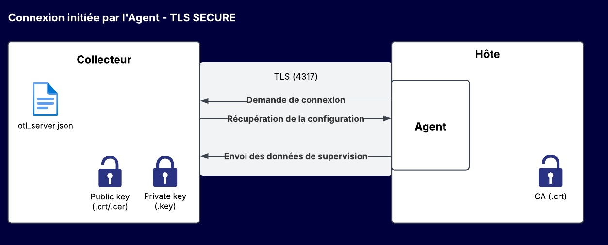
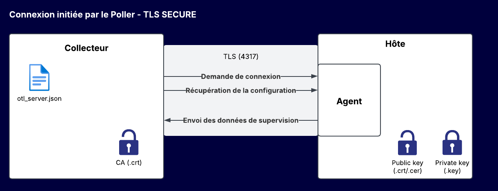

import Tabs from '@theme/Tabs';
import TabItem from '@theme/TabItem';
import PollerAgentConfiguration from './_poller-agent-configuration.mdx';

> L'agent CMA est encore en phase bêta. Pour obtenir de l'aide, visitez [notre groupe dédié sur The Watch](https://thewatch.centreon.com/groups/opentelemetry-agent-beta-program-61).

## Introduction

L'Agent de supervision Centreon (Centreon Monitoring Agent, CMA) est un logiciel qu'on installe sur les hôtes à superviser : il collecte des métriques et calcule des statuts, et les envoie à Centreon.

L'agent peut exécuter des contrôles natifs ou utiliser des plugins Centreon pour exécuter des contrôles non natifs. Les contrôles natifs sont exécutés directement par l'agent (contrairement aux contrôles non natifs, qui nécessitent l'installation de plugins locaux sur l'hôte). Les contrôles natifs sont plus performants et ont une meilleure empreinte (réduction de l'utilisation du processeur et de la mémoire).

Les contrôles natifs et non natifs sont définis dans le connecteur **Linux Centreon Monitoring Agent** ou dans le connecteur **Windows Centreon Monitoring Agent**. Les connecteurs fournissent les modèles et l'agent récupère la configuration de ces contrôles à intervalles réguliers après l'établissement de la connexion.

L'agent effectue les contrôles (pour les contrôles non natifs, en utilisant les plugins locaux) et envoie les données au collecteur. La partie du moteur du collecteur qui reçoit les données de l'agent est appelée récepteur OTLP (OTLP signifie OpenTelemetry protocol).

Les plugins Centreon comme les plugins personnalisés basés sur Nagios sont compatibles avec l'agent.

### Quand utiliser un agent ?

Utilisez l'agent CMA :

* lorsque les politiques de sécurité n'autorisent que les flux sortants (aucun contrôle ne peut être effectué par les collecteurs, le SNMP n'est pas autorisé).
* sur les sites qui n'ont pas de collecteur local.
* lorsque vous avez besoin d'exécuter un script localement sur la machine supervisée pour des raisons de sécurité (droits et/ou protocoles) ou de performance.

### Comment interagissent le collecteur et l'hôte?

Suivant le cas, soit l'agent soit le collecteur initie la connexion.

* Dans le cas d'une connexion initiée par l'agent, il suffit de configurer le collecteur pour qu'il écoute sur un port spécifique. Un poller peut recevoir des données de n agents/hôtes.
* Si l'agent n'est pas autorisé à se connecter au collecteur pour des raisons de sécurité (par exemple, lorsque le collecteur se trouve dans une DMZ), vous pouvez utiliser une connexion initiée par le collecteur. Vous devez déclarer dans Centreon chaque hôte qui sera supervisé par cet agent dans le menu **Configuration poller/agent**. Le collecteur recevra des données de n hôtes via l'agent.

<!--You can use both types of communication at the same time (for different hosts).-->

Selon le sens dans lequel la connexion est établie, le collecteur ou l'hôte peuvent être client ou serveur. La connexion entre le collecteur et l'agent doit être sécurisée en production.<!-- 2 options are possible:-->

<!--* TLS: the certificate is signed by a certification authority and the Common Name (CN) is verified.
* TLS insecure: the certification authority and Common Name are not verified (self-signed certificates can be used).-->

Stockez les certificats dans le répertoire **/etc/pki** du collecteur. Stockez-les où vous le souhaitez sur l'hôte. Les schémas ci-dessous décrivent les fichiers de certificats à utiliser dans chaque cas.

<Tabs groupId="sync">
<TabItem value="L'agent se connecte au collecteur, TLS sécurisé" label="L'agent se connecte au collecteur, TLS sécurisé">



Le collecteur sera configuré de la manière suivante, en utilisant la page **Configuration d'agent**, dans la section **Récepteur OTLP** :

* Certificat public (.crt)
* Clé privée (.key)
* CA : rarement nécessaire dans ce cas, sauf pour gérer un "double handshake". Le protocole TLS avec certificats valide l'identité du serveur pour le client, mais le "double handshake" va plus loin : il ajoute la validation de l'identité du client par le serveur. Cela est utile pour renforcer la sécurité, mais rarement nécessaire sur internet.

L'agent sera configuré de la manière suivante sur l'hôte [(pour Windows à l'aide de l'installeur ou de la CLI, et pour Linux à l'aide du fichier **centagent.json**)](#étape-2--préparez-lhôte).

Le nom DNS que l'agent utilisera pour se connecter au collecteur (champ "Poller endpoint") doit être identique au Common Name du certificat.
Si cela n'est pas possible, vous pouvez ajouter une correspondance IP **collector_host_name** dans le fichier **C:\Windows\System32\drivers\etc\hosts** (Windows) ou **/etc/hosts** (Linux).

* Encryption = yes
* Fichier de certificat de l'autorité de certification de confiance (peut être chargé dans le magasin de certificats et non référencé dans la configuration de l'agent)
* Nom commun du certificat (rarement nécessaire)

</TabItem>
<TabItem value="Le collecteur se connecte à l'agent, TLS sécurisé" label="Le collecteur se connecte à l'agent, TLS sécurisé">



Le collecteur sera configuré de la manière suivante, en utilisant la page **Poller/agent configuration**.

* Dans la section **Récepteur OTLP**, le certificat n'est pas techniquement nécessaire, mais est obligatoire dans l'interface.

* Dans la section **Configuration de l'hôte** :

   CA et CA Common Name (CN) sont facultatifs.

   * CA : Dans le cas d'un certificat public, la chaîne de certification standard du système d'exploitation est suffisante, renseigner ce paramètre n'est pas nécessaire.
   Dans le cas d'un certificat auto-signé, l'autorité de certification peut être ajoutée au système d'exploitation dans ses chaînes de certification, ce qui rend ce paramètre inutile. Si vous n'ajoutez pas l'autorité de certification au système d'exploitation, remplissez le champ CA.

   * CN : Le collecteur utilise un nom de domaine ou une adresse IP pour se connecter à l'agent. Si le certificat utilisé sur l'agent correspond à ce domaine/IP, laissez le champ vide. Dans le cas contraire, remplissez le champ.

   Veuillez noter que le champ CN du certificat doit correspondre au nom qui sera utilisé par le collecteur pour se connecter à l'hôte. Par exemple, si vous avez saisi **myhostname** dans le CN, le collecteur doit pouvoir se connecter à l'hôte **myhostname** sans utiliser l'adresse IP (une solution si **myhostname** n'est pas dans le DNS : ajouter la correspondance IP/myhostname dans le fichier **/etc/hosts**).

L'agent sera configuré de la manière suivante sur l'hôte [(pour Windows à l'aide de l'installeur ou de la CLI, et pour Linux à l'aide du fichier **centagent.json**)](#étape-2--préparez-lhôte).

* Encryption = yes
* Fichier de certificat public (.crt)
* Fichier de clé privée (.key)

</TabItem>
</Tabs>

#### Mode test : communication non chiffrée

Dans Centreon OnPrem 24.10, vous pouvez laisser la connexion non chiffrée **à des fins de test uniquement**. Dans ce mode, vous n'avez besoin d'aucun certificat ou jeton.

> Notez que cette connexion ne durera qu'une heure. N'utilisez pas ce paramètre en production !

Pour configurer ce mode, sélectionnez **No TLS** dans la liste **Niveau de chiffrement** de la fenêtre [**Configuration collecteur/agent**](#configurez-la-communication-collecteuragent).

L'agent sera configuré de la manière suivante sur l'hôte :
- [pour Windows, en utilisant l'option correspondante dans le programme d'installation ou la CLI](#étape-2--préparez-lhôte)
- pour Linux, en utilisant le fichier **centagent.json** :

<Tabs groupId="sync">
<TabItem value="Non chiffré, l'agent se connecte au collecteur" label="Non chiffré, l'agent se connecte au collecteur">


```json
{
  "log_level":"info",
  "endpoint":"<IP POLLER>:4317",
  "encryption" : "no",
  "host":"host_1",
  "log_type":"file",
  "log_file":"/var/log/centreon-monitoring-agent/centagent.log" 
}
```

</TabItem>
<TabItem value="Non chiffré, le collecteur se connecte à l'agent" label="Non chiffré, le collecteur se connecte à l'agent">

```json
{
  "log_level":"info",
  "endpoint":"0.0.0.0:4317",
  "encryption" : "no",
  "host":"host_1",
  "log_type":"file",
  "log_file":"/var/log/centreon-monitoring-agent/centagent.log" ,
  "reversed_grpc_streaming":true
}
```

</TabItem>
</Tabs>

### Générer un certificat autosigné

Pour générer un certificat autosigné valide un an, exécutez la commande suivante sur votre collecteur (remplacez **poller_hostname** par la valeur correcte) :

```shell
openssl req -new -newkey rsa:2048 -days 365 -nodes -x509 -keyout {key} -out {cert} -subj '/CN={poller_hostname}'
```
- \{key\} = chemin du fichier clé privée
- \{cert\} = chemin du fichier clé publique ou certificat
- \{poller_hostname\} = nom DNS du collecteur

### OS supportés

L'agent peut être installé sur et superviser les OS suivants :

<Tabs groupId="sync">
<TabItem value="Linux" label="Linux">

* Alma 8
* Alma 9
* Debian 11
* Debian 12
* Ubuntu 22.04 LTS

</TabItem>
<TabItem value="Windows" label="Windows">

* Windows 10
* Windows 11
* Windows Server 2016
* Windows Server 2019
* Windows Server 2022

</TabItem>
</Tabs>

### Limitations

L'Agent de supervision Centreon est en phase Beta. Les limitations suivantes s'appliquent :

* Le périmètre de supervision supporté est limité, de nouveaux contrôles (natifs) seront apportés dans la version définitive.

## Étape 1: Configurez Centreon

### Installez le connecteur de supervision nécessaire

Sur votre serveur central, vous devez installer le connecteur de supervision qui fournira les modèles et les commandes qui vous permettront de configurer les hôtes et les services supervisés dans Centreon.

<Tabs groupId="sync">
<TabItem value="Linux" label="Linux">

1. Sur votre serveur central, allez à la page **Configuration > Connecteurs > Connecteurs de supervision**.
2. [Installez](/docs/monitoring/pluginpacks#installer-un-connecteur-de-supervision) le connecteur de supervision [**Linux Centreon Monitoring Agent**](../../procedures/operatingsystems-linux-centreon-monitoring-agent.md).

</TabItem>
<TabItem value="Windows" label="Windows">

1. Sur votre serveur central, allez à la page **Configuration > Connecteurs > Connecteurs de supervision**.
2. [Installez](/docs/monitoring/pluginpacks#installer-un-connecteur-de-supervision) le connecteur de supervision [**Windows Centreon Monitoring Agent**](../../procedures/operatingsystems-windows-centreon-monitoring-agent.md).

</TabItem>
</Tabs>

### Créez le connecteur Centreon Monitoring Agent

<Tabs groupId="sync">
<TabItem value="Version OnPrem 24.10.6 ou plus récente" label="Version OnPrem 24.10.6 ou plus récente">

Pour cette version, aucune configuration n'est nécessaire. Passez à l'[étape suivante](#configurez-la-communication-collecteuragent).

</TabItem>
<TabItem value="Version OnPrem antérieure à la 24.10.6" label="Version OnPrem antérieure à la 24.10.6">

Si vous êtes sur une version antérieure à la 24.10.6, vous devez créer le connecteur Centreon Monitoring Agent sur votre serveur central :

1. Allez à la page **Configuration > Commandes > Connecteurs**.
2. Créez un nouveau connecteur avec les données suivantes :

| Paramètre                 | Valeur                                                                                                                                                                                        |
| ------------------------- | --------------------------------------------------------------------------------------------------------------------------------------------------------------------------------------------- |
| Nom du connecteur         | Centreon Monitoring Agent Beta                                                                                                                                                                     |
| Description du connecteur | Centreon Monitoring Agent Beta                                                                                                                                                                     |
| Ligne de commande         | `opentelemetry --processor=centreon_agent --extractor=attributes --host_path=resource_metrics.resource.attributes.host.name --service_path=resource_metrics.resource.attributes.service.name` |
| Utilisé par la commande   | Entrez `Centreon-Monitoring-Agent` et cliquez sur **Sélectionner tout**                                                                                                                       |
| Statut du connecteur      | Activé                                                                                                                                                                                        |

</TabItem>
</Tabs>

### Configurez la communication collecteur/agent

<Tabs groupId="sync">
<TabItem value="Centreon Cloud ou OnPrem à partir de 24.10.03" label="Centreon Cloud ou OnPrem à partir de 24.10.03">

Configurez la communication entre collecteur collecteur et agent :

<PollerAgentConfiguration type="CMA" />

5. Si l'agent n'est pas autorisé à se connecter au collecteur pour des raisons de sécurité (par exemple lorsque le collecteur est situé dans une DMZ), activez l'option **Connection initiée par le collecteur**. Puis, dans la section **Configuration des hôtes**, définissez tous les hôtes sur lesquels l'agent sera installé.

> Si vous configurez plusieurs collecteurs en même temps, assurez-vous que tous les fichiers de certificat aient le même nom.

6. [Déployez la configuration](/docs/monitoring/monitoring-servers/deploying-a-configuration).
7. Redémarrez le moteur de collecte.

   ```bash
   systemctl restart centengine
   ```

L'Agent de supervision Centreon est maintenant capable de communiquer avec Centreon. Vous pouvez mettre vos hôtes en supervision.

</TabItem>
<TabItem value="Versions antérieures à 24.10.03" label="Versions antérieures à 24.10.03">

1. Sur le collecteur qui recevra les données de l'agent, installez le paquet **centreon-engine-opentelemetry**.
   
2. Sur le collecteur qui recevra les données de l'agent, créez le fichier suivant :

   ```shell
   touch /etc/centreon-engine/otl_server.json
   ```

3. Remplacez le contenu du fichier par le contenu ci-dessous. Cela permettra au collecteur de recevoir les données en provenance de l'agent.

   > Le collecteur permet de fonctionner dans les deux modes simultanément (certains agents se connectent au collecteur alors que le collecteur se connecte à d'autres agents).

<Tabs groupId="sync">
<TabItem value="Pas de chiffrement, l'agent se connecte au collecteur" label="Pas de chiffrement, l'agent se connecte au collecteur">

```json
{
   "otel_server":{
      "host":"0.0.0.0",
      "port":4317
   },
   "max_length_grpc_log":0,
   "centreon_agent":{
      "check_interval":60,
      "export_period":10
   }
}
```

```bash
chown centreon-engine: /etc/centreon-engine/otl_server.json
```

</TabItem>
<TabItem value="Chiffrement, l'agent se connecte au collecteur" label="Chiffrement, l'agent se connecte au collecteur">

```json
{
   "otel_server":{
      "host":"0.0.0.0",
      "port":4317,
      "encryption":true,
      "public_cert":"<CERTIFICATE PATH>",
      "private_key":"<KEY PATH>",
      "ca_certificate":"<CA PATH>"
   },
   "max_length_grpc_log":0,
   "centreon_agent":{
      "check_interval":60,
      "export_period":10
   }
}
```

</TabItem>
<TabItem value="Pas de chiffrement, le collecteur se connecte à l'agent" label="Pas de chiffrement, le collecteur se connecte à l'agent">

Cette configuration est à utiliser lorsque l'agent ne peut pas se connecter au collecteur, pour des raisons de sécurité (ex : agent situé dans une DMZ).
Dans ce mode, le collecteur se connecte à l'agent.

```json
{
   "max_length_grpc_log":0,
   "centreon_agent":{
      "check_interval":60,
      "export_period":15,
      "reverse_connections":[
         {
            "host":"<HOST ADDRESS>",
            "port":<PORT>
         }
      ]
   }
}
```

```bash
chown centreon-engine: /etc/centreon-engine/otl_server.json
```

* Entrez l'adresse IP de l'hôte sur lequel est installé l'agent dans les champs **host** et **port**. Cette adresse doit être accessible depuis le collecteur.
* Le champ **check_interval** correspond à la fréquence des contrôles effectués par l'Agent de supervision Centreon.

</TabItem>
<TabItem value="Chiffrement, le collecteur se connecte à l'agent" label="Chiffrement, le collecteur se connecte à l'agent">

Cette configuration est à utiliser lorsque l'agent ne peut pas se connecter au collecteur, pour des raisons de sécurité (ex : agent situé dans une DMZ).
Dans ce mode, le collecteur se connecte à l'agent.

```json
{
   "max_length_grpc_log":0,
   "centreon_agent":{
      "check_interval":60,
      "export_period":15,
      "reverse_connections":[
         {
            "host":"localhost",
            "port":4317,
            "encryption":true,
            "ca_certificate":"<CERTIFICATE PATH>",
            "ca_name":"<CA NAME>"
         }
      ]
   }
}
```

* Entrez l'adresse IP de l'hôte sur lequel est installé l'agent dans les champs **host** et **port**. Cette adresse doit être accessible depuis le collecteur.
* Le champ **check_interval** correspond à la fréquence des contrôles effectués par l'Agent de supervision Centreon.

</TabItem>
</Tabs>

### Ajoutez un nouveau module Broker

1. Allez à la page **Configuration > Collecteurs > Configuration du moteur de collecte**, puis cliquez sur le collecteur qui supervisera les ressources.
2. Dans l'onglet **Données**, dans la section **Commande de lancement du module**, dans le paramètre **Multiple Broker Module**, cliquez sur **Ajouter une nouvelle entrée**.
3. Ajoutez l'entrée suivante :

   ```bash
   /usr/lib64/centreon-engine/libopentelemetry.so /etc/centreon-engine/otl_server.json
   ```

4. Exportez la configuration.
5. Redémarrez le moteur de collecte.

   ```bash
   systemctl restart centengine
   ```

L'Agent de supervision Centreon est maintenant capable de communiquer avec Centreon. Vous pouvez mettre vos hôtes en supervision.

</TabItem>
</Tabs>

## Étape 2 : Préparez l'hôte

### Téléchargez et installez l'agent sur l'hôte

<Tabs groupId="sync">
<TabItem value="Linux" label="Linux">

#### Installer le dépôt Centreon et l'agent

Installez le dépôt Centreon puis l'agent à l'aide des commandes suivantes :

<Tabs groupId="sync">
<TabItem value="Alma / RHEL / Oracle Linux 8" label="Alma / RHEL / Oracle Linux 8">

```shell
dnf install -y dnf-plugins-core
dnf config-manager --add-repo https://packages.centreon.com/rpm-standard/24.10/el8/centreon-24.10.repo
dnf install  centreon-monitoring-agent
```

</TabItem>
<TabItem value="Alma / RHEL / Oracle Linux 9" label="Alma / RHEL / Oracle Linux 9">

```shell
dnf install -y dnf-plugins-core
dnf config-manager --add-repo https://packages.centreon.com/rpm-standard/24.10/el9/centreon-24.10.repo
dnf install  compat-openssl11 centreon-monitoring-agent
```

</TabItem>
<TabItem value="Debian 12" label="Debian 12">

```shell
apt-get update
apt-get -y install lsb-release gpg wget
echo "deb https://packages.centreon.com/apt-standard-24.10-stable $(lsb_release -sc) main" | tee /etc/apt/sources.list.d/centreon.list
echo "deb https://packages.centreon.com/apt-plugins-stable/ $(lsb_release -sc) main" | tee /etc/apt/sources.list.d/centreon-plugins.list
```

Ensuite, importez la clé du dépôt :

```shell
wget -O- https://apt-key.centreon.com | gpg --dearmor | tee /etc/apt/trusted.gpg.d/centreon.gpg > /dev/null 2>&1
```

Ensuite, installez l'agent :

```shell
apt-get update
apt install centreon-monitoring-agent
```

</TabItem>
</Tabs>

#### Configurez **centreon-monitoring-agent**

1. Remplacez le contenu du fichier **/etc/centreon-monitoring-agent/centagent.json** par le contenu suivant (2 cas) :

<Tabs groupId="sync">
<TabItem value="Chiffré, l'agent se connecte au collecteur" label="Chiffré, l'agent se connecte au collecteur">

```json
{
  "log_level":"info",
  "endpoint":"<IP POLLER>:4317",
  "host":"host_1",
  "log_type":"file",
  "log_file":"/var/log/centreon-monitoring-agent/centagent.log" ,
  "encryption":true,
  "ca_certificate":"/tmp/ca_1234.crt"
}
```

</TabItem>
<TabItem value="Chiffré, le collecteur se connecte à l'agent" label="Chiffré, le collecteur se connecte à l'agent">

```json
{
  "log_level":"info",
  "endpoint":"0.0.0.0:4317",
  "host":"host_1",
  "log_type":"file",
  "log_file":"/var/log/centreon-monitoring-agent/centagent.log" ,
  "reversed_grpc_streaming":true,
  "encryption":true,
  "private_key":"/tmp/server_1234.key",
  "public_cert":"/tmp/server_1234.crt",
  "ca_certificate":"/tmp/ca_1234.crt"
}
```

</TabItem>
</Tabs>

Dans le champ **host**, entrez le nom de l'hôte à superviser tel que vous l'avez saisi dans l'interface Centreon. Si absent, l'agent utilisera le hostname de la machine.

#### Configurer les logs

Deux types de log sont disponibles :

* file: l'agent loggue dans le fichier dont le chemin est donné par **log_file**.
* stdout: l'agent loggue vers la sortie standard de l'exe.

Dans le cas de logging vers un fichier, une rotation peut être paramétrée avec les clés **log_max_file_size** et **log_max_files**.

Les niveaux de logs possibles sont:

* off: aucun log
* critical: erreurs critiques
* error: toutes les erreurs
* info: quelques informations supplémentaires
* debug: quelques informations sur les connections en plus
* trace: le niveau de trace le plus verbeux, permet de voir les messages échangés avec le collecteur

#### Redémarrer l'agent

Redémarrez le CMA :

   ```shell
   systemctl restart centagent
   ```

Vous pouvez vérifier l'état de l'agent avec la commande suivante :
```shell
systemctl status centagent
```

</TabItem>
<TabItem value="Windows" label="Windows">

[Téléchargez l'installer de l'agent](https://github.com/centreon/centreon-collect/releases?q=centreon-collect&expanded=true) sur tous les serveurs que vous voulez superviser.

Le programme d'installation de l'agent peut s'utiliser suivant deux modes:

<Tabs groupId="sync">
<TabItem value="Mode interactif" label="Mode interactif">

1. Lancez l'installer (durant la configuration, vous pourrez cliquer sur les (i) pour avoir de l'aide).
   Si vous installez les plugins Centreon, l'installer tentera de télécharger et d'installer la dernière version des plugins Centreon. Si l'installer ne peut pas les télécharger (pas d'accès web, problème réseau), une popup vous demandera confirmation pour installer les plugins Centreon embarqués dans l'installer.
  
   Les résultats seront affichés dans la fenêtre de l'installer.

2. Configurez l'endpoint et le type de connexion :
   * Dans le champ **Host name in Centreon**, entrez le nom de l'hôte à superviser tel que vous l'avez saisi dans l'interface Centreon.
   * Dans le cas le plus courant (l'agent se connecte au collecteur), saisissez l'adresse IP ou le nom DNS suivi du port OpenTelemetry sur lequel écoute le collecteur, sous la forme \<adresse IP ou nom DNS\>:port, par exemple 192.168.45.32:4317.
   * Si vous activez l'option **Poller-initiated connection** (le collecteur se connecte à l'agent), vous devez choisir l'interface (toutes les interfaces : 0.0.0.0) et le port (généralement 4317) sur lequel l'agent va accepter les connections venant du collecteur.

3. Configurez les options de log. Deux types de log sont disponibles :
   * **file** : les logs sont écrits dans un fichier
   * **eventlog** : les logs sont envoyés vers les [journaux d'évènements](/docs/alerts-notifications/event-log).
   Si vous choisissez de logger dans un fichier, vous pouvez configurer la rotation de logs en renseignant **Max File Size** et **Max number of files**.

   Les niveaux de logs possibles sont:

     * off: aucun log
     * critical: erreurs critiques
     * error: toutes les erreurs
     * info: quelques informations supplémentaires
     * debug: quelques informations sur les connections en plus
     * trace: le niveau de trace le plus verbeux, permet de voir les messages échangés avec le collecteur

4. Configurez les paramètres de chiffrement.
Le chiffrement est activé par défaut. Dans le cas où l'option **Poller-initiated connection** est activée, le certificat et le fichier contenant la clé privée sont obligatoires.

</TabItem>
<TabItem value="Mode silencieux" label="Mode silencieux (console)">

Dans ce mode, aucune interface n'est lancée. Comme cet installer n'est pas un programme console, il rend immédiatement la main même s'il n'a pas encore fini. Vous devez attendre de voir apparaître dans la console le message indiquant qu'il a terminé. 
Si vous voulez tester le succès de l'installation, vous devez récupérer l'exit status. Vous pouvez le lancer dans un powershell et attendre la fin du processus. L'exit status vaudra 0 si tout s'est bien passé.

Pour le lancer en mode silencieux, vous devez mettre en premier argument /S.
Vous pouvez afficher une liste des arguments avec la ligne de commande suivante :

```shell
centreon-monitoring-agent.exe /S --help
```

Les différents arguments sont:

| flag                       | description                                                                                                                                                                                                                                                                                                                                                                                                                                                                                         |
| -------------------------- | --------------------------------------------------------------------------------------------------------------------------------------------------------------------------------------------------------------------------------------------------------------------------------------------------------------------------------------------------------------------------------------------------------------------------------------------------------------------------------------------------- |
| --install_cma              | Si ce flag est présent, l'agent sera installé                                                                                                                                                                                                                                                                                                                                                                                                                                                       |
| --install_plugins          | Si ce flag est présent, la dernière version des plugins sera téléchargée et installée                                                                                                                                                                                                                                                                                                                                                                                                               |
| --install_embedded_plugins | Utilisez ce flag pour installer les plugins fournis par l'installer (cas d'un hôte n'ayant pas accès à internet)                                                                                                                                                                                                                                                                                                                                                                                    |
| --hostname                 | Le nom de l'hôte à superviser tel que vous l'avez saisi dans l'interface Centreon                                                                                                                                                                                                                                                                                                                                                                                                                   |
| --endpoint                 | Dans le cas le plus courant (l'agent se connecte au collecteur), saisissez l'adresse IP ou le nom DNS suivi du port OpenTelemetry sur lequel écoute le collecteur, sous la forme \<adresse IP ou nom DNS\>:port, par exemple 192.168.45.32:4317. Si vous activez l'option **--reverse** (le collecteur se connecte à l'agent), vous devez choisir l'interface (toutes les interfaces : 0.0.0.0) et le port (généralement 4317) sur lequel l'agent va accepter les connections venant du collecteur. |
| --reverse                  | Si ce flag est présent, l'agent accepte les connections venant du collecteur                                                                                                                                                                                                                                                                                                                                                                                                                        |
| --log_type                 | event_log ou file. Si vous choisissez file, le paramètre log_file est obligatoire                                                                                                                                                                                                                                                                                                                                                                                                                   |
| --log_level                | Choisir parmi: off, critical, error, warning, debug ou trace                                                                                                                                                                                                                                                                                                                                                                                                                                        |
| --log_file                 | Chemin du fichier de log                                                                                                                                                                                                                                                                                                                                                                                                                                                                            |
| --log_max_file_size        | Taille maximale du fichier de log avant rotation, en Mo.                                                                                                                                                                                                                                                                                                                                                                                                                                            |
| --log_max_files            | Nombre maximal de fichiers de log. Pour que la rotation des logs soit activée, ces deux paramètres sont nécessaires.                                                                                                                                                                                                                                                                                                                                                                                |
| --encryption               | Si ce flag est présent le chiffrement est activé.                                                                                                                                                                                                                                                                                                                                                                                                                                                   |
| --private_key              | Chemin du fichier contenant la clé privée. Obligatoire si le chiffrement et le mode reverse sont activés.                                                                                                                                                                                                                                                                                                                                                                                           |
| --public_cert              | Chemin du fichier contenant la clé publique. Obligatoire si le chiffrement et le mode reverse sont activés.                                                                                                                                                                                                                                                                                                                                                                                         |
| --ca                       | Chemin du fichier contenant le certificat de confiance.                                                                                                                                                                                                                                                                                                                                                                                                                                             |
| --ca_name                  | TLS certificate common name (CN).                                                                                                                                                                                                                                                                                                                                                                                                                                                                   |
| --reverse                  | Si ce flag est activé, l'agent accepte les connexions venant du collecteur (agent en DMZ par example).                                                                                                                                                                                                                                                                                                                                                                                              |

Si vous utilisez l'option **--install_plugins** et que le téléchargement échoue, l'installer va installer les plugins fournis par l'installer.

#### Niveaux de log

Les niveaux de logs possibles sont:

* off: aucun log
* critical: erreurs critiques
* error: toutes les erreurs
* info: quelques informations supplémentaires
* debug: quelques informations sur les connections en plus
* trace: le niveau de trace le plus verbeux, permet de voir les messages échangés avec le collecteur

</TabItem>
</Tabs>

</TabItem>
</Tabs>

### Déployer les plugins Centreon agent sur l'hôte

Si vous souhaitez exécuter des contrôles non natifs, vous devez installer les plugins Centreon agent, qui exécuteront les contrôles sur l'hôte.

<Tabs groupId="sync">
<TabItem value="Linux" label="Linux">

##### Activez les dépôts Centreon et installez les plugins

Ce dépôt permettra d'installer les plugins Centreon ainsi que **les dépendances qui ne peuvent pas être satisfaites par les dépôts standard des distributions**.

<Tabs groupId="sync">
<TabItem value="Alma / RHEL / Oracle Linux 8" label="Alma / RHEL / Oracle Linux 8">

```bash
dnf -y install dnf-plugins-core oracle-epel-release-el8
dnf config-manager --set-enabled ol8_codeready_builder

cat >/etc/yum.repos.d/centreon-plugins.repo <<'EOF'
[centreon-plugins-stable]
name=Centreon plugins repository.
baseurl=https://packages.centreon.com/rpm-plugins/el8/stable/$basearch/
enabled=1
gpgcheck=1
gpgkey=https://yum-gpg.centreon.com/RPM-GPG-KEY-CES
module_hotfixes=1

[centreon-plugins-stable-noarch]
name=Centreon plugins repository.
baseurl=https://packages.centreon.com/rpm-plugins/el8/stable/noarch/
enabled=1
gpgcheck=1
gpgkey=https://yum-gpg.centreon.com/RPM-GPG-KEY-CES
module_hotfixes=1

[centreon-plugins-testing]
name=Centreon plugins repository. (UNSUPPORTED)
baseurl=https://packages.centreon.com/rpm-plugins/el8/testing/$basearch/
enabled=0
gpgcheck=1
gpgkey=https://yum-gpg.centreon.com/RPM-GPG-KEY-CES
module_hotfixes=1

[centreon-plugins-testing-noarch]
name=Centreon plugins repository. (UNSUPPORTED)
baseurl=https://packages.centreon.com/rpm-plugins/el8/testing/noarch/
enabled=0
gpgcheck=1
gpgkey=https://yum-gpg.centreon.com/RPM-GPG-KEY-CES
module_hotfixes=1

[centreon-plugins-unstable]
name=Centreon plugins repository. (UNSUPPORTED)
baseurl=https://packages.centreon.com/rpm-plugins/el8/unstable/$basearch/
enabled=0
gpgcheck=1
gpgkey=https://yum-gpg.centreon.com/RPM-GPG-KEY-CES
module_hotfixes=1

[centreon-plugins-unstable-noarch]
name=Centreon plugins repository. (UNSUPPORTED)
baseurl=https://packages.centreon.com/rpm-plugins/el8/unstable/noarch/
enabled=0
gpgcheck=1
gpgkey=https://yum-gpg.centreon.com/RPM-GPG-KEY-CES
module_hotfixes=1
EOF
```

Installez le plugin :

```bash
dnf install -y centreon-plugin-Operatingsystems-Linux-Local.noarch
```

</TabItem>
<TabItem value="Alma / RHEL / Oracle Linux 9" label="Alma / RHEL / Oracle Linux 9">

```bash
dnf install dnf-plugins-core
dnf install epel-release
dnf config-manager --set-enabled crb

cat >/etc/yum.repos.d/centreon-plugins.repo <<'EOF'
[centreon-plugins-stable]
name=Centreon plugins repository.
baseurl=https://packages.centreon.com/rpm-plugins/el9/stable/$basearch/
enabled=1
gpgcheck=1
gpgkey=https://yum-gpg.centreon.com/RPM-GPG-KEY-CES
module_hotfixes=1

[centreon-plugins-stable-noarch]
name=Centreon plugins repository.
baseurl=https://packages.centreon.com/rpm-plugins/el9/stable/noarch/
enabled=1
gpgcheck=1
gpgkey=https://yum-gpg.centreon.com/RPM-GPG-KEY-CES
module_hotfixes=1

[centreon-plugins-testing]
name=Centreon plugins repository. (UNSUPPORTED)
baseurl=https://packages.centreon.com/rpm-plugins/el9/testing/$basearch/
enabled=0
gpgcheck=1
gpgkey=https://yum-gpg.centreon.com/RPM-GPG-KEY-CES
module_hotfixes=1

[centreon-plugins-testing-noarch]
name=Centreon plugins repository. (UNSUPPORTED)
baseurl=https://packages.centreon.com/rpm-plugins/el9/testing/noarch/
enabled=0
gpgcheck=1
gpgkey=https://yum-gpg.centreon.com/RPM-GPG-KEY-CES
module_hotfixes=1

[centreon-plugins-unstable]
name=Centreon plugins repository. (UNSUPPORTED)
baseurl=https://packages.centreon.com/rpm-plugins/el9/unstable/$basearch/
enabled=0
gpgcheck=1
gpgkey=https://yum-gpg.centreon.com/RPM-GPG-KEY-CES
module_hotfixes=1

[centreon-plugins-unstable-noarch]
name=Centreon plugins repository. (UNSUPPORTED)
baseurl=https://packages.centreon.com/rpm-plugins/el9/unstable/noarch/
enabled=0
gpgcheck=1
gpgkey=https://yum-gpg.centreon.com/RPM-GPG-KEY-CES
module_hotfixes=1
EOF
```

Installez le plugin :

```bash
dnf install -y centreon-plugin-Operatingsystems-Linux-Local.noarch
```

</TabItem>
<TabItem value="Debian 11 & 12" label="Debian 11 & 12">

```bash
apt update && apt install lsb-release ca-certificates apt-transport-https software-properties-common wget gnupg2 curl

wget -O- https://apt-key.centreon.com | gpg --dearmor | tee /etc/apt/trusted.gpg.d/centreon.gpg > /dev/null 2>&1
echo "deb https://packages.centreon.com/apt-plugins-stable/ $(lsb_release -sc) main" | tee /etc/apt/sources.list.d/centreon-plugins.list
apt-get update
```

Installez le plugin :

```bash
apt -y install centreon-plugin-operatingsystems-linux-local
```

</TabItem>
</Tabs>
</TabItem>
<TabItem value="Windows" label="Windows">

Sur les hôtes que vous voulez superviser, les plugins sont déjà installés par l'installer du Centreon Monitoring Agent.

</TabItem>
</Tabs>

## Étape 3 : Mettez l'hôte en supervision

### Créez l'hôte en utilisant le bon modèle

<Tabs groupId="sync">
<TabItem value="Linux" label="Linux">

Sur le serveur central, [créez l'hôte](/docs/monitoring/basic-objects/hosts) et appliquez-lui le modèle d'hôte **OS-Linux-Centreon-Monitoring-Agent-custom**. Le modèle comprend l'option **Activer les contrôles passifs** qui est définie sur **on**.

</TabItem>
<TabItem value="Windows" label="Windows">

Sur le serveur central, [créez l'hôte](/docs/monitoring/basic-objects/hosts) et appliquez-lui le modèle d'hôte **OS-Windows-Centreon-Monitoring-Agent-custom**. Le modèle comprend l'option **Activer les contrôles passifs** qui est définie sur **on**.

</TabItem>
</Tabs>

