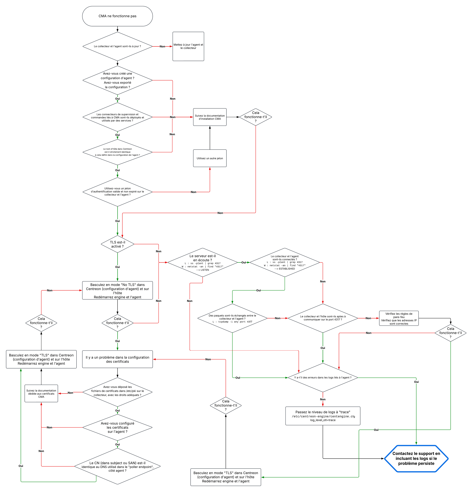

import Tabs from '@theme/Tabs';
import TabItem from '@theme/TabItem';



## Vérifications sur l'hôte

<Tabs groupId="sync">
<TabItem value="Linux" label="Linux">

### Vérifiez que le service est lancé

1. Exécutez la commande suivante :

   ```bash
   systemctl status centagent
   ```

2. Si le service n'est pas démarré, démarrez-le.

   ```bash
   systemctl restart centagent
   ```

### Vérifiez que le fichier de log agent ne contient pas d'erreur

Selon le chemin configuré pour votre fichier de log, recherchez d'éventuelles erreurs :

```bash
grep error /var/log/centreon-monitoring-agent/centagent.log
```

Aucune ligne ne doit être retournée.

### Vérifiez que la connexion avec le collecteur est établie

<Tabs groupId="sync">
<TabItem value="L'agent se connecte au collecteur" label="L'agent se connecte au collecteur">

1. Exécutez la commande suivante :

   ```bash
   nc -vz <IP ou DNS collecteur> 4317
   ```

   La valeur suivante doit être retournée : 

   ```bash
   Connection to <IP ou DNS collecteur> 4317 port [tcp/http] succeeded!
   ```

</TabItem>

<TabItem value="Le collecteur se connecte à l'agent" label="Le collecteur se connecte à l'agent">

1. Le port 4317 doit être ouvert en entrée sur l'hôte.

2. Exécutez la commande suivante :

   ```bash
   ss -plant | grep 4317
   ```

   Elle doit retourner des résultats, indiquant que le serveur est en écoute (LISTEN) ou que la connexion est établie (ESTABLISHED).
   
   ```bash
   Active Internet connections (servers and established)
   Proto Recv-Q Send-Q Local Address           Foreign Address         State
   tcp        0      0 0.0.0.0:4317          ::::                    LISTEN
   ```

   ```bash
   Active Internet connections (servers and established)
   Proto Recv-Q Send-Q    Local Address           Foreign Address         State
   tcp        0      0    0.0.0.0:4317          <IP COLLECTEUR>:<PORT>  ESTABLISHED
   ```

</TabItem>
</Tabs>
</TabItem>

<TabItem value="Windows" label="Windows">

### Vérifiez que le service est lancé

1. Exécutez la commande suivante :
  
   ```bash
   services.msc
   ```

2. Recherchez **Centreon Monitoring Agent** dans la liste des services : si le service n'est pas démarré, démarrez-le.

### Vérifiez que les logs ne contiennent pas d'erreur

Selon la configuration faite, utilisez l'observateur d'événements ou consultez le fichier spécifié.

### Vérifiez que la connexion avec le collecteur est établie

<Tabs groupId="sync">
<TabItem value="L'agent se connecte au collecteur" label="L'agent se connecte au collecteur">

1. Exécutez la commande suivante dans PowerShell :

   ```bash
   tnc <IP ou DNS collecteur> -p 4317
   ```

La valeur **true** doit être retournée.

</TabItem>

<TabItem value="Le collecteur se connecte à l'agent" label="Le collecteur se connecte à l'agent">

1. Le port 4317 doit être ouvert en entrée sur l'hôte.

2. Exécutez la commande suivante :

   ```bash
   netstat -an | find "4317"
   ```

   Elle doit retourner des résultats, indiquant que l'agent est en écoute (LISTEN) ou que la connexion est établie (ESTABLISHED).

  
   ```bash
   Active Internet connections (servers and established)
   Proto Recv-Q Send-Q Local Address           Foreign Address         State
   tcp        0      0 0.0.0.0:4317          ::::                    LISTEN
   ```

   ```bash
   Active Internet connections (servers and established)
   Proto Recv-Q Send-Q Local Address           Foreign Address         State
   tcp        0      0 0.0.0.0:4317          <IP COLLECTEUR>:<PORT>      ESTABLISHED
   ```

</TabItem>
</Tabs>
</TabItem>
</Tabs>

## Vérifications sur le collecteur

### Vérifiez que le serveur est en écoute et que des paquets sont échangés

<Tabs groupId="sync">
<TabItem value="L'agent se connecte au collecteur" label="L'agent se connecte au collecteur">

1. Le port 4317 doit être ouvert en entrée sur le collecteur.

2. Exécutez la commande suivante :

   ```bash
   ss -plant | grep 4317
   ```

   Elle doit retourner des résultats, indiquant que le collecteur est en écoute (LISTEN) ou que la connexion est établie (ESTABLISHED).

   
   ```bash
   Active Internet connections (servers and established)
   Proto Recv-Q Send-Q Local Address           Foreign Address         State
   tcp        0      0 0.0.0.0:4317          ::::                    LISTEN
   ```
   
   ```bash
   Active Internet connections (servers and established)
   Proto Recv-Q Send-Q Local Address           Foreign Address         State
   tcp        0      0 0.0.0.0:4317          <IP HOTE>:<PORT>      ESTABLISHED
   ```

</TabItem>
<TabItem value="Le collecteur se connecte à l'agent" label="Le collecteur se connecte à l'agent">

Le port 4317 doit être ouvert en entrée sur l'agent.

</TabItem>
</Tabs>

Exécutez la commande suivante :

```bash
tcpdump -i any port 4317
```

Elle doit retourner des résultats, indiquant que des paquets circulent entre l'agent et le collecteur.

### Activez les logs OpenTelemetry

1. Éditez le fichier de configuration du moteur de supervision :

   ```bash
   /etc/centreon-engine/centengine.cfg
   ```

2. Ajoutez la ligne suivante :

   ```bash
   log_level_otl=trace
   ```

   Les différents niveaux de log sont : trace, debug, info, warning, error, critical, disabled.

3. Redémarrez le moteur de supervision.

### Vérifiez que le fichier de log engine ne contient pas d'erreur

Exécutez la commande suivante :

```bash
grep error /var/log/centreon-engine/centengine.log
```

Aucune ligne concernant CMA ne doit être retournée.

## Vérifications dans Centreon

L'hôte et les services configurés doivent remonter un statut et des métriques.

## Emplacement des logs collecteur et agent

* Logs du collecteur : `/var/log/centreon-engine/centengine.log`

* Logs de l'agent : 
   * Linux : par défaut, `/var/log/centreon-monitoring-agent/centagent.log` (cet emplacement de log est configurable dans **/etc/centreon-monitoring-agent/centagent.json**)
   * Windows : l'emplacement est celui que vous avez défini lors de l'installation de l'agent (par défaut, dans l'observateur d'évènements Windows).