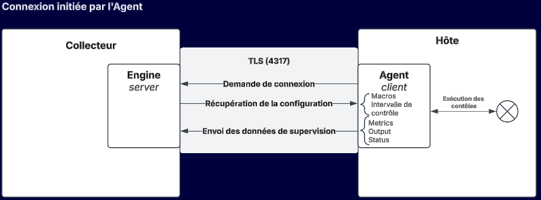
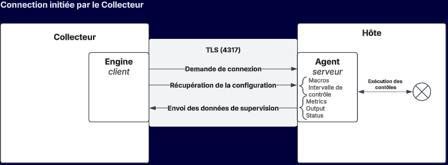

import Tabs from '@theme/Tabs';
import TabItem from '@theme/TabItem';
import PollerAgentConfiguration from '../_poller-agent-configuration.mdx';

> Utilisateurs de Centreon Cloud: l'agent CMA est encore en phase bêta pour la version Cloud. 
 
> Pour obtenir de l'aide ou échanger sur les évolutions de l'agent Centreon, visitez [notre groupe dédié sur The Watch](https://thewatch.centreon.com/groups/opentelemetry-agent-beta-program-61).

## Introduction

L'Agent de supervision Centreon (Centreon Monitoring Agent, CMA) est un logiciel qu'on installe sur les hôtes à superviser : il collecte des métriques et calcule des statuts, et les envoie à Centreon.

L'agent peut exécuter des contrôles natifs ou utiliser des plugins Centreon pour exécuter des contrôles non natifs. Les contrôles natifs sont exécutés directement par l'agent (contrairement aux contrôles non natifs, qui nécessitent l'installation de plugins locaux sur l'hôte). Les contrôles natifs sont plus performants et ont une meilleure empreinte (réduction de l'utilisation du processeur et de la mémoire).

Les contrôles natifs et non natifs sont définis dans le connecteur **Linux Centreon Monitoring Agent** ou dans le connecteur **Windows Centreon Monitoring Agent**. Les connecteurs fournissent les modèles et l'agent récupère la configuration de ces contrôles à intervalles réguliers après l'établissement de la connexion.

L'agent effectue les contrôles (pour les contrôles non natifs, en utilisant les plugins locaux) et envoie les données au collecteur. La partie du moteur du collecteur qui reçoit les données de l'agent est appelée récepteur OTLP (OTLP signifie OpenTelemetry protocol).

Les plugins Centreon comme les plugins personnalisés basés sur Nagios sont compatibles avec l'agent.

### Quand utiliser un agent ?

Utilisez l'agent CMA :

* lorsque les politiques de sécurité n'autorisent que les flux sortants (aucun contrôle ne peut être effectué par les collecteurs, le SNMP n'est pas autorisé).
* sur les sites qui n'ont pas de collecteur local.
* lorsque vous avez besoin d'exécuter un script localement sur la machine supervisée pour des raisons de sécurité (droits et/ou protocoles) ou de performance.

### OS supportés

L'agent peut être installé sur et superviser les OS suivants :

<Tabs groupId="sync">
<TabItem value="Linux" label="Linux">

* RHEL/Oracle Linux/Alma Linux 8
* RHEL/Oracle Linux/Alma Linux 9
* Debian 11
* Debian 12
* Ubuntu 22.04/24.04 LTS

</TabItem>
<TabItem value="Windows" label="Windows">

* Windows 10
* Windows 11
* Windows Server 2016
* Windows Server 2019
* Windows Server 2022

</TabItem>
</Tabs>

### Comment interagissent le collecteur et l'hôte?

#### Sens de connexion

Suivant le cas, soit l'agent soit le collecteur initie la connexion.
Une fois celle-ci établie, les échanges sont bidirectionnels.

* Dans le cas d'une **connexion initiée par l'agent**, le collecteur écoute sur un port spécifique, et peut recevoir des données de n agents/hôtes. Il s'agit du mode par défaut, qui permet une configuration dynamique des agents (on peut ajouter ou retirer des agents sans changer la configuration côté Collecteur)
* Vous pouvez également opter pour une **connexion initiée par le collecteur**. Ceci est pertinent dans le cas où, par exemple, l'agent n'est pas autorisé à se connecter au collecteur pour des raisons de sécurité (par exemple, lorsque l'hôte se trouve dans une DMZ). Vous devez déclarer chaque agent auquel le Collecteur devra se connecter, dans le menu **Collecteur > Configuration d'agent**.

Les deux sens de connection peuvent être combinés au sein d'un même collecteur, en fonction de la typologie de votre parc supervisé.

<!--You can use both types of communication at the same time (for different hosts).-->

#### Sécurisation de la connexion

La connexion entre le collecteur et l'agent doit être sécurisée en production.
<!-- 2 options are possible:-->
<!--* TLS: the certificate is signed by a certification authority and the Common Name (CN) is verified.
* TLS insecure: the certification authority and Common Name are not verified (self-signed certificates can be used).-->

Cela passe par : 
- [une connexion TLS par certificats](/pp/integrations/plugin-packs/getting-started/how-to-guides/cma/cma-certificates/)
- [l'utilisation d'un jeton d'authentification](#créez-le-jeton-dauthentification)

#### Schéma de fonctionnement

<Tabs groupId="sync">
<TabItem value="L'agent se connecte au collecteur" label="L'agent se connecte au collecteur">

</TabItem>
<TabItem value="Le collecteur se connecte à l'agent" label="Le collecteur se connecte à l'agent">

</TabItem>
</Tabs>


## Étape 1: Configurez Centreon

Cette étape s'effectue sur l'interface ou via [l'API Centreon Web](https://docs-api.centreon.com/api/centreon-web/24.10/).

### Installez le connecteur de supervision nécessaire (version onPrem)

Sur votre serveur central, vous devez installer le connecteur de supervision qui fournira les modèles et les commandes qui vous permettront de configurer les hôtes et les services supervisés dans Centreon.
Dans le cas d'une plateforme Cloud, ces connecteurs sont déjà installés.

<Tabs groupId="sync">
<TabItem value="Linux" label="Linux">

1. Sur votre serveur central, allez à la page **Configuration > Connecteurs > Connecteurs de supervision**.
2. [Installez](/docs/monitoring/pluginpacks#installer-un-connecteur-de-supervision) le connecteur de supervision [**Linux Centreon Monitoring Agent**](../../../procedures/operatingsystems-linux-centreon-monitoring-agent.md).

</TabItem>
<TabItem value="Windows" label="Windows">

1. Sur votre serveur central, allez à la page **Configuration > Connecteurs > Connecteurs de supervision**.
2. [Installez](/docs/monitoring/pluginpacks#installer-un-connecteur-de-supervision) le connecteur de supervision [**Windows Centreon Monitoring Agent**](../../../procedures/operatingsystems-windows-centreon-monitoring-agent.md).

</TabItem>
</Tabs>

### Mettez à jour le connecteur Centreon Monitoring Agent (version onPrem)

1. Allez à la page **Configuration > Commandes > Connecteurs**.

2. Mettez à jour le connecteur **Centreon Monitoring Agent** de la façon suivante : dans le champ **Utilisé par la commande**, entrez **Centreon-Monitoring-Agent** puis cliquez sur  **Select all**.

### Créez le jeton d'authentification

1. Allez à la page **Administration > Jetons d'authentification**.

2. Créez un jeton de type **Centreon Monitoring Agent**

Vous pouvez sélectionner une durée d'expiration. Par défaut, les jetons n'expirent pas.
Conservez le jeton généré pour la configuration de l'agent.
Au besoin, vous pouvez le copier dans le presse-papier à tout moment, depuis la liste des jetons.
Il est possible de n'utiliser qu'un jeton pour tous vos collecteurs et agents, ou d'en gérer plusieurs, pour un contrôle plus fin.


#### Comportement des jetons d'authentification CMA

**Expiration** 
<Tabs groupId="sync">
<TabItem value="L'agent se connecte au collecteur" label="L'agent se connecte au collecteur">
Lorsque le jeton expire, la connexion est tuée au prochain export de configuration ou envoi de données de performance. La mention “Token expired” apparait dans les logs Agent et Collecteur.
</TabItem>
<TabItem value="Le collecteur se connecte à l'agent" label="Le collecteur se connecte à l'agent">
Lorsque le jeton expire, la connexion est tuée. La mention “Token expired” apparait dans les logs Agent et Collecteur.
</TabItem>
</Tabs>

**Révocation**
Lorsque vous révoquez un jeton, déployez la configuration pour que cela soit pris en compte. 

### Créez l'hôte et les services

<Tabs groupId="sync">
<TabItem value="Linux" label="Linux">

Sur le serveur central, [créez l'hôte](/docs/monitoring/basic-objects/hosts) et appliquez-lui le modèle d'hôte **OS-Linux-Centreon-Monitoring-Agent-custom**. Le modèle comprend l'option **Activer les contrôles passifs** qui est définie sur **on**.
Créez les services associés au modèle d'hôte.

</TabItem>
<TabItem value="Windows" label="Windows">

Sur le serveur central, [créez l'hôte](/docs/monitoring/basic-objects/hosts) et appliquez-lui le modèle d'hôte **OS-Windows-Centreon-Monitoring-Agent-custom**. Le modèle comprend l'option **Activer les contrôles passifs** qui est définie sur **on**.
Créez les services associés au modèle d'hôte.

</TabItem>
</Tabs>

### Configurez la communication collecteur/agent

<!--<PollerAgentConfiguration type="CMA" />-->
1. Allez à la page **Configuration > Collecteurs > Configurations d'agent**, puis cliquez sur **Ajouter une configuration collecteur/agent**.
2. Dans la fenêtre qui s'ouvre, sélectionnez le Type d'agent "Centreon Monitoring Agent". Des champs supplémentaires apparaissent.
3. Sélectionnez le sens de connexion (par défaut : l'agent se connecte au collecteur).

<Tabs groupId="sync">
<TabItem value="L'agent se connecte au collecteur" label="L'agent se connecte au collecteur">
4. Dans la section **Paramètres**, sélectionnez le ou les collecteurs qui recevront des données en provenance de l'agent. <!--(You can select several pollers if the connection is initiated by the agent, but only one if it is initiated by the poller.)-->
5. Dans la section **Récepteur OTLP**, renseignez les chemins des fichiers de certificat. Voir [section dédiée](/pp/integrations/plugin-packs/getting-started/how-to-guides/cma/cma-certificates/) pour déterminer quels fichiers sont nécessaires, selon votre configuration et le sens de connexion souhaité.
> Si vous configurez plusieurs collecteurs en même temps, assurez-vous que tous les fichiers de certificat aient le même nom.
6. [Déployez la configuration en redémarrant le moteur de collecte](/docs/monitoring/monitoring-servers/deploying-a-configuration).

</TabItem>
<TabItem value="Le collecteur se connecte à l'agent" label="Le collecteur se connecte à l'agent">
4. Dans la section **Paramètres**, sélectionnez le collecteur qui se connectera aux agents. <!--(You can select several pollers if the connection is initiated by the agent, but only one if it is initiated by the poller.)-->
5. Dans la section **Hôtes supervisés**, sélectionnez l'hôte créé précédemment, son IP remonte et un port par défaut est renseigné. Modifier ces informations si nécessaire.
6. Renseignez les chemins des fichiers de certificat. Voir [section dédiée](/pp/integrations/plugin-packs/getting-started/how-to-guides/cma/cma-certificates/) pour déterminer quels fichiers sont nécessaires, selon votre configuration et le sens de connexion souhaité. 
7. Renseignez le jeton d'authentification créé précédemment. Il est aussi possible de créer un jeton depuis cet écran.
8. Ajoutez l'hôte.
9. Répétez l'opération pour chaque Hôte devant être lié à ce collecteur. Pour configurer de fortes volumétries, il est recommandé de passer par les API dédiées.
10. [Déployez la configuration en redémarrant le moteur de collecte](/docs/monitoring/monitoring-servers/deploying-a-configuration).
</TabItem>
</Tabs>

Cette configuration est déployée sur le collecteur dans le fichier /etc/centreon-engine/otl_server.json. Ce fichier ne doit pas être édité à la main car il est écrasé par le déploiement de la configuration.

## Étape 2 : Préparez le collecteur

Cette étape s'effectue sur le collecteur.

### Configurez le firewall

<Tabs groupId="sync">
<TabItem value="L'agent se connecte au collecteur" label="L'agent se connecte au collecteur">

```bash
firewall-cmd --zone=public --add-port=4317/tcp --permanent
```
```bash
firewall-cmd --reload 
```
</TabItem>
<TabItem value="Le collecteur se connecte à l'agent" label="Le collecteur se connecte à l'agent">
Pas d'action nécessaire.
</TabItem>
</Tabs>

### Configurez les paramètres de chiffrement

Voir [section dédiée](/pp/integrations/plugin-packs/getting-started/how-to-guides/cma/cma-certificates/) pour déterminer quels fichiers sont nécessaires, selon votre configuration et le sens de connexion souhaité. 

### Ajoutez les commandes CMA à vos listes blanches personnalisées

Si vous utilisez des listes blanches sur votre collecteur ([les collecteurs Cloud ont des listes blanches par défaut](/cloud/monitoring/basic-objects/commands#liste-blanche-de-commandes)), celles-ci doivent autoriser les commandes CMA. 
Sur le collecteur, dans votre fichier personnalisé de liste blanche (par exemple, **/etc/centreon-engine-whitelist/my-whitelist.yml**), incluez les lignes suivantes dans le bloc "cma-whitelist" : 

```text
whitelist:
  regex:
    - \/usr\/lib(64)?\/nagios\/plugins\/.*
    - \/usr\/lib(64)?\/nagios\/plugins\/.check_.*
    
cma-whitelist:
  default:
    regex:
      - \/usr\/lib(?:64)?\/nagios\/plugins\/.*
      - \/usr\/lib(?:64)?\/centreon\/plugins\/check_centreon_bam.*
      - \"C:\/Program Files\/Centreon\/Plugins\/centreon_plugins.exe\"\s+.+
      - ^\{\s*"check":".*\}$
      - \/usr\/bin\/echo\s+Host\s+alive
      - cmd\.exe\s+\/C\s+echo\s+.*
```

Vous pouvez au besoin spécifier des liste blanches par hôte, la syntaxe sera : 


```text
whitelist:
  regex:
    - \/usr\/lib(64)?\/nagios\/plugins\/.*
    - \/usr\/lib(64)?\/nagios\/plugins\/.check_.*
    
cma-whitelist:
  default:
    regex:
      - \/usr\/lib(?:64)?\/nagios\/plugins\/.*
      - \/usr\/lib(?:64)?\/centreon\/plugins\/check_centreon_bam.*
      - \"C:\/Program Files\/Centreon\/Plugins\/centreon_plugins.exe\"\s+.+
      - ^\{\s*"check":".*\}$
      - \/usr\/bin\/echo\s+Host\s+alive
      - cmd\.exe\s+\/C\s+echo\s+.*
  hosts:
    - hostname:Host_1
    regex:
      - ...
      
    - hostname:Host_2
    regex:
      - ...
```


Assurez-vous que les droits d'accès corrects sont définis sur tous les fichiers de liste blanche :

```
chown root:centreon-engine /etc/centreon-engine-whitelist/my-whitelist.yml
chmod 0640 /etc/centreon-engine-whitelist/my-whitelist.yml
chown root:centreon-engine /etc/centreon-engine-whitelist
chmod 750 /etc/centreon-engine-whitelist
```


Le comportement est le suivant : 
* Si le bloc whitelist est renseigné et le bloc cma-whitelist est absent → Le moteur de collecte appliquera la liste blanche et CMA n'appliquera pas de liste blanche (toute commande autorisée)
* Si les blocs whitelist et cma-whitelist sont renseignés → Le moteur de collecte appliquera le bloc whitelist et CMA appliquera cma-whitelist 
* Si le bloc whitelist est absent et le bloc cma-whitelist est renseigné → Le moteur de collecte n'appliquera pas de liste blanche (toute commande autorisée) and CMA appliquera cma-whitelist  
* Si aucun bloc n'est renseigné → Aucune liste blanche n'est appliquée

## Étape 3 : Préparez l'hôte

Cette étape s'effectue sur l'hôte supervisé.


### Téléchargez et installez l'agent

<Tabs groupId="sync">
<TabItem value="Linux" label="Linux">

#### Installer le dépôt Centreon et l'agent

Installez le dépôt Centreon puis l'agent à l'aide des commandes suivantes :

<Tabs groupId="sync">
<TabItem value="Alma / RHEL / Oracle Linux 8" label="Alma / RHEL / Oracle Linux 8">

```shell
dnf install -y dnf-plugins-core
dnf config-manager --add-repo https://packages.centreon.com/rpm-standard/24.10/el8/centreon-24.10.repo
dnf install  centreon-monitoring-agent
```

</TabItem>
<TabItem value="Alma / RHEL / Oracle Linux 9" label="Alma / RHEL / Oracle Linux 9">

```shell
dnf install -y dnf-plugins-core
dnf config-manager --add-repo https://packages.centreon.com/rpm-standard/24.10/el9/centreon-24.10.repo
dnf install  compat-openssl11 centreon-monitoring-agent
```

</TabItem>
<TabItem value="Debian 11 & 12" label="Debian 11 & 12">

```shell
apt-get update
apt-get -y install lsb-release gpg wget
echo "deb https://packages.centreon.com/apt-standard-24.10-stable $(lsb_release -sc) main" | tee /etc/apt/sources.list.d/centreon.list
echo "deb https://packages.centreon.com/apt-plugins-stable/ $(lsb_release -sc) main" | tee /etc/apt/sources.list.d/centreon-plugins.list
```

Ensuite, importez la clé du dépôt :

```shell
wget -O- https://apt-key.centreon.com | gpg --dearmor | tee /etc/apt/trusted.gpg.d/centreon.gpg > /dev/null 2>&1
```

Ensuite, installez l'agent :

```shell
apt-get update
apt install centreon-monitoring-agent
```

</TabItem>
<TabItem value="Ubuntu 22.04 & 24.04" label="Ubuntu 22.04 & 24.04">

1. Exécutez les commandes suivantes :

```shell
apt-get update
apt-get -y install lsb-release gpg wget
echo "deb https://packages.centreon.com/ubuntu-standard-24.10-stable $(lsb_release -sc) main" | tee /etc/apt/sources.list.d/centreon.list
echo "deb https://packages.centreon.com/ubuntu-plugins-stable/ $(lsb_release -sc) main" | tee /etc/apt/sources.list.d/centreon-plugins.list
```

2. Importez la clé du dépôt :

```shell
wget -O- https://apt-key.centreon.com | gpg --dearmor | tee /etc/apt/trusted.gpg.d/centreon.gpg > /dev/null 2>&1
```

3. Installez l'agent :

```shell
apt-get update
apt install centreon-monitoring-agent
```

</TabItem>
</Tabs>

#### Configurez **centreon-monitoring-agent**

1. Remplacez le contenu du fichier **/etc/centreon-monitoring-agent/centagent.json** par le contenu suivant :

<Tabs groupId="sync">
<TabItem value="L'agent se connecte au collecteur" label="L'agent se connecte au collecteur">

```json
{
  "log_level":"info",
  "endpoint":"<IP/DNS COLLECTEUR>:4317",
  "host":"host_1",
  "log_type":"file",
  "log_file":"/var/log/centreon-monitoring-agent/centagent.log" ,
  "encryption":true,
  "ca_certificate":"/tmp/ca_1234.crt",
  "token":"<JETON>"
}
```
</TabItem>
<TabItem value="Le collecteur se connecte à l'agent" label="Le collecteur se connecte à l'agent">

```json
{
  "log_level":"info",
  "endpoint":"0.0.0.0:4317",
  "host":"host_1",
  "log_type":"file",
  "log_file":"/var/log/centreon-monitoring-agent/centagent.log" ,
  "reversed_grpc_streaming":true,
  "encryption":true,
  "private_key":"/tmp/server_1234.key",
  "public_cert":"/tmp/server_1234.crt",
  "ca_certificate":"/tmp/ca_1234.crt",
  "token":"<JETON>"
}
```

</TabItem>
</Tabs>
> Important : dans le champ **host**, entrez le nom de l'hôte à superviser tel que vous l'avez saisi dans l'interface Centreon. Si absent, l'agent utilisera le hostname de la machine. Ce nom sera la clé de correspondance permettant de remonter les données sur l'hôte Centreon.

#### Configurez les paramètres de chiffrement

Voir [section dédiée](/pp/integrations/plugin-packs/getting-started/how-to-guides/cma-certificates/) pour déterminer quels fichiers sont nécessaires, selon votre configuration et le sens de connexion souhaité. 


#### Configurez les logs

Deux types de log sont disponibles :

* file: l'agent loggue dans le fichier dont le chemin est donné par **log_file**.
* stdout: l'agent loggue vers la sortie standard de l'exe.

Dans le cas de logging vers un fichier, une rotation peut être paramétrée avec les clés **log_max_file_size** et **log_max_files**.

Les niveaux de logs possibles sont:

* off: aucun log
* critical: erreurs critiques
* error: toutes les erreurs
* info: quelques informations supplémentaires
* debug: quelques informations sur les connections en plus
* trace: le niveau de trace le plus verbeux, permet de voir les messages échangés avec le collecteur

#### Redémarrez l'agent

   ```shell
   systemctl restart centagent
   ```

Vous pouvez vérifier que l'agent a bien redémarré, avec la commande suivante :
```shell
systemctl status centagent
```

</TabItem>
<TabItem value="Windows" label="Windows">

[Téléchargez l'installer de l'agent](https://download.centreon.com)  (onglet **Custom Platform**, puis onglet **Monitoring Agent**), sur tous les serveurs que vous voulez superviser.

Le programme d'installation de l'agent peut s'utiliser suivant deux modes:

<Tabs groupId="sync">
<TabItem value="Mode interactif" label="Mode interactif">

1. Lancez l'installer (durant la configuration, vous pourrez cliquer sur les (i) pour avoir de l'aide).
   Si vous installez les plugins Centreon, l'installer tentera de télécharger et d'installer la dernière version des plugins Centreon. Si l'installer ne peut pas les télécharger (pas d'accès web, problème réseau), une popup vous demandera confirmation pour installer les plugins Centreon embarqués dans l'installer.
  
   Les résultats seront affichés dans la fenêtre de l'installer.

2. Configurez le Host name, l'endpoint/listening interface et le sens de connexion :
   * Dans le champ **Host name in Centreon**, entrez le nom de l'hôte à superviser tel que vous l'avez saisi dans l'interface Centreon.
  > Important : Ce nom sera la clé de correspondance permettant de remonter les données sur l'hôte Centreon. Il doit être strictement identique au nom d'hôte Centreon (sensible à la casse).

<Tabs groupId="sync">
<TabItem value="L'agent se connecte au collecteur" label="L'agent se connecte au collecteur">
   * Dans le champ **Poller endpoint**, saisissez l'adresse IP ou le nom DNS du collecteur, suivi du port d'écoute CMA (4317 par défaut), sous la forme \<adresse IP ou nom DNS\>:port, par exemple 192.168.45.32:4317.
</TabItem>
<TabItem value="Le collecteur se connecte à l'agent" label="Le collecteur se connecte à l'agent">
   * Le champ **Listening interface** pourra rester à sa valeur par défaut (0.0.0.0:4317), et correspond à l'interface sur laquelle l'agent va accepter les connections venant du collecteur.
   La valeur par défaut (0.0.0.0) correspond à "toutes les interfaces", et peut être restreinte pour des raisons de sécurité.
</TabItem>
</Tabs>


</TabItem>
<TabItem value="Mode silencieux" label="Mode silencieux (console)">

Dans ce mode, aucune interface n'est lancée. Comme cet installer n'est pas un programme console, il rend immédiatement la main même s'il n'a pas encore fini. Vous devez attendre de voir apparaître dans la console le message indiquant qu'il a terminé. 
Si vous voulez tester le succès de l'installation, vous devez récupérer l'exit status. Vous pouvez le lancer dans un powershell et attendre la fin du processus. L'exit status vaudra 0 si tout s'est bien passé.

Pour le lancer en mode silencieux, vous devez mettre en premier argument /S.
Vous pouvez afficher une liste des arguments avec la ligne de commande suivante :

```shell
centreon-monitoring-agent.exe /S --help
```

Les différents arguments sont:

| flag                       | description                                                                                                                                                                                                                                                                                                                                                                                                                                                                                         |
| -------------------------- | --------------------------------------------------------------------------------------------------------------------------------------------------------------------------------------------------------------------------------------------------------------------------------------------------------------------------------------------------------------------------------------------------------------------------------------------------------------------------------------------------- |
| --install_cma              | Si ce flag est présent, l'agent sera installé                                                                                                                                                                                                                                                                                                                                                                                                                                                       |
| --install_plugins          | Si ce flag est présent, la dernière version des plugins sera téléchargée et installée                                                                                                                                                                                                                                                                                                                                                                                                               |
| --install_embedded_plugins | Utilisez ce flag pour installer les plugins fournis par l'installer (cas d'un hôte n'ayant pas accès à internet)                                                                                                                                                                                                                                                                                                                                                                                    |
| --hostname                 | Le nom de l'hôte à superviser tel que vous l'avez saisi dans l'interface Centreon. Ce nom sera la clé de correspondance permettant de remonter les données sur l'hôte Centreon.                                                                                                                                                                                       |
| --endpoint                 | Dans le cas le plus courant (l'agent se connecte au collecteur), saisissez l'adresse IP ou le nom DNS suivi du port OpenTelemetry sur lequel écoute le collecteur, sous la forme \<adresse IP ou nom DNS\>:port, par exemple 192.168.45.32:4317. Si vous activez l'option **--reverse** (le collecteur se connecte à l'agent), vous devez choisir l'interface (toutes les interfaces : 0.0.0.0) et le port (généralement 4317) sur lequel l'agent va accepter les connections venant du collecteur. |
| --reverse                  | Si ce flag est présent, l'agent accepte les connections venant du collecteur                                                                                                                                                                                                                                                                                                                                                                                                                        |
| --log_type                 | event_log ou file. Si vous choisissez file, le paramètre log_file est obligatoire                                                                                                                                                                                                                                                                                                                                                                                                                   |
| --log_level                | Choisir parmi: off, critical, error, warning, debug ou trace                                                                                                                                                                                                                                                                                                                                                                                                                                        |
| --log_file                 | Chemin du fichier de log                                                                                                                                                                                                                                                                                                                                                                                                                                                                            |
| --log_max_file_size        | Taille maximale du fichier de log avant rotation, en Mo.                                                                                                                                                                                                                                                                                                                                                                                                                                            |
| --log_max_files            | Nombre maximal de fichiers de log. Pour que la rotation des logs soit activée, ces deux paramètres sont nécessaires.                                                                                                                                                                                                                                                                                                                                                                                |
| --encryption               | Si ce flag est présent le chiffrement est activé.                                                                                                                                                                                                                                                                                                                                                                                                                                                   |
| --private_key              | Chemin du fichier contenant la clé privée. Obligatoire si le chiffrement et le mode reverse sont activés.                                                                                                                                                                                                                                                                                                                                                                                           |
| --public_cert              | Chemin du fichier contenant la clé publique. Obligatoire si le chiffrement et le mode reverse sont activés.                                                                                                                                                                                                                                                                                                                                                                                         |
| --ca                       | Chemin du fichier contenant le certificat de confiance.                                                                                                                                                                                                                                                                                                                                                                                                                                             |
| --ca_name                  | TLS certificate common name (CN).                                                                                                                                                                                                                                                                                                                                                                                                                                                                   |
| --reverse                  | Si ce flag est activé, l'agent accepte les connexions venant du collecteur.                                                                                                                                                                                                                                                                                                                                                                                              |
| --token                    | Jeton d'authentification.

Si vous utilisez l'option **--install_plugins** et que le téléchargement échoue, l'installer va installer les plugins fournis par l'installer.


</TabItem>
</Tabs>

#### Données de configuration

Les données renseignées via l'installer ou le mode silencieux sont écrites en base de registre : 

```
\HKEY_LOCAL_MACHINE\SOFTWARE\Centreon\CentreonMonitoringAgent
```

#### Configurez les paramètres de chiffrement

Voir [section dédiée](/pp/integrations/plugin-packs/getting-started/how-to-guides/cma/cma-certificates/) pour déterminer quels fichiers sont nécessaires, selon votre configuration et le sens de connexion souhaité. 


#### Configurez les logs

Deux types de log sont disponibles :
   * **eventlog** : les logs sont envoyés vers les journaux d'évènements Windows.
   * **file** : les logs sont écrits dans un fichier
   Si vous choisissez **file**, vous pouvez configurer le chemin du fichier dans **Log file**, et la rotation de logs en renseignant **Max File Size** et **Max number of files**.

   Les niveaux de logs possibles sont:
     * off: aucun log
     * critical: erreurs critiques
     * error: toutes les erreurs
     * info: ajout d'informations supplémentaires
     * debug: ajout d'informations sur les connexions
     * trace: permet de voir les messages échangés avec le collecteur

</TabItem>
</Tabs>

### Déployer les plugins Centreon agent sur l'hôte

Si vous souhaitez exécuter des contrôles non natifs, vous devez installer les plugins Centreon agent, qui exécuteront les contrôles sur l'hôte.

<Tabs groupId="sync">
<TabItem value="Linux" label="Linux">

##### Activez les dépôts Centreon et installez les plugins

Ce dépôt permettra d'installer les plugins Centreon ainsi que **les dépendances qui ne peuvent pas être satisfaites par les dépôts standard des distributions**.

<Tabs groupId="sync">
<TabItem value="Alma / RHEL / Oracle Linux 8" label="Alma / RHEL / Oracle Linux 8">

```bash
dnf -y install dnf-plugins-core oracle-epel-release-el8
dnf config-manager --set-enabled ol8_codeready_builder

cat >/etc/yum.repos.d/centreon-plugins.repo <<'EOF'
[centreon-plugins-stable]
name=Centreon plugins repository.
baseurl=https://packages.centreon.com/rpm-plugins/el8/stable/$basearch/
enabled=1
gpgcheck=1
gpgkey=https://yum-gpg.centreon.com/RPM-GPG-KEY-CES
module_hotfixes=1

[centreon-plugins-stable-noarch]
name=Centreon plugins repository.
baseurl=https://packages.centreon.com/rpm-plugins/el8/stable/noarch/
enabled=1
gpgcheck=1
gpgkey=https://yum-gpg.centreon.com/RPM-GPG-KEY-CES
module_hotfixes=1

[centreon-plugins-testing]
name=Centreon plugins repository. (UNSUPPORTED)
baseurl=https://packages.centreon.com/rpm-plugins/el8/testing/$basearch/
enabled=0
gpgcheck=1
gpgkey=https://yum-gpg.centreon.com/RPM-GPG-KEY-CES
module_hotfixes=1

[centreon-plugins-testing-noarch]
name=Centreon plugins repository. (UNSUPPORTED)
baseurl=https://packages.centreon.com/rpm-plugins/el8/testing/noarch/
enabled=0
gpgcheck=1
gpgkey=https://yum-gpg.centreon.com/RPM-GPG-KEY-CES
module_hotfixes=1

[centreon-plugins-unstable]
name=Centreon plugins repository. (UNSUPPORTED)
baseurl=https://packages.centreon.com/rpm-plugins/el8/unstable/$basearch/
enabled=0
gpgcheck=1
gpgkey=https://yum-gpg.centreon.com/RPM-GPG-KEY-CES
module_hotfixes=1

[centreon-plugins-unstable-noarch]
name=Centreon plugins repository. (UNSUPPORTED)
baseurl=https://packages.centreon.com/rpm-plugins/el8/unstable/noarch/
enabled=0
gpgcheck=1
gpgkey=https://yum-gpg.centreon.com/RPM-GPG-KEY-CES
module_hotfixes=1
EOF
```

Installez le plugin :

```bash
dnf install -y centreon-plugin-Operatingsystems-Linux-Local.noarch
```

</TabItem>
<TabItem value="Alma / RHEL / Oracle Linux 9" label="Alma / RHEL / Oracle Linux 9">

```bash
dnf install dnf-plugins-core
dnf install epel-release
dnf config-manager --set-enabled crb

cat >/etc/yum.repos.d/centreon-plugins.repo <<'EOF'
[centreon-plugins-stable]
name=Centreon plugins repository.
baseurl=https://packages.centreon.com/rpm-plugins/el9/stable/$basearch/
enabled=1
gpgcheck=1
gpgkey=https://yum-gpg.centreon.com/RPM-GPG-KEY-CES
module_hotfixes=1

[centreon-plugins-stable-noarch]
name=Centreon plugins repository.
baseurl=https://packages.centreon.com/rpm-plugins/el9/stable/noarch/
enabled=1
gpgcheck=1
gpgkey=https://yum-gpg.centreon.com/RPM-GPG-KEY-CES
module_hotfixes=1

[centreon-plugins-testing]
name=Centreon plugins repository. (UNSUPPORTED)
baseurl=https://packages.centreon.com/rpm-plugins/el9/testing/$basearch/
enabled=0
gpgcheck=1
gpgkey=https://yum-gpg.centreon.com/RPM-GPG-KEY-CES
module_hotfixes=1

[centreon-plugins-testing-noarch]
name=Centreon plugins repository. (UNSUPPORTED)
baseurl=https://packages.centreon.com/rpm-plugins/el9/testing/noarch/
enabled=0
gpgcheck=1
gpgkey=https://yum-gpg.centreon.com/RPM-GPG-KEY-CES
module_hotfixes=1

[centreon-plugins-unstable]
name=Centreon plugins repository. (UNSUPPORTED)
baseurl=https://packages.centreon.com/rpm-plugins/el9/unstable/$basearch/
enabled=0
gpgcheck=1
gpgkey=https://yum-gpg.centreon.com/RPM-GPG-KEY-CES
module_hotfixes=1

[centreon-plugins-unstable-noarch]
name=Centreon plugins repository. (UNSUPPORTED)
baseurl=https://packages.centreon.com/rpm-plugins/el9/unstable/noarch/
enabled=0
gpgcheck=1
gpgkey=https://yum-gpg.centreon.com/RPM-GPG-KEY-CES
module_hotfixes=1
EOF
```

Installez le plugin :

```bash
dnf install -y centreon-plugin-Operatingsystems-Linux-Local.noarch
```

</TabItem>
<TabItem value="Debian 11 & 12" label="Debian 11 & 12">

```bash
apt update && apt install lsb-release ca-certificates apt-transport-https software-properties-common wget gnupg2 curl

wget -O- https://apt-key.centreon.com | gpg --dearmor | tee /etc/apt/trusted.gpg.d/centreon.gpg > /dev/null 2>&1
echo "deb https://packages.centreon.com/apt-plugins-stable/ $(lsb_release -sc) main" | tee /etc/apt/sources.list.d/centreon-plugins.list
apt-get update
```

Installez le plugin :

```bash
apt -y install centreon-plugin-operatingsystems-linux-local
```

</TabItem>
</Tabs>
</TabItem>
<TabItem value="Windows" label="Windows">

Sur les hôtes que vous voulez superviser, les plugins sont déjà installés par l'installer du Centreon Monitoring Agent.

</TabItem>
</Tabs>


## Tests de bon fonctionnement 

Voir [section dédiée](/pp/integrations/plugin-packs/getting-started/how-to-guides/cma/cma-troubleshoting/).

