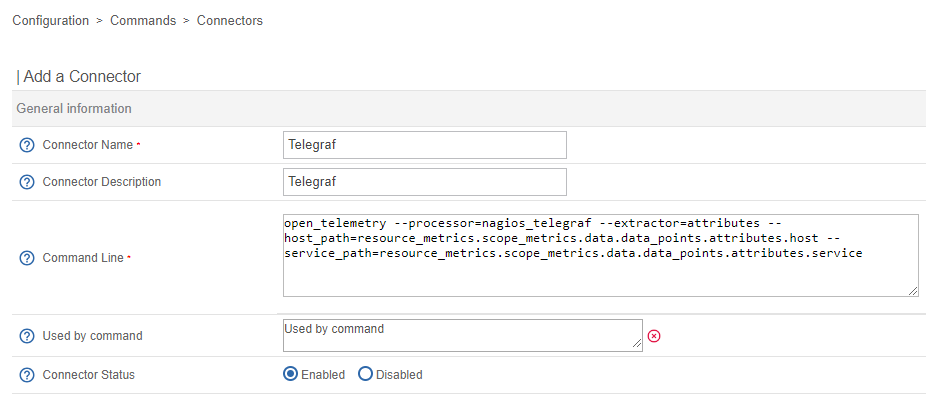

import Tabs from '@theme/Tabs';
import TabItem from '@theme/TabItem';

## Introduction

### Général

Centreon est capable de collecter des données de monitoring (métriques et statuts) auprès de l'agent Telegraf.
Cela peut être une valeur ajoutée si vous avez besoin d'un agent OpenTelemetry, capable d'exécuter des plugins nagios.

### Format de données d'entrée Nagios

L'intégration Telegraf de Centreon est basée sur le [Nagios input data format](https://docs.influxdata.com/telegraf/v1/data_formats/input/nagios/) natif, qui permet à Telegraf d'exécuter des plugins Nagios.
Centreon et les plugins personnalisés sont gérés par Telegraf, qui peut renvoyer des métriques et des statuts.

### Serveur de configuration Telegraf 

Centreon Engine embarque désormais nativement un gestionnaire de configuration d'agent Telegraf.
Ce composant, développé par Centreon est dédié à fournir une configuration à jour du Telegraf.
> La configuration est mise à jour sur l'agent uniquement lors du démarrage ou du rechargement.

### Limitations

En raison des contraintes de Telegraf et Centreon, les limitations suivantes doivent être prises en compte.
* Le rechargement manuel de Telegraf sur l'hôte est nécessaire à chaque fois que la configuration est mise à jour dans Centreon
* Les métriques inconnues (c'est-à-dire : provenant des receivers OTLP) ne sont pas prises en charge
* Seules les métriques et les statuts sont renvoyés (aucun output)
* Les connexions réseau sont à sens unique : agents vers poller (c'est-à-dire : l'hôte dans la DMZ aura besoin d'un poller dans la DMZ)
* Comme pour tout agent, la mise à jour de l'agent est nécessaire pour mettre à jour les plugins (pas de mise à jour automatique)

## Téléchargement & Installation

Les instructions de téléchargement et d'installation sont documentées [içi](https://docs.influxdata.com/telegraf/v1/install/).

## Configuration dans Centreon

### Installation des packs de connecteurs

Pour Windows : Windows Telegraf AGENT
Pour Linux : Linux Telegraf AGENT

### Créer le connecteur

Allez dans Configuration Commandes Connecteurs



Créez un nouveau connecteur avec les valeurs suivantes :

* Nom du connecteur : Telegraf
* Description du connecteur : Telegraf 
* Ligne de Commande :
~~~
open_telemetry --processor=nagios_telegraf --extractor=attributes --host_path=resource_metrics.scope_metrics.data.data_points.attributes.host --service_path=resource_metrics.scope_metrics.data.data_points.attributes.service
~~~
**open_telemetry** indiques à Engine que ce n'est pas un vrai connecteur

**--processor=nagios_telegraf**    
Toutes les données reçues sont stockées dans des files FiFo.  
Ce processeur affichera ces données afin de générer des résultats de vérification 

**--extractor=attributes --host_path=resource_metric…..attributes.host --service_path=resource……...service**  
Cet extracteur recherchera le nom d'hôte et la description du service dans ces attributs de télémétrie ouverts

* Utilisé par la commande : 
OS-Windows-Telegraf-Agent-Certificates
OS-Windows-Telegraf-Agent-Ntp
OS-Windows-Telegraf-Agent-Pending-Reboot
OS-Windows-Telegraf-Agent-Sessions
OS-Windows-Telegraf-Agent-Updates

* État du connecteur : Activé

### Configuration Engine

Créez otl_server.json avec le contenu suivant.

```
broker_module=/usr/lib64/centreon-engine/libopentelemetry.so /etc/centreon-engine/otl_server.json

{
 "otel_server": {
   "host": "0.0.0.0",
   "port": 4317
 },
 "max_length_grpc_log": 0,
 "telegraf_conf_server": {
   "http_server": {
     "port": 1443,
     "encryption": true,
     "certificate_path": "/tmp/otel/server.crt",
     "key_path": "/tmp/otel/server.key"
   },
   "telegraf_conf": {
     "interval": "10s",
     "service_address": "127.0.0.1:4317"
   }
 }
}
```

**otel_server** Serveur gRPC sur lequel le collecteur se connectera et transmettra les données  
**telegraf_conf_server** L'agent Telegraf se connectera au moteur pour obtenir sa configuration  
- **http_server** Serveur http(s) utilisé par les collecteurs Telegraf pour obtenir leur configuration.  
- **telegraf_conf** une configuration Telegraf telle que la période de vérification et où envoyer les données (configuration otel_server vue du côté de l'agent Telegraf)

### Ajout d'un nouveau module Broker
Aller dans Configuration    Pollers    Engine configuration  Data

Dans  "Multiple Broker Module", cliquer sur "Add a new entry".

Ajoutez l'entrée suivante :
```
/usr/lib64/centreon-engine/libopentelemetry.so /etc/centreon-engine/otl_server.json
```


## Supervision

### Déployer les plugins Centreon sur les hôtes

#### Linux

##### Activez notre référentiel de plugins et installez le plugin

Ce référentiel vous fournira nos plugins packagés ainsi que **les dépendances qui ne sont pas disponibles dans les référentiels de distribution standard**.

<Tabs groupId="sync">
<TabItem value="Alma / RHEL / Oracle Linux 8" label="Alma / RHEL / Oracle Linux 8">

```bash
cat >/etc/yum.repos.d/centreon-plugins.repo <<'EOF'
[centreon-plugins-stable]
name=Centreon plugins repository.
baseurl=https://packages.centreon.com/rpm-plugins/el8/stable/$basearch/
enabled=1
gpgcheck=1
gpgkey=https://yum-gpg.centreon.com/RPM-GPG-KEY-CES
module_hotfixes=1

[centreon-plugins-stable-noarch]
name=Centreon plugins repository.
baseurl=https://packages.centreon.com/rpm-plugins/el8/stable/noarch/
enabled=1
gpgcheck=1
gpgkey=https://yum-gpg.centreon.com/RPM-GPG-KEY-CES
module_hotfixes=1

[centreon-plugins-testing]
name=Centreon plugins repository. (UNSUPPORTED)
baseurl=https://packages.centreon.com/rpm-plugins/el8/testing/$basearch/
enabled=0
gpgcheck=1
gpgkey=https://yum-gpg.centreon.com/RPM-GPG-KEY-CES
module_hotfixes=1

[centreon-plugins-testing-noarch]
name=Centreon plugins repository. (UNSUPPORTED)
baseurl=https://packages.centreon.com/rpm-plugins/el8/testing/noarch/
enabled=0
gpgcheck=1
gpgkey=https://yum-gpg.centreon.com/RPM-GPG-KEY-CES
module_hotfixes=1

[centreon-plugins-unstable]
name=Centreon plugins repository. (UNSUPPORTED)
baseurl=https://packages.centreon.com/rpm-plugins/el8/unstable/$basearch/
enabled=0
gpgcheck=1
gpgkey=https://yum-gpg.centreon.com/RPM-GPG-KEY-CES
module_hotfixes=1

[centreon-plugins-unstable-noarch]
name=Centreon plugins repository. (UNSUPPORTED)
baseurl=https://packages.centreon.com/rpm-plugins/el8/unstable/noarch/
enabled=0
gpgcheck=1
gpgkey=https://yum-gpg.centreon.com/RPM-GPG-KEY-CES
module_hotfixes=1
EOF

```

Installer le plugin :

```bash
dnf install -y centreon-plugin-Operatingsystems-Linux-Local.noarch
```

</TabItem>
<TabItem value="Alma / RHEL / Oracle Linux 9" label="Alma / RHEL / Oracle Linux 9">

```bash
cat >/etc/yum.repos.d/centreon-plugins.repo <<'EOF'
[centreon-plugins-stable]
name=Centreon plugins repository.
baseurl=https://packages.centreon.com/rpm-plugins/el9/stable/$basearch/
enabled=1
gpgcheck=1
gpgkey=https://yum-gpg.centreon.com/RPM-GPG-KEY-CES
module_hotfixes=1

[centreon-plugins-stable-noarch]
name=Centreon plugins repository.
baseurl=https://packages.centreon.com/rpm-plugins/el9/stable/noarch/
enabled=1
gpgcheck=1
gpgkey=https://yum-gpg.centreon.com/RPM-GPG-KEY-CES
module_hotfixes=1

[centreon-plugins-testing]
name=Centreon plugins repository. (UNSUPPORTED)
baseurl=https://packages.centreon.com/rpm-plugins/el9/testing/$basearch/
enabled=0
gpgcheck=1
gpgkey=https://yum-gpg.centreon.com/RPM-GPG-KEY-CES
module_hotfixes=1

[centreon-plugins-testing-noarch]
name=Centreon plugins repository. (UNSUPPORTED)
baseurl=https://packages.centreon.com/rpm-plugins/el9/testing/noarch/
enabled=0
gpgcheck=1
gpgkey=https://yum-gpg.centreon.com/RPM-GPG-KEY-CES
module_hotfixes=1

[centreon-plugins-unstable]
name=Centreon plugins repository. (UNSUPPORTED)
baseurl=https://packages.centreon.com/rpm-plugins/el9/unstable/$basearch/
enabled=0
gpgcheck=1
gpgkey=https://yum-gpg.centreon.com/RPM-GPG-KEY-CES
module_hotfixes=1

[centreon-plugins-unstable-noarch]
name=Centreon plugins repository. (UNSUPPORTED)
baseurl=https://packages.centreon.com/rpm-plugins/el9/unstable/noarch/
enabled=0
gpgcheck=1
gpgkey=https://yum-gpg.centreon.com/RPM-GPG-KEY-CES
module_hotfixes=1
EOF
```

Installer le plugin :

```bash
dnf install -y centreon-plugin-Operatingsystems-Linux-Local.noarch
```

</TabItem>
<TabItem value="Debian 11 & 12" label="Debian 11 & 12">

```bash
wget -O- https://apt-key.centreon.com | gpg --dearmor | tee /etc/apt/trusted.gpg.d/centreon.gpg > /dev/null 2>&1
echo "deb https://packages.centreon.com/apt-plugins-stable/ $(lsb_release -sc) main" | tee /etc/apt/sources.list.d/centreon-plugins.list
apt-get update
```

Installer le plugin :

```bash
apt -y install centreon-plugin-operatingsystems-linux-local
```

</TabItem>
</Tabs>


#### Windows

Téléchargez et exécutez le package pour [Windows](https://github.com/centreon/centreon-nsclient-build/releases/download/20240325/centreon_plugins.exe)


### Créer les équipements en utilisant les modèles