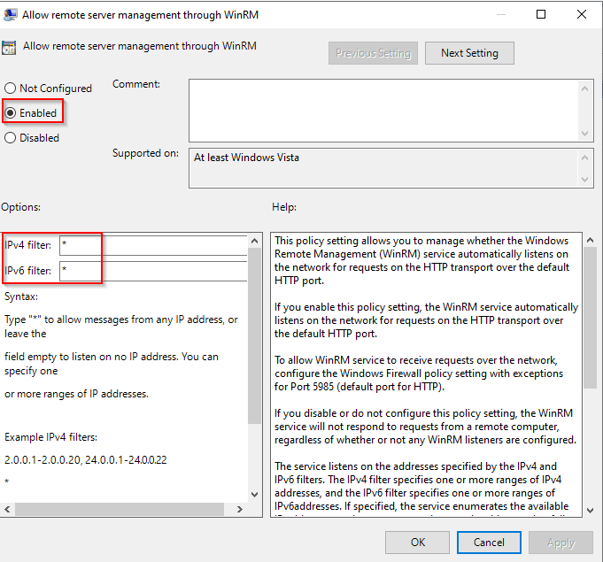
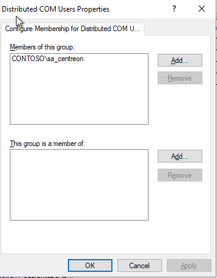

import Tabs from '@theme/Tabs';
import TabItem from '@theme/TabItem';

## Introduction

WS-Management est une spécification du DMTF définissant un protocole de communication pour l'administration des serveurs, équipements et applications, basé sur les web services (SOAP).

## Configuration de WinRM

<Tabs groupId="sync">
<TabItem value="Configuration Locale" label="Configuration Locale">

### Configuration de WSMAN

Sur votre serveur Windows, ouvrez PowerShell avec les privilèges d'administrateur et exécutez les commandes suivantes.

Activez WinRM et autorisez l'accès à distance :

``` bash
winrm quickconfig
```

Activez la méthode d'authentification "Basic" :

``` bash
winrm s winrm/config/service/auth '@{Basic="true"}'
```

### Configuration du firewall

* Ouvrez le **Server Manager**.
* Dans le menu **Tools**, sélectionnez **Windows Defender Firewall with Advanced Security**.
* Cliquez sur **Inbound Rules**.
* Cliquez sur **New Rule**.
* Cliquez sur **Port**, puis sur **Next**.

  

* Saisissez la valeur **5986** dans le champ **Specific local ports** et cliquez sur **Next**.

  

* Vérifiez que **Allow the connection** est sélectionné, puis cliquez sur **Next**.

  

* Sur la page suivante, sélectionnez les profils de pare-feu pour lesquels la règle doit s'appliquer, puis cliquez sur **Next**.

  

* Sur la page suivante, donnez un nom à la règle, puis cliquez sur **Finish**.

  

### Créer un certificat auto-signé

Ouvrez PowerShell avec des privilèges d'administrateur et exécutez la commande suivante, en remplaçant
@HOSTNAME@ par la valeur correcte.

``` bash
New-SelfSignedCertificate -Subject 'CN=@HOSTNAME@' -TextExtension '2.5.29.37={text}1.3.6.1.5.5.7.3.1'
```

Copiez le **Thumbprint** pour l'étape suivante :


Créez le port WinRM HTTPS en remplaçant les valeurs @HOSTNAME@ et @THUMBPRINT@ par les valeurs correctes.

``` bash
winrm create winrm/config/Listener?Address=*+Transport=HTTPS  '@{Hostname="@HOSTNAME@";CertificateThumbprint="@THUMBPRINT@"}'
```

À partir d'ici, vous pouvez superviser votre serveur Windows en utilisant le compte administrateur local.

Nous déconseillons fortement l'utilisation d'un compte administrateur au sein de Centreon.

## Configuration d'un utilisateur dédié

Cette section décrit comment configurer un utilisateur local et les privilèges minimum pour superviser votre serveur.

### Créer un utilisateur

Ouvrez un PowerShell avec des privilèges d'administrateur.

Créez votre utilisateur :

``` bash
net user @USERNAME@ @PASSWORD@ /add
```

### Configuration des groupes

Dans **Computer Management**, ajoutez votre utilisateur dans les groupes suivants :

* Distributed COM Users
* Event Log Readers
* Performance Log Users
* Performance Monitor Users
* Remote Management Users.

  

### Configuration de l'accès WMI

Dans PowerShell, exécutez la commande suivante :

``` bash
WMImgmt.msc
```

Faites un clic droit sur **WMI Control**, puis cliquez sur **Properties** :


Cliquez sur **Security** :


Sélectionnez **Root** et cliquez sur **Security** :

![image]

Cliquez sur **Add**, sélectionnez le groupe **Remote Management Users** et définissez les autorisations suivantes :

* Enable Account
* Remote Enabled.


Cliquez sur **Apply**, puis sur **OK**.

Les autorisations ne sont pas appliquées de manière récursive, vous devrez donc répéter le processus précédent sur les répertoires suivants :

* Root
* Root/CIMV2
* Root/DEFAULT
* Root/RSOP
* Root/RSOP/Computer
* Root/WMI
* Root/CIMv2/Security/MicrosoftTpm.

Cliquez sur **Apply**, puis sur **OK**. Fermez la fenêtre **WMImgmt.WMI**.

### Autoriser l'exécution de scripts

Dans PowerShell, exécutez la commande suivante :

``` bash
winrm configSDDL default
```

Ajoutez le groupe **Remote Management Users**.

Définissez les droits suivants :

* Read(Get,Enumerate,Subscribe)
* Execute(Invoke)


Cliquez sur **Apply**, puis sur **OK**.

### Accorder des autorisations pour les services

#### Récupérer le SID de l'utilisateur

Exécutez la commande suivante dans PowerShell, en remplaçant la valeur **@USERNAME@** par la valeur correcte.

```bash
wmic useraccount where name="@USERNAME@" get name,sid
```

Output:
><p>Name&ensp;&ensp;&ensp;&ensp;&ensp;&ensp;&ensp;&ensp;&ensp;&ensp;SID</p>
>@USRNAME@&ensp;&ensp;S-1-5-21-3051596711-3341658857-577043467-1000

#### Récupérer le SDDL actuel pour Service Control Manager

À partir d'une invite de commandes Windows (cmd), exécutez la commande suivante :

``` bash
sc sdshow scmanager
```

Votre SDDL ressemble à ceci :

>D:(A;;CC;;;AU)(A;;CCLCRPRC;;;IU)(A;;CCLCRPRC;;;SU)(A;;CCLCRPWPRC;;;SY)(A;;KA;;;BA)(A;;CC;;;AC)(A;;CC;;;S-1-15-3-1024-528118966-3876874398-709513571-1907873084-3598227634-3698730060-278077788-3990600205)S:(AU;FA;KA;;;WD)(AU;OIIOFA;GA;;;WD)

#### Modifier le SDDL

Copiez cette sortie et ajoutez la section suivante dans la section **D:** juste avant la section **S:** : **(A;;CCLCRPRC;;;@USERSID@)**.

Dans cet exemple, le SDDL ressemble maintenant à ceci :

>D:(A;;CC;;;AU)(A;;CCLCRPRC;;;IU)(A;;CCLCRPRC;;;SU)(A;;CCLCRPWPRC;;;SY)(A;;KA;;;BA)(A;;CC;;;AC)(A;;CC;;;S-1-15-3-1024-528118966-3876874398-709513571-1907873084-3598227634-3698730060-278077788-3990600205)*__(A;;CCLCRPRC;;;S-1-5-21-3051596711-3341658857-577043467-1000)__*S:(AU;FA;KA;;;WD)(AU;OIIOFA;GA;;;WD)

#### Définir les informations d'identification de sécurité pour accéder au gestionnaire de contrôle des services

Dans votre invite de commande Windows (cmd), exécutez la commande suivante en remplaçant **@NEWSDDL@** par la valeur correcte :

``` bash
sc sdset scmanager "@NEWSDDL@"
```

Dans cet exemple :

>sc sdset scmanager "D:(A;;CC;;;AU)(A;;CCLCRPRC;;;IU)(A;;CCLCRPRC;;;SU)(A;;CCLCRPWPRC;;;SY)(A;;KA;;;BA)(A;;CC;;;AC)(A;;CC;;;S-1-15-3-1024-528118966-3876874398-709513571-1907873084-3598227634-3698730060-278077788-3990600205)(A;;CCLCRPRC;;;S-1-5-21-3051596711-3341658857-577043467-1000)S:(AU;FA;KA;;;WD)(AU;OIIOFA;GA;;;WD)"

À partir de là, votre utilisateur dédié est opérationnel et peut superviser votre serveur Windows sans nécessiter de compte administrateur local.

</TabItem>
<TabItem value="Configuration du domaine" label="Configuration du domaine">

> Pour cette procédure, nous supposerons que votre Active Directory est correctement configuré et qu'un certificat racine est disponible sur chaque serveur.

### Activer et configurer WinRM via une GPO

* Ouvrez le **Group Policy Manager**.
* Étendez **Forest > Domains > @DOMAIN_NAME@**.
* Faites un clic droit sur **@DOMAIN_NAME@** et cliquez sur **Create a GPO in this domain, and link it here**


* Nommez votre GPO. Dans cet exemple, nous l'appellerons **Enable WinRM**.
* Faites un clic droit sur la nouvelle GPO (**Enable WinRM**), puis cliquez sur **Edit**.


* Dans l'**Group Policy Editor**, accédez à **Computer Configuration > Policies > Administrative Templates > Windows Components > Windows Remote Management (WinRM) > WinRM Service**.


* Activez la règle **Allow remote server management through WinRM**.
* Ajoutez "\*" dans **IPv4 filter** et **IPv6 filter**.



* Désactivez les règles suivantes :

    * **Allow Basic authentication**
    * **Allow CredSSP authentication**
    * **Allow unencrypted traffic**.
    
Le résultat doit ressembler à ceci :


### Démarrer automatiquement le service WinRM via une GPO

Dans la même règle GPO (**Enable WinRM**), allez dans **Computer Configuration > Preferences > Control Panel Settings > Services**.


* Faites un clic droit dans le panneau de droite, puis sélectionnez **New** et **Service**.
* Dans **Startup**, sélectionnez **Automatic**.
* Dans **Service name**, tapez **WinRM**.
* Dans **Service action**, sélectionnez **Start service**.
* Cliquez sur **OK**.


### Configurer la règle de pare-feu HTTPS WSMAN via une GPO

Dans la même règle GPO (**Enable WinRM**), accédez à **Computer Configuration > Policies > Windows Settiengs > Security Settings > Windows Defender Firewall with Advanced Security > Windows Defender > Inbound Rules** :


* Faites un clic droit sur le panneau de droite et cliquez sur **New Rule**.
* Cliquez sur **Port**, puis sur **Next**.


* Saisissez la valeur **5986** dans le champ **Specific local ports** et cliquez sur **Next**.


* Vérifiez que **Allow the connection** est sélectionné, puis cliquez sur **Next**.


* Sur la page suivante, sélectionnez les profils de pare-feu pour lesquels la règle doit s'appliquer, puis cliquez sur **Next**.


* Sur la page suivante, donnez un nom à la règle, puis cliquez sur **Finish**.

### Créer un modèle de certificat d'inscription automatique

#### Serveur de certificats

* Ouvrez le gestionnaire **Certification Authority**.
* Étendez le panneau de gauche, faites un clic droit sur **Certificate Templates**, puis cliquez sur **Manage**.


* Faites un clic droit sur le modèle **Web Server**, puis cliquez sur **Duplicate Template**.
* Dans l'onglet **General**, nommez votre modèle et cochez les cases suivantes :

    * **Publish certificate in Active Directory**
    * **Do not automatically reenroll...**.
    


* Accédez à l'onglet **Request Handling**.
* Cochez l'option **Allow private key to be exported**.


* Accédez à l'onglet **Security**.
* Cliquez sur **Add**, puis tapez **Domain Computers**.
* Définissez les autorisations suivantes :

    * **Read**
    * **Enroll**
    * **Autoenroll**.


* Accédez à l'onglet **Subject Name**.
* Configurez comme indiqué ci-dessous :


* Cliquez sur **OK** et fermez la fenêtre **Certificate Template Console**.
* Dans la fenêtre **crtsrv**, faites un clic droit sur **Certificate Templates**, puis cliquez sur **New** puis sur **Certificate Template to Issue**.


* Sélectionnez le modèle **WinRM Cert** précédemment créé, puis cliquez sur **OK**.
* Fermez la fenêtre **certsrv**.

#### Serveur Active Directory

> Si une GPO à inscription automatique est déjà configurée sur votre domaine, vous pouvez ignorer cette partie.

* Dans le gestionnaire **Group Policy Manager**, créez une nouvelle stratégie pour l'inscription automatique.
* Faites un clic droit sur cette politique et cliquez sur **Edit**.


* Dans la fenêtre **Group Policy Management Editor**, accédez à **Computer Configuration > Policies > Windows Settings > Security Settings > Public Key Policies**.


* Double-cliquez sur **Certificate Service Client - Certificate Enrollement Policy**.
* Définissez **Configuration Model** sur **Enabled**.
* Cliquez ensuite sur **OK**.


* Double-cliquez sur **Certificate Services Client - Auto-Enrollment**
* Définissez **Configuration Model** comme **Enabled**.
* Cochez les options suivantes :

    * **Renew expired certificates...**
    * **Update certificates...**

* Cliquez sur **OK**.


* Fermez la fenêtre **Group Policy Manager Editor**.
* Dans **Group Policy Mangement**, faites un clic droit sur la stratégie d'inscription automatique et cliquez sur **Enforced**.


* Définissez également la règle **Enable WinRM** comme **Enforced**.

Un certificat dédié sera émis pour chaque serveur faisant partie de votre domaine. Ces certificats serviront à chiffrer la communication entre Centreon et vos serveurs Windows en utilisant WSMAN et le protocole HTTPS.

#### Déployer le script

Pour lier ce certificat au service WinRM, vous devrez exécuter le script PowerShell (.ps1) suivant sur chaque serveur.
Cela peut être fait via GPO ou localement sur chaque serveur.

Créez le script "WinRM-HTTPS.ps1" sur votre contrôleur de domaine.

Script:

``` bash
$FQDN=$(($i=[System.Net.Dns]::GetHostByName($env:computerName))).HostName

$Thumbprint=Invoke-Command -ComputerName $FQDN `
                             -ScriptBlock {
                                Get-ChildItem -Path Cert:\LocalMachine\My |
                                Where-Object{($TmplExt = $_.Extensions |Where-Object {$_.Oid.FriendlyName -match 'Certificate Template'}) -and $TmplExt.format(0) -match 'WinRM'} |
                                Sort-Object -Property NotAfter |
                                Select-Object -Last 1 -ExpandProperty Thumbprint
                             }


Set-WSManInstance -ResourceURI winrm/config/Listener `
                  -SelectorSet @{Address="*";Transport="HTTPS"} `
                  -ComputerName $FQDN `
                  -ValueSet @{CertificateThumbprint=$Thumbprint}

winrm create winrm/config/Listener?Address=*+Transport=HTTPS "@{Hostname=".$FQDN.".;CertificateThumbprint=".$Thumbprint."}"
```

* Copiez ce script à l'emplacement suivant pour pouvoir le déployer massivement :

``` bash
\\<DOMAIN_NAME>\SYSVOL\<DOMAIN_NAME>\scripts
```

Dans notre cas, voilà le résultat :


* Retournez dans votre politique **Enable WinRM**.
* Accédez à **Computer Configuration > Preferences > Windows Settings > Files**.
* Faites un clic droit sur le panneau de droite puis cliquez sur **New > Files**.


* Sélectionnez le(s) fichier(s) source(s) et le fichier de destination :
    * Dans cet exemple :
        * **Source file(s)** : **\\contoso.local\SYSVOL\contoso.local\scripts\WinRM-HTTPS.ps1**
        * **Destination file** : **C:\Windows\Temp\WinRM-HTTPS.ps1**.

* Cliquez sur **Apply** puis sur **OK**.

#### Créer une tâche planifiée

* Allez dans le menu **Computer Configuration > Preferences > Control Panel Settings > Schedule Task**.


* Faites un clic droit sur le panneau de droite et sélectionnez **New > Scheduled Task (At least Windows 7)**.
* Nommez votre tâche.
* Sélectionnez l'utilisateur **NT Authority\Systems**.
* Sélectionnez **Run whether user is logged on or not**.
* Cochez **Run with highest privileges**.


* Allez dans l'onglet **Triggers**.
* Ajouter un nouveau déclencheur.
* En haut, sélectionnez **At task creation/modification**.
* Cochez **Repeat task every** :
    * Sélectionnez **5 minutes**
    * et **For a duration of 30 minutes**.
* Cochez **Enabled**.
* Cliquez sur **OK**.

> Le paramètre **Repeat task** est nécessaire pour prendre en compte de nouveaux serveurs rejoignant le domaine.
> En effet, le script peut être exécuté avant que le certificat ne soit émis.
> Avec ce paramètre, nous nous assurons que la tâche sera exécutée au moins une fois après l'émission du certificat WinRM.


* Allez dans l'onglet **Actions**.
* Ajoutez une nouvelle action.
* Spécifiez le paramètre suivant :
    * Action : **Start a program**.
    * Programme/script : **PowerShell.exe**.
    * Ajouter arguments : **-file C:\Windows\Temp\WinRM-HTTPS.ps1**.
        * Ajustez ce paramètre pour qu'il corresponde au paramètre "Destination du fichier" précédemment configuré.


* Enregistrez cette configuration.

> Adaptez la configuration à vos besoins.

> Si cela ne vous dérange pas de vous authentifier avec l'utilisateur Admin du domaine, vous pouvez passer directement à la section Kerberos.
> Sinon, vous pouvez continuer à suivre la documentation pour configurer un utilisateur de service dédié.

### Configurer l'utilisateur de service

Sur votre serveur Active Directory :

* Ouvrez **Active Directory Users and Computers**.
* Dans le panneau de gauche, sélectionnez **@NOM DU DOMAINE@ > Users**.
* Faites un clic droit sur le panneau de droite et sélectionnez **New > User**.


* Créez votre utilisateur.


* Configurez le mot de passe.
* Décochez l'option **User must change password at next logon**.
* Cochez les options :

    * **User cannot change password**
    * **Password never expires**.

* Cliquez sur **Next**, puis sur **Finish**
    


* Dans le panneau de gauche, accédez à **Builtin**.
* Ajoutez l'utilisateur du service en tant que membre des groupes suivants :
    * **Distributed COM Users**
    * **Event Log Readers**
    * **Performance Log Users**
    * **Performance Monitor Users**
    * **Remote Management Users**.


* Retournez à la fenêtre **Group Policy Manager** et modifiez la règle **Enable WinRM**.
* Accédez à **Computer Configuration > Policies > Windows Settings > Security Settings > Restricted Groups**.


* Faites un clic droit sur le panneau de droite et cliquez sur **Add Group**.
* Cliquez sur **Browse**.
* Tapez **Distributed COM Users**, puis cliquez sur **Check Names**, puis sur **OK**.
* Cliquez à nouveau sur **OK...**.
* Ajoutez ensuite votre utilisateur de service dans la section **Members of this group**.
* Cliquez sur **OK**.



* Répétez le processus pour tous les groupes Builtin :
    * Event Log Readers
    * Performance Log Users
    * Performance Monitor Users
    * Remote Management Users.
    
Lorsque toute la configuration est terminée, le résultat ressemble à ceci :


### Configurer les autorisations WMI

Pour cette étape, vous devrez vous connecter à un serveur cible pour configurer les droits adéquats.
Malheureusement, la délégation des autorisations WMI ne peut pas être effectuée via GPO, cette configuration doit être effectuée localement sur chaque serveur.
Pour appliquer massivement cette configuration, nous allons donc créer un modèle de configuration à partir d'un de vos serveurs, puis appliquer ce modèle via une tâche planifiée sur vos serveurs.

Dans PowerShell, exécutez la commande suivante :

``` bash
WmiMgmt.msc
```

Faites un clic droit sur **WMI Control**, puis sur **Properties**.


Cliquez sur **Security**.


Sélectionnez **Root** et cliquez sur **Security**.


Cliquez sur **Add...**, sélectionnez l'utilisateur du service (ici **sa_centreon**), puis accordez les autorisations suivantes :
* **Enable Account**
* **Remote Enabled**.


> Pour faciliter les choses, nous autoriserons ce namespace et tous les sous-namespaces.
> Si vous souhaitez autoriser manuellement chaque namespaces obligatoire, vous devrez créer un modèle dédié par espace de noms.
> Namespaces obligatoires :
> * **Root**
> * **Root/CIMV2**
> * **Root/DEFAULT**
> * **Root/RSOP**
> * **Root/RSOP/Computer**
> * **Root/WMI**
> * **Root/CIMv2/Security/MicrosoftTpm**.

* Cliquez sur **Advanced**.


* Cliquez sur votre utilisateur de service, puis sur **Edit**.


* Sur la ligne **Applies to**, sélectionnez **This namespace and all subnamespaces**.


* Cliquez sur **OK** pour chaque fenêtre ouverte.

* Redémarrer le service **WinRM**.

#### Créer un fichier de modèle de sécurité WMI

Sur le même serveur, exécutez la commande suivante dans PowerShell :

``` bash
$SidHelper = New-Object System.Management.ManagementClass Win32_SecurityDescriptorHelper
$SdList = @($null)
$(Get-WMIObject -Namespace "root" -Class __SystemSecurity).PsBase.InvokeMethod("GetSD",$SdList)

[System.Management.Automation.PSSerializer]::Serialize($SdList) | Set-Content sdlist.txt 
```

Vous devriez maintenant avoir un fichier **sdlist.txt** dans votre répertoire.

#### Déployer le modèle de sécurité WMI via GPO

* Sur votre contrôleur de domaine, créez le script **Set-WMINameSpaceSecurity.ps1**.

Script:

``` bash
$SdList = [System.Management.Automation.PSSerializer]::Deserialize($(Get-Content C:\Windows\Temp\sdlist.txt))

$SidHelper = New-Object System.Management.ManagementClass Win32_SecurityDescriptorHelper
$RootSecurity = $(Get-WMIObject -Namespace "root" -Class __SystemSecurity)
$RootSecurity.PsBase.InvokeMethod("SetSd",$SdList) 
```

* Copiez ce script à l'emplacement suivant pour pouvoir déployer massivement ce script.

``` bash
\\<DOMAIN_NAME>\SYSVOL\<DOMAIN_NAME>\scripts
```

Dans notre cas, le résultat est le suivant :


* Retournez dans votre politique **Enable WinRM**.
* Accédez à **Computer Configuration > Preferences > Windows Settings > Files**.
* Faites un clic droit sur le panneau de droite, puis cliquez sur **New > Files**.


* Sélectionnez le(s) fichier(s) source(s) et le fichier de destination.
    * Dans cet exemple :
        * **Source file(s)** : **\\contoso.local\SYSVOL\contoso.local\scripts\Set-WMINameSpaceSecurity.ps1**
        * **Destination file** : **C:\Windows\Temp\Set-WMINameSpaceSecurity.ps1**.


* Cliquez sur **Apply**, puis sur **OK**.

* Répétez ce processus pour le fichier **sdlist.txt**
* Sélectionnez le(s) fichier(s) source(s) et le fichier de destination.
    * Dans cet exemple :
        * **Source file(s)** : **\\contoso.local\SYSVOL\contoso.local\scripts\sdlist.txt**
        * **Destination file** : **C:\Windows\Temp\sdlist.txt**.
        


#### Exécuter le modèle de sécurité WMI via GPO

* Allez dans le menu **Computer Configuration > Preferences > Control Panel Settings > Schedule Task**.


* Faites un clic droit sur le panneau de droite et sélectionnez **New > Scheduled Task (At least Windows 7)**.
* Nommez votre tâche.
* Sélectionnez l'utilisateur **NT Authority\Systems**.
* Sélectionnez **Run whether user is logged on or not**.
* Cochez **Run with highest privileges**.


* Allez dans l'onglet **Triggers**.
* Ajoutez un nouveau déclencheur.
* En haut, sélectionnez **At task creation/modification**.
* Cochez **Enabled**.
* Cliquez sur **OK**.


* Allez dans l'onglet **Actions**.
* Ajoutez une nouvelle action.
* Spécifiez les paramètres suivants :
    * Action : **Start a program**
    * Programme/script : **PowerShell.exe**
    * Ajouter arguments : **-file C:\Windows\Temp\Set-WMINameSpaceSecurity.ps1**
        * Ajustez ce paramètre pour qu'il corresponde au paramètre **Destination file** précédemment configuré.


* Enregistrez cette configuration.

> Adaptez la configuration à vos besoins.

### Configurer les autorisations des services

Comme dans la section précédente, les autorisations doivent être gérées localement sur chaque serveur.

#### Déploiement de fichiers

Sur votre contrôleur de domaine, créez le script **system-services.ps1**.

Script:

```bash
# Query service manager to get the current permissions in SDDL format.
$command = @'
cmd.exe /C  sc sdshow scmanager
'@

$HostPermissions = Invoke-Expression -Command:$command

# Visually compare the two strings
Write-Host "  Host: " $HostPermissions

$NewPermission = $HostPermissions.replace('(A;;CC;;;AU)','(A;;CCLCRPRC;;;AU)')

Write-Host "New: $NewPermission"

$SetPermissionsCommand = @"
cmd.exe /C  sc sdset scmanager `"$($NewPermission)`"
"@

Invoke-Expression -Command:$SetPermissionsCommand
```

* Copiez ce script à l'emplacement suivant pour pouvoir le déployer massivement.

``` bash
\\<DOMAIN_NAME>\SYSVOL\<DOMAIN_NAME>\scripts
```

* Retournez dans votre politique **Enable WinRM**.
* Accédez à **Computer Configuration > Preferences > Windows Settings > Files**.
* Faites un clic droit sur le panneau de droite et sélectionnez **New > Files**.

* Sélectionnez le(s) fichier(s) source(s) et le fichier de destination.
    * Dans cet exemple :
        * **Source file(s)** : **\\contoso.local\SYSVOL\contoso.local\scripts\system-services.ps1**
        * **Destination file** : **C:\Windows\Temp\system-services.ps1**.


* Cliquez sur **Apply**, puis sur **OK**.

#### Création d'une tâche planifiée

* Allez dans le menu **Computer Configuration > Preferences > Control Panel Settings > Schedule Task**.


* Faites un clic droit sur le panneau de droite et sélectionnez **New > Scheduled Task (At least Windows 7)**.
* Nommez votre tâche.
* Sélectionnez l'utilisateur **NT Authority\Systems**.
* Sélectionnez **Run whether user is logged on or not**.
* Cochez **Run with highest privileges**.


* Allez dans l'onglet **Triggers**.
* Ajoutez un nouveau déclencheur.
* En haut, sélectionnez **At task creation/modification**.
* Cochez **Enabled**.
* Cliquez sur **OK**.


* Allez dans l'onglet **Actions**.
* Ajoutez une nouvelle action.
* Spécifiez les paramètres suivants :
    * Action : **Start a program**
    * Programme/script : **PowerShell.exe**
    * Ajouter arguments : **-file C:\Windows\Temp\system-services.ps1**
        * Ajustez ce paramètre pour qu'il corresponde au paramètre "Destination du fichier" précédemment configuré.


* Enregistrez cette configuration.

> Adaptez la configuration à vos besoins.

### Autoriser l'exécution de lignes de commande PowerShell

Comme dans la section précédente, les autorisations doivent être gérées localement sur chaque serveur.

#### Déploiement de fichiers

Sur votre contrôleur de domaine, créez le script **RootSDDL-Permision.ps1**.

> Ce script accordera l'autorisation **Execution** et **Read** à votre utilisateur de service via WinRM.

Script:

``` bash
$user = $args[0]

#Adding the below script should replace "winrm configSDDL default"
$GENERIC_READ = 0x80000000
$GENERIC_WRITE = 0x40000000
$GENERIC_EXECUTE = 0x20000000
$GENERIC_ALL = 0x10000000

# get SID of user/group to add

$user_sid = (New-Object -TypeName System.Security.Principal.NTAccount -ArgumentList $user).Translate([System.Security.Principal.SecurityIdentifier])

# get the existing SDDL of the WinRM listener
$sddl = (Get-Item -Path WSMan:\localhost\Service\RootSDDL).Value

# convert the SDDL string to a SecurityDescriptor object
$sd = New-Object -TypeName System.Security.AccessControl.CommonSecurityDescriptor -ArgumentList $false, $false, $sddl

# apply a new DACL to the SecurityDescriptor object
$sd.DiscretionaryAcl.AddAccess(
[System.Security.AccessControl.AccessControlType]::Allow,
$user_sid,
($GENERIC_READ -bor $GENERIC_EXECUTE),
[System.Security.AccessControl.InheritanceFlags]::None,
[System.Security.AccessControl.PropagationFlags]::None
)

# get the SDDL string from the changed SecurityDescriptor object
$new_sddl = $sd.GetSddlForm([System.Security.AccessControl.AccessControlSections]::All)

# apply the new SDDL to the WinRM listener
Set-Item -Path WSMan:\localhost\Service\RootSDDL -Value $new_sddl -Force
```

* Copiez ce script à l'emplacement suivant pour pouvoir le déployer massivement.

``` bash
\\<DOMAIN_NAME>\SYSVOL\<DOMAIN_NAME>\scripts
```

* Retournez dans votre politique **Enable WinRM**.
* Accédez à **Computer Configuration > Preferences > Windows Settings > Files**.
* Faites un clic droit sur le panneau de droite et sélectionnez **New > Files**.

* Sélectionnez le(s) fichier(s) source(s) et le fichier de destination.
    * Dans cet exemple :
        * **Source file(s)** : **\\contoso.local\SYSVOL\contoso.local\scripts\RootSDDL-Permision.ps1**
        * **Destination file** : **C:\Windows\Temp\RootSDDL-Permision.ps1**.


* Cliquez sur **Apply**, puis sur **OK**.

#### Création d'une tâche planifiée

* Allez dans le menu **Computer Configuration > Preferences > Control Panel Settings > Schedule Task**.


* Faites un clic droit sur le panneau de droite et sélectionnez **New > Scheduled Task (At least Windows 7)**.
* Nommez votre tâche.
* Sélectionnez l'utilisateur **NT Authority\Systems**.
* Sélectionnez **Run whether user is logged on or not**.
* Cochez **Run with highest privileges**.


* Allez dans l'onglet **Triggers**.
* Ajouter un nouveau déclencheur.
* En haut, sélectionnez **At task creation/modification**.
* Cochez **Enabled**.
* Cliquez sur **OK**.


* Allez dans l'onglet **Actions**.
* Ajoutez une nouvelle action.
* Spécifiez les paramètres suivants :
    * Action : **Start a program**
    * Programme/script : **PowerShell.exe**
    * Ajouter arguments : **-file C:\Windows\Temp\RootSDDL-Permision.ps1**<span style={{color:'#FF0000'}}>**@SERVICE_USERNAME@**</span>
        * Ajustez ce paramètre pour qu'il corresponde au paramètre "Destination du fichier" précédemment configuré
        * Dans notre exemple, l'argument est **-file C:\Windows\Temp\RootSDDL-Permision.ps1<span style={{color:'#FF0000'}}>sa_centreon</span>**.


* Enregistrez cette configuration.

> Adaptez la configuration à vos besoins.

### Autorisations des systèmes de fichiers

Sur votre contrôleur de domaine :

* Retournez dans votre politique **Enable WinRM**.
* Accédez à **Computer Configuration > Policies> Windows settigns > Security Settings > File System**.
* Faites un clic droit sur le panneau de droite et sélectionnez **Add File...**.


* Sélectionnez le répertoire sur lequel vous souhaitez accorder des autorisations, puis cliquez sur **OK**.


* Cliquez sur **Add...**, puis sélectionnez votre utilisateur de service.
* Définissez les autorisations suivantes :
    * **Read and Execute**
    * **List Folder Contents**
    * **Read**.
* Cliquez sur **Apply **, puis sur **OK**.


* Sélectionnez l'option correspondante pour propager ou non ces autorisations aux sous-dossiers.
* Cliquez sur **OK**


### Configurer Kerberos sur le serveur Centreon

Sur le serveur Centreon, exécutez la commande suivante :

``` bash
yum install sssd realmd oddjob oddjob-mkhomedir adcli samba-common samba-common-tools krb5-workstation openldap-clients policycoreutils-python -y
realm join --user=administrator <YOUR_DOMAIN>
```

> Dans le cas de Debian 12 :

``` bash
apt -y install realmd sssd sssd-tools libnss-sss libpam-sss adcli samba-common-bin oddjob oddjob-mkhomedir packagekit krb5-user 
realm join --user=administrator <YOUR_DOMAIN>
```

Il vous sera demandé de saisir le mot de passe de votre compte d'administrateur de domaine.

Dans notre exemple, voici le résultat :


#### Ticket Kerberos

Les tickets d'authentification Kerberos expirent toutes les 10 heures, déconnectant l'utilisateur **centreon-engine** et désactivant l'authentification.
De plus, le ticket Kerberos a une durée de vie de 7 jours.
Pour contourner ce problème, nous renouvellerons automatiquement le ticket d'authentification toutes les 9 heures, et nous réinitialiserons la durée de vie du ticket tous les samedis via une tâche cron.

Pour la partie réinitialisation, vous devrez créer un fichier "keytab" associé à votre compte de service pour pouvoir vous connecter sans mot de passe.

Exécutez la commande suivante en remplaçant **@USERNAME@** par la valeur correcte pour créer le fichier "keytab".

``` bash
ktutil
addent -password -p @USERNAME@ -k 1 -e aes256-cts
wkt /var/lib/centreon-engine/@USERNAME@.keytab
q
```

Copiez le "keytab" dans le répertoire home de l'utilisateur **centreon-engine** et **centreon-gorgone** et changez les permissions du fichier "keytab".

Exécutez la commande suivante en remplaçant **@USERNAME@** par la valeur correcte.

``` bash
cp /var/lib/centreon-engine/@USERNAME@.keytab /var/lib/centreon-engine/
chown centreon-engine. /var/lib/centreon-engine/@USERNAME@.keytab

cp /var/lib/centreon-engine/@USERNAME@.keytab /var/lib/centreon-gorgone/
chown centreon-gorgone. /var/lib/centreon-gorgone/@USERNAME@.keytab
```

Une fois cette étape terminée, exécutez les commandes suivantes pour permettre à **centreon-engine** et **centreon-gorgone** d'effectuer l'authentification :

``` bash
su - centreon-engine
kinit -k -t @USERNAME@.keytab @USERNAME@
logout
su - centreon-gorgone
kinit -k -t @USERNAME@.keytab @USERNAME@
```

Créez une tâche cron en remplaçant **@USERNAME@** par la valeur correcte :

``` bash
cat <<EOF > /etc/cron.d/kerberos
# ########################################
#
# Cron Configuration for Kerberos
#
PATH=/sbin:/bin:/usr/sbin:/usr/bin

# rewrite file with new cron line
CRONTAB_EXEC_USER=""

############################ Renew ticket
0 */9 * * *  centreon-engine kinit -R
0 */9 * * *  centreon-gorgone kinit -R


############################ Reinitilaize ticket liftime
0 0 * * 6  centreon-engine kinit -k -t @USERNAME@.keytab @USERNAME@
0 0 * * 6  centreon-gorgone kinit -k -t @USERNAME@.keytab @USERNAME@
EOF
```

Redémarrez le processus **crond**.

``` bash
systemctl restart crond
```

Tout est maintenant configuré pour superviser vos serveurs Windows à l'aide de WSMAN avec un compte d'utilisateur de service, en utilisant un protocole chiffré de bout en bout.

### Comment tester votre configuration depuis votre poller Centreon

```bash
/usr/lib/centreon/plugins/centreon_windows_wsman.pl --plugin=os::windows::wsman::plugin --mode=cpu --hostname=wsman.contoso.local --wsman-scheme=https --wsman-port=5986 --wsman-username='' --wsman-password='' --wsman-auth-method='gssnegotiate'
OK: CPU(s) average usage is 0.84 % - CPU '0' usage: 0.84 % | 'cpu.utilization.percentage'=0.84%;;;0;100 '0#core.cpu.utilization.percentage'=0.84%;;;0;100
```

> Cette méthode d'authentification nécessite que vous utilisiez le nom DNS de votre serveur Windows, sinon Kerberos n'autorisera pas la connexion.
> L'option `--wsman-auth-method='gssnegotiate'` est obligatoire pour utiliser un compte de domaine.
> Les utilisateurs du système Centreon (**centreon-engine** et **centreon-gorgone**) étant déjà authentifiés par la commande **kinit**, vous n'avez pas besoin de renseigner les options **wsman-username** et **wsman-password**.

</TabItem>
</Tabs>
