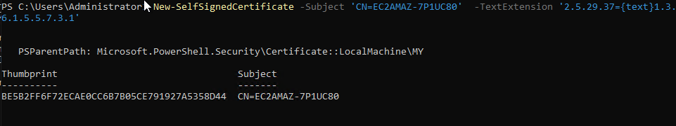
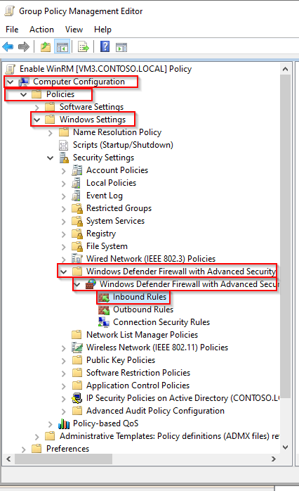
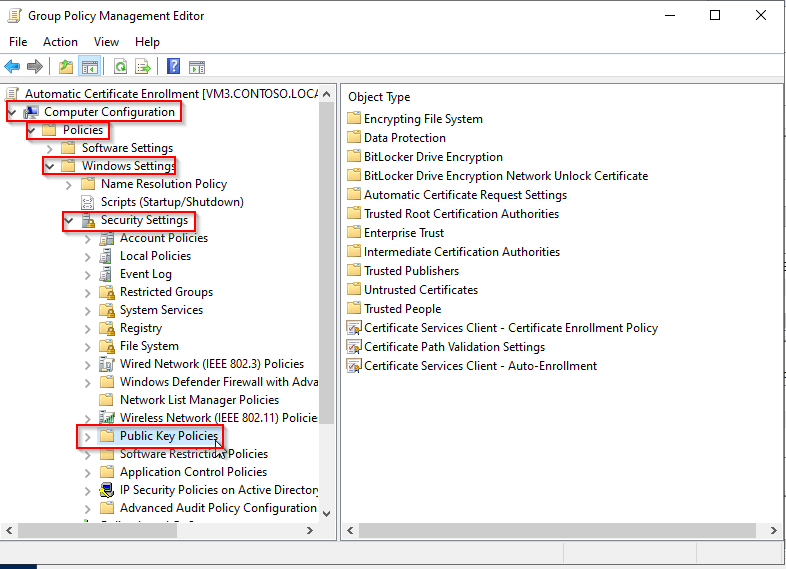
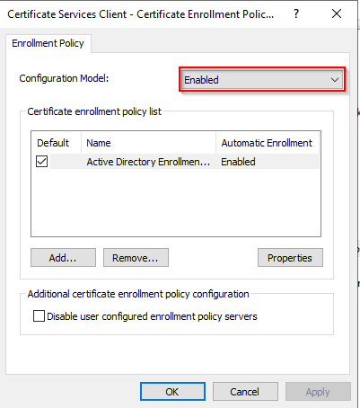
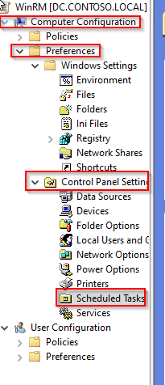
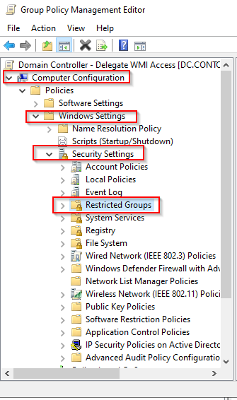

import Tabs from '@theme/Tabs';
import TabItem from '@theme/TabItem';

> Hello community! We're looking for a contributor to help us to translate this
page into French. If it's you, let us know by making a PR or pinging us on
[TheWatch](https://thewatch.centreon.com).

## Introduction

WS-Management est une spécification du DMTF, définissant un protocole de communication pour l'administration des serveurs, équipements, et applications basé sur les web services (SOAP).

## Configuration de WinRM

<Tabs groupId="sync">
<TabItem value="Configuration Local" label="Configuration Local">

### WSMAN configuration

Sur votre serveur Windows, ouvrez PowerShell avec les privilèges d'administrateur et exécutez les commandes suivantes.

Activez WinRM et autorisez l'accès à distance :

``` bash
winrm quickconfig
```

Activer la methode d'authentification "Basic" :

``` bash
winrm s winrm/config/service/auth '@{Basic="true"}'
```

### Configuration du Firewall

* Ouvrez **Gestionnaire de serveur**
* Dans le menu **Outils**, sélectionnez **Pare-feu Windows Defender avec sécurité avancée**
* Cliquez sur **Règles entrantes**
* Cliquez sur **Nouvelle règle...**
* Cliquez sur **Port**, puis sur **Suivant**

  

* Saisissez la valeur **5986** dans le champ **Ports locaux spécifiques** et cliquez sur **Suivant**.

  

* Vérifiez que **Autoriser la connexion** est sélectionné, puis cliquez sur **Suivant**.

  

* Sur la page suivante, sélectionnez les profils de pare-feu pour lesquels la règle doit s'appliquer, puis cliquez sur **Suivant**.

  

* Sur la page suivante, donnez un nom à la règle, puis cliquez sur **Terminer**.

  

### Créer un certificat auto-signé

Ouvrez PowerShell avec des privilèges d'administrateur et exécutez la commande suivante, en remplaçant
@HOSTNAME@ avec la valeur correcte.

``` bash
New-SelfSignedCertificate -Subject 'CN=@HOSTNAME@' -TextExtension '2.5.29.37={text}1.3.6.1.5.5.7.3.1'
```

Copiez **Thumbprint** pour l'étape suivante :



Créez le port WinRM HTTPS en remplaçant les valeurs @HOSTNAME@ et @THUMBPRINT@ par les valeurs correctes.

``` bash
winrm create winrm/config/Listener?Address=*+Transport=HTTPS  '@{Hostname="@HOSTNAME@";CertificateThumbprint="@THUMBPRINT@"}'
```

À partir d'ici, vous pouvez superviser votre serveur Windows en utilisant le compte administrateur local.

Nous déconseillons fortement l'utilisation d'un compte administrateur au sein de Centreon.

## Configuration d'un utilisateur dédié

Cette section décrit comment configurer un utilisateur local et les privilèges minimum pour surveiller votre serveur.

### Créer un utilisateur

Ouvrez un PowerShell avec des privilèges d'administrateur.

Créez votre utilisateur :

``` bash
net user @USERNAME@ @PASSWORD@ /add
```

### Configuration des groupes

Ouvrez **Gestion de l'ordinateur** et ajoutez votre utilisateur dans les groupes suivants :

* Distributed COM Users
* Event Log Readers
* Performance Log Users
* Performance Monitor Users
* Remote Management Users.

  

### Configuration de l'accès WMI

Dans PowerShell, exécutez la commande suivante :

``` bash
WMImgmt.msc
```

Faites un clic droit sur **Contrôle WMI**, puis **Propriétés** :


Cliquez sur **Sécurité** :


Sélectionnez **Root** et cliquez sur **Sécurité** :

![image]

Cliquez sur **Ajouter...**, sélectionnez le groupe **Remote Management Users** et définissez les autorisations suivantes :

* Activé le compte
* Appel à distance autorisé


Cliquez sur **Appliquer** et **OK**

Les autorisations ne sont pas appliquées de manière récursive, vous devrez donc répéter le processus précédent sur les répertoires suivants :

* Root
* Root/CIMV2
* Root/DEFAULT
* Root/RSOP
* Root/RSOP/Computer
* Root/WMI
* Root/CIMv2/Security/MicrosoftTpm

Cliquez sur **Appliquer** et **OK**. Fermez la fenêtre WMImgmt.

### Autoriser l'exécution de scripts

Dans PowerShell, exécutez la commande suivante :

``` bash
winrm configSDDL default
```

Ajoutez le groupe **Remote Management Users**.
Définissez les droits suivants :

* Lecture(Get,Enumerate,Subscribe)
* Exécution(Invoke)


Click **Apply** and **OK**.

### Accorder des autorisations pour les services

#### Récupérer le SID de l'utilisateur

Exécutez la commande suivante dans PowerShell, en remplaçant la valeur *@USERNAME@* par la valeur correcte.

```bash
wmic useraccount where name="@USERNAME@" get name,sid
```

Output:
><p>Name&ensp;&ensp;&ensp;&ensp;&ensp;&ensp;&ensp;&ensp;&ensp;&ensp;SID</p>
>@USRNAME@&ensp;&ensp;S-1-5-21-3051596711-3341658857-577043467-1000

#### Récupérer le SDDL actuel pour Service Control Manager

A partir d'une invite de commandes Windows (cmd), exécutez la commande suivante :

``` bash
sc sdshow scmanager
```

Votre SDDL ressemble à ceci :

>D:(A;;CC;;;AU)(A;;CCLCRPRC;;;IU)(A;;CCLCRPRC;;;SU)(A;;CCLCRPWPRC;;;SY)(A;;KA;;;BA)(A;;CC;;;AC)(A;;CC;;;S-1-15-3-1024-528118966-3876874398-709513571-1907873084-3598227634-3698730060-278077788-3990600205)S:(AU;FA;KA;;;WD)(AU;OIIOFA;GA;;;WD)

#### Modifier SDDL

Copiez cette sortie et ajoutez la section suivante **(A;;CCLCRPRC;;;@USERSID@)** dans la section **D:** juste avant la section **S:**.

Dans cet exemple, le SDDL ressemble maintenant à ceci :

>D:(A;;CC;;;AU)(A;;CCLCRPRC;;;IU)(A;;CCLCRPRC;;;SU)(A;;CCLCRPWPRC;;;SY)(A;;KA;;;BA)(A;;CC;;;AC)(A;;CC;;;S-1-15-3-1024-528118966-3876874398-709513571-1907873084-3598227634-3698730060-278077788-3990600205)*__(A;;CCLCRPRC;;;S-1-5-21-3051596711-3341658857-577043467-1000)__*S:(AU;FA;KA;;;WD)(AU;OIIOFA;GA;;;WD)

#### Définir les informations d'identification de sécurité pour accéder au gestionnaire de contrôle des services

Dans votre invite de commande Windows (cmd), exécutez la commande suivante en remplaçant *@NEWSDDL@* par la valeur correcte :

``` bash
sc sdset scmanager "@NEWSDDL@"
```

Dans cet exemple :

>sc sdset scmanager "D:(A;;CC;;;AU)(A;;CCLCRPRC;;;IU)(A;;CCLCRPRC;;;SU)(A;;CCLCRPWPRC;;;SY)(A;;KA;;;BA)(A;;CC;;;AC)(A;;CC;;;S-1-15-3-1024-528118966-3876874398-709513571-1907873084-3598227634-3698730060-278077788-3990600205)(A;;CCLCRPRC;;;S-1-5-21-3051596711-3341658857-577043467-1000)S:(AU;FA;KA;;;WD)(AU;OIIOFA;GA;;;WD)"

À partir de là, votre utilisateur dédié est opérationnel et peut surveiller votre serveur Windows sans nécessiter de compte administrateur local.

</TabItem>
<TabItem value="Configuration du domaine" label="Configuration du domaine">

> Pour cette procédure, nous supposerons que votre Active Directory est correctement configuré et qu'un certificat racine est disponible sur chaque serveur.

### Activer et configurer WinRM via un GPO

* Ouvrez le **Gestionnaire de stratégie de groupe**
* Étendre **Forêt > Domaines > @DOMAIN_NAME@**
* Faites un clic droit sur **@DOMAIN_NAME@** et cliquez sur **Créer un GPO dans ce domaine, et le lier ici...**


* Nommez votre GPO. Dans cet exemple, nous l'appellerons **Activer WinRM**.
* Faites un clic droit sur le nouveau GPO **Activer WinRM**, et cliquez sur **Modifier...**


* Dans l'**Éditeur de gestion des stratégies de groupe**, accédez à **Configuration ordinateur > Stratégies > Modèles d'administration > Gestion à distance de Windows (WinRM) > Service WinRM**.


* Activez la règle **Autoriser la gestion de serveur distant via WinRM**.
* Ajoutez "\*" dans **Filtre IPv4** et **Filtre IPv6**.


* Désactivez les règles suivantes :

    * **Autoriser l'authentification de base**
    * **Autoriser l'authentification CredSSP**
    * **Autoriser le trafic non chiffré**
    
Le résultat doit ressembler à ceci :


### Démarrer automatiquement le service WinRM via un GPO

Dans la même règle GPO **Activer WinRM** :
* Allez dans **Configuration ordinateur > Préférences > Paramètres du panneau de configuration > Services**.


* Sur le panneau de droite, cliquez avec le bouton droit de la souris, puis sélectionnez **Nouveau** et **Service**
* Dans **Démarrage**, sélectionnez **Automatique**
* Dans **Nom du service**, tapez **WinRM**
* Dans **Action de service**, sélectionnez **Démarrer le service**
* Cliquez sur OK**.


### Configurer la règle de pare-feu HTTPS WSMAN via un GPO

Dans la même règle GPO **Activer WinRM** :

* Accédez à **Configuration ordinateur > Stratégies > Paramètres Windows > Paramètres de sécurité > Pare-feu Windows Defender avec fonctions avancées de sécurité  > Pare-feu Windows Defender > Règles de trafic entrant** :



* Faites un clic droit sur le panneau de droite et cliquez sur **Nouvelle règle...**
* Cliquez sur **Port**, puis sur **Suivant**.


* Saisissez la valeur **5986** dans le champ **Ports locaux spécifiques** et cliquez sur **Suivant**.


* Vérifiez que **Autoriser la connexion** est sélectionné, puis cliquez sur **Suivant**.


* Sur la page suivante, sélectionnez les profils de pare-feu pour lesquels la règle doit s'appliquer, puis cliquez sur **Suivant**.


* Sur la page suivante, donnez un nom à la règle, puis cliquez sur **Terminer**.

### Créer un modèle de certificat d'inscription automatique

#### Serveur de certificats

* Ouvrez le gestionnaire **Autorité de certification**
* Étendez le panneau de gauche, faites un clic droit sur **Modèles de certificat**, puis **Gérer**.


* Faites un clic droit sur le modèle **Web Server** et **Dupliquer le modèle**.
* Dans l'onglet **Général**, nommez votre modèle et cochez les cases suivantes :

    * **Publier le certificat dans Active Directory**
    * **Ne pas se réinscrire automatiquement...**
    


* Accédez à l'onglet **Gestion des demandes**.
* Cochez l'option **Autoriser l'exportation de la clé privée**.


* Accédez à l'onglet **Sécurité**.
* Cliquez sur **Ajouter...**, tapez **Domain Computers**
* Définissez les autorisations suivantes :

    * **Lis**
    * **Inscrivez-vous**
    * **Inscription automatique**.


* Accédez à l'onglet **Nom du sujet**.
* Configurez comme indiqué ci-dessous :


* Cliquez sur **OK** et fermez la **console de modèle de certificat**.
* Dans la fenêtre **crtsrv**, faites un clic droit sur **Modèles de certificat**, puis cliquez sur **Nouveau** et **Modèle de certificat à émettre**.


* Sélectionnez le modèle **WinRM Cert** précédemment créé, puis cliquez sur **OK**.
* Fermez la fenêtre **certsrv**.

#### Serveur Active Directory

> Si une GPO à inscription automatique est déjà configuré sur votre domaine, vous pouvez ignorer cette partie.

* Dans le **Gestionnaire de stratégies de groupe**, créez une nouvelle stratégie pour l'inscription automatique.
* Faites un clic droit sur cette politique et cliquez sur **Modifier...**


* Dans l'**Éditeur de gestion des stratégies de groupe**, accédez à **Configuration ordinateur > Straté
> Paramètres Windows > Paramètres de sécurité > Stratégies de clé publique**.



* Double-cliquez sur **Client des services de certificats - Stratégies d'inscription des certificats**.
* Définissez **Modèle de configuration** sur **Activé**.
* Cliquez ensuite sur **OK**.



* Double-cliquez sur **Client des services de certificats - Inscription automatique**
* Définissez **Modèle de configuration** sur **Activé**.
* Cochez les options suivantes :

    * **Renouveler les certificats expirés...**
    * **Mettre à jour les certificats...**

* Cliquez sur **OK**.


* Fermez l'**Éditeur du gestionnaire de stratégie de groupe**.
* Dans **Gestion des stratégies de groupe**, faites un clic droit sur la stratégie d'inscription automatique et cliquez sur **Appliquée**.


* Définissez également la règle **Activer WinRM** sur **Appliquée**.

Un certificat dédié sera émis pour chaque serveur faisant partie de votre domaine. Ces certificats serviront à chiffrer la communication entre Centreon et vos serveurs Windows en utilisant WSMAN et le protocole HTTPS.

#### Deploy script

Pour lier ce certificat au service WinRM, vous devrez exécuter le script PowerShell (.ps1) suivant sur chaque serveur.
Cela peut être fait via GPO ou localement sur chaque serveur.

Créez le script "WinRM-HTTPS.ps1" sur votre contrôleur de domaine.

Script:

``` bash
$FQDN=$(($i=[System.Net.Dns]::GetHostByName($env:computerName))).HostName

$Thumbprint=Invoke-Command -ComputerName $FQDN `
                             -ScriptBlock {
                                Get-ChildItem -Path Cert:\LocalMachine\My |
                                Where-Object{($TmplExt = $_.Extensions |Where-Object {$_.Oid.FriendlyName -match 'Certificate Template'}) -and $TmplExt.format(0) -match 'WinRM'} |
                                Sort-Object -Property NotAfter |
                                Select-Object -Last 1 -ExpandProperty Thumbprint
                             }


Set-WSManInstance -ResourceURI winrm/config/Listener `
                  -SelectorSet @{Address="*";Transport="HTTPS"} `
                  -ComputerName $FQDN `
                  -ValueSet @{CertificateThumbprint=$Thumbprint}

winrm create winrm/config/Listener?Address=*+Transport=HTTPS "@{Hostname=".$FQDN.".;CertificateThumbprint=".$Thumbprint."}"
```

* Copiez ce script à l'emplacement suivant pour pouvoir le déployer massivement

``` bash
\\<DOMAIN_NAME>\SYSVOL\<DOMAIN_NAME>\scripts
```

Dans notre cas, cela ressemble à ceci:


* Retournez dans votre politique **Activer WinRM**
* Accédez à **Configuration ordinateur > Préférences > Paramètres Windows > Fichiers**
* Faites un clic droit sur le panneau de droite et sélectionnez **Nouveau > Fichiers**


* Sélectionnez le **fichier(s) source(s)** et le **fichier de destination**
    * Dans cet exemple :
        * Fichier source : **\\contoso.local\SYSVOL\contoso.local\scripts\WinRM-HTTPS.ps1**
        * Fichier de destination : **C:\Windows\Temp\WinRM-HTTPS.ps1**

* Cliquez sur **Appliquer** et **OK**

#### Créer une tâche planifiée

* Allez dans le menu **Configuration ordinateur > Préférences > Paramètres du panneau de configuration > Tâche planifiées**



* Faites un clic droit sur le panneau de droite et sélectionnez **Nouveau > Tâche planifiée (au minimum Windows 7)**
* Nommé votre tâche
* Sélectionnez l'utilisateur **NT Authority\Systems**
* Sélectionnez **Exécuter si l'utilisateur est connecté ou non**
* Cochez **Exécuter avec les privilèges les plus élevés**


* Allez dans l'onglet **Déclencheurs**
* Ajouter un nouveau déclencheur
* En haut, sélectionnez **Lors de la création/modification de la tâche**
* Cochez **Répéter la tâche tous les :**
    * Sélectionnez **5 minutes**
    * et **Pour une durée de 30 minutes**
* Cochez **Activé**
* Cliquez sur **OK**

> Le paramètre répéter la tâche est nécessaire lorsque de nouveaux serveurs rejoignent le domaine.
> Le script peut être exécuté avant que ce certificat ne soit émis.
> Avec ce paramètre, nous nous assurons que la tâche sera exécutée au moins une fois après l'émission du certificat WinRM.
> Si un membre de la communauté sait quel événement peut être utilisé pour déclencher cette tâche pour qu'elle ne soit exécutée que une fois l'émission du certificat faite, nous serons plus qu'heureux d'avoir vos commentaires pour adapter cette procédure.


* Allez dans l'onglet **Actions**
* Ajouter une nouvelle action
* Mettez le paramètre suivant :
    * Action : **Démarrer un programme**
    * Programme/script : **PowerShell.exe**
    * Ajouter arguments : **-file C:\Windows\Temp\WinRM-HTTPS.ps1**
        * Ajustez ce paramètre pour qu'il corresponde au paramètre "Destination du fichier" précédemment configuré


* Enregistrez cette configuration

> N'hésitez pas à adapter la configuration à vos besoins

> Si cela ne vous dérange pas de vous authentifier auprès de l'utilisateur Admin du domaine, vous pouvez passer directement à la section Kerberos.
> Sinon, vous pouvez continuer à suivre la documentation pour configurer un utilisateur de service dédié.


### Configurer l'utilisateur de service

Sur votre serveur Active Directory :

* Ouvrez **Utilisateurs et ordinateurs Active Directory**.
* Dans le panneau de gauche, sélectionnez **@NOM DU DOMAINE@ > Users**.
* Faites un clic droit sur le panneau de droite et sélectionnez **Nouveau > Utilisateur**.


* Créez votre utilisateur.


* Configurer le mot de passe
* Décochez l'option **L'utilisateur doit changer de mot de passe à la prochaine ouverture de session**
* Vérifiez les options :

    * **L'utilisateur ne peut pas changer de mot de passe**
    * **Le mot de passe n'expire jamais**

* Cliquez sur **Suivant**, puis sur **Terminer**
    


* Dans le panneau de gauche, accédez à **Builtin**.
* Ajoutez l'utilisateur du service en tant que membre des groupes suivants :
    * **Distributed COM Users**
    * **Event Log Readers**
    * **Performance Log Users**
    * **Performance Monitor Users**
    * **Remote Management Users**


* Retournez au **Gestionnaire de stratégie de groupe** et modifiez la règle **Activer WinRM**
* Accédez à **Configuration ordinateur > Stratégies > Paramètres Windows > Paramètres de sécurité > Groupes restreints**



* Faites un clic droit sur le panneau de droite et cliquez sur **Ajouter un groupe...**
* Cliquez sur **Parcourir...**
* Tapez *Distributed COM Users*, et cliquez sur **Vérifier les noms**, puis sur **OK**
* Cliquez à nouveau sur **OK...**
* Ajoutez ensuite votre utilisateur de service dans la section "Membre de ce groupe :"
* Cliquez sur OK**


* Répétez le processus pour tous les groupes Builtin :
    * Event Log Readers
    * Performance Log Users
    * Performance Monitor Users
    * Remote Management Users
    
Lorsque toute la configuration est terminée, cela devrait ressembler à ceci :


### Configurer les autorisations WMI

Pour cette étape, vous devrez vous connecter à un serveur cible pour configurer les droits adéquats.
Malheureusement, la délégation des autorisations WMI ne peut pas être effectuée via GPO, cette configuration doit être effectuée localement sur chaque serveur.
Pour appliquer massivement cette configuration, nous allons donc créer un modèle de configuration à partir d'un de vos serveurs puis appliquer ce modèle via une tâche planifiée sur vos serveurs.

Dans PowerShell, exécutez la ligne de commande suivante :

``` bash
WmiMgmt.msc
```

Faites un clic droit sur **Contrôle WMI**, puis sur **Propriétés**.


Cliquez sur **Sécurité**.


Sélectionnez **Root** et cliquez sur **Sécurité**.


Cliquez sur **Ajouter...**, sélectionnez l'utilisateur du service (ici sa_centreon)
Et accordez les autorisations suivantes :
* **Activer le compte**
* **Appel à distance autorisé**


> Pour faciliter les choses, nous autoriserons ce namespaces et tous les sous-namespace.
> Si vous souhaitez autoriser manuellement chaque namespaces obligatoire, vous devrez créer un modèle dédié par espace de noms.
> Namespaces obligatoires :
> Mandatory namspaces:
> * **Root**
> * **Root/CIMV2**
> * **Root/DEFAULT**
> * **Root/RSOP**
> * **Root/RSOP/Computer**
> * **Root/WMI**
> * **Root/CIMv2/Security/MicrosoftTpm**

* Cliquez sur **Avancé**


* Cliquez sur votre utilisateur de service, puis sur **Modifier**


* Sur la ligne **S'applique à :**, sélectionnez **Cet espace de noms et tous les sous-espaces de noms**


* Cliquez sur **OK** sur chaque fenêtre ouverte

#### Créer un fichier de modèle de sécurité WMI

Sur le même serveur, exécutez la ligne de commande suivante dans PowerShell

``` bash
$SidHelper = New-Object System.Management.ManagementClass Win32_SecurityDescriptorHelper
$SdList = @($null)
$(Get-WMIObject -Namespace "root" -Class __SystemSecurity).PsBase.InvokeMethod("GetSD",$SdList)

[System.Management.Automation.PSSerializer]::Serialize($SdList) | Set-Content sdlist.txt 
```

Vous devriez maintenant avoir un fichier **sdlist.txt** dans votre répertoire

#### Déployer le modèle de sécurité WMI via GPO

* Sur votre contrôleur de domaine
* Créez le script **Set-WMINameSpaceSecurity.ps1**

Script:

``` bash
$SdList = [System.Management.Automation.PSSerializer]::Deserialize($(Get-Content C:\Windows\Temp\sdlist.txt))

$SidHelper = New-Object System.Management.ManagementClass Win32_SecurityDescriptorHelper
$RootSecurity = $(Get-WMIObject -Namespace "root" -Class __SystemSecurity)
$RootSecurity.PsBase.InvokeMethod("SetSd",$SdList) 
```

* Copiez ce script à l'emplacement suivant pour pouvoir déployer massivement ce script.

``` bash
\\<DOMAIN_NAME>\SYSVOL\<DOMAIN_NAME>\scripts
```

Dans notre cas, cela ressemble à ceci:


* Retournez dans votre politique **Activer WinRM**
* Accédez à **Configuration ordinateur > Préférences > Paramètres Windows > Fichiers**
* Faites un clic droit sur le panneau de droite et sélectionnez **Nouveau > Fichiers**


* Sélectionnez le **fichier(s) source(s)** et le **fichier de destination**
    * Dans cet exemple :
        * Fichier source : **\\contoso.local\SYSVOL\contoso.local\scripts\Set-WMINameSpaceSecurity.ps1**
        * Fichier de destination : **C:\Windows\Temp\Set-WMINameSpaceSecurity.ps1**


* Cliquez sur **Appliquer** et **OK**

* Répétez ce processus pour le fichier **sdlist.txt**
* Sélectionnez le **fichier(s) source(s)** et le **fichier de destination**
    * Dans cet exemple :
        * Fichier source : **\\contoso.local\SYSVOL\contoso.local\scripts\sdlist.txt**
        * Fichier de destination : **C:\Windows\Temp\sdlist.txt**
        


#### Exécuter le modèle de sécurité WMI via GPO

* Allez dans le menu **Configuration ordinateur > Préférences > Paramètres du panneau de configuration > Tâche planifiées**


* Faites un clic droit sur le panneau de droite et sélectionnez **Nouveau > Tâche planifiée (au minimum Windows 7)**
* Nommé votre tâche
* Sélectionnez l'utilisateur **NT Authority\Systems**
* Sélectionnez **Exécuter si l'utilisateur est connecté ou non**
* Cochez **Exécuter avec les privilèges les plus élevés**


* Allez dans l'onglet **Déclencheurs**
* Ajouter un nouveau déclencheur
* En haut, sélectionnez **Lors de la création/modification de la tâche**
* Cochez **Activé**
* Cliquez sur **OK**


* Allez dans l'onglet **Actions**
* Ajouter une nouvelle action
* Mettez le paramètre suivant :
    * Action : **Démarrer un programme**
    * Programme/script : **PowerShell.exe**
    * Ajouter arguments : **-file C:\Windows\Temp\Set-WMINameSpaceSecurity.ps1**
        * Ajustez ce paramètre pour qu'il corresponde au paramètre "Destination du fichier" précédemment configuré


* Enregistrez cette configuration

> N'hésitez pas à adapter la configuration à vos besoins

### Configurer les autorisations des services

Comme dans la section précédente, les autorisations doivent être gérées localement sur chaque serveur.

#### Déploiement de fichiers

Sur votre contrôleur de domaine

* Créez le script **system-services.ps1**

Script:

```bash
# Query service manager to get the current permissions in SDDL format.
$command = @'
cmd.exe /C  sc sdshow scmanager
'@

$HostPermissions = Invoke-Expression -Command:$command

# Visually compare the two strings
Write-Host "  Host: " $HostPermissions

$NewPermission = $HostPermissions.replace('(A;;CC;;;AU)','(A;;CCLCRPRC;;;AU)')

Write-Host "New: $NewPermission"

$SetPermissionsCommand = @"
cmd.exe /C  sc sdset scmanager `"$($NewPermission)`"
"@

Invoke-Expression -Command:$SetPermissionsCommand
```

* Copiez ce script à l'emplacement suivant pour pouvoir déployer massivement ce script.

``` bash
\\<DOMAIN_NAME>\SYSVOL\<DOMAIN_NAME>\scripts
```

* Retournez dans votre politique **Activer WinRM**
* Accédez à **Configuration ordinateur > Préférences > Paramètres Windows > Fichiers**
* Faites un clic droit sur le panneau de droite et sélectionnez **Nouveau > Fichiers**

* Sélectionnez le **fichier(s) source(s)** et le **fichier de destination**
    * Dans cet exemple :
        * Fichier source : **\\contoso.local\SYSVOL\contoso.local\scripts\system-services.ps1**
        * Fichier de destination : **C:\Windows\Temp\system-services.ps1**


* Cliquez sur **Appliquer** et **OK**

#### Création d'une tâche planifiée

* Allez dans le menu **Configuration ordinateur > Préférences > Paramètres du panneau de configuration > Tâche planifiées**


* Faites un clic droit sur le panneau de droite et sélectionnez **Nouveau > Tâche planifiée (au minimum Windows 7)**
* Nommé votre tâche
* Sélectionnez l'utilisateur **NT Authority\Systems**
* Sélectionnez **Exécuter si l'utilisateur est connecté ou non**
* Cochez **Exécuter avec les privilèges les plus élevés**


* Allez dans l'onglet **Déclencheurs**
* Ajouter un nouveau déclencheur
* En haut, sélectionnez **Lors de la création/modification de la tâche**
* Cochez **Activé**
* Cliquez sur **OK**


* Allez dans l'onglet **Actions**
* Ajouter une nouvelle action
* Mettez le paramètre suivant :
    * Action : **Démarrer un programme**
    * Programme/script : **PowerShell.exe**
    * Ajouter arguments : **-file C:\Windows\Temp\system-services.ps1**
        * Ajustez ce paramètre pour qu'il corresponde au paramètre "Destination du fichier" précédemment configuré


* Enregistrez cette configuration

> N'hésitez pas à adapter la configuration à vos besoins

### Autoriser l'exécution de lignes de commande PowerShell

Comme dans la section précédente, les autorisations doivent être gérées localement sur chaque serveur.

#### Déploiement de fichiers

Sur votre contrôleur de domaine

* Créez le script "**RootSDDL-Permision.ps1**"

> Ce script accordera l'autorisation **Exécution** et **Lire** à votre utilisateur de service via WinRM.

Script:

``` bash
$user = $args[0]

#Adding the below script should replace "winrm configSDDL default"
$GENERIC_READ = 0x80000000
$GENERIC_WRITE = 0x40000000
$GENERIC_EXECUTE = 0x20000000
$GENERIC_ALL = 0x10000000

# get SID of user/group to add

$user_sid = (New-Object -TypeName System.Security.Principal.NTAccount -ArgumentList $user).Translate([System.Security.Principal.SecurityIdentifier])

# get the existing SDDL of the WinRM listener
$sddl = (Get-Item -Path WSMan:\localhost\Service\RootSDDL).Value

# convert the SDDL string to a SecurityDescriptor object
$sd = New-Object -TypeName System.Security.AccessControl.CommonSecurityDescriptor -ArgumentList $false, $false, $sddl

# apply a new DACL to the SecurityDescriptor object
$sd.DiscretionaryAcl.AddAccess(
[System.Security.AccessControl.AccessControlType]::Allow,
$user_sid,
($GENERIC_READ -bor $GENERIC_EXECUTE),
[System.Security.AccessControl.InheritanceFlags]::None,
[System.Security.AccessControl.PropagationFlags]::None
)

# get the SDDL string from the changed SecurityDescriptor object
$new_sddl = $sd.GetSddlForm([System.Security.AccessControl.AccessControlSections]::All)

# apply the new SDDL to the WinRM listener
Set-Item -Path WSMan:\localhost\Service\RootSDDL -Value $new_sddl -Force
```

* Copiez ce script à l'emplacement suivant pour pouvoir déployer massivement ce script.

``` bash
\\<DOMAIN_NAME>\SYSVOL\<DOMAIN_NAME>\scripts
```

* Retournez dans votre politique **Activer WinRM**
* Accédez à **Configuration ordinateur > Préférences > Paramètres Windows > Fichiers**
* Faites un clic droit sur le panneau de droite et sélectionnez **Nouveau > Fichiers**

* Sélectionnez le **fichier(s) source(s)** et le **fichier de destination**
    * Dans cet exemple :
        * Fichier source : **\\contoso.local\SYSVOL\contoso.local\scripts\RootSDDL-Permision.ps1**
        * Fichier de destination : **C:\Windows\Temp\RootSDDL-Permision.ps1**


* Cliquez sur **Appliquer** et **OK**

#### Création d'une tâche planifiée

* Allez dans le menu **Configuration ordinateur > Préférences > Paramètres du panneau de configuration > Tâche planifiées**


* Faites un clic droit sur le panneau de droite et sélectionnez **Nouveau > Tâche planifiée (au minimum Windows 7)**
* Nommé votre tâche
* Sélectionnez l'utilisateur **NT Authority\Systems**
* Sélectionnez **Exécuter si l'utilisateur est connecté ou non**
* Cochez **Exécuter avec les privilèges les plus élevés**


* Allez dans l'onglet **Déclencheurs**
* Ajouter un nouveau déclencheur
* En haut, sélectionnez **Lors de la création/modification de la tâche**
* Cochez **Activé**
* Cliquez sur **OK**


* Allez dans l'onglet **Actions**
* Ajouter une nouvelle action
* Mettez le paramètre suivant :
    * Action : **Démarrer un programme**
    * Programme/script : **PowerShell.exe**
    * Ajouter arguments : **-file C:\Windows\Temp\RootSDDL-Permision.ps1**<span style={{color:'#FF0000'}}>**@SERVICE_USERNAME@**</span>
        * Ajustez ce paramètre pour qu'il corresponde au paramètre "Destination du fichier" précédemment configuré
        * Dans notre exemple, l'argument est **-file C:\Windows\Temp\RootSDDL-Permision.ps1<span style={{color:'#FF0000'}}>sa_centreon</span>**


* Enregistrez cette configuration

> N'hésitez pas à adapter la configuration à vos besoins

### Autorisations des systèmes de fichiers

Sur votre contrôleur de domaine

* Retournez dans votre politique **Activer WinRM**
* Accédez à **Configuration ordinateur > Stratégies > Paramètres Windows > Paramètres de sécurité > Système de fichiers**
* Faites un clic droit sur le panneau de droite et sélectionnez **Ajouter un fichier...**


* Sélectionnez le répertoire auquel vous souhaitez accorder des autorisations et cliquez sur **OK**


* Cliquez sur **Ajouter...**, sélectionnez votre utilisateur de service
* Autorisez les autorisations suivantes :
    * **Lire et exécuter**
    * **Liste du contenu du dossier**
    * **Lecture**
* Cliquez sur **Appliquer** et **OK**


* Sélectionnez pour propager ou non ces autorisations au sous-dossier.
* Cliquez sur **OK**


### Configure Kerberos on the Centreon server

Sur le serveur Centreon, exécutez la commande suivante :

``` bash
yum install sssd realmd oddjob oddjob-mkhomedir adcli samba-common samba-common-tools krb5-workstation openldap-clients policycoreutils-python -y
realm join --user=administrator <YOUR_DOMAIN>
```

You will be asked to type your domain account password. When this is done, run the following command:

Il vous sera demandé de saisir le mot de passe de votre compte d'administrateur de domaine.
Une fois terminé, exécutez les commandes suivantes pour permettre à centreon-engine et centreon-gorgone d'effectuer l'authentification :

``` bash
su - centreon-engine
kinit <SERVICE_USERNAME>
logout
su - centreon-gorgone
kinit <SERVICE_USERNAME
```

Dans notre exemple, cela ressemble à ceci :


#### Renouveler le ticket Kerberos

Les tickets d'authentification Kerberos expirent toutes les 10h, déconnectant l'utilisateur centreon-engine et désactivant le processus d'authentification.
De plus, le ticket Kerberos a une durée de vie de 7 jours.
pour contourner ce problème, nous renouvellerons automatiquement le ticket d'authentification toutes les 9h, ainsi qu'une réinitialisation de la durée de vie du ticket tous les samedis via une tâche cron.

Pour la partie réinitialisation vous devrez créer un fichier "keytab" associé à votre compte de service pour pouvoir vous reconnecter sans mot de passe.

Exécutez la ligne de commande suivante en remplaçant **@USERNAME@** par la bonne valeur pour créer le fichier "keytab".

``` bash
kutil
addent -password -p @USERNAME@ -k 1 -e RC4-HMAC
wkt /var/lib/centreon-engine/@USERNAME@.keytab
q
```

Copiez le "keytab" dans le répertoire home de l'utilisateur centreon-engine et centreon-gorgone et changez les permissions du fichier "keytab".

Exécutez la ligne de commande suivante en remplaçant **@USERNAME@** par la bonne valeur.

``` bash
cp /var/lib/centreon-engine/@USERNAME@.keytab /var/lib/centreon-engine/
chmod centreon-engine. /var/lib/centreon-engine/@USERNAME@.keytab

cp /var/lib/centreon-engine/@USERNAME@.keytab /var/lib/centreon-gorgone/
chmod centreon-gorgone. /var/lib/centreon-gorgone/@USERNAME@.keytab
```

Créez une tâche cron en remplaçant **@USERNAME@** par la bonne valeur

``` bash
cat <<EOF > /etc/cron.d/kerberos
# ########################################
#
# Cron Configuration for Kerberos
#
PATH=/sbin:/bin:/usr/sbin:/usr/bin

# rewrite file with new cron line
CRONTAB_EXEC_USER=""

############################ Renew ticket
0 */9 * * *  centreon-engine kinit -R
0 */9 * * *  centreon-gorgone kinit -R


############################ Reinitilaize ticket liftime
0 0 * * 6  centreon-engine kinit -k -t @USERNAME@.keytab @USERNAME@
0 0 * * 6  centreon-gorgone kinit -k -t @USERNAME@.keytab @USERNAME@
EOF
```

Redémarrez le processus crond.

``` bash
systemctl restart crond
```

Tout est maintenant configuré pour surveiller vos serveurs Windows à l'aide de WSMAN avec un compte d'utilisateur de service avec un protocole chiffré de bout en bout.

### Comment tester votre configuration depuis votre poller Centreon

```bash
/usr/lib/centreon/plugins/centreon_windows_wsman.pl --plugin=os::windows::wsman::plugin --mode=cpu --hostname=wsman.contoso.local --wsman-scheme=https --wsman-port=5986 --wsman-username='' --wsman-password='' --wsman-auth-method='gssnegotiate'
OK: CPU(s) average usage is 0.84 % - CPU '0' usage: 0.84 % | 'cpu.utilization.percentage'=0.84%;;;0;100 '0#core.cpu.utilization.percentage'=0.84%;;;0;100
```

> Cette méthode d'authentification nécessite que vous utilisiez le nom DNS de votre serveur Windows, sinon Kerberos n'autorisera pas la connexion.
> L'option `--wsman-auth-method='gssnegotiate'` est obligatoire pour utiliser un compte de domaine.
> Les utilisateurs du système Centreon (centreon-engine et centreon-gorgone) étant déjà authentifiés par la commande **kinit**, vous n'avez pas besoin de renseigner les options **wsman-username** et **wsman-password **

</TabItem>
</Tabs>
