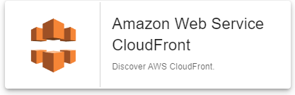

import Tabs from '@theme/Tabs';
import TabItem from '@theme/TabItem';


## Contenu du Pack

### Modèles

Le connecteur de supervision Centreon **Amazon CloudFront** apporte un modèle d'hôte :

* Cloud-Aws-CloudFront-custom

Il apporte les modèles de service suivants :

| Alias                 | Modèle de service                   | Description                                         | Défaut |
|:----------------------|:------------------------------------|:----------------------------------------------------|:-------|
| Cloudfront-Errors     | Cloud-Aws-Cloudfront-Errors-Api     | Contrôle le pourcentage d'erreurs d'accès aux pages | X      |
| Cloudfront-Requests   | Cloud-Aws-Cloudfront-Requests-Api   | Contrôle le nombre de requêtes                      | X      |
| Cloudfront-Throughput | Cloud-Aws-Cloudfront-Throughput-Api | Contrôle les débits montant et descendant           | X      |

### Règles de découverte

Ce pack propose une règle de découverte d'hôtes permettant de découvrir automatiquement des ressources CloudFront :



Vous trouverez plus d'informations sur la découverte d'Hôtes et son fonctionnement sur la documentation du module : [Découverte des hôtes](/onprem/monitoring/discovery/hosts-discovery).

### Métriques & statuts collectés

<Tabs groupId="sync">
<TabItem value="Cloudfront-Errors" label="Cloudfront-Errors">

| Métrique                              | Unité |
|:--------------------------------------|:------|
| cloudfront.errorrate.4xx.percentage   | %     |
| cloudfront.errorrate.5xx.percentage   | %     |
| cloudfront.errorrate.total.percentage | %     |

</TabItem>
<TabItem value="Cloudfront-Requests" label="Cloudfront-Requests">

| Métrique                  | Unité |
|:--------------------------|:------|
| cloudfront.requests.count | count |

</TabItem>
<TabItem value="Cloudfront-Throughput" label="Cloudfront-Throughput">

| Métrique                          | Unité |
|:----------------------------------|:------|
| cloudfront.bytes.downloaded.bytes | bytes |
| cloudfront.bytes.uploaded.bytes   | B     |

</TabItem>
</Tabs>

## Prérequis

### Privilèges AWS

Pour pouvoir utiliser le monitoring AWS/EC2, configurez un compte (combinaison de access key et secret key) et attribuez-lui les privilèges suivants :

| AWS Privilege                  | Description                                                     |
| :----------------------------- | :-------------------------------------------------------------- |
| cloudwatch:getMetricStatistics | Get metrics from the AWS/EC2 namespace on Cloudwatch.           |
| cloudfront:ListDistributions   | Grants permission to list the distributions associated with your AWS account. |

### Dépendances du Plugin

Afin de récupérer les informations nécessaires via les APIs AWS, il est possible d'utiliser soit le binaire *awscli* fourni par Amazon, soit le SDK Perl *paws*. Le SDK est recommandé car plus performant.

> **Attention** il n'est pas possible d'utiliser *paws* si la connexion s'effectue au travers d'un proxy.

<Tabs groupId="sync">
<TabItem value="perl-Paws-installation" label="perl-Paws-installation">

```bash
yum install perl-Paws
```

</TabItem>
<TabItem value="aws-cli-installation" label="aws-cli-installation">

```bash
curl "https://awscli.amazonaws.com/awscli-exe-linux-x86_64.zip" -o "awscliv2.zip"
unzip awscliv2.zip
sudo ./aws/install
```

</TabItem>
</Tabs>

## Installation

### Pack de supervision

Si la plateforme est configurée avec une licence *online*, l'installation d'un paquet
n'est pas requise pour voir apparaître le pack dans le menu **Configuration > Gestionnaire de connecteurs de supervision**.

Au contraire, si la plateforme utilise une licence *offline*, installez le paquet
sur le **serveur central** via la commande correspondant au gestionnaire de paquet
associé à sa distribution :

<Tabs groupId="sync">
<TabItem value="Alma / RHEL / Oracle Linux 8" label="Alma / RHEL / Oracle Linux 8">

```bash
dnf install centreon-pack-cloud-aws-cloudfront
```

</TabItem>
<TabItem value="CentOS 7" label="CentOS 7">

```bash
yum install centreon-pack-cloud-aws-cloudfront
```

</TabItem>
<TabItem value="Debian 11 & 12" label="Debian 11 & 12">

```bash
apt install centreon-pack-cloud-aws-cloudfront
```

</TabItem>
</Tabs>

Quel que soit le type de la licence (*online* ou *offline*), installez le Pack **Amazon CloudFront**
depuis l'interface web et le menu **Configuration > Gestionnaire de connecteurs de supervision**.

### Plugin

À partir de Centreon 22.04, il est possible de demander le déploiement automatique
du plugin lors de l'utilisation d'un pack. Si cette fonctionnalité est activée, et
que vous ne souhaitez pas découvrir des éléments pour la première fois, alors cette
étape n'est pas requise.

> Plus d'informations dans la section [Installer le plugin](/onprem/monitoring/pluginpacks/#installer-le-plugin).

Utilisez les commandes ci-dessous en fonction du gestionnaire de paquets de votre système d'exploitation :

<Tabs groupId="sync">
<TabItem value="Alma / RHEL / Oracle Linux 8" label="Alma / RHEL / Oracle Linux 8">

```bash
dnf install centreon-plugin-Cloud-Aws-Cloudfront-Api
```

</TabItem>
<TabItem value="CentOS 7" label="CentOS 7">

```bash
yum install centreon-plugin-Cloud-Aws-Cloudfront-Api
```

</TabItem>
<TabItem value="Debian 11 & 12" label="Debian 11 & 12">

```bash
apt install centreon-plugin-cloud-aws-cloudfront-api
```

</TabItem>
</Tabs>

## Configuration

### Hôte

* Ajoutez un hôte à Centreon depuis la page **Configuration > Hôtes**.
* Complétez les champs **Nom**, **Alias** & **IP Address/DNS** correspondant à votre serveur **CloudFront**.
* Appliquez le modèle d'hôte **Cloud-Aws-CloudFront-custom**.
* Une fois le modèle appliqué, les macros ci-dessous indiquées comme requises (**Obligatoire**) doivent être renseignées.

| Obligatoire | Macro         | Description                                                                            |
|:------------|:--------------|:---------------------------------------------------------------------------------------|
|             | AWSACCESSKEY  |                                                                                        |
|             | AWSASSUMEROLE |                                                                                        |
|             | AWSCUSTOMMODE | (Défaut : 'paws')                                                                      |
|             | AWSINSTANCEID |                                                                                        |
|             | AWSREGION     |                                                                                        |
|             | AWSSECRETKEY  |                                                                                        |
|             | EXTRAOPTIONS  | Options supplémentaires à ajouter à l'ensemble des commandes de l'hôte (ex: --verbose) |
|             | PROXYURL      |                                                                                        |

## Comment puis-je tester le plugin et que signifient les options des commandes ?

Une fois le plugin installé, vous pouvez tester celui-ci directement en ligne
de commande depuis votre collecteur Centreon en vous connectant avec
l'utilisateur **centreon-engine** (`su - centreon-engine`) :

```bash
/usr/lib/centreon/plugins//centreon_aws_cloudfront_api.pl \
    --plugin=cloud::aws::cloudfront::plugin \
    --mode=throughput \
    --custommode='paws' \
    --aws-secret-key='' \
    --aws-access-key='' \
    --aws-role-arn='' \
    --region='' \
    --id='' \
    --proxyurl='' \
    --filter-metric='' \
    --statistic='sum' \
    --timeframe='600' \
    --period='60' \
    --warning-bytes-uploaded='' \
    --critical-bytes-uploaded='' \
    --warning-bytes-downloaded='' \
    --critical-bytes-downloaded='' \
    --per-sec \
    --verbose \
    --use-new-perfdata
```

La commande devrait retourner un message de sortie similaire à :

```bash
OK: Bytes Downloaded Bytes Uploaded | 'cloudfront.bytes.downloaded.bytes'=9000;;;; 'cloudfront.bytes.uploaded.bytes'=9000B;;;; 
```

La liste de toutes les options complémentaires et leur signification peut être
affichée en ajoutant le paramètre `--help` à la commande :

```bash
/usr/lib/centreon/plugins//centreon_aws_cloudfront_api.pl \
    --plugin=cloud::aws::cloudfront::plugin \
    --mode=throughput \
    --help
```

Tous les modes disponibles peuvent être affichés en ajoutant le paramètre
`--list-mode` à la commande :

```bash
/usr/lib/centreon/plugins//centreon_aws_cloudfront_api.pl \
    --plugin=cloud::aws::cloudfront::plugin \
    --list-mode
```

### Diagnostic des erreurs communes

Rendez-vous sur la [documentation dédiée](../getting-started/how-to-guides/troubleshooting-plugins.md)
pour le diagnostic des erreurs communes des plugins Centreon.
