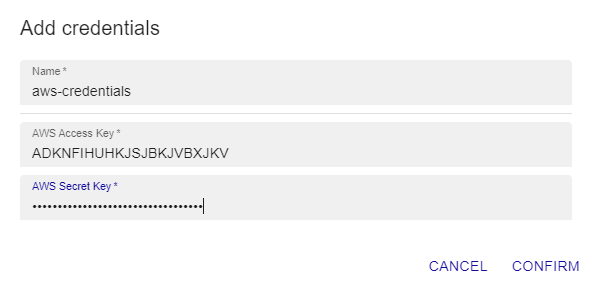
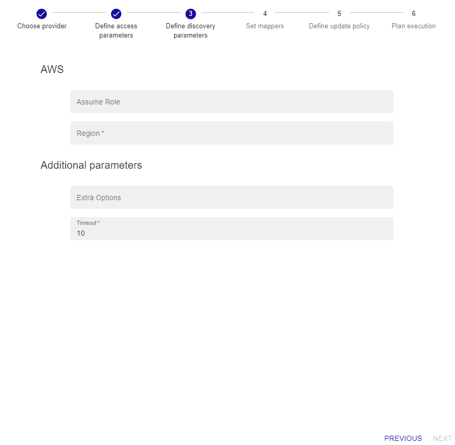
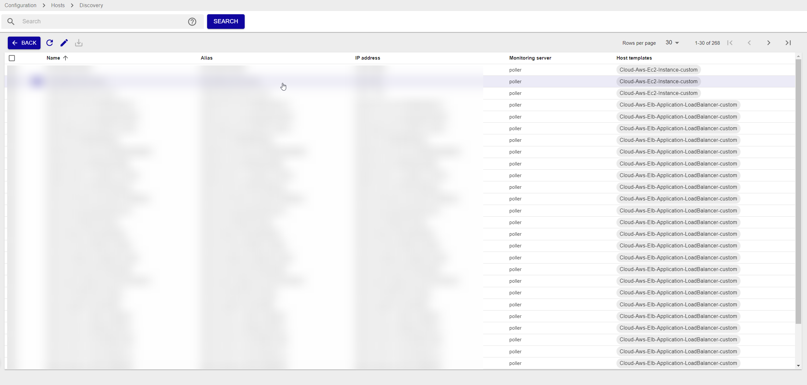

import Tabs from '@theme/Tabs';
import TabItem from '@theme/TabItem';


## Vue d'ensemble

Le connecteur de supervision Centreon **AWS Discover** permet de découvrir les resources AWS suivantes :
* API Gateway
* Backup Vault
* EBS
* EC2
* EFS
* FSx
* Kinesis
* Lamba
* RDS
* S3
* SNS
* SQS
* VPN

Ce pack s'appuie sur l'API d'AWS pour récupérer les ressources AWS et sur tous les connecteurs de supervision Centreon
pour AWS afin de définir des modèles et des indicateurs de surveillance appropriés pour chaque type de ressource.

## Contenu du connecteur de supervision

> Le connecteur de supervision **AWS Discover** est un pack de *découverte*. Il ne fournit pas de modèles ni d'indicateurs de supervision.

### Règles de découverte

Le connecteur de supervision Centreon **AWS Discover** fournit un *provider* de découverte d'hôtes nommé **AWS Discover**


Vous trouverez plus d'informations sur la découverte d'hôtes et son fonctionnement sur la documentation du module :
[Découverte des hôtes](/onprem/monitoring/discovery/hosts-discovery)

# Prérequis

### Privilèges AWS

Voici la liste des droits nécessaires pour pouvoir découvrir les ressources avec Centreon :

| AWS Privilege                  | 
|:-------------------------------|
| apigateway:GetRestApis         |
| backup:ListBackupVaults        |
| ec2:DescribeVolumes            |
| ec2:DescribeInstances          |
| ec2:DescribeSpotFleetRequests  |
| ec2:DescribeVpnConnections     |
| efs:DescribeFileSystems        |
| elb:DescribeLoadBalancers      |
| elbv2DdescribeLoadBalancers    |
| fsx:DescribeFileSystems        |
| kinesis:ListStreams            |
| lambda:ListFunctions           |
| rds:DescribeDBInstances        |
| s3api:ListBuckets              |
| sns:ListTopics                 | 
| sqs:ListQueues                 |
| cloudwatch:listMetrics         | 
| cloudwatch:getMetricStatistics |

### Dépendances du Plugin

Afin de récupérer les informations nécessaires via les APIs AWS, il est possible d'utiliser soit le binaire *awscli* fourni par Amazon, soit le SDK Perl *paws*. Le SDK est recommandé car plus performant. 

> **Attention** il n'est pas possible d'utiliser *paws* si la connexion s'effectue au travers d'un proxy.

<Tabs groupId="sync">
<TabItem value="perl-Paws-installation" label="perl-Paws-installation">

```bash
yum install perl-Paws
```

</TabItem>
<TabItem value="aws-cli-installation" label="aws-cli-installation">

```bash
curl "https://awscli.amazonaws.com/awscli-exe-linux-x86_64.zip" -o "awscliv2.zip"
unzip awscliv2.zip
sudo ./aws/install
```

</TabItem>
</Tabs>

## Installation

<Tabs groupId="sync">
<TabItem value="Online License" label="Online License">

1. Installez le plugin sur tous les collecteurs Centreon devant découvrir des ressources AWS :

```bash
yum install centreon-plugin-Cloud-Aws-Cloudwatch-Api
```

2. Sur l'interface web de Centreon, installez le connecteur de supervision **AWS Discover** depuis la page **Configuration > Packs de plugins**.
Des connecteurs de supervision supplémentaires seront installés en dépendance afin de permettre la supervision de l'ensemble des ressources découvertes.


</TabItem>
<TabItem value="Offline License" label="Offline License">

1. Installez le plugin sur tous les collecteurs Centreon devant superviser des ressources AWS :

```bash
yum install centreon-plugin-Cloud-Aws-Cloudwatch-Api
```

2. Sur le serveur central Centreon, installez l'ensemble des RPM des connecteurs de supervision *AWS* afin de bénéficier de l'ensemble des dépendances :

```bash
yum install centreon-pack-cloud-aws\*
```

3. Sur l'interface web de Centreon, installez le connecteur de supervision **AWS Discover** depuis la page **Configuration > Packs de plugins**.
Les connecteurs de supervision supplémentaires seront installés en dépendance afin de permettre la supervision de l'ensemble des ressources découvertes.

</TabItem>
</Tabs>

## Paramétrer une découverte

> Le descriptif du fonctionnement général de la fonctionnalité *Host Discovery* est disponible [ici](/onprem/monitoring/discovery/hosts-discovery)

### Paramètres d'accès

Après avoir sélectionné le provider **AWS Discover**, renseignez les paramètres d'authentification ainsi que les options 
d'accès à l'API comme ci-après si besoin :


- Sélectionnez le **collecteur Centreon** depuis lequel sera lancé la découverte
- Renseignez les paramètres relatifs à l'utilisation d'un **proxy d'entreprise** si besoin
- Sélectionnez le **profil d'authentification AWS** à utiliser si besoin

Dans le cadre d'une première utilisation avec le profil d'authentification, vous pouvez en créer un nouveau en cliquant sur '+'. Renseignez ensuite
les informations demandées comme ci-après :



> Tous les champs du formulaire *credentials* doivent être renseignés

Cliquez sur *confirm* puis sur *suivant* pour afficher la page des paramètres de la découverte.

### Paramètres de découverte

Renseignez si besoin les informations ci-après :



- AWS Region : Région où sont présentes les ressources AWS à découvrir (obligatoire)
- AWS Assume Role : Role ARN à utiliser si le **profile d'authentification AWS** n'est pas à utilisé

### Lancement de la découverte et affichage des résultats

L'étape 4 permet d'ajuster les *modificateurs*; ceux-ci sont déjà prédéfinis par le connecteur de supervision, il n'est normalement pas
nécessaire de les modifier dans le cadre d'un *job* de découverte *standard*. Si besoin, référez-vous à la 
[documentation des modificateurs](/onprem/monitoring/discovery/hosts-discovery#comment-utiliser-les-modificateurs).

Les étapes 5 & 6 permettent d'ajuster la politique de modélisation des résultats si besoin. Rendez-vous 
[ici](/onprem/monitoring/discovery/hosts-discovery#définir-les-politiques-danalyse-et-de-mise-à-jour) pour plus d'informations.

Une fois la découverte terminé, vous pouvez afficher les résultats en cliquant sur *job results*. Les modèles relatifs aux types de resources
AWS sont automatiquement appliqués:



> Certains éléments découverts peuvent ne pas avoir de modèle appliqué dans la liste des résultats si les conditions 
> appliquées aux modificateurs ne peuvent s'appliquer

Sélectionnez les éléments que vous voulez ajouter dans Centreon et *Sauvegardez*.

### Diagnostic des erreurs communes

Rendez-vous sur la [documentation dédiée](../getting-started/how-to-guides/troubleshooting-plugins.md)
pour le diagnostic des erreurs communes des Plugins Centreon.