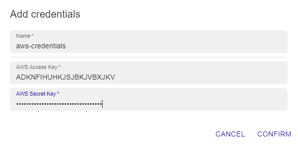
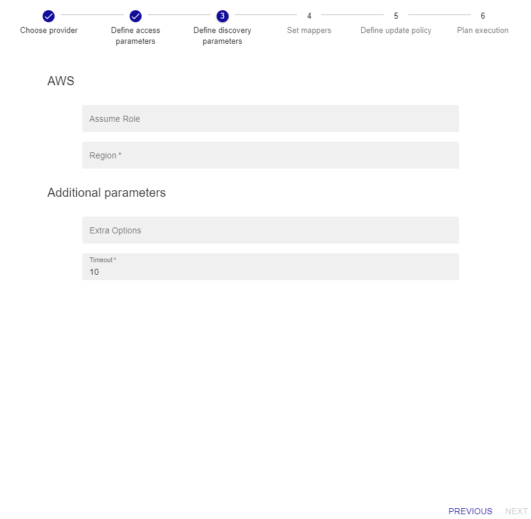

---
id: cloud-aws-cloudwatch-discover
slug: /cloud-aws-cloudwatch-discover
title: AWS Discover
---
import Tabs from '@theme/Tabs';
import TabItem from '@theme/TabItem';

## Dépendances du connecteur de supervision

Les connecteurs de supervision suivants sont automatiquement installés lors de l'installation du connecteur **AAWS Discover** 
depuis la page **Configuration > Connecteurs > Connecteurs de supervision** :
* [Base Pack](./base-generic.md)
* [Amazon API Gateway](./cloud-aws-apigateway.md)
* [Amazon Backup Vault](./cloud-aws-backup.md)
* [Amazon EBS](./cloud-aws-ebs.md)
* [Amazon EC2](./cloud-aws-ec2.md)
* [Amazon EFS](./cloud-aws-efs.md)
* [Amazon FSx](./cloud-aws-fsx.md)
* [Amazon Kinesis](./cloud-aws-kinesis.md)
* [AWS Lamba](./cloud-aws-lambda.md)
* [Amazon RDS](./cloud-aws-rds.md)
* [Amazon S3](./cloud-aws-s3.md)
* [Amazon SNS](./cloud-aws-sns.md)
* [Amazon SQS](./cloud-aws-sqs.md)
* [AWS VPN](./cloud-aws-vpn.md)

## Contenu du pack

### Modèles

Le connecteur de supervision **AWS Discover** ne propose pas de modèle d'hôte directement,
il se base sur les packs de la liste ci-dessus.

#### Découverte d'hôtes

| Nom de la règle                 | Description                                       |
|:--------------------------------|:--------------------------------------------------|
| Amazon AWS API Gateway          | Découvre les instances Amazon AWS API Gateway     |
| Amazon Web Service Backup Vault | Découvre les hôtes AWS Backup Vault               |
| Amazon AWS EBS                  | Découvre les hôtes Amazon AWS Elastic Block Store |
| Amazon AWS EC2                  | Découvre les instance Amazon AWS EC2              |
| Amazon AWS ASG                  | Découvre les Auto Scaling Groups Amazon AWS       |
| Amazon AWS EFS                  | Découvre les instances Amazon AWS EFS             |
| Amazon AWS FSX                  | Découvre les instances Amazon AWS FSX             |
| Amazon AWS Kinesis              | Découvre les hôtes Amazon AWS Kinesis streams     |
| Amazon Web Service Lambda       | Découvre les instances AWS Lambda                 |
| Amazon AWS RDS                  | Découvre les instances Amazon AWS RDS             |
| Amazon AWS S3                   | Découvre les instances Amazon AWS S3              |
| Amazon Web Service SNS          | Découvre les Topics AWS SNS                       |
| Amazon Web Service SQS          | Découvre les queues AWS SQS                       |
| Amazon AWS VPN                  | Découvre les VPN AWS                              |

Rendez-vous sur la [documentation dédiée](/docs/monitoring/discovery/hosts-discovery) 
pour en savoir plus sur la découverte automatique d'hôtes.

### Métriques & statuts collectés

Pas de métriques et de status collectés pour ce connecteur de supervision.

## Prérequis

### Privilèges AWS

Configurez un compte de service (via une combinaison d'access key et de secret key).
Voici la liste des droits nécessaires pour pouvoir utiliser ce connecteur de supervision :

| AWS Privilege                  | 
|:-------------------------------|
| apigateway:GetRestApis         |
| backup:ListBackupVaults        |
| ec2:DescribeVolumes            |
| ec2:DescribeInstances          |
| ec2:DescribeSpotFleetRequests  |
| ec2:DescribeVpnConnections     |
| efs:DescribeFileSystems        |
| elb:DescribeLoadBalancers      |
| elbv2:DdescribeLoadBalancers    |
| fsx:DescribeFileSystems        |
| kinesis:ListStreams            |
| lambda:ListFunctions           |
| rds:DescribeDBInstances        |
| s3api:ListBuckets              |
| sns:ListTopics                 | 
| sqs:ListQueues                 |
| cloudwatch:listMetrics         | 
| cloudwatch:getMetricStatistics |

### Dépendances du Plugin

Afin de récupérer les informations nécessaires via les APIs AWS, il est possible d'utiliser soit le binaire *awscli* fourni par Amazon, soit le SDK Perl *paws*. Le SDK est recommandé car plus performant.

> **Attention**, il n'est pas possible d'utiliser *paws* si la connexion s'effectue au travers d'un proxy.

<Tabs groupId="sync">
<TabItem value="perl-Paws-installation" label="perl-Paws-installation">

```bash
yum install perl-Paws
```

</TabItem>
<TabItem value="aws-cli-installation" label="aws-cli-installation">

```bash
curl "https://awscli.amazonaws.com/awscli-exe-linux-x86_64.zip" -o "awscliv2.zip"
unzip awscliv2.zip
sudo ./aws/install
```

</TabItem>
</Tabs>

## Installer le connecteur de supervision

### Pack

La procédure d'installation des connecteurs de supervision diffère légèrement [suivant que votre licence est offline ou online](../getting-started/how-to-guides/connectors-licenses.md).

1. Si la plateforme est configurée avec une licence *online*, l'installation d'un paquet
n'est pas requise pour voir apparaître le connecteur dans le menu **Configuration > Connecteurs > Connecteurs de supervision**.
Au contraire, si la plateforme utilise une licence *offline*, installez le paquet
sur le **serveur central** via la commande correspondant au gestionnaire de paquets
associé à sa distribution :

<Tabs groupId="sync">
<TabItem value="Alma / RHEL / Oracle Linux 8" label="Alma / RHEL / Oracle Linux 8">

```bash
dnf install centreon-pack-cloud-aws\*
```

</TabItem>
<TabItem value="Alma / RHEL / Oracle Linux 9" label="Alma / RHEL / Oracle Linux 9">

```bash
dnf install centreon-pack-cloud-aws\*
```

</TabItem>
<TabItem value="Debian 11 & 12" label="Debian 11 & 12">

```bash
apt install centreon-pack-cloud-aws\*
```

</TabItem>
<TabItem value="CentOS 7" label="CentOS 7">

```bash
yum install centreon-pack-cloud-aws\*
```

</TabItem>
</Tabs>

2. Quel que soit le type de la licence (*online* ou *offline*), installez le connecteur **AWS Discover**
depuis l'interface web et le menu **Configuration > Connecteurs > Connecteurs de supervision**.

### Plugin

À partir de Centreon 22.04, il est possible de demander le déploiement automatique
du plugin lors de l'utilisation d'un connecteur. Si cette fonctionnalité est activée, et
que vous ne souhaitez pas découvrir des éléments pour la première fois, alors cette
étape n'est pas requise.

> Plus d'informations dans la section [Installer le plugin](/docs/monitoring/pluginpacks/#installer-le-plugin).

Utilisez les commandes ci-dessous en fonction du gestionnaire de paquets de votre système d'exploitation :

<Tabs groupId="sync">
<TabItem value="Alma / RHEL / Oracle Linux 8" label="Alma / RHEL / Oracle Linux 8">

```bash
dnf install centreon-plugin-Cloud-Aws-Cloudwatch-Api
```

</TabItem>
<TabItem value="Alma / RHEL / Oracle Linux 9" label="Alma / RHEL / Oracle Linux 9">

```bash
dnf install centreon-plugin-Cloud-Aws-Cloudwatch-Api
```

</TabItem>
<TabItem value="Debian 11 & 12" label="Debian 11 & 12">

```bash
apt install centreon-plugin-cloud-aws-cloudwatch-api
```

</TabItem>
<TabItem value="CentOS 7" label="CentOS 7">

```bash
yum install centreon-plugin-Cloud-Aws-Cloudwatch-Api
```

</TabItem>
</Tabs>

### Paramètres d'accès

Après avoir sélectionné le provider **AWS Discover**, renseignez les paramètres d'authentification ainsi que les options 
d'accès à l'API comme ci-après si besoin :


- Sélectionnez le **collecteur Centreon** depuis lequel sera lancé la découverte
- Renseignez les paramètres relatifs à l'utilisation d'un **proxy d'entreprise** si besoin
- Sélectionnez le **profil d'authentification AWS** à utiliser si besoin

Dans le cadre d'une première utilisation avec le profil d'authentification, vous pouvez en créer un nouveau en cliquant sur '+'. Renseignez ensuite
les informations demandées comme ci-après :



> Tous les champs du formulaire *credentials* doivent être renseignés.

Cliquez sur *confirm* puis sur *suivant* pour afficher la page des paramètres de la découverte.

### Paramètres de découverte

Renseignez si besoin les informations ci-après :



- AWS Region : Région où sont présentes les ressources AWS à découvrir (obligatoire)
- AWS Assume Role : Role ARN à utiliser si le **profil d'authentification AWS** n'est pas utilisé

### Lancement de la découverte et affichage des résultats

L'étape 4 permet d'ajuster les *modificateurs*; ceux-ci sont déjà prédéfinis par le connecteur de supervision, il n'est normalement pas
nécessaire de les modifier dans le cadre d'un *job* de découverte *standard*. Si besoin, référez-vous à la 
[documentation des modificateurs](/docs/monitoring/discovery/hosts-discovery#comment-utiliser-les-modificateurs).

Les étapes 5 & 6 permettent d'ajuster la politique de modélisation des résultats si besoin. Rendez-vous 
[ici](/docs/monitoring/discovery/hosts-discovery#étape-5--définir-les-politiques-danalyse-et-de-mise-à-jour) pour plus d'informations.

Une fois la découverte terminé, vous pouvez afficher les résultats en cliquant sur *job results*. Les modèles relatifs aux types de resources
AWS sont automatiquement appliqués:


> Certains éléments découverts peuvent ne pas avoir de modèle appliqué dans la liste des résultats si les conditions 
> appliquées aux modificateurs ne peuvent s'appliquer.

Sélectionnez les éléments que vous voulez ajouter dans Centreon et *Sauvegardez*.

### Diagnostic des erreurs communes

Rendez-vous sur la [documentation dédiée](../getting-started/how-to-guides/troubleshooting-plugins.md)
pour le diagnostic des erreurs communes des plugins Centreon.
