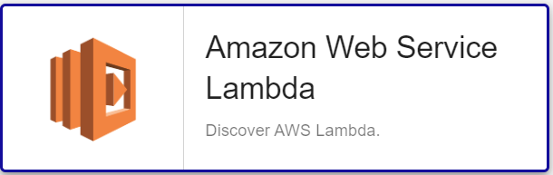

import Tabs from '@theme/Tabs';
import TabItem from '@theme/TabItem';


## Contenu du Pack

### Modèles

Le Plugin Pack Centreon **AWS Lambda** apporte un modèle d'hôte :
* Cloud-Aws-Lambda-custom

Il apporte le modèle de service suivant :

| Alias              | Modèle de service                | Description                                  | Défaut |
|:-------------------|:---------------------------------|:---------------------------------------------|:-------|
| Lambda-Invocations | Cloud-Aws-Lambda-Invocations-Api | Contrôle les performances du cache Memcached | X      |

### Règles de découverte

Ce pack propose une règle de découverte d'hôtes permettant de découvrir automatiquement des ressources AWS Backup vault : 



Vous trouverez plus d'informations sur la découverte d'Hôtes et son fonctionnement sur la documentation du module : [Découverte des hôtes](/docs/monitoring/discovery/hosts-discovery)


### Métriques & statuts collectés

<Tabs groupId="sync">
<TabItem value="Lambda-Invocations" label="Lambda-Invocations">

| Metric Name                              | Unit  |
|:-----------------------------------------|:------|
| lambda.function.duration.milliseconds    | ms    |
| lambda.function.invocations.count        | count |
| lambda.function.errors.count             | count |
| lambda.function.deadlettererrors.count   | count |
| lambda.function.throttles.count          | count |
| lambda.function.iteratorage.milliseconds | count |

</TabItem>
</Tabs>

## Prérequis

### Privilèges AWS

Voici la liste des droits nécessaires au travers des access/secret key utilisées pour pouvoir utiliser le monitoring AWS/EC2: 

| AWS Privilege                  | Description                                                     |
| :------------------------------| :-------------------------------------------------------------- |
| lamdba:ListFunctions           | Get a list of Lambda function                                   |
| cloudwatch:getMetricStatistics | Get metrics from the AWS/EC2 namespace on Cloudwatch.           |

### Dépendances du Plugin

Afin de récupérer les informations nécessaires via les APIs AWS, il est possible d'utiliser soit le binaire *awscli* fourni par Amazon, soit le SDK Perl *paws*. Le SDK est recommandé car plus performant. 

> **Attention** il n'est pas possible d'utiliser *paws* si la connexion s'effectue au travers d'un proxy.

<Tabs groupId="sync">
<TabItem value="perl-Paws-installation" label="perl-Paws-installation">

```bash
yum install perl-Paws
```

</TabItem>
<TabItem value="aws-cli-installation" label="aws-cli-installation">

```bash
curl "https://awscli.amazonaws.com/awscli-exe-linux-x86_64.zip" -o "awscliv2.zip"
unzip awscliv2.zip
sudo ./aws/install
```

</TabItem>
</Tabs>

## Installation

<Tabs groupId="sync">
<TabItem value="Online License" label="Online License">

1. Installez le plugin sur tous les collecteurs Centreon devant superviser des ressources **AWS Lambda** :

```bash
yum install centreon-plugin-Cloud-Aws-Lambda-Api
```

2. Sur l'interface web de Centreon, installez le Plugin Pack **AWS Lambda** depuis la page **Configuration > Packs de plugins**.

</TabItem>
<TabItem value="Offline License" label="Offline License">

1. Installez le plugin sur tous les collecteurs Centreon devant superviser des ressources **AWS Lambda** :

```bash
yum install centreon-plugin-Cloud-Aws-Lambda-Api
```

2. Sur le serveur central Centreon, installez le RPM du Plugin Pack **AWS Lambda** :

```bash
yum install centreon-pack-cloud-aws-lambda
```

3. Sur l'interface web de Centreon, installez le Plugin Pack **AWS Lambda** depuis la page **Configuration > Packs de plugins**.

</TabItem>
</Tabs>

## Configuration

### Hôte

* Ajoutez un hôte à Centreon depuis la page **Configuration > Hôtes**.
* Remplissez le champ **Adresse IP/DNS** avec l'adresse **127.0.0.1**.
* Appliquez le modèle d'hôte **Cloud-Aws-Lambda-custom**.
* Une fois le modèle appliqué, les Macros ci-dessous indiquées comme requises doivent être renseignées :

| Mandatory   | Nom             | Description                                                                                 |
| :---------- | :-------------- | :------------------------------------------------------------------------------------------ |
| X           | AWSSECRETKEY    | AWS Secret key of your IAM role. Password checkbox must be checked                          |
| X           | AWSACESSKEY     | AWS Access key of your IAM role. Password checkbox must be checked                          |
| X           | AWSREGION       | Region where the instance is running                                                        |
| X           | AWSCUSTOMMODE   | Custom mode to get metrics, 'awscli' is the default, you can also use 'paws' perl library   |
|             | PROXYURL        | Configure proxy URL                                                                         |
|             | FUNCTIONNAME    | Function name (Default : '.*')                                                              |
|             | EXTRAOPTIONS    | Any extra option you may want to add to every command line (eg. a --verbose flag)           |
|             | DUMMYSTATUS     | Host state. Default is OK, do not modify it unless you know what you are doing              |
|             | DUMMYOUTPUT     | Host check output. Default is 'This is a dummy check'. Customize it with your own if needed |

## Comment puis-je tester le plugin et que signifient les options des commandes ?

Une fois le plugin installé, vous pouvez tester celui-ci directement en ligne
de commande depuis votre collecteur Centreon en vous connectant avec
l'utilisateur **centreon-engine** (`su - centreon-engine`) :

```bash
/usr/lib/centreon/plugins//centreon_aws_lambda_api.pl \
    --plugin=cloud::aws::lambda::plugin \
    --mode=invocations \
    --custommode='awscli' \
    --aws-secret-key='' \
    --aws-access-key='' \
    --region='eu-west-1' \
    --proxyurl='' \
    --filter-metric='' \
    --timeframe='600' \
    --period='60' \
    --name='myfunctions' \
    --zeroed \
    --verbose
```

La commande devrait retourner un message de sortie similaire à :

```bash
OK: Function 'myfunctions' All metrics are ok | 'myfunctions~average#lambda.function.throttles.count'=0.00;;;; 'myfunctions~average#lambda.function.errors.count'=0.00;;;; 'myfunctions~average#lambda.function.iteratorage.milliseconds'=0.00;;;; 'myfunctions~average#lambda.function.invocations.count'=0.00;;;; 'myfunctions~average#lambda.function.deadlettererrors.count'=0.00;;;; 'myfunctions~average#lambda.function.duration.milliseconds'=0.00;;;; 'myfunctions~sum#lambda.function.throttles.count'=0.00;;;; 'myfunctions~sum#lambda.function.errors.count'=0.00;;;; 'myfunctions~sum#lambda.function.iteratorage.milliseconds'=0.00;;;; 'myfunctions~sum#lambda.function.invocations.count'=0.00;;;; 'myfunctions~sum#lambda.function.deadlettererrors.count'=0.00;;;; 'myfunctions~sum#lambda.function.duration.milliseconds'=0.00;;;;
Checking Function 'myfunctions'
    Statistic 'Average' Metrics Throttles: 0.00, Errors: 0.00, Iterator Age: 0.00, Invocations: 0.00, Dead Letter Errors: 0.00, Duration: 0.00
    Statistic 'Sum' Metrics Throttles: 0.00, Errors: 0.00, Iterator Age: 0.00, Invocations: 0.00, Dead Letter Errors: 0.00, Duration: 0.00
```

La liste de toutes les options complémentaires et leur signification peut être
affichée en ajoutant le paramètre `--help` à la commande :

```bash
/usr/lib/centreon/plugins//centreon_aws_lambda_api.pl \
    --plugin=cloud::aws::lambda::plugin \
    --mode=invocations \
    --help
```

Tous les modes disponibles peuvent être affichés en ajoutant le paramètre
`--list-mode` à la commande :

```bash
/usr/lib/centreon/plugins//centreon_aws_lambda_api.pl \
    --plugin=cloud::aws::lambda::plugin \
    --list-mode
```

### Diagnostic des erreurs communes

Rendez-vous sur la [documentation dédiée](../getting-started/how-to-guides/troubleshooting-plugins.md)
pour le diagnostic des erreurs communes des plugins Centreon.