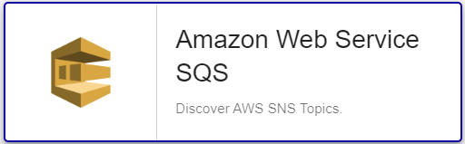

import Tabs from '@theme/Tabs';
import TabItem from '@theme/TabItem';


## Contenu du Pack

### Modèles

Le Plugin Pack Centreon **Amazon SQS** apporte un modèle d'hôte :
* Cloud-Aws-Sqs-custom

Il apporte le modèle de service suivant :

| Alias      | Modèle de service        | Description                           | Défaut |
|:-----------|:-------------------------|:--------------------------------------|:-------|
| Sqs-Queues | Cloud-Aws-Sqs-Queues-Api | Contrôle la file d'attente Amazon SQS | X      |

### Règles de découverte

Ce pack propose une règle de découverte d'hôtes permettant de découvrir automatiquement des ressources **AWS SQS** : 



Vous trouverez plus d'informations sur la découverte d'Hôtes et son fonctionnement sur la documentation du module : [Découverte des hôtes](/docs/monitoring/discovery/hosts-discovery)

### Métriques collectées

Plus de détails sur les métriques présentées ci-après sont disponibles sur la documentation officielle du service SQS:
https://docs.aws.amazon.com/fr_fr/AWSSimpleQueueService/latest/SQSDeveloperGuide/sqs-monitoring-using-cloudwatch

<Tabs groupId="sync">
<TabItem value="Sqs-Queues" label="Sqs-Queues">

| Metric name                         | Description                                                                                     | Unit |
|:------------------------------------|:------------------------------------------------------------------------------------------------|:-----|
| sqs.queue.messages.oldest.seconds   | The approximate age of the oldest non-deleted message in the queue.                             | s    |
| sqs.queue.messages.delayed.count    | The number of messages in the queue that are delayed and not available for reading immediately. |      |
| sqs.queue.messages.notvisible.count | The number of messages that are in flight.                                                      |      |
| sqs.queue.messages.visible.count    | The number of messages available for retrieval from the queue.                                  |      |
| sqs.queue.messages.empty.count      | The number of ReceiveMessage API calls that did not return a message.                           |      |
| sqs.queue.messages.deleted.count    | The number of messages deleted from the queue.                                                  |      |
| sqs.queue.messages.received.count   | The number of messages returned by calls to the ReceiveMessage action.                          |      |
| sqs.queue.messages.sent.count       | The number of messages added to a queue.                                                        |      |

</TabItem>
</Tabs>

## Prérequis

### Privilèges AWS

Un compte de service (paire d'identifiants *access/secret keys*) est nécessaire afin de pouvoir superviser les resources **Amazon SQS**.
Ce compte doit bénéficier des privilèges suivants :

| AWS Privilege                  | Description                                          |
|:-------------------------------|:-----------------------------------------------------|
| sqs:ListQueues                 | Returns a list of your queues in the current region. |
| cloudwatch:listMetrics         | List all metrics from Cloudwatch AWS/VPN namespace   |
| cloudwatch:getMetricStatistics | Get metrics values from Cloudwatch AWS/VPN namespace |

### Dépendances du Plugin

Afin de récupérer les informations nécessaires via les APIs AWS, il est possible d'utiliser soit le binaire *awscli*, soit le SDK perl Paws. Le SDK est recommandé car plus performant. 

**Attention** il n'est pas possible d'utiliser perl-Paws si la connexion s'effectue au travers d'un proxy.

<Tabs groupId="sync">
<TabItem value="perl-Paws-installation" label="perl-Paws-installation">

```bash
yum install perl-Paws
```

</TabItem>
<TabItem value="aws-cli-installation" label="aws-cli-installation">

```bash
yum install awscli
```

</TabItem>
</Tabs>

# Installation

<Tabs groupId="sync">
<TabItem value="Online License" label="Online License">

1. Installez le plugin sur tous les collecteurs Centreon devant superviser des ressources **SQS** :

```bash
yum install centreon-plugin-Cloud-Aws-Sns-Api
```

2. Sur l'interface web de Centreon, installez le Plugin Pack **Amazon SQS** depuis la page **Configuration > Packs de plugins**.

</TabItem>
<TabItem value="Offline License" label="Offline License">

1. Installez le plugin sur tous les collecteurs Centreon devant superviser des ressources **SQS** :

```bash
yum install centreon-plugin-Cloud-Aws-Sns-Api
```

2. Sur le serveur central Centreon, installez le RPM du Plugin Pack **Amazon SQS** :

```bash
yum install centreon-pack-cloud-aws-sns
```

3. Sur l'interface web de Centreon, installez le Plugin Pack **Amazon SQS** depuis la page **Configuration > Packs de plugins**.

</TabItem>
</Tabs>

## Configuration

### Hôte

* Ajoutez un hôte à Centreon depuis la page **Configuration > Hôtes**.
* Remplissez le champ **Adresse IP/DNS** avec l'adresse **127.0.0.1**.
* Appliquez le modèle d'hôte **Cloud-Aws-Sqs-custom**.
* Une fois le modèle appliqué, les Macros ci-dessous indiquées comme requises (*Mandatory*) doivent être renseignées:

| Mandatory   | Nom             | Description                                                                                 |
| :---------- | :-------------- | :------------------------------------------------------------------------------------------ |
| X           | AWSSECRETKEY    | AWS Secret key of your IAM role. Password checkbox must be checked                          |
| X           | AWSACESSKEY     | AWS Access key of your IAM role. Password checkbox must be checked                          |
| X           | AWSREGION       | Region where the instance is running                                                        |
| X           | AWSCUSTOMMODE   | Custom mode to get metrics, 'awscli' is the default, you can also use 'paws' perl library   |
|             | QUEUENAME       | Queue name (Default : '.*')                                                                 |
|             | PROXYURL        | Configure proxy URL                                                                         |
|             | EXTRAOPTIONS    | Any extra option you may want to add to every command line (eg. a --verbose flag)           |
|             | DUMMYSTATUS     | Host state. Default is OK, do not modify it unless you know what you are doing              |
|             | DUMMYOUTPUT     | Host check output. Default is 'This is a dummy check'. Customize it with your own if needed |

### Comment puis-je tester le plugin et que signifient les options des commandes ?

Une fois le plugin installé, vous pouvez tester celui-ci directement en ligne
de commande depuis votre collecteur Centreon en vous connectant avec
l'utilisateur **centreon-engine** (`su - centreon-engine`) 
(certaines options comme `--proxyurl` doivent être ajustées en fonction du contexte) :

```bash
/usr/lib/centreon/plugins/centreon_aws_sqs_api.pl \
    --plugin=cloud::aws::sqs::plugin \
    --mode=queues \
    --custommode=awscli \
    --aws-secret-key='*******************' \
    --aws-access-key='**********' \
    --region='eu-west-1' \
    --proxyurl='http://myproxy.mycompany.org:8080'
    --statistic=average \
    --timeframe='600' \
    --period='60' \
    --queue-name='my_sqs_queue_1' \
    --filter-metric='NumberOfMessagesSent|NumberOfMessagesReceived' \
    --critical-messages-sent=1: \
    --critical-messages-received=1: \
    --verbose
```

La commande devrait retourner un message de sortie de la forme ci-dessous:

```bash
OK: 'my_sqs_queue_1' Statistic 'Average' number of messages sent: 45, number of 
messages received: 32 | 'my_sqs_queue_1~average#sqs.queue.messages.sent.count'=45;;1:;; 'my_sqs_queue_1~average#sqs.queue.messages.received.count'=32;;1:;;
SQS Queue'my_sqs_queue_1'
    Statistic 'Average' number of messages sent: 45, number of messages received: 32  
```

La liste de toutes les options complémentaires et leur signification peut être
affichée en ajoutant le paramètre `--help` à la commande :

```bash
/usr/lib/centreon/plugins//centreon_aws_sqs_api.pl \
    --plugin=cloud::aws::sns::plugin \
    --mode=queues \
    --help
```

### Diagnostic des erreurs communes

Rendez-vous sur la [documentation dédiée](../getting-started/how-to-guides/troubleshooting-plugins.md)
pour le diagnostic des erreurs communes des plugins Centreon.