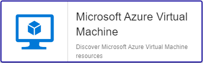

import Tabs from '@theme/Tabs';
import TabItem from '@theme/TabItem';


## Contenu du Pack

### Modèles

Le connecteur de supervision Centreon **Azure Virtual Machine** apporte un modèle d'hôte :

* Cloud-Azure-Compute-VirtualMachine-custom

Il apporte les modèles de service suivants :

| Alias            | Modèle de service                                       | Description                                                                | Défaut |
|:-----------------|:--------------------------------------------------------|:---------------------------------------------------------------------------|:-------|
| Cpu-Credit       | Cloud-Azure-Compute-VirtualMachine-Cpu-Credit-Api       | Contrôle l'utilisation des crédits CPU                                     |        |
| Cpu-Usage        | Cloud-Azure-Compute-VirtualMachine-Cpu-Usage-Api        | Contrôle l'utilisation CPU                                                 | X      |
| Diskio           | Cloud-Azure-Compute-VirtualMachine-Diskio-Api           | Contrôle l'utilisation des écritures                                       | X      |
| Health           | Cloud-Azure-Compute-VirtualMachine-Health-Api           | Contrôle le statut de la VM                                                | X      |
| Memory           | Cloud-Azure-Compute-VirtualMachine-Memory-Api           | Contrôle l'utilisation de la memoire                                       | X      |
| Network          | Cloud-Azure-Compute-VirtualMachine-Network-Api          | Contrôle l'utilisation réseau                                              | X      |
| Vm-Sizes-Global  | Cloud-Azure-Compute-VirtualMachine-Vm-Sizes-Global-Api  | Contrôle permettant de remonter le nombre de machines virtuelles par types |        |

### Règles de découverte

Le connecteur de supervision Centreon **Azure Virtual Machine** inclut un fournisseur de découverte
d'hôtes nommé **Microsoft Azure Virtual Machines**. Celui-ci permet de découvrir l'ensemble des instances
rattachées à une souscription Microsoft Azure donnée:



> La découverte **Azure Virtual Machine** n'est compatible qu'avec le mode **api**. Le mode **azcli** n'est pas supporté dans le cadre
> de cette utilisation.

Rendez-vous sur la [documentation dédiée](/onprem/monitoring/discovery/hosts-discovery)
pour en savoir plus sur la découverte automatique d'hôtes.

### Métriques & statuts collectés

<Tabs groupId="sync">
<TabItem value="Cpu-Credit" label="Cpu-Credit">

| Metric Name                      | Unit  |
|:---------------------------------|:------|
| azvm.cpu.credits.consumed.count  |       |
| azvm.cpu.credits.remaining.count |       |
| azvm.cpu.utilization.percentage  | %     |

</TabItem>
<TabItem value="Cpu-Usage" label="Cpu-Usage">

| Metric Name                      | Unit  |
|:---------------------------------|:------|
| azvm.cpu.credits.consumed.count  |       |
| azvm.cpu.credits.remaining.count |       |
| azvm.cpu.utilization.percentage  | %     |

</TabItem>
<TabItem value="Diskio" label="Diskio">

| Metric Name               | Unit  |
|:--------------------------|:------|
| azvm.disk.read.bytes      | B     |
| azvm.disk.read.persecond  |       |
| azvm.disk.write.bytes     | B     |
| azvm.disk.write.persecond |       |

</TabItem>
<TabItem value="Health" label="Health">

| Status Name | Description                 |
|:------------|:----------------------------|
| status      | Current operational status  |
| summary     | Last related status message |

</TabItem>
<TabItem value="Memory" label="Memory">

| Metric Name                 | Unit  |
|:----------------------------|:------|
| azvm.memory.available.bytes | B     |

</TabItem>
<TabItem value="Network" label="Network">

| Metric Name            | Unit  |
|:-----------------------|:------|
| azvm.network.in.bytes  | B     |
| azvm.network.out.bytes | B     |

</TabItem>
<TabItem value="Vm-Sizes-Global" label="Vm-Sizes-Global">

One metric corresponding to each available machine size you can deploy with Azure. 

</TabItem>
</Tabs>

## Prérequis

Rendez-vous sur la [documentation dédiée](../getting-started/how-to-guides/azure-credential-configuration.md) afin d'obtenir les prérequis nécessaires pour interroger les API d'Azure.

## Installation

<Tabs groupId="sync">
<TabItem value="Online License" label="Online License">

1. Installez le plugin sur tous les collecteurs Centreon devant superviser des ressources **Azure Virtual Machine** :

```bash
yum install centreon-plugin-Cloud-Azure-Compute-VirtualMachine-Api
```

2. Sur l'interface web de Centreon, installez le connecteur de supervision **Azure Virtual Machine** depuis la page **Configuration > Packs de plugins**.

</TabItem>
<TabItem value="Offline License" label="Offline License">

1. Installez le plugin sur tous les collecteurs Centreon devant superviser des ressources **Azure Virtual Machine** :

```bash
yum install centreon-plugin-Cloud-Azure-Compute-VirtualMachine-Api
```

2. Sur le serveur central Centreon, installez le RPM du connecteur de supervision **Azure Virtual Machine** :

```bash
yum install centreon-pack-cloud-azure-compute-virtualmachine
```

3. Sur l'interface web de Centreon, installez le connecteur de supervision **Azure Virtual Machine** depuis la page **Configuration > Packs de plugins**.

</TabItem>
</Tabs>

## Configuration

### Hôte

* Ajoutez un hôte à Centreon depuis la page **Configuration > Hôtes**.
* Remplissez le champ **Adresse IP/DNS** avec l'adresse **127.0.0.1**.
* Appliquez le modèle d'hôte **Cloud-Azure-Compute-VirtualMachine-custom**.
* Une fois le modèle appliqué, renseignez les macros correspondantes. Attention, certaines macros sont obligatoires. Elles doivent être renseignées selon le *custom mode* utilisé.

> Deux méthodes peuvent être utilisées lors de l'assignation des macros :

>
> * Utilisation de l'ID complet de la ressource (de type `/subscriptions/<subscription_id>/resourceGroups/<resourcegroup_id>/providers/XXXXXX/XXXXXXX/<resource_name>`) dans la macro *AZURERESOURCE*.
> * Utilisation du nom de la ressource dans la macro **AZURERESOURCE** et du nom du groupe de ressources dans la macro **AZURERESOURCEGROUP**.

<Tabs groupId="sync">
<TabItem value="Azure Monitor API" label="Azure Monitor API">

| Obligatoire | Macro              | Description                                      |
|:------------|:-------------------|:-------------------------------------------------|
|     x       | AZUREAPICUSTOMMODE | Custom mode **api**                              |
|     x       | AZURECLIENTID      | Client ID                                        |
|     x       | AZURECLIENTSECRET  | Client secret                                    |
|     x       | AZURERESOURCE      | ID or name of the Azure Virtual Machine resource |
|             | AZURERESOURCEGROUP | Resource group name if resource name is used     |
|     x       | AZURESUBSCRIPTION  | Subscription ID                                  |
|     x       | AZURETENANT        | Tenant ID                                        |

</TabItem>
<TabItem value="Azure AZ CLI" label="Azure AZ CLI">

| Obligatoire | Macro              | Description                                      |
|:------------|:-------------------|:-------------------------------------------------|
|     x       | AZURECLICUSTOMMODE | Custom mode **azcli**                            |
|     x       | AZURERESOURCE      | ID or name of the Azure Virtual Machine resource |
|     x       | AZURERESOURCEGROUP | Resource group name if resource name is used     |
|     x       | AZURESUBSCRIPTION  | Subscription ID                                  |

</TabItem>
</Tabs>

## Comment puis-je tester le plugin et que signifient les options des commandes ?

Une fois le plugin installé, vous pouvez tester celui-ci directement en ligne
de commande depuis votre collecteur Centreon en vous connectant avec
l'utilisateur **centreon-engine** (`su - centreon-engine`) :

```bash
/usr/lib/centreon/plugins//centreon_azure_compute_virtualmachine_api.pl \
    --plugin=cloud::azure::compute::virtualmachine::plugin \
    --mode=health \
    --custommode='api' \
    --resource='VM001ABCD' \
    --resource-group='RSG1234' \
    --subscription='xxxxxxxxx' \
    --tenant='xxxxxxxxx' \
    --client-id='xxxxxxxxx' \
    --client-secret='xxxxxxxxx' \
    --proxyurl='' \
    --ok-status='%{status} =~ /^Available$/' \
    --warning-status='' \
    --critical-status='%{status} =~ /^Unavailable$/' \
    --unknown-status='%{status} =~ /^Unknown$/' \
    --api-version=2017-07-01\
    --use-new-perfdata
```

La commande devrait retourner un message de sortie similaire à :

```bash
OK: Status: '%s', Summary: '%s' |
```

La liste de toutes les options complémentaires et leur signification peut être
affichée en ajoutant le paramètre `--help` à la commande :

```bash
/usr/lib/centreon/plugins//centreon_azure_compute_virtualmachine_api.pl \
    --plugin=cloud::azure::compute::virtualmachine::plugin \
    --mode=health \
    --help
```

Tous les modes disponibles peuvent être affichés en ajoutant le paramètre
`--list-mode` à la commande :

```bash
/usr/lib/centreon/plugins//centreon_azure_compute_virtualmachine_api.pl \
    --plugin=cloud::azure::compute::virtualmachine::plugin \
    --list-mode
```

### Diagnostic des erreurs communes

Rendez-vous sur la [documentation dédiée](../getting-started/how-to-guides/troubleshooting-plugins.md#http-and-api-checks)
des plugins basés sur HTTP/API.