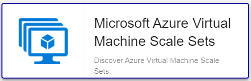

import Tabs from '@theme/Tabs';
import TabItem from '@theme/TabItem';


## Contenu du Pack

### Modèles

Le Plugin Pack Centreon Azure Virtual Machine Scale Sets apporte 1 modèle d'hôte :
* Cloud-Azure-Compute-Vmscalesets-custom

Il apporte les Modèles de Service suivants :

| Alias     | Modèle de service                             | Description                                                                  | Défaut |
|:----------|:----------------------------------------------|:-----------------------------------------------------------------------------|:-------|
| Cpu-Usage | Cloud-Azure-Compute-Vmscalesets-Cpu-Usage-Api | Contrôle le CPU du Virtual Machine Scale Sets                                | X      |
| Diskio    | Cloud-Azure-Compute-Vmscalesets-Diskio-Api    | Contrôle l'utilisation des écritures                                         | X      |
| Health    | Cloud-Azure-Compute-Vmscalesets-Health-Api    | Contrôle le statut du Virtual Machine Scale Sets                             | X      |
| Memory    | Cloud-Azure-Compute-Vmscalesets-Memory-Api    | Contrôle de la mémoire disponible restante sur le Virtual Machine Scale Sets | X      |
| Traffic   | Cloud-Azure-Compute-Vmscalesets-Traffic-Api   | Contrôle l'utilisation du réseau du Virtual Machine Scale Sets               | X      |

### Règles de découverte

Le Plugin Pack Centreon *Azure Virtual Machine Scale Sets* inclut un fournisseur de découverte
d'Hôtes nommé **Microsoft Azure Virtual Machine Scale Setss**. Celui-ci permet de découvrir l'ensemble des instances
rattachées à une *souscription* Microsoft Azure donnée:



> La découverte *Azure Virtual Machine Scale Sets* n'est compatible qu'avec le mode 'api'. Le mode 'azcli' n'est pas supporté dans le cadre
> de cette utilisation.

Vous trouverez plus d'informations sur la découverte d'Hôtes et son
fonctionnement sur la documentation du module:
[Découverte des hôtes](/docs/monitoring/discovery/hosts-discovery)

### Métriques & statuts collectés

<Tabs groupId="metrics">
<TabItem value="Cpu-Usage" label="Cpu-Usage">

| Métrique                    | Unité |
|:----------------------------|:------|
| cpu.credits.consumed.count  |       |
| cpu.credits.remaining.count |       |
| cpu.utilization.percentage  | %     |

</TabItem>
<TabItem value="Diskio" label="Diskio">

| Métrique              | Unité |
|:----------------------|:------|
| disk.write.ops.persec |       |
| disk.write.ops.persec |       |

</TabItem>
<TabItem value="Health" label="Health">

Could not retrive metrics

</TabItem>
<TabItem value="Memory" label="Memory">

| Métrique               | Unité |
|:-----------------------|:------|
| memory.available.bytes | B     |

</TabItem>
<TabItem value="Traffic" label="Traffic">

| Métrique          | Unité |
|:------------------|:------|
| traffic.in.bytes  | B     |
| traffic.out.bytes | B     |

</TabItem>
</Tabs>

## Prérequis

Rendez-vous sur la [documentation dédiée](../getting-started/how-to-guides/azure-credential-configuration.md) afin d'obtenir les prérequis nécessaires pour interroger les API d'Azure.

## Installation

<Tabs groupId="sync">
<TabItem value="Online License" label="Online License">

1. Installer le Plugin Centreon sur tous les collecteurs Centreon devant superviser des ressources *Azure VMSS* :

```bash
yum install centreon-plugin-Cloud-Azure-Compute-Vmscalesets-Api
```

2. Sur l'interface Web de Centreon, installer le Plugin Pack **Azure Virtual Machine Scale Sets** depuis la page **Configuration > Packs de plugins**.

</TabItem>
<TabItem value="Offline License" label="Offline License">

1. Installer le Plugin Centreon sur tous les collecteurs Centreon devant superviser des ressources *Azure VMSS* :

```bash
yum install centreon-plugin-Cloud-Azure-Compute-Vmscalesets-Api
```

2. Sur le serveur Central Centreon, installer le RPM du Pack **Azure Virtual Machine Scale Sets** :

```bash
yum install centreon-pack-cloud-azure-compute-vmscalesets
```

3. Sur l'interface Web de Centreon, installer le Plugin Pack **Azure Virtual Machine Scale Sets** depuis la page **Configuration > Packs de plugins**.

</TabItem>
</Tabs>

## Configuration

### Hôte

* Ajoutez un Hôte à Centreon, remplissez le champ **Adresse IP/DNS** avec l'adresse 127.0.0.1.
et appliquez-lui le Modèle d'Hôte *Cloud-Azure-Compute-Vmscalesets-custom**.
* Une fois le modèle appliqué, renseignez les Macroscorrespondantes. Attention, certaines macros sont obligatoires.
doivent être renseignées selon le *custom mode* utilisé.

> Deux méthodes peuvent être utilisées lors de l'assignation des Macros :
> * Utilisation de l'ID complet de la ressource (de type `/subscriptions/<subscription_id>/resourceGroups/<resourcegroup_id>/providers/XXXXXX/XXXXXXX/<resource_name>`)
dans la Macro *AZURERESOURCE*.
> * Utilisation du nom de la ressource dans la Macro *AZURERESOURCE* associée à la Macro *AZURERESOURCEGROUP*.

<Tabs groupId="sync">
<TabItem value="Azure Monitor API" label="Azure Monitor API">

| Mandatory   | Macro              | Description                                        |
|:------------|:-------------------|:---------------------------------------------------|
|             | AZURECLIENTID      | Client ID                                          |
|             | AZURECLIENTSECRET  | Client secret                                      |
|             | AZURECUSTOMMODE    | Custom mode 'api'                                  |
|             | AZURERESOURCE      | ID or name of the %s resource                      |
|             | AZURERESOURCEGROUP | Associated Resource Group if resource name is used |
|             | AZURESUBSCRIPTION  | Subscription ID                                    |
|             | AZURETENANT        | Tenant ID                                          |

</TabItem>
<TabItem value="Azure azcli" label="Azure azcli">

| Mandatory   | Macro              | Description                                        |
|:------------|:-------------------|:---------------------------------------------------|
|             | AZURECUSTOMMODE    | Custom mode 'azcli'                                |
|             | AZURERESOURCE      | ID or name of the %s resource                      |
|             | AZURERESOURCEGROUP | Associated Resource Group if resource name is used |
|             | AZURESUBSCRIPTION  | Subscription ID                                    |

</TabItem>
</Tabs>

## Comment puis-je tester le Plugin et que signifient les options des commandes ? 

Une fois le Plugin installé, vous pouvez tester celui-ci directement en ligne 
de commande depuis votre collecteur Centreon en vous connectant avec 
l'utilisateur **centreon-engine** (`su - centreon-engine`) :

```bash
/usr/lib/centreon/plugins//centreon_azure_compute_vmscalesets_api.pl \
    --plugin=cloud::azure::compute::vmscalesets::plugin \
    --mode=cpu \
    --custommode='api' \
    --resource='' \
    --resource-group='' \
    --subscription='' \
    --tenant='' \
    --client-id='' \
    --client-secret='' \
    --proxyurl='' \
    --filter-metric='' \
    --timeframe='900' \
    --interval='PT5M' \
    --warning-cpu-usage='' \
    --critical-cpu-usage='' \
    --warning-cpu-credits-remaining='' \
    --critical-cpu-credits-remaining='' \
    --use-new-perfdata 
```

La commande devrait retourner un message de sortie similaire à :

```bash
OK: CPU Credits Consumed CPU Credits Remaining CPU percent | 'cpu.credits.consumed.count'=9000;;;0; 'cpu.credits.remaining.count'=9000;;;0; 'cpu.utilization.percentage'=9000%;;;0;100 
```

La liste de toutes les options complémentaires et leur signification peut être
affichée en ajoutant le paramètre `--help` à la commande :

```bash
/usr/lib/centreon/plugins//centreon_azure_compute_vmscalesets_api.pl \
    --plugin=cloud::azure::compute::vmscalesets::plugin \
    --mode=cpu \
    --help
```

Tous les modes disponibles peuvent être affichés en ajoutant le paramètre 
`--list-mode` à la commande :

```bash
/usr/lib/centreon/plugins//centreon_azure_compute_vmscalesets_api.pl \
    --plugin=cloud::azure::compute::vmscalesets::plugin \
    --list-mode
```

### Diagnostic des erreurs communes

Rendez-vous sur la [documentation dédiée](../getting-started/how-to-guides/troubleshooting-plugins.md#http-and-api-checks)
des Plugins basés sur HTTP/API.