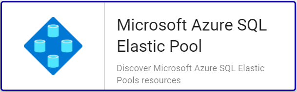

import Tabs from '@theme/Tabs';
import TabItem from '@theme/TabItem';


## Vue d'ensemble

Les pools élastiques Azure SQL Database représentent une solution simple et rentable de gestion et de mise à l’échelle de plusieurs
bases de données qui ont des demandes d’utilisation variables et imprévisibles. Les bases de données d’un pool élastique se trouvent
sur un seul serveur et partagent un nombre défini de ressources à prix fixe. 

Le connecteur de supervision Centreon *Azure Elastic Pool* s'appuie sur les API Azure Monitor afin de récuperer les métriques relatives au service
Elastic Pool. Il est possible d'utiliser les 2 modes proposés par Microsoft: RestAPI ou Azure CLI.

## Contenu du connecteur de supervision

### Objets supervisés

* *Elastic Pools* Azure SQL

### Règles de découverte

Le connecteur de supervision Centreon *Azure Elastic Pool* inclut un *provider* de découverte d'Hôtes nommé **Microsoft Azure SQL Elastic Pool**.
Celui-ci permet de découvrir l'ensemble des *Elastic Pools* rattachés à une *souscription* Microsoft Azure donnée:



> La découverte *Azure Elastic Pool* n'est compatible qu'avec le mode 'api'. Le mode 'azcli' n'est pas supporté dans le cadre
> de cette utilisation. 

Vous trouverez plus d'informations sur la découverte d'Hôtes et son fonctionnement sur la documentation du module:
[Découverte des hôtes](/onprem/monitoring/discovery/hosts-discovery)

### Métriques collectées 

<Tabs groupId="sync">
<TabItem value="Cpu" label="Cpu">

> Ces métriques sont disponibles uniquement pour les *Pools* de type *vCore*

| Metric name                      | Description    | Unit  |
|:---------------------------------|:---------------|:------|
| elasticpool.cpu.limit.count      | CPU limit      | Count |
| elasticpool.cpu.usage.percentage | CPU percentage | %     |
| elasticpool.cpu.used.count       | CPU used       | Count |

</TabItem>
<TabItem value="Dtu" label="Dtu">

> Ces métriques sont disponibles uniquement pour les *Pools* de type *DTU*

| Metric name                             | Description    | Unit  |
|:----------------------------------------|:---------------|:------|
| elasticpool.dtu.consumpution.percentage | DTU percentage | %     |
| elasticpool.edtu.limit.count            | eDTU limit     | Count |
| elasticpool.edtu.used.count             | eDTU used      | Count |

</TabItem>
<TabItem value="Log" label="Log">

| Metric name                             | Description                    | Unit |
|:----------------------------------------|:-------------------------------|:-----|
| elasticpool.log.write.percentage        | Log IO percentage              | %    |
| elasticpool.log.tempdb.size.kilobytes   | Tempdb Log File Size Kilobytes | KB   |
| elasticpool.log.tempdb.usage.percentage | Tempdb Percent Log Used        | %    |

</TabItem>
<TabItem value="Sessions" label="Sessions">

| Metric name                           | Description         | Unit |
|:--------------------------------------|:--------------------|:-----|
| elasticpool.sessions.usage.percentage | Sessions percentage | %    |
| elasticpool.workers.usage.percentage  | Workers percentage  | %    |

</TabItem>
<TabItem value="Storage" label="Storage">

| Metric name                                   | Description                  | Unit |
|:----------------------------------------------|:-----------------------------|:-----|
| elasticpool.storage.data.allocated.bytes      | Data space allocated         | B    |
| elasticpool.storage.data.allocated.percentage | Data space allocated percent | %    |
| elasticpool.storage.used.bytes                | Data space used              | B    |
| elasticpool.storage.usage.percentage          | Data space used percent      | %    |

</TabItem>
</Tabs>

## Prérequis

Rendez-vous sur la [documentation dédiée](../getting-started/how-to-guides/azure-credential-configuration.md) afin d'obtenir les prérequis nécessaires pour interroger les API d'Azure.

## Installation 

<Tabs groupId="sync">
<TabItem value="Online License" label="Online License">

1. Installer le Plugin sur tous les collecteurs Centreon devant superviser des resources Azure Elastic Pool:

```bash
yum install centreon-plugin-Cloud-Azure-Database-Elasticpool-Api
```

2. Sur l'interface Web de Centreon, installer le connecteur de supervision *Azure Elastic Pool* depuis la page **Configuration > Gestionnaire de connecteurs de supervision**

</TabItem>
<TabItem value="Offline License" label="Offline License">

1. Installer le Plugin sur tous les collecteurs Centreon devant superviser des resources Azure Elastic Pool::

```bash
yum install centreon-plugin-Cloud-Azure-Database-Elasticpool-Api
```

2. Sur le serveur Central Centreon, installer le RPM du connecteur de supervision *Azure Elastic Pool*:

```bash
yum install centreon-pack-cloud-azure-database-elasticpool.noarch
```

3. Sur l'interface Web de Centreon, installer le connecteur de supervision *Azure Elastic Pool* depuis la page **Configuration > Gestionnaire de connecteurs de supervision**

</TabItem>
</Tabs>

## Configuration

### Hôte

* Ajoutez un Hôte à Centreon, remplissez le champ *Adresse IP/DNS* avec l'adresse 127.0.0.1 
et appliquez-lui le Modèle d'Hôte *Cloud-Azure-Database-Elasticpool-custom*.
* Une fois le modèle appliqué, les Macros ci-dessous indiquées comme requises (*Mandatory*) 
doivent être renseignées selon le custom-mode utilisé:

<Tabs groupId="sync">
<TabItem value="Azure Monitor API" label="Azure Monitor API">

| Mandatory | Nom               | Description                                                                                     |
|:----------|:------------------|:------------------------------------------------------------------------------------------------|
| X         | AZURECUSTOMMODE   | Custom mode 'api'                                                                               |
| X         | AZURESUBSCRIPTION | Subscription ID                                                                                 |
| X         | AZURETENANT       | Tenant ID                                                                                       |
| X         | AZURECLIENTID     | Client ID                                                                                       |
| X         | AZURECLIENTSECRET | Client secret                                                                                   |
| X         | AZURERESOURCE     | Id of the Elastic Pool resource (syntax: <server\_name\>/elasticpool/<elasticpools\_name\>)     |

</TabItem>
<TabItem value="Azure AZ CLI" label="Azure AZ CLI">

| Mandatory | Nom               | Description                                                                                     |
|:----------|:------------------|:------------------------------------------------------------------------------------------------|
| X         | AZURECUSTOMMODE   | Custom mode 'azcli'                                                                             |
| X         | AZURESUBSCRIPTION | Subscription ID                                                                                 |
| X         | AZURERESOURCE     | Id of the Elastic Pool resource (syntax: <server\_name\>/elasticpool/<elasticpools\_name\>)     |

</TabItem>
</Tabs>

## FAQ

### Comment puis-je tester le Plugin et que signifient les options des commandes ?

Une fois le Plugin installé, vous pouvez tester celui-ci directement en ligne de
commande depuis votre collecteur Centreon en vous connectant avec l'utilisateur
*centreon-engine*:

```bash
/usr/lib/centreon/plugins/centreon_azure_database_elasticpool_api.pl \
    --plugin=cloud::azure::database::elasticpool::plugin \
    --mode=sessions \
    --custommode=api \
    --subscription='xxxxxxxxx' \
    --tenant='xxxxxxxxx' \
    --client-id='xxxxxxxxx' \
    --client-secret='xxxxxxxxx' \
    --resource='SQLSRV001/elasticpools/SQLELP001' \
    --timeframe='900' \
    --interval='PT5M' \
    --aggregation='average' \
    --warning-sessions-percent='80' \
    --critical-sessions-percent='90' \
    --verbose
```

La commande devrait retourner un message de sortie similaire à: 

```bash
OK: Elastic Pool 'SQLSRV001/SQLELP001' Statistic 'average' Metrics Workers usage percentage: 0.03 %, Sessions usage percentage: 0.00 % |
'SQLSRV001/SQLELP001~average#elasticpool.workers.usage.percentage'=0.03%;;;; 'SQLSRV001/SQLELP001~average#elasticpool.sessions.usage.percentage'=0.00%;;;;
Checking Pool'SQLSRV001/SQLELP001' 
    Statistic 'average' Metrics Workers usage percentage: 0.03 %, Sessions usage percentage: 0.00 %
```

La commande ci-dessus collecte les métriques relatives aux statistiques de *sessions* de l'*Elastic Pool* SQLELP001 hebergé sur le 
*SQL server* SQLSRV001 (```--plugin=cloud::azure::database::elasticpool::plugin --mode=sessions --resource='SQLSRV001/elasticpools/SQLELP001'```).

Le mode de connexion utilisé est 'api' (```--custommode=api```), les paramètres d'authentification nécessaires à l'utilisation de ce mode
sont donc renseignés en fonction (```--subscription='xxxxxxxxx' --tenant='xxxxxxx' --client-id='xxxxxxxx' --client-secret='xxxxxxxxxx'```).

Les métriques retournées seront une moyenne (```--aggregation='average'```) sur un intervalle de 15 minutes / 900 secondes  (```--timeframe='900'```) 
avec un point par tranche de 5 minutes (```--interval='PT5M'```).

Dans cette exemple, une alarme de type WARNING sera déclenchée si le pourcentage de *sessions* en cours pendant l'intervalle donné
est supérieur à 80% des capacités du *pool* (```--warning-sessions-percent='80'```); l'alarme sera de type CRITICAL au delà de 90%
d'utilisation des capacités de *sessions* (```--critical-sessions-percent='90'```).

La liste de toutes les options complémentaires et leur signification
peut être affichée en ajoutant le paramètre ```--help``` à la commande:

```bash
/usr/lib/centreon/plugins/centreon_azure_database_elasticpool_api.pl \
    --plugin=cloud::azure::database::elasticpool::plugin \
    --mode=sessions \
    --help
```

### Diagnostic des erreurs communes  

#### ```UNKNOWN: Login endpoint API returns error code 'ERROR_NAME' (add --debug option for detailed message)```

Lors du déploiement de mes contrôles, j'obtiens le message suivant : 
```UNKNOWN: Login endpoint API returns error code 'ERROR_NAME' (add --debug option for detailed message)```.

Cela signifie que l'un des paramètres utilisés pour authentifier la requête est incorrect. Le paramètre 
en question est spécifié dans le message d'erreur en lieu et place de 'ERROR_DESC'. 

Par exemple, 'invalid_client' signifie que le client-id et/ou le client-secret
n'est (ne sont) pas valide(s).

#### Les identifiants ont changé et mon Plugin ne fonctionne plus

Le Plugin utilise un fichier de cache pour conserver les informations de connexion afin de ne pas 
se ré-authentifier à chaque appel. Si des informations sur le Tenant, la Souscription ou les 
Client ID / Secret changent, il est nécessaire de supprimer le fichier de cache du Plugin. 

Celui ci se trouve dans le répertoire ```/var/lib/centreon/centplugins/``` avec le nom azure_api_`<md5>_<md5>_<md5>_<md5>`.

#### UNKNOWN: 500 Can't connect to login.microsoftonline.com:443 

Si l'utilisation d'un proxy est requise pour les connexions HTTP depuis le 
collecteur Centreon, il est nécessaire de le préciser dans la commande en
utilisant l'option ```--proxyurl='http://proxy.mycompany.com:8080'```.

Il est également possible qu'un équipement tiers de type Pare-feu bloque la requête
effectuée par le Plugin.
