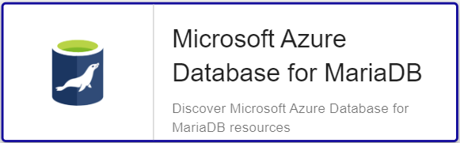

import Tabs from '@theme/Tabs';
import TabItem from '@theme/TabItem';


## Contenu du Pack

### Modèles

Le Plugin Pack Centreon **Azure Database for MariaDB** apporte un modèle d'hôte :

* Cloud-Azure-Database-MariaDB-custom

Il apporte les modèles de service suivants :

| Alias          | Modèle de service                               | Description                                                                      | Défaut |
|:---------------|:------------------------------------------------|:---------------------------------------------------------------------------------|:-------|
| Connections    | Cloud-Azure-Database-MariaDB-Connections-Api    | Contrôle les statistiques de connexions de l'instance Azure Database for MariaDB | X      |
| Cpu            | Cloud-Azure-Database-MariaDB-Cpu-Api            | Contrôle le CPU de l'instance Azure Database for MariaDB                         | X      |
| IO-Consumption | Cloud-Azure-Database-MariaDB-IO-Consumption-Api | Contrôle les écritures                                                           | X      |
| Memory         | Cloud-Azure-Database-MariaDB-Memory-Api         | Contrôle l'utilisation de la mémoire de l'instance Azure Database for MariaDB    | X      |
| Replication    | Cloud-Azure-Database-MariaDB-Replication-Api    | Contrôle la réplication de l'instance Azure Database for MariaDB                 | X      |
| Storage        | Cloud-Azure-Database-MariaDB-Storage-Api        | Contrôle les statistiques de stockage de l'instance Azure Database for MariaDB   | X      |
| Traffic        | Cloud-Azure-Database-MariaDB-Traffic-Api        | Contrôle l'utilisation du réseau de l'instance Azure Database for MariaDB        | X      |

### Règles de découverte

Le Plugin Pack Centreon **Azure Database for MariaDB** inclut un fournisseur de découverte
d'hôtes nommé **Microsoft Azure Database for MariaDBs**. Celui-ci permet de découvrir l'ensemble des instances
rattachées à une souscription Microsoft Azure donnée:



> La découverte **Azure Database for MariaDB** n'est compatible qu'avec le mode **api**. Le mode **azcli** n'est pas supporté dans le cadre
> de cette utilisation.

Rendez-vous sur la [documentation dédiée](/docs/monitoring/discovery/hosts-discovery)
pour en savoir plus sur la découverte automatique d'hôtes.

### Métriques & statuts collectés

<Tabs groupId="sync">
<TabItem value="Connections" label="Connections">

| Métrique                           | Unité |
|:-----------------------------------|:------|
| azmariadb.connections.active.count |       |
| azmariadb.connections.failed.count |       |

</TabItem>
<TabItem value="Cpu" label="Cpu">

| Métrique                             | Unité |
|:-------------------------------------|:------|
| azmariadb.cpu.utilization.percentage | %     |

</TabItem>
<TabItem value="IO-Consumption" label="IO-Consumption">

| Métrique                                 | Unité |
|:-----------------------------------------|:------|
| azmariadb.ioconsumption.usage.percentage | %     |

</TabItem>
<TabItem value="Memory" label="Memory">

| Métrique                          | Unité |
|:----------------------------------|:------|
| azmariadb.memory.usage.percentage | %     |

</TabItem>
<TabItem value="Replication" label="Replication">

| Métrique                        | Unité |
|:--------------------------------|:------|
| azmariadb.slave.latency.seconds |       |

</TabItem>
<TabItem value="Storage" label="Storage">

| Métrique                                     | Unité |
|:---------------------------------------------|:------|
| azmariadb.storage.serverlog.limit.bytes      | B     |
| azmariadb.storage.serverlog.usage.percentage | %     |
| azmariadb.storage.serverlog.usage.bytes      | B     |
| azmariadb.storage.backup.usage.bytes         | B     |
| azmariadb.storage.limit.bytes                | B     |
| azmariadb.storage.usage.percentage           | %     |
| azmariadb.storage.usage.bytes                | B     |

</TabItem>
<TabItem value="Traffic" label="Traffic">

| Métrique                    | Unité |
|:----------------------------|:------|
| azmariadb.traffic.in.bytes  | B     |
| azmariadb.traffic.out.bytes | B     |

</TabItem>
</Tabs>

## Prérequis

Rendez-vous sur la [documentation dédiée](../getting-started/how-to-guides/azure-credential-configuration.md) afin d'obtenir les prérequis nécessaires pour interroger les API d'Azure.

## Installation

<Tabs groupId="sync">
<TabItem value="Online License" label="Online License">

1. Installez le plugin sur tous les collecteurs Centreon devant superviser des ressources **Azure Database MariaDB** :

```bash
yum install centreon-plugin-Cloud-Azure-Database-MariaDB-Api
```

2. Sur l'interface web de Centreon, installez le Plugin Pack **Azure Database for MariaDB** depuis la page **Configuration > Packs de plugins**.

</TabItem>
<TabItem value="Offline License" label="Offline License">

1. Installez le plugin sur tous les collecteurs Centreon devant superviser des ressources **Azure Database MariaDB** :

```bash
yum install centreon-plugin-Cloud-Azure-Database-MariaDB-Api
```

2. Sur le serveur central Centreon, installez le RPM du Plugin Pack **Azure Database for MariaDB** :

```bash
yum install centreon-pack-cloud-azure-database-mariadb
```

3. Sur l'interface web de Centreon, installez le Plugin Pack **Azure Database for MariaDB** depuis la page **Configuration > Packs de plugins**.

</TabItem>
</Tabs>

## Configuration

### hôte

* Ajoutez un hôte à Centreon depuis la page **Configuration > Hôtes**.
* Remplissez le champ **Adresse IP/DNS** avec l'adresse **127.0.0.1**.
* Appliquez le modèle d'hôte **Cloud-Azure-Database-MariaDB-custom**.
* Une fois le modèle appliqué, renseignez les macros correspondantes. Attention, certaines macros sont obligatoires. Elles doivent être renseignées selon le *custom mode* utilisé.

> Deux méthodes peuvent être utilisées lors de l'assignation des macros :

>
> * Utilisation de l'ID complet de la ressource (de type `/subscriptions/<subscription_id>/resourceGroups/<resourcegroup_id>/providers/XXXXXX/XXXXXXX/<resource_name>`) dans la macro *AZURERESOURCE*.
> * Utilisation du nom de la ressource dans la macro **AZURERESOURCE** et du nom du groupe de ressources dans la macro **AZURERESOURCEGROUP**.

<Tabs groupId="sync">
<TabItem value="Azure Monitor API" label="Azure Monitor API">

| Obligatoire | Macro              | Description                                       |
|:------------|:-------------------|:--------------------------------------------------|
| X           | AZUREAPICUSTOMMODE | Custom mode **api**                               |
| X           | AZURECLIENTID      | Client ID                                         |
| X           | AZURECLIENTSECRET  | Client secret                                     |
| X           | AZURERESOURCE      | ID or name of the Azure Database MariaDB resource |
|             | AZURERESOURCEGROUP | Resource group name if resource name is used      |
| X           | AZURESUBSCRIPTION  | Subscription ID                                   |
| X           | AZURETENANT        | Tenant ID                                         |

</TabItem>
<TabItem value="Azure AZ CLI" label="Azure AZ CLI">

| Obligatoire | Macro              | Description                                       |
|:------------|:-------------------|:--------------------------------------------------|
| X           | AZURECLICUSTOMMODE | Custom mode **azcli**                             |
| X           | AZURERESOURCE      | ID or name of the Azure Database MariaDB resource |
|             | AZURERESOURCEGROUP | Resource group name if resource name is used      |
| X           | AZURESUBSCRIPTION  | Subscription ID                                   |

</TabItem>
</Tabs>

## Comment puis-je tester le plugin et que signifient les options des commandes ?

Une fois le plugin installé, vous pouvez tester celui-ci directement en ligne
de commande depuis votre collecteur Centreon en vous connectant avec
l'utilisateur **centreon-engine** (`su - centreon-engine`) :

```bash
/usr/lib/centreon/plugins//centreon_azure_database_mariadb_api.pl \
    --plugin=cloud::azure::database::mariadb::plugin \
    --mode=storage \
    --custommode='api' \
    --resource='/mysubscriptionid/' \
    --resource-group='' \
    --subscription='xxx' \
    --tenant='xxx' \
    --client-id='xxx' \
    --client-secret='xxx' \
    --proxyurl='' \
    --filter-metric='' \
    --filter-dimension='' \
    --timeframe='900' \
    --interval='PT5M' \
    --aggregation='Average' \
    --warning-serverlog-percent='' \
    --critical-serverlog-percent='' \
    --warning-storage-percent='' \
    --critical-storage-percent='' \
    --warning-storage-backup='' \
    --critical-storage-backup='' \
    --warning-storage-used='' \
    --critical-storage-used='' \
    --warning-storage-limit='' \
    --critical-storage-limit='' \
    --warning-serverlog-usage='' \
    --critical-serverlog-usage='' \
    --warning-serverlog-limit='' \
    --critical-serverlog-limit='' \
    --use-new-perfdata
```

La commande devrait retourner un message de sortie similaire à :

```bash
OK: Instance 'myresource' Statistic 'maximum' Metrics Server Log storage percent: 0.00%, Storage Percent: 14.41%, Backup Storage used: 28.90GB, Storage Used: 21.62GB, Storage Limit: 150.00GB, Server Log storage used: 0.00B, Server Log storage limit: 7.00GB | 'myresource~maximum#azmariadb.storage.serverlog.usage.percentage'=0.00%;;;0; 'myresource~maximum#azmariadb.storage.usage.percentage'=14.41%;;;0; 'myresource~maximum#azmariadb.storage.backup.usage.bytes'=31029043513.00B;;;0; 'myresource~maximum#azmariadb.storage.usage.bytes'=23212425216.00B;;;0; 'myresource~maximum#azmariadb.storage.limit.bytes'=161061273600.00B;;;0; 'myresource~maximum#azmariadb.storage.serverlog.usage.bytes'=0.00B;;;0; 'myresource~maximum#azmariadb.storage.serverlog.limit.bytes'=7516192768.00B;;;0;
```

La liste de toutes les options complémentaires et leur signification peut être
affichée en ajoutant le paramètre `--help` à la commande :

```bash
/usr/lib/centreon/plugins//centreon_azure_database_mariadb_api.pl \
    --plugin=cloud::azure::database::mariadb::plugin \
    --mode=storage \
    --help
```

Tous les modes disponibles peuvent être affichés en ajoutant le paramètre
`--list-mode` à la commande :

```bash
/usr/lib/centreon/plugins//centreon_azure_database_mariadb_api.pl \
    --plugin=cloud::azure::database::mariadb::plugin \
    --list-mode
```

### Diagnostic des erreurs communes

Rendez-vous sur la [documentation dédiée](../getting-started/how-to-guides/troubleshooting-plugins.md#http-and-api-checks)
des plugins basés sur HTTP/API.