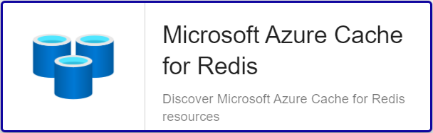

import Tabs from '@theme/Tabs';
import TabItem from '@theme/TabItem';


## Vue d'ensemble

Azure Cache pour Redis fournit un magasin de données en mémoire basé sur le logiciel Redis. Redis améliore les performances et l’extensibilité d’une
application qui utilise abondamment les magasins de données principaux. Il peut traiter des volumes conséquents de demandes d’applications en conservant
les données fréquemment utilisées dans la mémoire du serveur, qui peut être écrite et lue rapidement. Redis constitue une solution de stockage de
données à faible latence et à haut débit critique pour les applications modernes. 

Le connecteur de supervision Centreon *Azure Cache for Redis* s'appuie sur les API Azure Monitor afin de récuperer les métriques relatives au service
Cosmos DB. Il est possible d'utiliser les 2 modes proposés par Microsoft: RestAPI ou Azure CLI.

## Contenu du Pack

### Objets supervisés

* Instances Azure *Cache for Redis*
    * Cache-Latency
    * Cache-Throughput
    * Cache-Usage
    * Clients
    * Cpu
    * Discovery
    * Errors
    * Health
    * Load
    * Memory
    * Operations

### Règles de découverte

Le connecteur de supervision Centreon *Azure Cache for Redis* inclut un *provider* de découverte d'Hôtes nommé **Microsoft Azure Cache for Redis**.
Celui-ci permet de découvrir l'ensemble des comptes *Cosmos DB* rattachés à une *souscription* Microsoft Azure donnée:



> La découverte *Azure Cache for Redis* n'est compatible qu'avec le mode 'api'. Le mode 'azcli' n'est pas supporté dans le cadre
> de cette utilisation. 

Vous trouverez plus d'informations sur la découverte d'Hôtes et son fonctionnement sur la documentation du module:
[Découverte des hôtes](/onprem/monitoring/discovery/hosts-discovery)

### Métriques & statuts collectés 

<Tabs groupId="sync">
<TabItem value="Cache-Latency" label="Cache-Latency">

| Metric Name                      | Description   | Unit |
|:---------------------------------|:--------------|:-----|
| redis.cache.latency.microseconds | Cache Latency | μs   |

</TabItem>
<TabItem value="Cache-Throughput" label="Cache-Throughput">

| Metric Name                                 | Description            | Unit |
|:--------------------------------------------|:-----------------------|:-----|
| redis.cache.read.throughput.bytespersecond  | Cache Read Throughput  | B/s  |
| redis.cache.write.throughput.bytespersecond | Cache Write Throughput | B/s  |

</TabItem>
<TabItem value="Cache-Usage" label="Cache-Usage">

| Metric Name              | Description  | Unit  |
|:-------------------------|:-------------|:------|
| redis.cache.hits.count   | Cache Hits   | Count |
| redis.cache.misses.count | Cache Misses | Count |

</TabItem>
<TabItem value="Clients" label="Clients">

| Metric Name                         | Description       | Unit  |
|:------------------------------------|:------------------|:------|
| redis.cache.clients.connected.count | Connected Clients | Count |

</TabItem>
<TabItem value="Cpu" label="Cpu">

| Metric Name                      | Description          | Unit |
|:---------------------------------|:---------------------|:-----|
| redis.cache.cpu.usage.percentage | CPU Usage Percentage | %    |

</TabItem>
<TabItem value="Errors" label="Errors">

| Metric Name              | Description | Unit  |
|:-------------------------|:------------|:------|
| redis.cache.errors.count | Errors      | Count |

</TabItem>
<TabItem value="Health" label="Health">

| Status Name | Description                 |
|:------------|:----------------------------|
| status      | Current operational status  |
| summary     | Last related status message |

</TabItem>
<TabItem value="Load" label="Load">

| Metric Name                        | Description | Unit |
|:-----------------------------------|:------------|:-----|
| redis.cache.server.load.percentage | Server Load | %    |

</TabItem>
<TabItem value="Memory" label="Memory">

| Metric Name                         | Description             | Unit |
|:------------------------------------|:------------------------|:-----|
| redis.cache.memory.usage.percentage | Memory Usage Percentage | %    |

</TabItem>
<TabItem value="Operations" label="Operations">

| Metric Name                      | Description            | Unit |
|:---------------------------------|:-----------------------|:-----|
| redis.cache.operations.persecond | Operations per seconds | op/s |

</TabItem>
</Tabs>

## Prérequis

Rendez-vous sur la [documentation dédiée](../getting-started/how-to-guides/azure-credential-configuration.md) afin d'obtenir les prérequis nécessaires pour interroger les API d'Azure.

## Installation 

<Tabs groupId="sync">
<TabItem value="Online License" label="Online License">

1. Installer le Plugin sur tous les collecteurs Centreon devant superviser des resources Azure Cache for Redis:

```bash
yum install centreon-plugin-Cloud-Azure-Database-Redis-Api
```

2. Sur l'interface Integration de Centreon, installer le connecteur de supervision *Azure Cache for Redis* depuis la page **Configuration > Gestionnaire de connecteurs de supervision**

</TabItem>
<TabItem value="Offline License" label="Offline License">

1. Installer le Plugin sur tous les collecteurs Centreon devant superviser des resources Azure Cache for Redis:

```bash
yum install centreon-plugin-Cloud-Azure-Database-Redis-Api
```

2. Sur le serveur Central Centreon, installer le RPM du Pack *Azure Cache for Redis*:

```bash
yum install centreon-pack-cloud-azure-database-redis.noarch
```

3. Sur l'interface Integration de Centreon, installer le connecteur de supervision *Azure Cache for Redis* depuis la page **Configuration > Gestionnaire de connecteurs de supervision**

</TabItem>
</Tabs>

## Configuration

### Hôte

* Ajoutez un Hôte à Centreon, remplissez le champ *Adresse IP/DNS* avec l'adresse 127.0.0.1 
et appliquez-lui le Modèle d'Hôte *Cloud-Azure-Database-Redis-custom*.
* Une fois le modèle appliqué, les Macros ci-dessous indiquées comme requises (*Mandatory*) 
doivent être renseignées selon le *custom mode* utilisé.

> Deux méthodes peuvent être utilisées lors de l'assignation des Macros:
> * Utilisation de l'ID complet de la ressource (de type ```/subscriptions/<subscription_id>/resourceGroups/<resourcegroup_id>/providers/Microsoft.DocumentDB/databaseAccounts/<resource_name>```)
dans la Macro *AZURERESOURCE*
> * Utilisation du nom de la ressource dans la Macro *AZURERESOURCE* associée aux Macros *AZURERESOURCEGROUP* et *AZURERESOURCETYPE*

<Tabs groupId="sync">
<TabItem value="Azure Monitor API" label="Azure Monitor API">

| Mandatory | Nom                | Description                                        |
|:----------|:-------------------|:---------------------------------------------------|
| X         | AZURECUSTOMMODE    | Custom mode 'api'                                  |
| X         | AZURESUBSCRIPTION  | Subscription ID                                    |
| X         | AZURETENANT        | Tenant ID                                          |
| X         | AZURECLIENTID      | Client ID                                          |
| X         | AZURECLIENTSECRET  | Client secret                                      |
| X         | AZURERESOURCE      | ID or name of the Redis resource                   |
|           | AZURERESOURCEGROUP | Associated Resource Group if resource name is used |
|           | AZURERESOURCETYPE  | Associated Resource Type if resource name is used  |

</TabItem>
<TabItem value="Azure AZ CLI" label="Azure AZ CLI">

| Mandatory | Nom                | Description                                        |
|:----------|:-------------------|:---------------------------------------------------|
| X         | AZURECUSTOMMODE    | Custom mode 'azcli'                                |
| X         | AZURESUBSCRIPTION  | Subscription ID                                    |
| X         | AZURERESOURCE      | ID or name of the Redis resource                   |
|           | AZURERESOURCEGROUP | Associated Resource Group if resource name is used |
|           | AZURERESOURCETYPE  | Associated Resource Type if resource name is used  |

</TabItem>
</Tabs>

## Comment puis-je tester le Plugin et que signifient les options des commandes ?

Une fois le Plugin installé, vous pouvez tester celui-ci directement en ligne de commande depuis votre collecteur Centreon en
vous connectant avec l'utilisateur *centreon-engine*:

```bash
/usr/lib/centreon/plugins/centreon_azure_database_redis_api.pl \
    --plugin=cloud::azure::database::redis::plugin \
    --mode=cache-latency \
    --custommode=api \
    --subscription='xxxxxxxxx' \
    --tenant='xxxxxxxxx' \
    --client-id='xxxxxxxxx' \
    --client-secret='xxxxxxxxx' \
    --resource='REDIS001ABCD' \
    --resource-group='RSG1234' \
    --timeframe='900' \
    --interval='PT5M' \
    --aggregation='Average' \
    --warning-cache-latency='8000' \
    --critical-cache-latency='9000'
```

La commande devrait retourner un message de sortie similaire à:

```bash
OK: Instance 'REDIS001ABCD' Statistic 'average' Metrics Cache Latency: 1206.15μs | 'REDIS001ABCD~average#redis.cache.latency.microseconds'=1206.15μs;;;0;
```

La commande ci-dessus vérifie les statistiques de *latence du cache* de l'instance *Azure Cache for Redis* nommée *REDIS001ABCD*
(```--plugin=cloud::azure::database::redis::plugin --mode=cache-latency --resource='REDIS001ABCD'```) et lié au *Resource Group* *RSG1234*
(```--resource-group='RSG1234'```).

Le mode de connexion utilisé est 'api' (```--custommode=api```), les paramètres d'authentification nécessaires à l'utilisation de ce mode
sont donc renseignés en fonction (```--subscription='xxxxxxxxx' --tenant='xxxxxxx' --client-id='xxxxxxxx' --client-secret='xxxxxxxxxx'```).

Les statuts caculés se baseront sur les valeurs moyennes (```--aggregation='Average'```) d'un échantillon dans un intervalle de
15 minutes / 900 secondes  (```--timeframe='900'```) avec un état retourné par tranche de 5 minutes (```--interval='PT5M'```).

Dans cet exemple, une alarme de type WARNING sera déclenchée si la *latence du cache* constatée pendant l'intervalle donné
est supérieure à 8000µs (```--warning-cache-latency='8000'```); l'alarme sera de type CRITICAL au-delà de 9000µs 
(```--critical-cache-latency='9000'```).

La liste de toutes les options complémentaires et leur signification peut être affichée en ajoutant le paramètre ```--help```
à la commande:

```bash
/usr/lib/centreon/plugins/centreon_azure_database_redis_api.pl \
    --plugin=cloud::azure::database::redis::plugin \
    --mode=cache-latency \
    --help
```

### Diagnostic des erreurs communes  

#### Les identifiants ont changé et mon Plugin ne fonctionne plus

Le Plugin utilise un fichier de cache pour conserver les informations de connexion afin de ne pas 
se ré-authentifier à chaque appel. Si des informations sur le Tenant, la Souscription ou les 
Client ID / Secret changent, il est nécessaire de supprimer le fichier de cache du Plugin. 

Celui ci se trouve dans le répertoire ```/var/lib/centreon/centplugins/``` avec le nom azure_api_`<md5>_<md5>_<md5>_<md5>`.

#### ```UNKNOWN: Login endpoint API returns error code 'ERROR_NAME' (add --debug option for detailed message)```

Cette erreur signifie que l'un des paramètres utilisés pour authentifier la requête est incorrect. Le paramètre 
en question est spécifié dans le message d'erreur en lieu et place de 'ERROR_DESC'. 

Par exemple, 'invalid_client' signifie que le client-id et/ou le client-secret
n'est (ne sont) pas valide(s).

#### ```UNKNOWN: 500 Can't connect to login.microsoftonline.com:443```

Si l'utilisation d'un proxy est requise pour les connexions HTTP depuis le 
collecteur Centreon, il est nécessaire de le préciser dans la commande en
utilisant l'option ```--proxyurl='http://proxy.mycompany.com:8080'```.

Il est également possible qu'un équipement tiers de type Pare-feu bloque la requête
effectuée par le Plugin.

#### ```UNKNOWN: No metrics. Check your options or use --zeroed option to set 0 on undefined values```

Lors du déploiement de mes contrôles, j'obtiens le message suivant 'UNKNOWN: No metrics. Check your options or use --zeroed option to set 0 on undefined values'. 

Cela signifie qu'Azure n'a pas consolidé de données sur la période.

Vous pouvez ajouter ```--zeroed``` à la macro EXTRAOPTIONS du **service** en question afin de forcer le stockage d'un 0 et ainsi éviter un statut UNKNOWN.