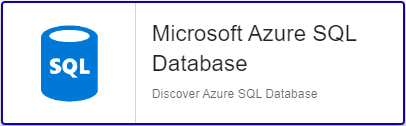

import Tabs from '@theme/Tabs';
import TabItem from '@theme/TabItem';


## Contenu du Pack

### Modèles

Le Plugin Pack Centreon **Azure SQL Database** apporte un modèle d'hôte :

* Cloud-Azure-Database-SqlDatabase-custom

Il apporte les modèles de service suivants :

| Alias         | Modèle de service                              | Description                                     | Défaut |
|:--------------|:-----------------------------------------------|:------------------------------------------------|:-------|
| App-Resources | Cloud-Azure-Database-SqlDatabase-App-Resources | Contrôle les métriques CPU et Mémoire de l'App  |        |
| Connections   | Cloud-Azure-Database-SqlDatabase-Connections   | Contrôle le nombre de connexion par statut      |        |
| Deadlocks     | Cloud-Azure-Database-SqlDatabase-Deadlocks     | Contrôle la présence de deadlocks               |        |
| Health        | Cloud-Azure-Database-SqlDatabase-Health        | Contrôle le statut associé à la base de données | X      |
| Sessions      | Cloud-Azure-Database-SqlDatabase-Sessions      | Contrôle le nombre de sessions utilisées        |        |
| Storage       | Cloud-Azure-Database-SqlDatabase-Storage       | Contrôle la taille de la base                   |        |
| Workers       | Cloud-Azure-Database-SqlDatabase-Workers       | Contrôle le nombre de workers                   |        |

### Règles de découverte

Le Plugin Pack Centreon **Azure SQL Database** inclut un fournisseur de découverte
d'hôtes nommé **Microsoft Azure SQL Databases**. Celui-ci permet de découvrir l'ensemble des instances
rattachées à une souscription Microsoft Azure donnée:



> La découverte **Azure SQL Database** n'est compatible qu'avec le mode **api**. Le mode **azcli** n'est pas supporté dans le cadre
> de cette utilisation.

Rendez-vous sur la [documentation dédiée](/docs/monitoring/discovery/hosts-discovery)
pour en savoir plus sur la découverte automatique d'hôtes.

### Métriques & statuts collectés

<Tabs groupId="sync">
<TabItem value="App-Resources" label="App-Resources">

| Métrique                                     | Unité |
|:---------------------------------------------|:------|
| sqldatabase.serverless.app.cpu.percentage    | %     |
| sqldatabase.serverless.app.memory.percentage | %     |

</TabItem>
<TabItem value="Connections" label="Connections">

| Métrique                                | Unité |
|:----------------------------------------|:------|
| sqldatabase.connection.blocked.count    |       |
| sqldatabase.connection.failed.count     |       |
| sqldatabase.connection.successful.count |       |

</TabItem>
<TabItem value="Deadlocks" label="Deadlocks">

| Métrique                    | Unité |
|:----------------------------|:------|
| sqldatabase.deadlocks.count |       |

</TabItem>
<TabItem value="Health" label="Health">

| Status Name | Description                 |
|:------------|:----------------------------|
| status      | Current operational status  |
| summary     | Last related status message |

</TabItem>
<TabItem value="Sessions" label="Sessions">

| Métrique                   | Unité |
|:---------------------------|:------|
| sqldatabase.sessions.count |       |

</TabItem>
<TabItem value="Storage" label="Storage">

| Métrique                                   | Unité |
|:-------------------------------------------|:------|
| sqldatabase.storage.space.usage.bytes      | B     |
| sqldatabase.storage.space.usage.percentage | %     |

</TabItem>
<TabItem value="Workers" label="Workers">

| Métrique                  | Unité |
|:--------------------------|:------|
| sqldatabase.workers.count |       |

</TabItem>
</Tabs>

## Prérequis

Rendez-vous sur la [documentation dédiée](../getting-started/how-to-guides/azure-credential-configuration.md) afin d'obtenir les prérequis nécessaires pour interroger les API d'Azure.

## Installation

<Tabs groupId="sync">
<TabItem value="Online License" label="Online License">

1. Installez le plugin sur tous les collecteurs Centreon devant superviser des ressources **Azure SQL Database** :

```bash
yum install centreon-plugin-Cloud-Azure-Database-SqlDatabase-Api
```

2. Sur l'interface web de Centreon, installez le Plugin Pack **Azure SQL Database** depuis la page **Configuration > Packs de plugins**.

</TabItem>
<TabItem value="Offline License" label="Offline License">

1. Installez le plugin sur tous les collecteurs Centreon devant superviser des ressources **Azure SQL Database** :

```bash
yum install centreon-plugin-Cloud-Azure-Database-SqlDatabase-Api
```

2. Sur le serveur central Centreon, installez le RPM du Plugin Pack **Azure SQL Database** :

```bash
yum install centreon-pack-cloud-azure-database-sqldatabase
```

3. Sur l'interface web de Centreon, installez le Plugin Pack **Azure SQL Database** depuis la page **Configuration > Packs de plugins**.

</TabItem>
</Tabs>

## Configuration

### hôte

* Ajoutez un hôte à Centreon depuis la page **Configuration > Hôtes**.
* Remplissez le champ **Adresse IP/DNS** avec l'adresse **127.0.0.1**.
* Appliquez le modèle d'hôte **Cloud-Azure-Database-SqlDatabase-custom**.
* Une fois le modèle appliqué, renseignez les macros correspondantes. Attention, certaines macros sont obligatoires. Elles doivent être renseignées selon le *custom mode* utilisé.

> Deux méthodes peuvent être utilisées lors de l'assignation des macros :

>
> * Utilisation de l'ID complet de la ressource (de type `/subscriptions/<subscription_id>/resourceGroups/<resourcegroup_id>/providers/XXXXXX/XXXXXXX/<resource_name>`) dans la macro *AZURERESOURCE*.
> * Utilisation du nom de la ressource dans la macro **AZURERESOURCE** et du nom du groupe de ressources dans la macro **AZURERESOURCEGROUP**.

<Tabs groupId="sync">
<TabItem value="Azure Monitor API" label="Azure Monitor API">

| Obligatoire | Macro              | Description                                   |
|:------------|:-------------------|:----------------------------------------------|
|     x       | AZUREAPICUSTOMMODE | Custom mode **api**                           |
|     x       | AZURECLIENTID      | Client ID                                     |
|     x       | AZURECLIENTSECRET  | Client secret                                 |
|     x       | AZURERESOURCE      | ID or name of the Azure SQL Database resource |
|             | AZURERESOURCEGROUP | Resource group name if resource name is used  |
|     x       | AZURESUBSCRIPTION  | Subscription ID                               |
|     x       | AZURETENANT        | Tenant ID                                     |

</TabItem>
<TabItem value="Azure AZ CLI" label="Azure AZ CLI">

| Obligatoire | Macro              | Description                                   |
|:------------|:-------------------|:----------------------------------------------|
|     x       | AZURECLICUSTOMMODE | Custom mode **azcli**                         |
|     x       | AZURERESOURCE      | ID or name of the Azure SQL Database resource |
|     x       | AZURERESOURCEGROUP | Resource group name if resource name is used  |
|     x       | AZURESUBSCRIPTION  | Subscription ID                               |

</TabItem>
</Tabs>

## Comment puis-je tester le plugin et que signifient les options des commandes ?

Une fois le plugin installé, vous pouvez tester celui-ci directement en ligne
de commande depuis votre collecteur Centreon en vous connectant avec
l'utilisateur **centreon-engine** (`su - centreon-engine`) :

```bash
/usr/lib/centreon/plugins//centreon_azure_database_sqldatabase_api.pl \
    --plugin=cloud::azure::database::sqldatabase::plugin \
    --mode=deadlocks \
    --custommode='api' \
    --resource='SQLDB001A' \
    --resource-group='RSG1234' \
    --subscription='xxxxxxxxx' \
    --tenant='xxxxxxxxx' \
    --client-id='xxxxxxxxx' \
    --client-secret='xxxxxxxxx' \
    --proxyurl=''  \
    --warning-deadlocks='' \
    --critical-deadlocks='' \
    --use-new-perfdata
```

La commande devrait retourner un message de sortie similaire à :

```bash
OK: Deadlocks: 0  | 'sqldatabase.deadlocks.count'=0;;;0; 
```

La liste de toutes les options complémentaires et leur signification peut être
affichée en ajoutant le paramètre `--help` à la commande :

```bash
/usr/lib/centreon/plugins//centreon_azure_database_sqldatabase_api.pl \
    --plugin=cloud::azure::database::sqldatabase::plugin \
    --mode=deadlocks \
    --help
```

Tous les modes disponibles peuvent être affichés en ajoutant le paramètre
`--list-mode` à la commande :

```bash
/usr/lib/centreon/plugins//centreon_azure_database_sqldatabase_api.pl \
    --plugin=cloud::azure::database::sqldatabase::plugin \
    --list-mode
```

### Diagnostic des erreurs communes

Rendez-vous sur la [documentation dédiée](../getting-started/how-to-guides/troubleshooting-plugins.md#http-and-api-checks)
des plugins basés sur HTTP/API.