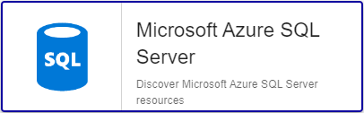

import Tabs from '@theme/Tabs';
import TabItem from '@theme/TabItem';


## Contenu du Pack

### Modèles

Le connecteur de supervision Centreon **Azure SQL Server** apporte un modèle d'hôte :

* Cloud-Azure-Database-SqlServer-custom

Il apporte le modèle de service suivant :

| Alias         | Modèle de service                                | Description                    | Défaut |
|:--------------|:-------------------------------------------------|:-------------------------------|:-------|
| Server-Status | Cloud-Azure-Database-SqlServer-Server-Status-Api | Contrôle l'état du serveur SQL | X      |

### Règles de découverte

Le connecteur de supervision Centreon **Azure SQL Server** inclut un fournisseur de découverte
d'hôtes nommé **Microsoft Azure SQL Servers**. Celui-ci permet de découvrir l'ensemble des instances
rattachées à une souscription Microsoft Azure donnée:



> La découverte **Azure SQL Server** n'est compatible qu'avec le mode **api**. Le mode **azcli** n'est pas supporté dans le cadre
> de cette utilisation.

Rendez-vous sur la [documentation dédiée](/onprem/monitoring/discovery/hosts-discovery)
pour en savoir plus sur la découverte automatique d'hôtes.

### Métriques & statuts collectés

<Tabs groupId="sync">
<TabItem value="Server-Status" label="Server-Status">

| Status Name | Description                 |
|:------------|:----------------------------|
| status      | Current operational status  |
| summary     | Last related status message |

</TabItem>
</Tabs>

## Prérequis

Rendez-vous sur la [documentation dédiée](../getting-started/how-to-guides/azure-credential-configuration.md) afin d'obtenir les prérequis nécessaires pour interroger les API d'Azure.

## Installation

<Tabs groupId="sync">
<TabItem value="Online License" label="Online License">

1. Installez le plugin sur tous les collecteurs Centreon devant superviser des ressources **Azure SQL Server** :

```bash
yum install centreon-plugin-Cloud-Azure-Database-SqlServer-Api
```

2. Sur l'interface web de Centreon, installez le connecteur de supervision **Azure SQL Server** depuis la page **Configuration > Packs de plugins**.

</TabItem>
<TabItem value="Offline License" label="Offline License">

1. Installez le plugin sur tous les collecteurs Centreon devant superviser des ressources **Azure SQL Server** :

```bash
yum install centreon-plugin-Cloud-Azure-Database-SqlServer-Api
```

2. Sur le serveur central Centreon, installez le RPM du connecteur de supervision **Azure SQL Server** :

```bash
yum install centreon-pack-cloud-azure-database-sqlserver
```

3. Sur l'interface web de Centreon, installez le connecteur de supervision **Azure SQL Server** depuis la page **Configuration > Packs de plugins**.

</TabItem>
</Tabs>

## Configuration

### Hôte

* Ajoutez un hôte à Centreon depuis la page **Configuration > Hôtes**.
* Remplissez le champ **Adresse IP/DNS** avec l'adresse **127.0.0.1**.
* Appliquez le modèle d'hôte **Cloud-Azure-Database-SqlServer-custom**.
* Une fois le modèle appliqué, renseignez les macros correspondantes. Attention, certaines macros sont obligatoires. Elles doivent être renseignées selon le *custom mode* utilisé.

> Deux méthodes peuvent être utilisées lors de l'assignation des macros :

>
> * Utilisation de l'ID complet de la ressource (de type `/subscriptions/<subscription_id>/resourceGroups/<resourcegroup_id>/providers/XXXXXX/XXXXXXX/<resource_name>`) dans la macro *AZURERESOURCE*.
> * Utilisation du nom de la ressource dans la macro **AZURERESOURCE** et du nom du groupe de ressources dans la macro **AZURERESOURCEGROUP**.

<Tabs groupId="sync">
<TabItem value="Azure Monitor API" label="Azure Monitor API">

| Obligatoire | Macro              | Description                                  |
|:------------|:-------------------|:---------------------------------------------|
|             | AZUREAPICUSTOMMODE | Custom mode **api**                          |
|             | AZURECLIENTID      | Client ID                                    |
|             | AZURECLIENTSECRET  | Client secret                                |
|             | AZURERESOURCE      | ID or name of the Azure SQL Server resource  |
|             | AZURERESOURCEGROUP | Resource group name if resource name is used |
|             | AZURESUBSCRIPTION  | Subscription ID                              |
|             | AZURETENANT        | Tenant ID                                    |

</TabItem>
<TabItem value="Azure AZ CLI" label="Azure AZ CLI">

| Obligatoire | Macro              | Description                                  |
|:------------|:-------------------|:---------------------------------------------|
|             | AZURECLICUSTOMMODE | Custom mode **azcli**                        |
|             | AZURERESOURCE      | ID or name of the Azure SQL Server resource  |
|             | AZURERESOURCEGROUP | Resource group name if resource name is used |
|             | AZURESUBSCRIPTION  | Subscription ID                              |

</TabItem>
</Tabs>

## Comment puis-je tester le plugin et que signifient les options des commandes ?

Une fois le plugin installé, vous pouvez tester celui-ci directement en ligne
de commande depuis votre collecteur Centreon en vous connectant avec
l'utilisateur **centreon-engine** (`su - centreon-engine`) :

```bash
/usr/lib/centreon/plugins//centreon_azure_database_sqlserver_api.pl \
    --plugin=cloud::azure::database::sqlserver::plugin \
    --mode=server-status \
    --resource='SQLSRV001ABCD' \
    --resource-group='RSG1234' \
    --custommode='api' \
    --subscription='xxxxxxxxx' \
    --tenant='xxxxxxxxx' \
    --client-id='xxxxxxxxx' \
    --client-secret='xxxxxxxxx' \
    --proxyurl='' \
    --location='' \
    --filter-name='' \
    --warning-status='' \
    --critical-status='%{state} ne "Ready"' \
```

La commande devrait retourner un message de sortie similaire à :

```bash
OK: Server 'SQLSRV001ABCD' State: '%s' [FQDN:'%s'] | 
```

La liste de toutes les options complémentaires et leur signification peut être
affichée en ajoutant le paramètre `--help` à la commande :

```bash
/usr/lib/centreon/plugins//centreon_azure_database_sqlserver_api.pl \
    --plugin=cloud::azure::database::sqlserver::plugin \
    --mode=server-status \
    --help
```

Tous les modes disponibles peuvent être affichés en ajoutant le paramètre
`--list-mode` à la commande :

```bash
/usr/lib/centreon/plugins//centreon_azure_database_sqlserver_api.pl \
    --plugin=cloud::azure::database::sqlserver::plugin \
    --list-mode
```

### Diagnostic des erreurs communes

Rendez-vous sur la [documentation dédiée](../getting-started/how-to-guides/troubleshooting-plugins.md#http-and-api-checks)
des plugins basés sur HTTP/API.