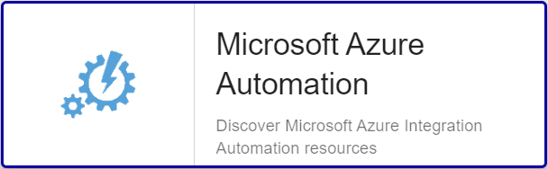

import Tabs from '@theme/Tabs';
import TabItem from '@theme/TabItem';


## Vue d'ensemble

Azure Automation offre un service d’automatisation et de configuration cloud 
prenant en charge une gestion cohérente de vos environnements Azure et 
non-Azure. Il comprend l’automatisation des processus, la gestion de la 
configuration, la gestion des mises à jour, les fonctionnalités partagées et les 
fonctionnalités hétérogènes. Azure Automation vous offre un contrôle complet 
lors du déploiement, des opérations et de la désaffectation des charges de 
travail et des ressources.

Le connecteur de supervision Centreon *Azure Automation* s'appuie sur les API Azure Monitor 
afin de récuperer les métriques relatives au service
Automation. Il est possible d'utiliser les 2 modes proposés par 
Microsoft: RestAPI ou Azure CLI.

## Contenu du connecteur de supervision

### Objets supervisés

* Instances Azure *Automation*

### Règles de découverte

Le connecteur de supervision Centreon *Azure Automation* inclut un *provider* de découverte d'Hôtes nommé **Microsoft Azure Automation**.
Celui-ci permet de découvrir l'ensemble des instances *Automation* rattachés à une *souscription* Microsoft Azure donnée:



> La découverte *Azure Automation* n'est compatible qu'avec le mode 'api'. Le mode 'azcli' n'est pas supporté dans le cadre
> de cette utilisation. 

Vous trouverez plus d'informations sur la découverte d'Hôtes et son fonctionnement sur la documentation du module:
[Découverte des hôtes](/onprem/monitoring/discovery/hosts-discovery)

### Métriques & statuts collectés 

<Tabs groupId="sync">
<TabItem value="Jobs" label="Jobs">

| Metric Name                        | Description                                    |
|:-----------------------------------|:-----------------------------------------------|
| automation.jobs.total.count        | Number of total jobs                           |
| automation.machineruns.total.count | Number of total update deployment machine runs |
| automation.runs.total.count        | Number of total Update deployment runs         |

</TabItem>
</Tabs>

## Prérequis

Rendez-vous sur la [documentation dédiée](../getting-started/how-to-guides/azure-credential-configuration.md) afin d'obtenir les prérequis nécessaires pour interroger les API d'Azure.

## Installation 

<Tabs groupId="sync">
<TabItem value="Online License" label="Online License">

1. Installer le Plugin sur tous les collecteurs Centreon devant superviser des resources Azure Automation:

```bash
yum install centreon-plugin-Cloud-Azure-Management-Automation-Api
```

2. Sur l'interface Integration de Centreon, installer le connecteur de supervision *Azure Automation* depuis la page **Configuration > Gestionnaire de connecteurs de supervision**

</TabItem>
<TabItem value="Offline License" label="Offline License">

1. Installer le Plugin sur tous les collecteurs Centreon devant superviser des resources Azure Automation:

```bash
yum install centreon-plugin-Cloud-Azure-Management-Automation-Api
```

2. Sur le serveur Central Centreon, installer le RPM du connecteur de supervision *Azure Automation*:

```bash
yum install centreon-pack-cloud-azure-management-automation.noarch
```

3. Sur l'interface Integration de Centreon, installer le connecteur de supervision *Azure Automation* depuis la page **Configuration > Gestionnaire de connecteurs de supervision**

</TabItem>
</Tabs>

## Configuration

### Hôte

* Ajoutez un Hôte à Centreon, remplissez le champ *Adresse IP/DNS* avec l'adresse 127.0.0.1 
et appliquez-lui le Modèle d'Hôte *Cloud-Azure-Management-Automation-custom*.
* Une fois le modèle appliqué, les Macros ci-dessous indiquées comme requises (*Mandatory*) 
doivent être renseignées selon le custom-mode utilisé:

<Tabs groupId="sync">
<TabItem value="Azure Monitor API" label="Azure Monitor API">

| Mandatory | Nom               | Description                   |
|:----------|:------------------|:------------------------------|
| X         | AZURECUSTOMMODE   | Custom mode 'api'             |
| X         | AZURESUBSCRIPTION | Subscription ID               |
| X         | AZURETENANT       | Tenant ID                     |
| X         | AZURECLIENTID     | Client ID                     |
| X         | AZURECLIENTSECRET | Client secret                 |
| X         | AZURERESOURCE     | Id of the Automation instance |

</TabItem>
<TabItem value="Azure AZ CLI" label="Azure AZ CLI">

| Mandatory | Nom               | Description                   |
|:----------|:------------------|:------------------------------|
| X         | AZURECUSTOMMODE   | Custom mode 'azcli'           |
| X         | AZURESUBSCRIPTION | Subscription ID               |
| X         | AZURERESOURCE     | Id of the Automation instance |

</TabItem>
</Tabs>

## FAQ

### Comment puis-je tester le Plugin et que signifient les options des commandes ?

Une fois le Plugin installé, vous pouvez tester celui-ci directement en ligne de
commande depuis votre collecteur Centreon en vous connectant avec l'utilisateur
*centreon-engine*:

```bash
/usr/lib/centreon/plugins/centreon_azure_management_automation_api.pl \
    --plugin=cloud::azure::management::automation::plugin \
    --mode=jobs \
    --custommode=api \
    --subscription='xxxxxxxxx' \
    --tenant='xxxxxxxxx' \
    --client-id='xxxxxxxxx' \
    --client-secret='xxxxxxxxx' \
    --resource='AUTOMATION01' \
    --resource-group='xxxxxxxxx' \
    --timeframe='900' \
    --interval='PT5M' \
    --aggregation='Total' \
    --warning-jobs-total='80' \
    --critical-jobs-total='90'
```

La commande devrait retourner un message de sortie similaire à:

```bash
OK: Instance 'AUTOMATION01' Statistic 'total' Metrics Total Update Deployment Runs: 0.00, Total Update Deployment Machine Runs: 0.00, Total Jobs: 0.00 | 'AUTOMATION01~total#automation.runs.total.count'=0.00;;;0; 'AUTOMATION01~total#automation.machineruns.total.count'=0.00;;;0; 'AUTOMATION01~total#automation.jobs.total.count'=0.00;0:80;0:90;0;
```

La commande ci-dessus vérifie les tâches sur l'instance *Automation* nommée *AUTOMATION01*
(```--plugin=cloud::azure::management::automation::plugin --mode=jobs --resource='AUTOMATION01'```).

Le mode de connexion utilisé est 'api' (```--custommode=api```), les paramètres d'authentification nécessaires à l'utilisation de ce mode
sont donc renseignés en fonction (```--subscription='xxxxxxxxx' --tenant='xxxxxxx' --client-id='xxxxxxxx' --client-secret='xxxxxxxxxx'```).

Les statuts caculés se baseront sur les valeurs totales d'un échantillon dans un intervalle de 15 minutes / 900 secondes  (```--timeframe='900'```) 
avec un état retourné par tranche de 5 minutes (```--interval='PT5M'```).

Dans cet exemple, une alarme de type WARNING sera déclenchée si le nombre de *total jobs* pendant l'intervalle donné
est supérieur à 80 (```--warning-jobs-total='80'```); l'alarme sera de type CRITICAL au-delà de 90 tâches
(```--critical-jobs-total='90'```).

La liste de toutes les options complémentaires et leur signification
peut être affichée en ajoutant le paramètre ```--help``` à la commande:

```bash
/usr/lib/centreon/plugins/centreon_azure_management_automation_api.pl \
    --plugin=cloud::azure::management::automation::plugin \
    --mode=jobs \
    --help
```

### Diagnostic des erreurs communes  

#### Les identifiants ont changé et mon Plugin ne fonctionne plus

Le Plugin utilise un fichier de cache pour conserver les informations de connexion afin de ne pas 
se ré-authentifier à chaque appel. Si des informations sur le Tenant, la Souscription ou les 
Client ID / Secret changent, il est nécessaire de supprimer le fichier de cache du Plugin. 

Celui ci se trouve dans le répertoire ```/var/lib/centreon/centplugins/``` avec le nom azure_api_`<md5>_<md5>_<md5>_<md5>`.

#### ```UNKNOWN: Login endpoint API returns error code 'ERROR_NAME' (add --debug option for detailed message)```

Lors du déploiement de mes contrôles, j'obtiens le message suivant : 
```UNKNOWN: Login endpoint API returns error code 'ERROR_NAME' (add --debug option for detailed message)```.

Cela signifie que l'un des paramètres utilisés pour authentifier la requête est incorrect. Le paramètre 
en question est spécifié dans le message d'erreur en lieu et place de 'ERROR_DESC'. 

Par exemple, 'invalid_client' signifie que le client-id et/ou le client-secret
n'est (ne sont) pas valide(s).

#### ```UNKNOWN: 500 Can't connect to login.microsoftonline.com:443```

Si l'utilisation d'un proxy est requise pour les connexions HTTP depuis le 
collecteur Centreon, il est nécessaire de le préciser dans la commande en
utilisant l'option ```--proxyurl='http://proxy.mycompany.com:8080'```.

Il est également possible qu'un équipement tiers de type Pare-feu bloque la requête
effectuée par le Plugin.

#### ```UNKNOWN: No metrics. Check your options or use --zeroed option to set 0 on undefined values```

Lors du déploiement de mes contrôles, j'obtiens le message suivant 'UNKNOWN: No metrics. Check your options or use --zeroed option to set 0 on undefined values'. 

Cela signifie qu'Azure n'a pas consolidé de données sur la période.

Vous pouvez ajouter ```--zeroed``` à la macro EXTRAOPTIONS du **service** en question afin de forcer le stockage d'un 0 et ainsi éviter un statut UNKNOWN.