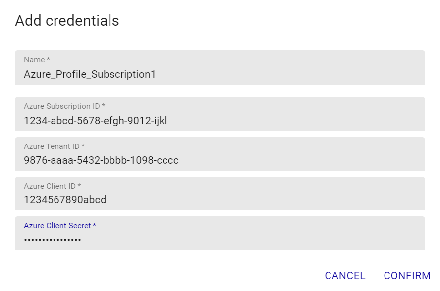
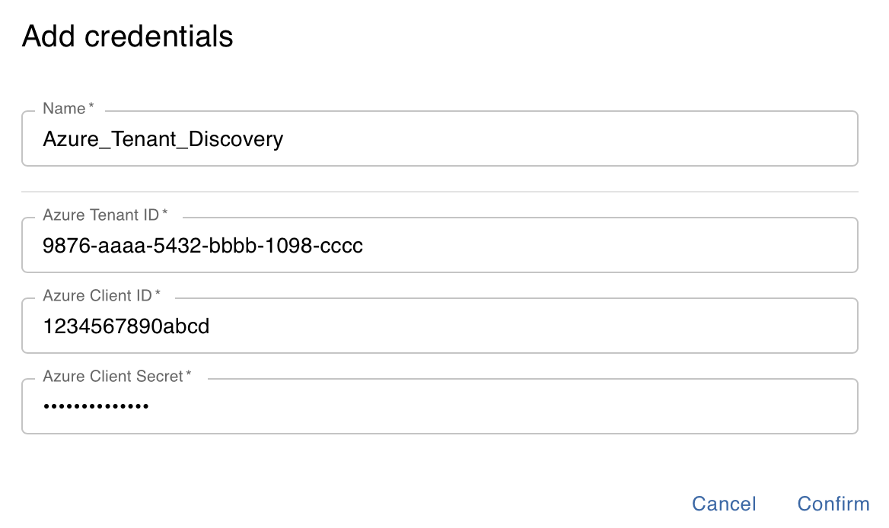
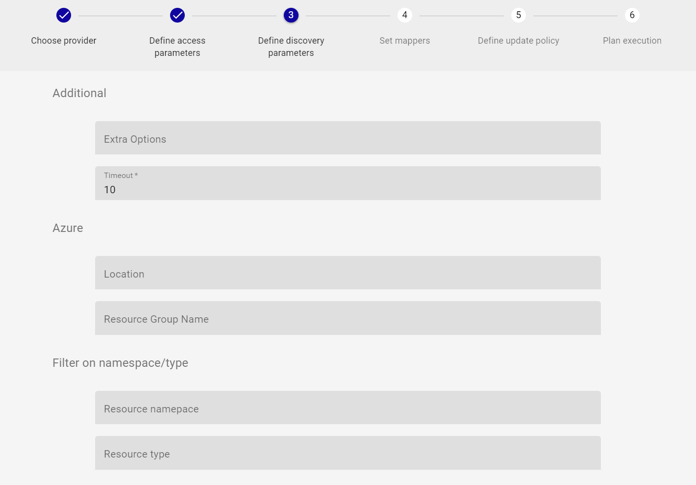
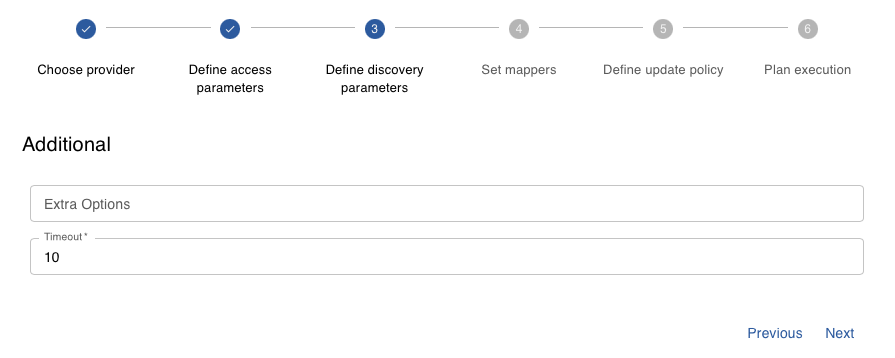
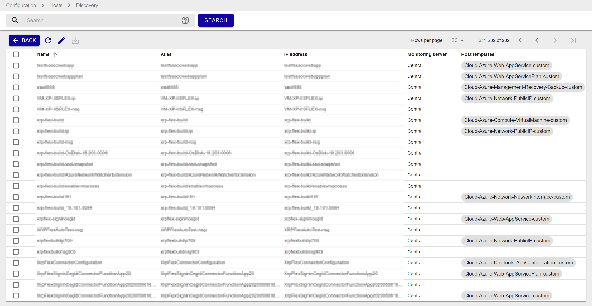

import Tabs from '@theme/Tabs';
import TabItem from '@theme/TabItem';


## Vue d'ensemble

Le connecteur de supervision Centreon *Azure Discover* permet de découvrir l'ensemble des resources Azure rattachées à une souscription ou un locataire donné.
Il s'appuie sur les API Azure Monitor afin de récuperer les éléments de l'infrastructure. Il s'appuie sur la collection des connecteur de supervision
afin de modéliser une infrastructure Azure dans Centreon

> Le connecteur de supervision Centreon *Azure Discover* est uniquement compatible avec le *custom-mode* 'api'.

## Contenu du connecteur de supervision

> Le connecteur de supervision *Azure Discover* est un pack de *découverte*. Il ne fournit pas de modèles ni d'indicateurs de supervision en propre.

### Règles de découverte

Le connecteur de supervision Centreon *Azure Discover* fournit deux *providers* de découverte d'Hôtes :
- **Microsoft Azure Management Discover** qui permet de découvrir l'ensemble des ressources Microsoft Azure rattachées à une *souscription* donnée.
- **Azure Tenant Discovery** qui permet de découvrir l'ensemble des ressources Microsoft Azure de chaque *souscription* rattachée au locataire donné.

> Ces règles de découverte sont uniquement compatibles avec le *custom-mode* 'api'.

Vous trouverez plus d'informations sur la découverte d'Hôtes et son fonctionnement sur la documentation du module:
[Découverte des hôtes](/docs/monitoring/discovery/hosts-discovery)

## Prérequis

Rendez-vous sur la [documentation dédiée](../getting-started/how-to-guides/azure-credential-configuration.md) afin d'obtenir les prérequis nécessaires pour interroger les API d'Azure.

## Configuration 

<Tabs groupId="sync">
<TabItem value="Online License" label="Online License">

1. Installez le Plugin sur chaque Centreon Poller censé découvrir les ressources Azure :

```bash
yum install centreon-plugin-Cloud-Azure-Management-Discover-Api
```

2. Sur l'interface Web de Centreon, installez le Azure Discover Centreon Plugin Pack sur la page "Configuration > Plugin Packs > Manager" Vous serez invité à installer plusieurs autres Azure Plugin Packs en dépendances (ils serviront à définir les bons templates/indicateurs sur les éléments découverts).


</TabItem>
<TabItem value="Offline License" label="Offline License">

1. Installez le Plugin sur chaque Centreon Poller censé découvrir les ressources Azure :

```bash
yum install centreon-plugin-Cloud-Azure-Management-Discover-Api
```

2. Installez le Centreon Plugin Pack RPM sur le serveur Centreon Central, installez tous les Centreon Plugin Packs pour Azure, afin de rendre toutes les dépendances disponibles :

```bash
yum install centreon-pack-cloud-azure\*
```

3. Sur l'interface Web de Centreon, installez le Azure Discover Centreon Plugin Pack sur la page "Configuration > Plugin Packs > Manager" Vous serez invité à installer plusieurs autres Azure Plugin Packs en dépendances (ils serviront à définir les bons templates/indicateurs sur les éléments découverts).


</TabItem>
</Tabs>

## Paramétrer une découverte

> Le descriptif du fonctionnement général de la fonctionnalité *Host Discovery* est disponible [ici](/docs/monitoring/discovery/hosts-discovery)

### Paramètres d'accès

Après avoir sélectionné le provider **Microsoft Azure Management Discover** ou **Azure Tenant Discovery**, renseignez les paramètres d'authentification ainsi que les options 
d'accès à l'API comme ci-après:


- Sélectionnez le **collecteur Centreon** depuis lequel sera lancé la découverte
- Renseignez les paramètres relatifs à l'utilisation d'un **proxy d'entreprise** si besoin
- Sélectionnez le **profil d'authentification Azure** à utiliser

Dans le cadre d'une première utilisation, vous pouvez créer un nouveau profil d'accès à Azure en cliquant sur '+'. Renseignez ensuite
les informations demandées comme ci-après:

<Tabs groupId="provider">
<TabItem value="Microsoft Azure Management Discover" label="Microsoft Azure Management Discover">



</TabItem>
<TabItem value="Azure Tenant Discovery" label="Azure Tenant Discovery">



</TabItem>
</Tabs>

> Tous les champs du formulaire *credentials* doivent être renseignés

Cliquez sur *confirm* puis sur *next* pour afficher la page des paramètres de la découverte.

### Paramètres de découverte

Renseignez si besoin les information ci-après:

<Tabs groupId="provider">
<TabItem value="Microsoft Azure Management Discover" label="Microsoft Azure Management Discover">



- Azure Location/Resource Group: permet de restreindre la découverte à une *location* ou un *resource group* donné
- Filter on namespace/type: permet de restreindre la découverte à un Service Azure spécifique, par exemple:
    - *Resource namespace*: 'Microsoft.Compute'
    - *Resource type*: 'virtualMachines'
    > ** Attention** : pour l'utilisation de ce filtre, les champs *Resource namepsace* et *Resource type* doivent dans ce cas être **tous les deux** renseignés

</TabItem>
<TabItem value="Azure Tenant Discovery" label="Azure Tenant Discovery">



</TabItem>
</Tabs>

> Tous les champs de ce formulaire sont facultatifs

### Lancement de la découverte et affichage des résultats

L'étape 4 permet d'ajuster les *mappers*; ceux-ci sont déjà prédéfinis par le connecteur de supervision, il n'est normalement pas
nécessaire de les modifier dans le cadre d'un *job* de découverte *standard*. Si besoin, référez-vous à la 
[documentation des mappers](/docs/monitoring/discovery/hosts-discovery#comment-utiliser-les-modificateurs).

Les étapes 5 & 6 permettent d'ajuster la politique de modélisation des résultats si besoin. Rendez-vous 
[ici](/docs/monitoring/discovery/hosts-discovery#définir-les-politiques-danalyse-et-de-mise-à-jour) pour plus d'informations.

Une fois la découverte terminé, vous pouvez afficher les résultats en cliquant sur *job results*. Les modèles relatifs aux types de resources
Azure sont automatiquement appliqués:



> Certains éléments peuvent ne pas avoir de modèle appliqué dans la liste des résultats:
> - les éléments ne sont pas des ressources pouvant être supervisées
> - ces ressources ne sont pas couvertes par les connecteur de supervision Centreon

Sélectionnez les éléments à modéliser dans Centreon et *Sauvegardez*.

## Diagnostic des erreurs communes  

### Les identifiants ont changé et la découverte ne fonctionne plus

Le Plugin de découverte utilise un fichier de cache pour conserver les informations de connexion afin de ne pas 
se ré-authentifier à chaque appel. Si des informations sur le Tenant, la Souscription ou les 
Client ID / Secret changent, il est nécessaire de supprimer le fichier de cache du Plugin. 

Celui ci se trouve dans le répertoire ```/var/lib/centreon/centplugins/``` avec le nom azure_api_`<md5>_<md5>_<md5>_<md5>`.

### ```UNKNOWN: Login endpoint API returns error code 'ERROR_NAME' (add --debug option for detailed message)```

le *job* de découverte renvoie le message suivant : 
```UNKNOWN: Login endpoint API returns error code 'ERROR_NAME' (add --debug option for detailed message)```.

Cela signifie que l'un des paramètres utilisés pour authentifier la requête est incorrect. Le paramètre 
en question est spécifié dans le message d'erreur en lieu et place de 'ERROR_NAME'. 

Par exemple, 'invalid_client' signifie que le client-id et/ou le client-secret
n'est (ne sont) pas valide(s).
