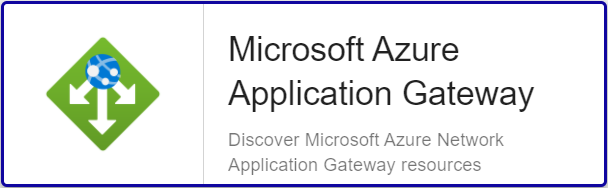

import Tabs from '@theme/Tabs';
import TabItem from '@theme/TabItem';


## Vue d'ensemble

Azure Application Gateway est un équilibreur de charge du trafic web qui vous permet de gérer le trafic vers vos applications web.
Les équilibreurs de charge traditionnels fonctionnent au niveau de la couche de transport (couche OSI 4 - TCP et UDP) et
acheminent le trafic en fonction de l’adresse IP et du port sources, vers une adresse IP et un port de destination.

Le connecteur de supervision Centreon *Azure Application Gateway* s'appuie sur les API Azure Monitor afin de récuperer les métriques relatives au service
Application Gateway. Il est possible d'utiliser les 2 modes proposés par Microsoft: RestAPI ou Azure CLI.

Les versions 1 & 2 des ressources Application Gateway sont supportées.

## Contenu du Pack

### Objets supervisés

* Instances Azure *Application Gateway* v1
    * Backend-Health
    * Connections
    * Health
    * Requests
    * Throughput

* Instances Azure *Application Gateway* v2
    * Backend-Status
    * Backend-Time
    * Clients-Traffic
    * Connections
    * Gateway-Time
    * Health
    * Requests
    * Throughput
    * Units

### Règles de découverte

Le connecteur de supervision Centreon *Azure Application Gateway* inclut un *provider* de découverte d'Hôtes nommé **Microsoft Azure Application Gateway**.
Celui-ci permet de découvrir l'ensemble des instances *Application Gateway* rattachés à une *souscription* Microsoft Azure donnée:



> La découverte *Azure Application Gateway* n'est compatible qu'avec le mode 'api'. Le mode 'azcli' n'est pas supporté dans le cadre
> de cette utilisation. 

Vous trouverez plus d'informations sur la découverte d'Hôtes et son fonctionnement sur la documentation du module:
[Découverte des hôtes](/onprem/monitoring/discovery/hosts-discovery)

### Métriques & statuts collectés 

Les métriques et statuts disponibles peuvent différer selon la version de l'instance *Application Gateway*.

#### Spécifiques v1

<Tabs groupId="sync">
<TabItem value="Backend-Health" label="Backend-Health">

| Metric Name                             | Description          | Unit  |
|:----------------------------------------|:---------------------|:------|
| appgateway.backend.healthy.host.count   | Healthy Host Count   | Count |
| appgateway.backend.unhealthy.host.count | Unhealthy Host Count | Count |

</TabItem>
</Tabs>

#### Spécifiques v2

<Tabs groupId="sync">
<TabItem value="Backend-Status" label="Backend-Status">

| Metric Name                              | Description             | Unit  |
|:-----------------------------------------|:------------------------|:------|
| appgateway.backend.response.status.count | Backend Response Status | Count |

</TabItem>
<TabItem value="Backend-Time" label="Backend-Time">

| Metric Name                                            | Description                      | Unit |
|:-------------------------------------------------------|:---------------------------------|:-----|
| appgateway.backend.connect.time.milliseconds           | Backend Connect Time             | ms   |
| appgateway.backend.firstbyte.responsetime.milliseconds | Backend First Byte Response Time | ms   |
| appgateway.backend.lastbyte.responsetime.milliseconds  | Backend Last Byte Response Time  | ms   |

</TabItem>
<TabItem value="Clients-Traffic" label="Clients-Traffic">

| Metric Name                               | Description            | Unit |
|:------------------------------------------|:-----------------------|:-----|
| appgateway.traffic.clients.received.bytes | Clients Bytes Received | B    |
| appgateway.traffic.clients.sent.bytes     | Clients Bytes Sent     | B    |

</TabItem>
<TabItem value="Gateway-Time" label="Gateway-Time">

| Metric Name                        | Description                    | Unit |
|:-----------------------------------|:-------------------------------|:-----|
| appgateway.time.total.milliseconds | Application Gateway Total Time | ms   |

</TabItem>
<TabItem value="Units" label="Units">

| Metric Name                             | Description                     | Unit  |
|:----------------------------------------|:--------------------------------|:------|
| appgateway.billable.units.fixed.count   | Fixed Billable Capacity Units   | Count |
| appgateway.billed.units.estimated.count | Estimated Billed Capacity Units | Count |
| appgateway.capacity.units.count         | Capacity Units consumed         | Count |
| appgateway.compute.units.count          | Compute Units consumed          | Count |

#### Communs aux 2 versions

</TabItem>
<TabItem value="Connections" label="Connections">

| Metric Name                                  | Description         | Unit  |
|:---------------------------------------------|:--------------------|:------|
| appgateway.backend.connections.current.count | Current Connections | Count |

</TabItem>
<TabItem value="Health" label="Health">

| Status Name | Description                 |
|:------------|:----------------------------|
| status      | Current operational status  |
| summary     | Last related status message |

</TabItem>
<TabItem value="Requests" label="Requests">

| Metric Name                      | Description     | Unit  |
|:---------------------------------|:----------------|:------|
| appgateway.requests.failed.count | Failed Requests | Count |
| appgateway.requests.total.count  | Total Requests  | Count |

</TabItem>
<TabItem value="Throughput" label="Throughput">

| Metric Name                          | Description | Unit |
|:-------------------------------------|:------------|:-----|
| appgateway.throughput.bytespersecond | Throughput  | B/s  |

</TabItem>
</Tabs>

## Prérequis

Rendez-vous sur la [documentation dédiée](../getting-started/how-to-guides/azure-credential-configuration.md) afin d'obtenir les prérequis nécessaires pour interroger les API d'Azure.

## Installation 

<Tabs groupId="sync">
<TabItem value="Online License" label="Online License">

1. Installer le Plugin sur tous les collecteurs Centreon devant superviser des resources Azure Application Gateway:

```bash
yum install centreon-plugin-Cloud-Azure-Network-AppGateway-Api
```

2. Sur l'interface Integration de Centreon, installer le connecteur de supervision *Azure Application Gateway* depuis la page **Configuration > Gestionnaire de connecteurs de supervision**

</TabItem>
<TabItem value="Offline License" label="Offline License">

1. Installer le Plugin sur tous les collecteurs Centreon devant superviser des resources Azure Application Gateway:

```bash
yum install centreon-plugin-Cloud-Azure-Network-AppGateway-Api
```

2. Sur le serveur Central Centreon, installer le RPM du Pack *Azure Application Gateway*:

```bash
yum install centreon-pack-cloud-azure-network-appgateway.noarch
```

3. Sur l'interface Integration de Centreon, installer le connecteur de supervision *Azure Application Gateway* depuis la page **Configuration > Gestionnaire de connecteurs de supervision**

</TabItem>
</Tabs>

## Configuration

### Hôte

* Ajoutez un Hôte à Centreon, remplissez le champ *Adresse IP/DNS* avec l'adresse 127.0.0.1 
et appliquez-lui le Modèle d'Hôte *Cloud-Azure-Network-AppGateway-custom*.
* Une fois le modèle appliqué, les Macros ci-dessous indiquées comme requises (*Mandatory*) 
doivent être renseignées selon le *custom mode* utilisé.

> Deux méthodes peuvent être utilisées lors de l'assignation des Macros:
> * Utilisation de l'ID complet de la ressource (de type ```/subscriptions/<subscription_id>/resourceGroups/<resourcegroup_id>/providers/Microsoft.Network/<resource_type>/<resource_name>```)
dans la Macro *AZURERESOURCE*
> * Utilisation du nom de la ressource dans la Macro *AZURERESOURCE* associée aux Macros *AZURERESOURCEGROUP* et *AZURERESOURCETYPE*

<Tabs groupId="sync">
<TabItem value="Azure Monitor API" label="Azure Monitor API">

| Mandatory | Nom                | Description                                        |
|:----------|:-------------------|:---------------------------------------------------|
| X         | AZURECUSTOMMODE    | Custom mode 'api'                                  |
| X         | AZURESUBSCRIPTION  | Subscription ID                                    |
| X         | AZURETENANT        | Tenant ID                                          |
| X         | AZURECLIENTID      | Client ID                                          |
| X         | AZURECLIENTSECRET  | Client secret                                      |
| X         | AZURERESOURCE      | ID or name of the Application Gateway resource     |
|           | AZURERESOURCEGROUP | Associated Resource Group if resource name is used |
|           | AZURERESOURCETYPE  | Associated Resource Type if resource name is used  |

</TabItem>
<TabItem value="Azure AZ CLI" label="Azure AZ CLI">

| Mandatory | Nom                | Description                                        |
|:----------|:-------------------|:---------------------------------------------------|
| X         | AZURECUSTOMMODE    | Custom mode 'azcli'                                |
| X         | AZURESUBSCRIPTION  | Subscription ID                                    |
| X         | AZURERESOURCE      | ID or name of the Application Gateway resource     |
|           | AZURERESOURCEGROUP | Associated Resource Group if resource name is used |
|           | AZURERESOURCETYPE  | Associated Resource Type if resource name is used  |

</TabItem>
</Tabs>

## Comment puis-je tester le Plugin et que signifient les options des commandes ?

Une fois le Plugin installé, vous pouvez tester celui-ci directement en ligne de
commande depuis votre collecteur Centreon en vous connectant avec l'utilisateur
*centreon-engine*:

```bash
/usr/lib/centreon/plugins/centreon_azure_network_appgateway_api.pl \
    --plugin=cloud::azure::network::appgateway::plugin \
    --mode=requests \
    --custommode=api \
    --subscription='xxxxxxxxx' \
    --tenant='xxxxxxxxx' \
    --client-id='xxxxxxxxx' \
    --client-secret='xxxxxxxxx' \
    --resource='APP001ABCD' \
    --resource-group='RSG1234' \
    --timeframe='900' \
    --interval='PT5M' \
    --aggregation='Total' \
    --warning-failed-requests='80' \
    --critical-failed-requests='90'
```

La commande devrait retourner un message de sortie similaire à:

```bash
OK: Instance 'APP001ABCD' Statistic 'total' Metrics Failed Requests: 0.00, Total Requests: 523.00 |
'APP001ABCD~total#appgateway.requests.failed.count'=0.00;0:80;0:90;0; 'APP001ABCD~total#appgateway.requests.total.count'=523.00;;;0;
```

La commande ci-dessus vérifie les statistiques de *requêtes* de l'instance *Application Gateway* nommée *APP001ABCD*
(```--plugin=cloud::azure::network::appgateway::plugin --mode=requests --resource='APP001ABCD'```) et liée au *Resource Group* *RSG1234*
(```--resource-group='RSG1234'```).

Le mode de connexion utilisé est 'api' (```--custommode=api```), les paramètres d'authentification nécessaires à l'utilisation de ce mode
sont donc renseignés en fonction (```--subscription='xxxxxxxxx' --tenant='xxxxxxx' --client-id='xxxxxxxx' --client-secret='xxxxxxxxxx'```).

Les statuts caculés se baseront sur les valeurs totales d'un échantillon dans un intervalle de 15 minutes / 900 secondes  (```--timeframe='900'```) 
avec un état retourné par tranche de 5 minutes (```--interval='PT5M'```).

Dans cet exemple, une alarme de type WARNING sera déclenchée si le nombre de requêtes 'failed' pendant l'intervalle donné
est supérieur à 80 (```--warning-failed-requests='80'```); l'alarme sera de type CRITICAL au-delà de 90 requêtes en erreur.
(```--critical-failed-requests='90'```).

La liste de toutes les options complémentaires et leur signification
peut être affichée en ajoutant le paramètre ```--help``` à la commande:

```bash
/usr/lib/centreon/plugins/centreon_azure_network_appgateway_api.pl \
    --plugin=cloud::azure::network::appgateway::plugin \
    --mode=requests \
    --help
```

### Diagnostic des erreurs communes  

#### Les identifiants ont changé et mon Plugin ne fonctionne plus

Le Plugin utilise un fichier de cache pour conserver les informations de connexion afin de ne pas 
se ré-authentifier à chaque appel. Si des informations sur le Tenant, la Souscription ou les 
Client ID / Secret changent, il est nécessaire de supprimer le fichier de cache du Plugin. 

Celui ci se trouve dans le répertoire ```/var/lib/centreon/centplugins/``` avec le nom azure_api_`<md5>_<md5>_<md5>_<md5>`.

#### ```UNKNOWN: Login endpoint API returns error code 'ERROR_NAME' (add --debug option for detailed message)```

Lors du déploiement de mes contrôles, j'obtiens le message suivant : 
```UNKNOWN: Login endpoint API returns error code 'ERROR_NAME' (add --debug option for detailed message)```.

Cela signifie que l'un des paramètres utilisés pour authentifier la requête est incorrect. Le paramètre 
en question est spécifié dans le message d'erreur en lieu et place de 'ERROR_DESC'. 

Par exemple, 'invalid_client' signifie que le client-id et/ou le client-secret
n'est (ne sont) pas valide(s).

#### ```UNKNOWN: 500 Can't connect to login.microsoftonline.com:443```

Si l'utilisation d'un proxy est requise pour les connexions HTTP depuis le 
collecteur Centreon, il est nécessaire de le préciser dans la commande en
utilisant l'option ```--proxyurl='http://proxy.mycompany.com:8080'```.

Il est également possible qu'un équipement tiers de type Pare-feu bloque la requête
effectuée par le Plugin.

#### ```UNKNOWN: No metrics. Check your options or use --zeroed option to set 0 on undefined values```

Lors du déploiement de mes contrôles, j'obtiens le message suivant 'UNKNOWN: No metrics. Check your options or use --zeroed option to set 0 on undefined values'. 

Cela signifie qu'Azure n'a pas consolidé de données sur la période.

Vous pouvez ajouter ```--zeroed``` à la macro EXTRAOPTIONS du **service** en question afin de forcer le stockage d'un 0 et ainsi éviter un statut UNKNOWN.
