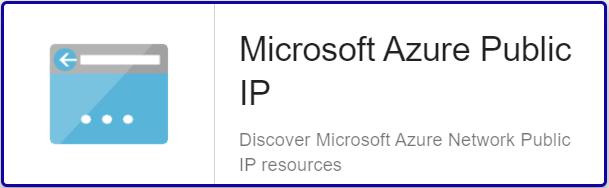

import Tabs from '@theme/Tabs';
import TabItem from '@theme/TabItem';


## Vue d'ensemble

Les adresses IP publiques permettent aux ressources Azure de communiquer avec Internet et les services Azure publics. L’adresse
est dédiée à la ressource jusqu’à ce que vous annuliez son attribution. Une ressource sans adresse IP publique attribuée peut
établir une communication sortante. Azure attribue dynamiquement une adresse IP disponible qui n’est pas dédiée à la ressource.

Le connecteur de supervision Centreon *Azure Public IP* s'appuie sur les API Azure Monitor afin de récuperer les métriques relatives au service
Public IP. Il est possible d'utiliser les 2 modes proposés par Microsoft: RestAPI ou Azure CLI.

## Contenu du connecteur de supervision

### Objets supervisés

* Instances Azure *Public IP*

### Règles de découverte

Le connecteur de supervision Centreon *Azure Public IP* inclut un *provider* de découverte d'Hôtes nommé **Microsoft Azure Public IP**.
Celui-ci permet de découvrir l'ensemble des *Public IPs* rattachés à une *souscription* Microsoft Azure donnée:



> La découverte *Azure Public IP* n'est compatible qu'avec le mode 'api'. Le mode 'azcli' n'est pas supporté dans le cadre
> de cette utilisation. 

Vous trouverez plus d'informations sur la découverte d'Hôtes et son fonctionnement sur la documentation du module:
[Découverte des hôtes](/onprem/monitoring/discovery/hosts-discovery)

### Métriques & statuts collectés 

<Tabs groupId="sync">
<TabItem value="Ddos-Traffic" label="Ddos-Traffic">

| Metric name                          | Description                   | Unit    |
|:-------------------------------------|:------------------------------|:--------|
| publicip.ddos.dropped.bytes          | Inbound bytes dropped DDoS    | B       |
| publicip.ddos.forwarded.bytes        | Inbound bytes forwarded DDoS' | B       |
| publicip.ddos.inbound.bytes          | Inbound bytes DDoS            | B       |
| publicip.ddos.packets.countpersecond | Inbound packets dropped DDoS  | count/s |

</TabItem>
<TabItem value="Status" label="Status">

| Status name        | Description                                 |
|:-------------------|:--------------------------------------------|
| ddos-status        | Is the Public IP under Ddos attack          |
| provisioning-state | Current operational status of the Public IP |

</TabItem>
</Tabs>

## Prérequis

Rendez-vous sur la [documentation dédiée](../getting-started/how-to-guides/azure-credential-configuration.md) afin d'obtenir les prérequis nécessaires pour interroger les API d'Azure.

## Installation 

<Tabs groupId="sync">
<TabItem value="Online License" label="Online License">

1. Installer le Plugin sur tous les collecteurs Centreon devant superviser des resources Azure Public IP:

```bash
yum install centreon-plugin-Cloud-Azure-Network-PublicIP-Api
```

2. Sur l'interface Web de Centreon, installer le connecteur de supervision *Azure Public IP* depuis la page **Configuration > Gestionnaire de connecteurs de supervision**

</TabItem>
<TabItem value="Offline License" label="Offline License">

1. Installer le Plugin sur tous les collecteurs Centreon devant superviser des resources Azure Public IP:

```bash
yum install centreon-plugin-Cloud-Azure-Network-PublicIP-Api
```

2. Sur le serveur Central Centreon, installer le RPM du connecteur de supervision *Azure Public IP*:

```bash
yum install centreon-pack-cloud-azure-network-publicip.noarch
```

3. Sur l'interface Web de Centreon, installer le connecteur de supervision *Azure Public IP* depuis la page **Configuration > Gestionnaire de connecteurs de supervision**

</TabItem>
</Tabs>

## Configuration

### Hôte

* Ajoutez un Hôte à Centreon, remplissez le champ *Adresse IP/DNS* avec l'adresse 127.0.0.1 
et appliquez-lui le Modèle d'Hôte *Cloud-Azure-Network-PublicIP-custom*.
* Une fois le modèle appliqué, les Macros ci-dessous indiquées comme requises (*Mandatory*) 
doivent être renseignées selon le custom-mode utilisé:

<Tabs groupId="sync">
<TabItem value="Azure Monitor API" label="Azure Monitor API">

| Mandatory | Nom               | Description                  |
|:----------|:------------------|:-----------------------------|
| X         | AZURECUSTOMMODE   | Custom mode 'api'            |
| X         | AZURESUBSCRIPTION | Subscription ID              |
| X         | AZURETENANT       | Tenant ID                    |
| X         | AZURECLIENTID     | Client ID                    |
| X         | AZURECLIENTSECRET | Client secret                |
| X         | AZURERESOURCE     | Id of the Public IP resource |

</TabItem>
<TabItem value="Azure AZ CLI" label="Azure AZ CLI">

| Mandatory | Nom               | Description                  |
|:----------|:------------------|:-----------------------------|
| X         | AZURECUSTOMMODE   | Custom mode 'azcli'          |
| X         | AZURESUBSCRIPTION | Subscription ID              |
| X         | AZURERESOURCE     | Id of the Public IP resource |

</TabItem>
</Tabs>

## FAQ

### Comment puis-je tester le Plugin et que signifient les options des commandes ?

Une fois le Plugin installé, vous pouvez tester celui-ci directement en ligne de
commande depuis votre collecteur Centreon en vous connectant avec l'utilisateur
*centreon-engine*:

```bash
/usr/lib/centreon/plugins/centreon_azure_network_publicip_api.pl \
    --plugin=cloud::azure::network::publicip::plugin \
    --mode=status \
    --custommode=api \
    --subscription='xxxxxxxxx' \
    --tenant='xxxxxxxxx' \
    --client-id='xxxxxxxxx' \
    --client-secret='xxxxxxxxx' \
    --resource='IPA001ABCD' \
    --timeframe='900' \
    --interval='PT5M' \
    --critical-provisioning-state='%{state} =~ /Failed/i' \
    --critical-ddos-status='%{status} =~ /DDOS Attack ongoing/i'
```

La commande devrait retourner un message de sortie similaire à: 

```bash
OK: Public IP instance 'IPA001ABCD', IP: 1.2.3.4 (IPv4) current DDOS status: "OK", current provisioning state: "Succeeded" |
```

La commande ci-dessus vérifie le statut actuel de la *Public IP* nommée *IPA001ABCD*
(```--plugin=cloud::azure::network::publicip::plugin --mode=status --resource='IPA001ABCD'```).

Le mode de connexion utilisé est 'api' (```--custommode=api```), les paramètres d'authentification nécessaires à l'utilisation de ce mode
sont donc renseignés en fonction (```--subscription='xxxxxxxxx' --tenant='xxxxxxx' --client-id='xxxxxxxx' --client-secret='xxxxxxxxxx'```).

Les statuts caculés se baseront sur les valeurs maximales d'un échantillon dans un intervalle de 15 minutes / 900 secondes  (```--timeframe='900'```) 
avec un état retourné par tranche de 5 minutes (```--interval='PT5M'```).

Dans cette exemple, des alarmes de type CRITICAL seront déclenchées dans les cas suivants:
* l'état opérationnel de la resource est retournée comme *Failed* (```--critical-provisioning-state='%{state} =~ /Failed/i'```)
* une attaque DDOS est en cours vers la resource (```--critical-ddos-status='%{status} =~ /DDOS Attack ongoing/i'```)


La liste de toutes les options complémentaires et leur signification
peut être affichée en ajoutant le paramètre ```--help``` à la commande:

```bash
/usr/lib/centreon/plugins/centreon_azure_network_publicip_api.pl \
    --plugin=cloud::azure::network::publicip::plugin \
    --mode=status \
    --help
```

### Diagnostic des erreurs communes  

#### Les identifiants ont changé et mon Plugin ne fonctionne plus

Le Plugin utilise un fichier de cache pour conserver les informations de connexion afin de ne pas 
se ré-authentifier à chaque appel. Si des informations sur le Tenant, la Souscription ou les 
Client ID / Secret changent, il est nécessaire de supprimer le fichier de cache du Plugin. 

Celui ci se trouve dans le répertoire ```/var/lib/centreon/centplugins/``` avec le nom azure_api_`<md5>_<md5>_<md5>_<md5>`.

#### ```UNKNOWN: Login endpoint API returns error code 'ERROR_NAME' (add --debug option for detailed message)```

Lors du déploiement de mes contrôles, j'obtiens le message suivant : 
```UNKNOWN: Login endpoint API returns error code 'ERROR_NAME' (add --debug option for detailed message)```.

Cela signifie que l'un des paramètres utilisés pour authentifier la requête est incorrect. Le paramètre 
en question est spécifié dans le message d'erreur en lieu et place de 'ERROR_DESC'. 

Par exemple, 'invalid_client' signifie que le client-id et/ou le client-secret
n'est (ne sont) pas valide(s).

#### ```UNKNOWN: 500 Can't connect to login.microsoftonline.com:443```

Si l'utilisation d'un proxy est requise pour les connexions HTTP depuis le 
collecteur Centreon, il est nécessaire de le préciser dans la commande en
utilisant l'option ```--proxyurl='http://proxy.mycompany.com:8080'```.

Il est également possible qu'un équipement tiers de type Pare-feu bloque la requête
effectuée par le Plugin.

#### ```UNKNOWN: No metrics. Check your options or use --zeroed option to set 0 on undefined values```

Lors du déploiement de mes contrôles, j'obtiens le message suivant 'UNKNOWN: No metrics. Check your options or use --zeroed option to set 0 on undefined values'. 

Cela signifie qu'Azure n'a pas consolidé de données sur la période.

Vous pouvez ajouter ```--zeroed``` à la macro EXTRAOPTIONS du **service** en question afin de forcer le stockage d'un 0 et ainsi éviter un statut UNKNOWN.