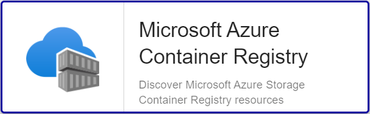

import Tabs from '@theme/Tabs';
import TabItem from '@theme/TabItem';


## Vue d'ensemble

Azure Container Registry est un service de registre Docker managé privé, qui est basé sur le registre open source Docker 2.0. Il permet de créer et de
tenir à jour des registres de conteneurs Azure pour stocker et gérer des images conteneur Docker privées et les artefacts associés.

Le Plugin Centreon *Azure Container Registry* s'appuie sur les API Azure Monitor afin de récupérer les métriques relatives au service
Container Registry. 

Il est possible d'utiliser les 2 modes de connexion aux API Azure proposés par Microsoft: RestAPI ou Azure CLI.

## Contenu du Pack

### Objets supervisés

* Registries
     * Storage-usage

### Règles de découverte

Le Plugin-Pack Centreon *Azure Container Registry* inclut un fournisseur de découverte
d'Hôtes nommé **Microsoft Azure Container Registry**. Celui-ci permet de découvrir l'ensemble des instances
rattachées à une *souscription* Microsoft Azure donnée:



> La découverte *Azure Container Registry* n'est compatible qu'avec le mode 'api'. Le mode 'azcli' n'est pas supporté dans le cadre
> de cette utilisation.
Vous trouverez plus d'informations sur la découverte d'Hôtes et son fonctionnement sur la documentation du module:
[Découverte des hôtes](/docs/monitoring/discovery/hosts-discovery)

### Métriques collectées 

<Tabs groupId="sync">
<TabItem value="Storage-usage" label="Storage-usage">

| Metric Name                                            | Description  | Unit |
|:-------------------------------------------------------|:-------------|:-----|
| *instance*#azure.containerregistry.storage.used.bytes  | Storage used | B    |

</TabItem>
</Tabs>

## Prérequis

Deux moyens sont disponibles pour interroger les API Microsoft Azure.

Centreon préconise l'utilisation de la méthode *API* plutôt que la *CLI*, cette dernière étant significativement
moins performante. L'API Rest permet également une authentification *Application* et ne nécessite pas de compte de service dédié.

<Tabs groupId="sync">
<TabItem value="Azure Monitor API" label="Azure Monitor API">

Pour le custom-mode 'api', récupérez les informations en suivant la procédure ci-dessous (en anglais)
et notez celles-ci en lieu sûr. Elles seront en effet indispensables lors de la configuration des ressources
dans Centreon.

* Create an *application* in Azure Active Directory:
	- Log in to your Azure account.
	- Select *Azure Active directory* in the left sidebar.
	- Click on *App registrations*.
	- Click on *+ Add*.
	- Enter Centreon as the application name (or any name of your choice), select application type(api) and sign-on-url.
	- Click on the *Create* button.

* Get *Subscription ID*
	- Log in to your Azure account.
	- Select *Subscriptions* in the left sidebar.
	- Select whichever subscription is needed.
	- Click on *Overview*.
	- **Copy the Subscription ID.**

* Get *Tenant ID*
	- Log in to your Azure account.
	- Select *Azure Active directory* in the left sidebar.
	- Click on *Properties*.
	- **Copy the directory ID.**

* Get *Client ID*
	- Log in to your Azure account.
	- Select *Azure Active directory* in the left sidebar.
	- Click on *Enterprise applications*.
	- Click on *All applications*.
	- Select the application previously created.
	- Click on *Properties*.
	- **Copy the Application ID.**

* Get *Client secret*
	- Log in to your Azure account.
	- Select *Azure Active directory* in the left sidebar.
	- Click on *App registrations*.
	- Select the application previously created.
	- Click on *All settings*.
	- Click on *Keys*.
	- Enter the key description and select the duration.
	- Click on *Save*.
	- **Copy and store the key value. You won't be able to retrieve it after you leave this page.**

Please make sure to assign the **Monitoring Reader** role to the application.

</TabItem>
<TabItem value="Azure AZ CLI" label="Azure AZ CLI">

Afin d'utiliser le custom-mode 'azcli', installez le binaire associé sur tous les Collecteurs Centreon
devant superviser des resources Azure:

- La CLI requiert une version de Python >= 2.7 (<https://github.com/Azure/azure-cli/blob/dev/doc/install_linux_prerequisites.md>)

Sur un système utilisant le packaging RPM, utilisez les commandes ci-dessous avec
l'utilisateur **root** ou un utilisateur avec les droits **sudo** adéquats:

```shell
sudo rpm --import https://packages.microsoft.com/keys/microsoft.asc
sudo echo -e "[azure-cli]\nname=Azure CLI\nbaseurl=https://packages.microsoft.com/yumrepos/azure-cli\nenabled=1\ngpgcheck=1\ngpgkey=https://packages.microsoft.com/keys/microsoft.asc" > /etc/yum.repos.d/azure-cli.repo
sudo yum install azure-cli
```

Ensuite, réalisez les opérations suivantes avec l'utilisateur *centreon-engine*
afin de récupérer le token d'authentification Azure:

```shell
su - centreon-engine
az login
```

La commande retourne le message ci-dessous contenant un code:

	*To sign in, use a web browser to open the page https://microsoft.com/devicelogin*
	*and enter the code CWT4WQZAD to authenticate.*

Rendez-vous sur <https://microsoft.com/devicelogin> afin de saisir le code obtenu, puis connectez-vous avec le compte de service dédié à la supervision.

Une fois ces actions effectuées, des informations d'auhtentification de la forme suivante devraient s'afficher dans le terminal
du collecteur Centreon: 

```shell
	[
	  {
		"cloudName": "AzureCloud",
		"id": "0ef83f3a-d83e-2039-d930-309df93acd93d",
		"isDefault": true,
		"name": "N/A(tenant level account)",
		"state": "Enabled",
		"tenantId": "0ef83f3a-03cd-2039-d930-90fd39ecd048",
		"user": {
		  "name": "email@mycompany.onmicrosoft.com",
		  "type": "user"
		}
	  }
	]
```

Vous avez désormais les informations stockées localement dans un fichier
**accessTokens.json** qui sera utilisé automatiquement par le Plugin.

</TabItem>
</Tabs>

## Installation 

<Tabs groupId="sync">
<TabItem value="Online License" label="Online License">

1. Installer le Plugin sur tous les collecteurs Centreon devant superviser des resources *Azure Container Registry*:

```bash
yum install centreon-plugin-Cloud-Azure-Storage-ContainerRegistry-Api
```

2. Sur l'interface Web Centreon, installer le Pack *Azure Container Registry* depuis la page **Configuration > Plugin packs > Gestionnaire**.

</TabItem>
<TabItem value="Offline License" label="Offline License">

1. Installer le Plugin sur tous les collecteurs Centreon devant superviser des resources *Azure Container Registry*:

```bash
yum install centreon-plugin-Cloud-Azure-Storage-ContainerRegistry-Api
```
2. Sur le serveur Central Centreon, installer le RPM du Pack *Azure Container Registry*:

```bash
yum install centreon-pack-cloud-azure-storage-acr.noarch
```

3. Sur l'interface Web Centreon, installer le Pack *Azure Container Registry* depuis la page **Configuration > Plugin packs > Gestionnaire**.

</TabItem>
</Tabs>

## Configuration

### Hôte

* Ajoutez un Hôte à Centreon, remplissez le champ **Adresse IP/DNS** avec l'adresse 127.0.0.1 
et appliquez-lui le Modèle d'Hôte **Cloud-Azure-Storage-ContainerRegistry-custom**.
* Une fois le modèle appliqué, les Macros ci-dessous indiquées comme requises (*Mandatory*) 
doivent être renseignées selon le *custom mode* utilisé.

> Deux méthodes peuvent être utilisées lors de l'assignation des Macros:
> * Utilisation de l'ID complet de la ressource (de type `/subscriptions/<subscription_id>/resourceGroups/<resourcegroup_id>/providers/Microsoft.ContainerRegistry/registries/<resource_name>`)
dans la Macro *AZURERESOURCE*
> * Utilisation du nom de la ressource dans la Macro *AZURERESOURCE* associée à la Macro *AZURERESOURCEGROUP* 

<Tabs groupId="sync">
<TabItem value="Azure Monitor API" label="Azure Monitor API">

| Mandatory | Nom                | Description                                        |
|:----------|:-------------------|:---------------------------------------------------|
| X         | AZURECUSTOMMODE    | Custom mode 'api'                                  |
| X         | AZURESUBSCRIPTION  | Subscription ID                                    |
| X         | AZURETENANT        | Tenant ID                                          |
| X         | AZURECLIENTID      | Client ID                                          |
| X         | AZURECLIENTSECRET  | Client secret                                      |
| X         | AZURERESOURCE      | ID or name of the Container Registry resource      |
|           | AZURERESOURCEGROUP | Associated Resource Group if resource name is used |

</TabItem>
<TabItem value="Azure AZ CLI" label="Azure AZ CLI">

| Mandatory | Nom                | Description                                        |
|:----------|:-------------------|:---------------------------------------------------|
| X         | AZURECUSTOMMODE    | Custom mode 'azcli'                                |
| X         | AZURESUBSCRIPTION  | Subscription ID                                    |
| X         | AZURERESOURCE      | ID or name of the Container Registry resource      |
|           | AZURERESOURCEGROUP | Associated Resource Group if resource name is used |

</TabItem>
</Tabs>

## FAQ

### Comment puis-je tester le Plugin et que signifient les options des commandes ?

Une fois le Plugin installé, vous pouvez tester celui-ci directement en ligne de
commande depuis votre collecteur Centreon en vous connectant avec l'utilisateur
*centreon-engine* (`#su - centreon-engine`):

```bash
/usr/lib/centreon/plugins/centreon_azure_storage_acr_api.pl \
    --plugin=cloud::azure::storage::acr::plugin \
    --mode=storage-usage \
    --custommode='api' \
    --subscription='xxxxxxxxx' \
    --tenant='xxxxxxxxx' \
    --client-id='xxxxxxxxx' \
    --client-secret='xxxxxxxxx' \
    --resource='ACR001ABCD' \
    --resource-group='RSG1234'
    --aggregation='Total' \
    --timeframe='3600' \
    --interval='PT1H' \
    --warning-storage-used='80000000000' \
    --critical-item-errors='90000000000'
 ```

La commande devrait retourner un message de sortie similaire à: 

```bash
OK: Instance 'ACR001ABCD' Statistic 'total' Metrics Storage used: 74.86GB |
'ACR001ABCD~total#azure.containerregistry.storage.used.bytes'=80379853954.00B;0:70000000000;0:90000000000;0;
```

La commande ci-dessus vérifie l'état du stockage dédié à l'instance *Container Registry* nommée *ACR001ABCD*
(`--plugin=cloud::azure::storage::acr::plugin --mode=storage-usage --resource='ACR001ABCD'`) et liée au *Resource Group* *RSG1234*
(`--resource-group='RSG1234'`).

Le mode de connexion utilisé est 'api' (`--custommode=api`), les paramètres d'authentification nécessaires à l'utilisation de ce mode
sont donc renseignés en fonction (`--subscription='xxxxxxxxx' --tenant='xxxxxxx' --client-id='xxxxxxxx' --client-secret='xxxxxxxxxx'`).

Les valeurs obtenus sont le résultat de la récupération d'un point unique sur une période d'une heure / 3600 secondes.
(`--timeframe='3600' --interval='PT1H'`).

Dans cet exemple, une alarme de type WARNING sera déclenchée lorsque le stockage utilisé est supérieur à 80GB (`--warning-storage-used='80000000000'`);
l'alarme sera de type CRITICAL au-delà de 90GB d'utilisation (`--critical-storage-used='90000000000'`).

La liste de toutes les options complémentaires et leur signification peut être affichée en ajoutant le paramètre `--help` à la commande:

```bash
/usr/lib/centreon/plugins/centreon_azure_storage_acr_api.pl \
    --plugin=cloud::azure::storage::acr::plugin \
    --mode=storage-usage  \
    --help
 ```

### Diagnostic des erreurs communes  

Rendez-vous sur la [documentation dédiée](../tutorials/troubleshooting-plugins.md#http-and-api-checks) des Plugins basés sur HTTP/API.
