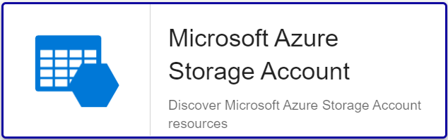

import Tabs from '@theme/Tabs';
import TabItem from '@theme/TabItem';


## Contenu du Pack

### Modèles

Le Plugin Pack Centreon **Azure Storage Account** apporte 5 modèles d'hôte différents :

* Cloud-Azure-Storage-StorageAccount-Account-custom
* Cloud-Azure-Storage-StorageAccount-Blob-custom
* Cloud-Azure-Storage-StorageAccount-File-custom
* Cloud-Azure-Storage-StorageAccount-Queue-custom
* Cloud-Azure-Storage-StorageAccount-Table-custom

Il apporte les modèles de service suivants :

| Alias                             | Modèle de service                                            | Description                                                  | Défaut |
| :-------------------------------- | :----------------------------------------------------------- | :----------------------------------------------------------- | :----- |
| Account-Transactions-Availability | Cloud-Azure-ClassicStorage-StorageAccount-Account-Transactions-Availability-Api | Contrôle le taux de disponibilité du stockage                | X      |
| Account-Transactions-Count        | Cloud-Azure-ClassicStorage-StorageAccount-Account-Transactions-Count-Api | Contrôle le nombre de transactions sur le stockage           | X      |
| Account-Transactions-Latency      | Cloud-Azure-ClassicStorage-StorageAccount-Account-Transactions-Latency-Api | Contrôle la latence et le temps de traitement des requêtes réussis sur le stockage | X      |
| Account-Transactions-Throughput   | Cloud-Azure-ClassicStorage-StorageAccount-Account-Transactions-Throughput-Api | Contrôle le volume de données entrant et sortant sur le stockage | X      |
| Account-Used-Capacity             | Cloud-Azure-ClassicStorage-StorageAccount-Account-Used-Capacity-Api | Contrôle le volume utilisé sur le stockage                   | X      |
| Blob-Capacity                     | Cloud-Azure-ClassicStorage-StorageAccount-Blob-Capacity-Api  | Contrôle le volume de type Blob utilisé sur le stockage      | X      |
| Blob-Container-Count              | Cloud-Azure-ClassicStorage-StorageAccount-Blob-Container-Count-Api | Contrôle le nombre de container Blob sur le stockage         | X      |
| Blob-Count                        | Cloud-Azure-ClassicStorage-StorageAccount-Blob-Count-Api     | Contrôle le nombre d'objets sur le stockage                  | X      |
| Blob-Transactions-Availability    | Cloud-Azure-ClassicStorage-StorageAccount-Blob-Transactions-Availability-Api | Contrôle le taux de disponibilité du stockage                | X      |
| Blob-Transactions-Count           | Cloud-Azure-ClassicStorage-StorageAccount-Blob-Transactions-Count-Api | Contrôle le nombre de transactions sur le stockage           | X      |
| Blob-Transactions-Latency         | Cloud-Azure-ClassicStorage-StorageAccount-Blob-Transactions-Latency-Api | Contrôle la latence et le temps de traitement des requêtes réussis sur le stockage | X      |
| Blob-Transactions-Throughput      | Cloud-Azure-ClassicStorage-StorageAccount-Blob-Transactions-Throughput-Api | Contrôle le volume de données entrant et sortant sur le stockage | X      |
| File-Capacity                     | Cloud-Azure-ClassicStorage-StorageAccount-File-Capacity-Api  | Contrôle le volume de type File utilisé sur le stockage      | X      |
| File-Count                        | Cloud-Azure-ClassicStorage-StorageAccount-File-Count-Api     | Contrôle le nombre de fichiers sur le stockage               | X      |
| File-Share-Count                  | Cloud-Azure-ClassicStorage-StorageAccount-File-Share-Count-Api | Contrôle le nombre de partage sur le stockage                | X      |
| File-Share-Quota                  | Cloud-Azure-ClassicStorage-StorageAccount-File-Share-Quota-Api | Contrôle la taille maximale en octets                        | X      |
| File-Transactions-Availability    | Cloud-Azure-ClassicStorage-StorageAccount-File-Transactions-Availability-Api | Contrôle le taux de disponibilité du stockage                | X      |
| File-Transactions-Count           | Cloud-Azure-ClassicStorage-StorageAccount-File-Transactions-Count-Api | Contrôle le nombre de transactions sur le stockage           | X      |
| File-Transactions-Latency         | Cloud-Azure-ClassicStorage-StorageAccount-File-Transactions-Latency-Api | Contrôle la latence et le temps de traitement des requêtes réussis sur le stockage | X      |
| File-Transactions-Throughput      | Cloud-Azure-ClassicStorage-StorageAccount-File-Transactions-Throughput-Api | Contrôle le volume de données entrant et sortant sur le stockage | X      |
| Health                            | Cloud-Azure-ClassicStorage-StorageAccount-Health-Api         | Contrôle le statut de l'instance de stockage                 | X      |
| Queue-Capacity                    | Cloud-Azure-ClassicStorage-StorageAccount-Queue-Capacity-Api | Contrôle le volume de type Queue utilisé sur le stockage     | X      |
| Queue-Count                       | Cloud-Azure-ClassicStorage-StorageAccount-Queue-Count-Api    | Contrôle le nombre de file d'attente sur le stockage         | X      |
| Queue-Message-Count               | Cloud-Azure-ClassicStorage-StorageAccount-Queue-Message-Count-Api | Contrôle le nombre de message dans la file d'attente sur le stockage | X      |
| Queue-Transactions-Availability   | Cloud-Azure-ClassicStorage-StorageAccount-Queue-Transactions-Availability-Api | Contrôle le taux de disponibilité du stockage                | X      |
| Queue-Transactions-Count          | Cloud-Azure-ClassicStorage-StorageAccount-Queue-Transactions-Count-Api | Contrôle le nombre de transactions sur le stockage           | X      |
| Queue-Transactions-Latency        | Cloud-Azure-ClassicStorage-StorageAccount-Queue-Transactions-Latency-Api | Contrôle la latence et le temps de traitement des requêtes réussis sur le stockage | X      |
| Queue-Transactions-Throughput     | Cloud-Azure-ClassicStorage-StorageAccount-Queue-Transactions-Throughput-Api | Contrôle le volume de données entrant et sortant sur le stockage | X      |
| Table-Capacity                    | Cloud-Azure-ClassicStorage-StorageAccount-Table-Capacity-Api | Contrôle le volume de type Table utilisé sur le stockage     | X      |
| Table-Count                       | Cloud-Azure-ClassicStorage-StorageAccount-Table-Count-Api    | Contrôle le nombre de table sur le stockage                  | X      |
| Table-Entity-Count                | Cloud-Azure-ClassicStorage-StorageAccount-Table-Entity-Count-Api | Contrôle le nombre d'entrée dans les tables sur le stockage  | X      |
| Table-Transactions-Availability   | Cloud-Azure-ClassicStorage-StorageAccount-Table-Transactions-Availability-Api | Contrôle le taux de disponibilité du stockage                | X      |
| Table-Transactions-Count          | Cloud-Azure-ClassicStorage-StorageAccount-Table-Transactions-Count-Api | Contrôle le nombre de transactions sur le stockage           | X      |
| Table-Transactions-Latency        | Cloud-Azure-ClassicStorage-StorageAccount-Table-Transactions-Latency-Api | Contrôle la latence et le temps de traitement des requêtes réussis sur le stockage | X      |
| Table-Transactions-Throughput     | Cloud-Azure-ClassicStorage-StorageAccount-Table-Transactions-Throughput-Api | Contrôle le volume de données entrant et sortant sur le stockage | X      |

### Règles de découverte

Le Plugin Pack Centreon **Azure Storage Account** inclut un fournisseur de découverte
d'hôtes nommé **Microsoft Azure Storage Accounts**. Celui-ci permet de découvrir l'ensemble des instances
rattachées à une souscription Microsoft Azure donnée:



> La découverte **Azure Storage Account** n'est compatible qu'avec le mode **api**. Le mode **azcli** n'est pas supporté dans le cadre
> de cette utilisation.

Rendez-vous sur la [documentation dédiée](/docs/monitoring/discovery/hosts-discovery)
pour en savoir plus sur la découverte automatique d'hôtes.

### Métriques & statuts collectés

<Tabs groupId="sync">
<TabItem value="Account-Transactions-Availability" label="Account-Transactions-Availability">

| Métrique                           | Unité |
|:-----------------------------------|:------|
| usedcapacity_total                 | B     |


</TabItem>
<TabItem value="Account-Transactions-Count" label="Account-Transactions-Count">

| Métrique                           | Unité |
|:-----------------------------------|:------|
| transactions_total                 | B     |


</TabItem>
<TabItem value="Account-Transactions-Latency" label="Account-Transactions-Latency">

| Métrique                           | Unité |
|:-----------------------------------|:------|
| successserverlatency_average       | ms    |
| successe2elatency_average          | ms    |

</TabItem>
<TabItem value="Account-Transactions-Throughput" label="Account-Transactions-Throughput">

| Métrique                           | Unité |
|:-----------------------------------|:------|
| ingress_total                      | B     |
| egress_total                       | B     |

</TabItem>
<TabItem value="Account-Used-Capacity" label="Account-Used-Capacity">

| Métrique                           | Unité |
|:-----------------------------------|:------|
| usedcapacity_total                 | B     |

</TabItem>
<TabItem value="Blob-Capacity" label="Blob-Capacity">

| Métrique                           | Unité |
|:-----------------------------------|:------|
| blobcapacity_total                 | B     |

</TabItem>
<TabItem value="Blob-Container-Count" label="Blob-Container-Count">

| Métrique                           | Unité |
|:-----------------------------------|:------|
| containercount_average             |       |


</TabItem>
<TabItem value="Blob-Count" label="Blob-Count">

| Métrique                           | Unité |
|:-----------------------------------|:------|
| blobcount_total                    |       |


</TabItem>
<TabItem value="Blob-Transactions-Availability" label="Blob-Transactions-Availability">

| Métrique                           | Unité |
|:-----------------------------------|:------|
| availability_average               | %     |

</TabItem>
<TabItem value="Blob-Transactions-Count" label="Blob-Transactions-Count">

| Métrique                           | Unité |
|:-----------------------------------|:------|
| transactions_total                 | B     |

</TabItem>
<TabItem value="Blob-Transactions-Latency" label="Blob-Transactions-Latency">

| Métrique                           | Unité |
|:-----------------------------------|:------|
| successserverlatency_average       | ms    |
| successe2elatency_average          | ms    |

</TabItem>
<TabItem value="Blob-Transactions-Throughput" label="Blob-Transactions-Throughput">

| Métrique                           | Unité |
|:-----------------------------------|:------|
| ingress_total                      | B     |
| egress_total                       | B     |

</TabItem>
<TabItem value="File-Capacity" label="File-Capacity">

| Métrique                           | Unité |
|:-----------------------------------|:------|
| filecapacity_average               | B     |

</TabItem>
<TabItem value="File-Count" label="File-Count">

| Métrique                           | Unité |
|:-----------------------------------|:------|
| filecount_average                  |       |

</TabItem>
<TabItem value="File-Share-Count" label="File-Share-Count">

| Métrique                           | Unité |
|:-----------------------------------|:------|
| filesharecount_average             |       |


</TabItem>
<TabItem value="File-Share-Quota" label="File-Share-Quota">

| Métrique                           | Unité |
|:-----------------------------------|:------|
| filesharecapacityquota_average     | B     |

</TabItem>
<TabItem value="File-Transactions-Availability" label="File-Transactions-Availability">

| Métrique                           | Unité |
|:-----------------------------------|:------|
| availability_average               | %     |

</TabItem>
<TabItem value="File-Transactions-Count" label="File-Transactions-Count">

| Métrique                           | Unité |
|:-----------------------------------|:------|
| transactions_total                 | B     |

</TabItem>
<TabItem value="File-Transactions-Latency" label="File-Transactions-Latency">

| Métrique                           | Unité |
|:-----------------------------------|:------|
| successserverlatency_average       | ms    |
| successe2elatency_average          | ms    |

</TabItem>
<TabItem value="File-Transactions-Throughput" label="File-Transactions-Throughput">

| Métrique                           | Unité |
|:-----------------------------------|:------|
| ingress_total                      | B     |
| egress_total                       | B     |

</TabItem>
<TabItem value="Health" label="Health">

| Métrique                           | Unité |
|:-----------------------------------|:------|
| Status                             |       |

</TabItem>
<TabItem value="Queue-Capacity" label="Queue-Capacity">

| Métrique                           | Unité |
|:-----------------------------------|:------|
| ingress_total                      | B     |
| egress_total                       | B     |

</TabItem>
<TabItem value="Queue-Count" label="Queue-Count">

| Métrique                           | Unité |
|:-----------------------------------|:------|
| queuecount_average                 |       |

</TabItem>
<TabItem value="Queue-Message-Count" label="Queue-Message-Count">

| Métrique                           | Unité |
|:-----------------------------------|:------|
| queuemessagecount_average          |       |

</TabItem>
<TabItem value="Queue-Transactions-Availability" label="Queue-Transactions-Availability">

| Métrique                           | Unité |
|:-----------------------------------|:------|
| availability_average               | %     |

</TabItem>
<TabItem value="Queue-Transactions-Count" label="Queue-Transactions-Count">

| Métrique                           | Unité |
|:-----------------------------------|:------|
| transactions_total                 | B     |

</TabItem>
<TabItem value="Queue-Transactions-Latency" label="Queue-Transactions-Latency">

| Métrique                           | Unité |
|:-----------------------------------|:------|
| successserverlatency_average       | ms    |
| successe2elatency_average          | ms    |

</TabItem>
<TabItem value="Queue-Transactions-Throughput" label="Queue-Transactions-Throughput">

| Métrique                           | Unité |
|:-----------------------------------|:------|
| ingress_total                      | B     |
| egress_total                       | B     |

</TabItem>
<TabItem value="Table-Capacity" label="Table-Capacity">

| Métrique                           | Unité |
|:-----------------------------------|:------|
| tablecapacity_average              | B     |

</TabItem>
<TabItem value="Table-Count" label="Table-Count">

| Métrique                           | Unité |
|:-----------------------------------|:------|
| tablecount_average                 | B     |

</TabItem>
<TabItem value="Table-Entity-Count" label="Table-Entity-Count">

| Métrique                           | Unité |
|:-----------------------------------|:------|
| tableentitycount_average           |       |

</TabItem>
<TabItem value="Table-Transactions-Availability" label="Table-Transactions-Availability">

| Métrique                           | Unité |
|:-----------------------------------|:------|
| availability_average               | %     |

</TabItem>
<TabItem value="Table-Transactions-Count" label="Table-Transactions-Count">

| Métrique                           | Unité |
|:-----------------------------------|:------|
| transactions_total                 | B     |

</TabItem>
<TabItem value="Table-Transactions-Latency" label="Table-Transactions-Latency">

| Métrique                           | Unité |
|:-----------------------------------|:------|
| successserverlatency_average       | ms    |
| successe2elatency_average          | ms    |

</TabItem>
<TabItem value="Table-Transactions-Throughput" label="Table-Transactions-Throughput">

| Métrique                           | Unité |
|:-----------------------------------|:------|
| ingress_total                      | B     |
| egress_total                       | B     |

</TabItem>
</Tabs>

## Prérequis

Rendez-vous sur la [documentation dédiée](../getting-started/how-to-guides/azure-credential-configuration.md) afin d'obtenir les prérequis nécessaires pour interroger les API d'Azure.

## Installation

<Tabs groupId="sync">
<TabItem value="Online License" label="Online License">

1. Installez le plugin sur tous les collecteurs Centreon devant superviser des ressources **Azure Storage Account** :

```bash
yum install centreon-plugin-Cloud-Azure-Storage-StorageAccount-Api
```

2. Sur l'interface web de Centreon, installez le Plugin Pack **Azure Storage Account** depuis la page **Configuration > Packs de plugins**.

</TabItem>
<TabItem value="Offline License" label="Offline License">

1. Installez le plugin sur tous les collecteurs Centreon devant superviser des ressources **Azure Storage Account** :

```bash
yum install centreon-plugin-Cloud-Azure-Storage-StorageAccount-Api
```

2. Sur le serveur central Centreon, installez le RPM du Plugin Pack **Azure Storage Account** :

```bash
yum install centreon-pack-cloud-azure-storage-storageaccount
```

3. Sur l'interface web de Centreon, installez le Plugin Pack **Azure Storage Account** depuis la page **Configuration > Packs de plugins**.

</TabItem>
</Tabs>

## Configuration

### Hôte

* Ajoutez un hôte à Centreon depuis la page **Configuration > Hôtes**.
* Remplissez le champ **Adresse IP/DNS** avec l'adresse **127.0.0.1**.
* Appliquez le modèle d'hôte **Cloud-Azure-Storage-StorageAccount-Account-custom**.
* Une fois le modèle appliqué, renseignez les macros correspondantes. Attention, certaines macros sont obligatoires. Elles doivent être renseignées selon le *custom mode* utilisé.

> Deux méthodes peuvent être utilisées lors de l'assignation des macros :

>* Utilisation de l'ID complet de la ressource (de type `/subscriptions/<subscription_id>/resourceGroups/<resourcegroup_id>/providers/XXXXXX/XXXXXXX/<resource_name>`) dans la macro *AZURERESOURCE*.
>* Utilisation du nom de la ressource dans la macro **AZURERESOURCE** et du nom du groupe de ressources dans la macro **AZURERESOURCEGROUP**.

<Tabs groupId="sync">
<TabItem value="Azure Monitor API" label="Azure Monitor API">

| Obligatoire | Macro              | Description                                      |
| :---------- | :----------------- | :----------------------------------------------- |
| X           | AZUREAPICUSTOMMODE | Custom mode **api**                              |
| X           | AZURECLIENTID      | Client ID                                        |
| X           | AZURECLIENTSECRET  | Client secret                                    |
| X           | AZURERESOURCE      | ID or name of the Azure Classic Storage resource |
|             | AZURERESOURCEGROUP | Resource group name if resource name is used     |
| X           | AZURESUBSCRIPTION  | Subscription ID                                  |
| X           | AZURETENANT        | Tenant ID                                        |


</TabItem>
<TabItem value="Azure AZ CLI" label="Azure AZ CLI">

| Obligatoire | Macro              | Description                                      |
| :---------- | :----------------- | :----------------------------------------------- |
| X           | AZURECLICUSTOMMODE | Custom mode **azcli**                            |
| X           | AZURERESOURCE      | ID or name of the Azure Classic Storage resource |
|             | AZURERESOURCEGROUP | Resource group name if resource name is used     |
| X           | AZURESUBSCRIPTION  | Subscription ID                                  |

</TabItem>
</Tabs>

## Comment puis-je tester le plugin et que signifient les options des commandes ?

Une fois le plugin installé, vous pouvez tester celui-ci directement en ligne
de commande depuis votre collecteur Centreon en vous connectant avec
l'utilisateur **centreon-engine** (`su - centreon-engine`) :

```bash
/usr/lib/centreon/plugins//centreon_azure_storage_storageaccount_api.pl \
    --plugin=cloud::azure::storage::storageaccount::plugin \
    --mode=transactions-latency \
    --custommode='api' \
    --resource='/subscriptions/xxx/resourceGroups/rgdev/providers/Microsoft.Storage/storageAccounts/storageaccountdev' \
    --resource-group='' \
    --subscription='xxx' \
    --tenant='xxx' \
    --client-id='xxx' \
    --client-secret='xxx' \
    --proxyurl='' \
    --storage-type='' \
    --timeframe='' \
    --interval='' \
    --aggregation='' \
    --warning-successserverlatency-average='' \
    --critical-successserverlatency-average='' \
    --warning-successe2elatency-average='' \
    --critical-successe2elatency-average='' \
    --use-new-perfdata
```

La commande devrait retourner un message de sortie similaire à :

```bash
OK: Resource 'storageaccountdev' (Account) average SuccessServerLatency: 10.00 ms, SuccessE2ELatency: 10.17 ms | 'successserverlatency_average'=10.00ms;;;0; 'successe2elatency_average'=10.17ms;;;0;
```

La liste de toutes les options complémentaires et leur signification peut être
affichée en ajoutant le paramètre `--help` à la commande :

```bash
/usr/lib/centreon/plugins//centreon_azure_storage_storageaccount_api.pl \
    --plugin=cloud::azure::storage::storageaccount::plugin \
    --mode=transactions-latency \
    --help
```

Tous les modes disponibles peuvent être affichés en ajoutant le paramètre
`--list-mode` à la commande :

```bash
/usr/lib/centreon/plugins//centreon_azure_storage_storageaccount_api.pl \
    --plugin=cloud::azure::storage::storageaccount::plugin \
    --list-mode
```

### Diagnostic des erreurs communes

Rendez-vous sur la [documentation dédiée](../getting-started/how-to-guides/troubleshooting-plugins.md#http-and-api-checks)
des plugins basés sur HTTP/API.