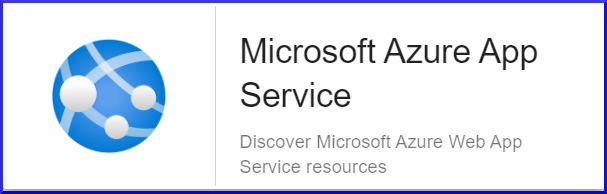

import Tabs from '@theme/Tabs';
import TabItem from '@theme/TabItem';


## Vue d'ensemble

Azure App Service est une solution qui permet de facilement créer, déployer et
mettre à l'échelle des applications web et APIs sur des conteneurs ou sur Windows
et Linux.

Le connecteur de supervision Centreon *Azure App Service* s'appuie sur les API Azure Monitor 
afin de récuperer les métriques relatives au service
App Service. Il est possible d'utiliser les 2 modes proposés par 
Microsoft: RestAPI ou Azure CLI.

## Contenu du connecteur de supervision

### Objets supervisés

* Instances Azure *App Service*

### Règles de découverte

Le connecteur de supervision Centreon *Azure App Service* inclut un *provider* de découverte d'Hôtes nommé **Microsoft Azure App Service**.
Celui-ci permet de découvrir l'ensemble des instances *App Service* rattachés à une *souscription* Microsoft Azure donnée:



> La découverte *Azure App Service* n'est compatible qu'avec le mode 'api'. Le mode 'azcli' n'est pas supporté dans le cadre
> de cette utilisation. 

Vous trouverez plus d'informations sur la découverte d'Hôtes et son fonctionnement sur la documentation du module:
[Découverte des hôtes](/docs/monitoring/discovery/hosts-discovery)

### Métriques & statuts collectés 

<Tabs groupId="sync">
<TabItem value="App-Usage" label="App-Usage">

| Metric Name                          | Description                                                                       | Unit  |
|:-------------------------------------|:----------------------------------------------------------------------------------|:------|
| appservice.connections.count         | The number of bound sockets existing in the sandbox                               | Count |
| appservice.assemblies.current.count  | The current number of assemblies loaded across all AppDomains in this application | Count |
| appservice.handle.count              | The total number of handles currently open by the app process                     | Count |
| appservice.thread.count              | The number of threads currently active in the app process                         | Count |
| appservice.appdomains.count          | The current number of AppDomains loaded in this application                       | Count |
| appservice.appdomains.unloaded.count | The total number of AppDomains unloaded since the start of the application        | Count |

</TabItem>
<TabItem value="Cpu-Time" label="Cpu-Time">

| Metric Name                     | Description                                      | Unit |
|:--------------------------------|:-------------------------------------------------|:-----|
| appservice.cpu.consumed.seconds | The amount of CPU consumed by the app in seconds | s    |

</TabItem>
<TabItem value="Data" label="Data">

| Metric Name               | Description                                          | Unit |
|:--------------------------|:-----------------------------------------------------|:-----|
| appservice.data.in.bytes  | The amount of incoming bandwidth consumed by the app | B    |
| appservice.data.out.bytes | The amount of outgoing bandwidth consumed by the app | B    |

</TabItem>
<TabItem value="File-System" label="File-System">

| Metric Name                       | Description                          | Unit |
|:----------------------------------|:-------------------------------------|:-----|
| appservice.filesystem.usage.bytes | Filesystem quota consumed by the app | B    |
 
</TabItem>
<TabItem value="Gc-Usage" label="Gc-Usage">

| Metric Name              | Description                                                                                           | Unit  |
|:-------------------------|:------------------------------------------------------------------------------------------------------|:------|
| appservice.gc.gen0.count | The number of times the generation 0 objects are garbage collected since the start of the app process | Count |
| appservice.gc.gen1.count | The number of times the generation 1 objects are garbage collected since the start of the app process | Count |
| appservice.gc.gen2.count | The number of times the generation 2 objects are garbage collected since the start of the app process | Count |

</TabItem>
<TabItem value="Health" label="Health">

| Status Name | Description                 |
|:------------|:----------------------------|
| status      | Current operational status  |
| summary     | Last related status message |

</TabItem>
<TabItem value="Http-Requests" label="Http-Requests">

| Metric Name                         | Description                                                                 | Unit  |
|:------------------------------------|:----------------------------------------------------------------------------|:------|
| appservice.http.request.count       | The total number of requests regardless of their resulting HTTP status code | Count |
| appservice.http.request.queue.count | The number of requests in the application request queue                     | Count |
| appservice.htpp.request.XXX.count   | The count of requests resulting in an HTTP status code = XXX                | Count |

</TabItem>
<TabItem value="IO-Operations" label="IO-Operations">

| Metric Name                                | Description                                                                                      | Unit |
|:-------------------------------------------|:-------------------------------------------------------------------------------------------------|:-----|
| appservice.bytes.other.bytespersecond      | The rate at which the app process is issuing bytes to I/O operations that don't involve data     | B/s  |
| appservice.operations.other.bytespersecond | The rate at which the app process is issuing I/O operations that aren't read or write operations | B/s  |
| appservice.bytes.read.bytespersecond       | The rate at which the app process is reading bytes from I/O operations                           | B/s  |
| appservice.operations.read.bytespersecond  | The rate at which the app process is issuing read I/O operations                                 | B/s  |
| appservice.bytes.write.bytespersecond      | The rate at which the app process is writing bytes to I/O operations                             | B/s  |
| appservice.operations.write.bytespersecond | The rate at which the app process is issuing write I/O operations                                | B/s  |

</TabItem>
<TabItem value="Memory" label="Memory">

| Metric Name                                | Description                                                                                           | Unit |
|:-------------------------------------------|:------------------------------------------------------------------------------------------------------|:-----|
| appservice.memory.average.usage.bytes      | The average amount of memory used by the app                                                          | B    |
| appservice.memory.usage.bytes              | The current amount of memory used by the app                                                          | B    |

</TabItem>
<TabItem value="Response-Time" label="Response-Time">

| Metric Name                           | Description                                  | Unit |
|:--------------------------------------|:---------------------------------------------|:-----|
| appservice.http.response.time.seconds | The time taken for the app to serve requests | s    |

</TabItem>
<TabItem value="Status" label="Status">

| Metric Name             | Description         | Unit  |
|:------------------------|:--------------------|:------|
| appservice.status.count | Health check status | Count |

</TabItem>
</Tabs>

## Prérequis

Rendez-vous sur la [documentation dédiée](../getting-started/how-to-guides/azure-credential-configuration.md) afin d'obtenir les prérequis nécessaires pour interroger les API d'Azure.

## Installation 

<Tabs groupId="sync">
<TabItem value="Online License" label="Online License">

1. Installer le Plugin sur tous les collecteurs Centreon devant superviser des resources Azure App Service:

```bash
yum install centreon-plugin-Cloud-Azure-Web-AppService-Api
```

2. Sur l'interface Integration de Centreon, installer le connecteur de supervision *Azure App Service* depuis la page **Configuration > Gestionnaire de connecteurs de supervision**

</TabItem>
<TabItem value="Offline License" label="Offline License">

1. Installer le Plugin sur tous les collecteurs Centreon devant superviser des resources Azure App Service:

```bash
yum install centreon-plugin-Cloud-Azure-Web-AppService-Api
```

2. Sur le serveur Central Centreon, installer le RPM du connecteur de supervision *Azure App Service*:

```bash
yum install centreon-pack-cloud-azure-web-appservice.noarch
```

3. Sur l'interface Integration de Centreon, installer le connecteur de supervision *Azure App Service* depuis la page **Configuration > Gestionnaire de connecteurs de supervision**

</TabItem>
</Tabs>

## Configuration

### Hôte

* Ajoutez un Hôte à Centreon, remplissez le champ *Adresse IP/DNS* avec l'adresse 127.0.0.1 
et appliquez-lui le Modèle d'Hôte *Cloud-Azure-Web-AppService-custom*.
* Une fois le modèle appliqué, les Macros ci-dessous indiquées comme requises (*Mandatory*) 
doivent être renseignées selon le custom-mode utilisé:

<Tabs groupId="sync">
<TabItem value="Azure Monitor API" label="Azure Monitor API">

| Mandatory | Nom               | Description                             |
|:----------|:------------------|:----------------------------------------|
| X         | AZURECUSTOMMODE   | Custom mode 'api'                       |
| X         | AZURESUBSCRIPTION | Subscription ID                         |
| X         | AZURETENANT       | Tenant ID                               |
| X         | AZURECLIENTID     | Client ID                               |
| X         | AZURECLIENTSECRET | Client secret                           |
| X         | AZURERESOURCE     | Id of the App Service instance          |

</TabItem>
<TabItem value="Azure AZ CLI" label="Azure AZ CLI">

| Mandatory | Nom               | Description                             |
|:----------|:------------------|:----------------------------------------|
| X         | AZURECUSTOMMODE   | Custom mode 'azcli'                     |
| X         | AZURESUBSCRIPTION | Subscription ID                         |
| X         | AZURERESOURCE     | Id of the App Service instance          |

</TabItem>
</Tabs>

## FAQ

### Comment puis-je tester le Plugin et que signifient les options des commandes ?

Une fois le Plugin installé, vous pouvez tester celui-ci directement en ligne de
commande depuis votre collecteur Centreon en vous connectant avec l'utilisateur
*centreon-engine*:

```bash
/usr/lib/centreon/plugins/centreon_azure_web_appservice_api.pl \
    --plugin=cloud::azure::web::appservice::plugin \
    --mode=cpu-time \
    --custommode=api \
    --subscription='xxxxxxxxx' \
    --tenant='xxxxxxxxx' \
    --client-id='xxxxxxxxx' \
    --client-secret='xxxxxxxxx' \
    --resource='APP01' \
    --resource-group='xxxxxxxxx' \
    --timeframe='900' \
    --interval='PT5M' \
    --aggregation='Total' \
    --warning-cpu-time='1' \
    --critical-cpu-time='2'
```

La commande devrait retourner un message de sortie similaire à:

```bash
OK: Instance 'APP01' Statistic 'total' Metrics CPU Time: 0.08s | 'APP01~total#appservice.cpu.consumed.seconds'=0.08s;;;0;
```

La commande ci-dessus vérifie le temps processeur consommé sur l'instance *App Service* nommée *APP01*
(```--plugin=cloud::azure::web::appservice::plugin --mode=cpu-time --resource='APP01'```).

Le mode de connexion utilisé est 'api' (```--custommode=api```), les paramètres d'authentification nécessaires à l'utilisation de ce mode
sont donc renseignés en fonction (```--subscription='xxxxxxxxx' --tenant='xxxxxxx' --client-id='xxxxxxxx' --client-secret='xxxxxxxxxx'```).

Les statuts caculés se baseront sur les valeurs totales d'un échantillon dans un intervalle de 15 minutes / 900 secondes  (```--timeframe='900'```)
avec un état retourné par tranche de 5 minutes (```--interval='PT5M'```).

Dans cet exemple, une alarme de type WARNING sera déclenchée si le temps de processeur consommé pendant l'intervalle donné
est supérieur à 1 (```--warning-cpu-time='1'```); l'alarme sera de type CRITICAL au-delà de 2
(```--critical-cpu-time='2'```).

La liste de toutes les options complémentaires et leur signification
peut être affichée en ajoutant le paramètre ```--help``` à la commande:

```bash
/usr/lib/centreon/plugins/centreon_azure_web_appservice_api.pl \
    --plugin=cloud::azure::web::appservice::plugin \
    --mode=cpu-time \
    --help
```

### Diagnostic des erreurs communes  

#### Les identifiants ont changé et mon Plugin ne fonctionne plus

Le Plugin utilise un fichier de cache pour conserver les informations de connexion afin de ne pas 
se ré-authentifier à chaque appel. Si des informations sur le Tenant, la Souscription ou les 
Client ID / Secret changent, il est nécessaire de supprimer le fichier de cache du Plugin. 

Celui ci se trouve dans le répertoire ```/var/lib/centreon/centplugins/``` avec le nom azure_api_`<md5>_<md5>_<md5>_<md5>`.

#### ```UNKNOWN: Login endpoint API returns error code 'ERROR_NAME' (add --debug option for detailed message)```

Lors du déploiement de mes contrôles, j'obtiens le message suivant : 
```UNKNOWN: Login endpoint API returns error code 'ERROR_NAME' (add --debug option for detailed message)```.

Cela signifie que l'un des paramètres utilisés pour authentifier la requête est incorrect. Le paramètre 
en question est spécifié dans le message d'erreur en lieu et place de 'ERROR_DESC'. 

Par exemple, 'invalid_client' signifie que le client-id et/ou le client-secret
n'est (ne sont) pas valide(s).

#### ```UNKNOWN: 500 Can't connect to login.microsoftonline.com:443```

Si l'utilisation d'un proxy est requise pour les connexions HTTP depuis le 
collecteur Centreon, il est nécessaire de le préciser dans la commande en
utilisant l'option ```--proxyurl='http://proxy.mycompany.com:8080'```.

Il est également possible qu'un équipement tiers de type Pare-feu bloque la requête
effectuée par le Plugin.

#### ```UNKNOWN: No metrics. Check your options or use --zeroed option to set 0 on undefined values```

Lors du déploiement de mes contrôles, j'obtiens le message suivant 'UNKNOWN: No metrics. Check your options or use --zeroed option to set 0 on undefined values'. 

Cela signifie qu'Azure n'a pas consolidé de données sur la période.

Vous pouvez ajouter ```--zeroed``` à la macro EXTRAOPTIONS du **service** en question afin de forcer le stockage d'un 0 et ainsi éviter un statut UNKNOWN.
