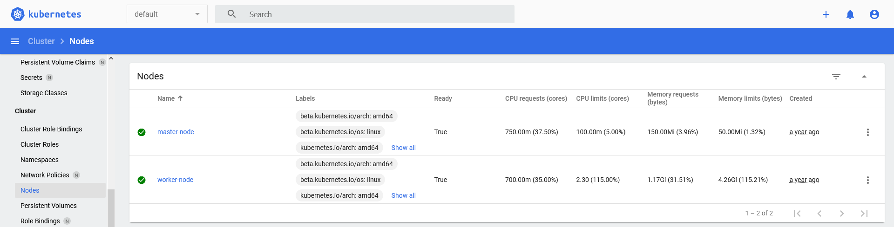
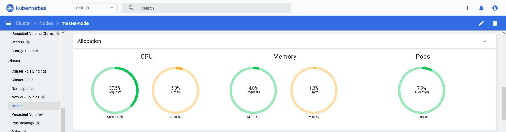

## Vue d'ensemble

Kubernetes est un système d'orchestration de conteneurs open source pour
l'automatisation de déploiement, la mise à l'échelle et la gestion
d'applications.

Ce Pack vise à superviser à la fois la couche d'infrastructure (noeuds) et
les services du cluster (deployments, daemonsets, etc).

## Contenu du Pack

Le Pack Kubernetes API offre plusieurs choix concernant la façon dont
vous pouvez organiser la supervision du cluster.

Il existe principalement trois façons :

- Rassemblez toutes les métriques sur un seul hôte Centreon avec un service
  par unité Kubernetes (i.e. deployments, daemonsets, etc) - appliquer
  la procédure [création manuelle](#creation-manuelle),
- Rassemblez toutes les métriques sur un seul hôte Centreon avec un service
  pour chaque instances de chaque unité Kubernetes - appliquer les procédures
  [création manuelle](#creation-manuelle) et
  [découverte de service](#decouverte-de-service),
- Collectez les métriques d'infrastructure (noeuds maître et noeuds de travail)
  avec un hôte Centreon par noeud Kubernetes et conserver les métriques
  d'orchestration / d'application sur un hôte unique (en utilisant l'un des 2
  scénarii précédents) - appliquer la procédure
  [découverte d'hôte](#decouverte-dhote).

Pour tous ces scénarii, la découverte et les modèles classiques seront
utilisées.

Il vous suffit de choisir la méthode qui vous plaît le plus : communiquer avec
l'API Rest exposée par le cluster Kubernetes, ou à l'aide de l'outil CLI
`kubectl` pour communiquer avec le noeud ayant le rôle control plane.

### Découverte

Le Pack Kubernetes API est fourni avec plusieurs règles de découverte.

Voici la liste des *providers* Host Discovery :

| Provider                   | Description                                                                        |
|----------------------------|------------------------------------------------------------------------------------|
| Kubernetes Nodes (RestAPI) | Découvrez les noeuds Kubernetes en interrogeant l'API Rest Kubernetes              |
| Kubernetes Nodes (Kubectl) | Découvrez les noeuds Kubernetes en interrogeant le cluster Kubernetes avec kubectl |

Les deux *providers* rechercheront les noeuds Kubernetes et les lieront à un
modèle d'hôte minimaliste pour superviser l'utilisation des noeuds en termes
d'allocation de pods, de processeur et de demandes / limites de mémoire. 

Parallèlement à cette découverte, des services unitaires peuvent être créés
grâce aux règles de Service Discovery :

| Règle                                              | Description                                                                 |
|----------------------------------------------------|-----------------------------------------------------------------------------|
| Cloud-Kubernetes-Api-CronJobs-Status               | Découvrez les CronJobs Kubernetes pour superviser leur statut               |
| Cloud-Kubernetes-Api-Daemonsets-Status             | Découvrez les DaemonSets Kubernetes pour superviser leur statut             |
| Cloud-Kubernetes-Api-Deployments-Status            | Découvrez les Deployments Kubernetes pour superviser leur statut            |
| Cloud-Kubernetes-Api-Nodes-Status                  | Découvrez les Nodes Kubernetes pour superviser leur statut                  |
| Cloud-Kubernetes-Api-Nodes-Usage                   | Découvrez les Nodes Kubernetes pour superviser leur utilisation             |
| Cloud-Kubernetes-Api-PersistentVolumes-Status      | Découvrez les PersistentVolumes Kubernetes pour superviser leur statut      |
| Cloud-Kubernetes-Api-Pods-Status                   | Découvrez les Pods Kubernetes pour superviser leur statut                   |
| Cloud-Kubernetes-Api-ReplicaSets-Status            | Découvrez les ReplicaSets Kubernetes pour superviser leur statut            |
| Cloud-Kubernetes-Api-ReplicationControllers-Status | Découvrez les ReplicationControllers Kubernetes pour superviser leur statut |
| Cloud-Kubernetes-Api-StatefulSets-Status           | Découvrez les StatefulSets Kubernetes pour superviser leur statut           |

### Modèles

Le Pack Kubernetes API apporte 2 modèles d'hôte différents à utiliser en
fonction des scénarios mentionnés précédemment :

- Modèle d'hôte tout en un qui rassemblera les contrôles et les métriques
  avec un service par unité Kubernetes :

    | Cloud-Kubernetes-Api         |
    |------------------------------|
    | Cluster Events               |
    | CronJob Status               |
    | DaemonSet Status             |
    | Deployment Status            |
    | Node Status                  |
    | Node Usage                   |
    | PersistentVolume Status      |
    | Pod Status                   |
    | ReplicatSet Status           |
    | ReplicationController Status |
    | StatefulSet Status           |

- Un modèle d'hôte minimal qui ne collectera que des métriques pour les
  noeuds Kubernetes :

    | Cloud-Kubernetes-Node-Api |
    |---------------------------|
    | Node Usage                |
    | Node Status               |

## Métriques et indicateurs supervisés

### Evénements du cluster

Cet indicateur permet de superviser le nombre d'événements se produisant sur
le cluster, comme le `kubectl get events` peut fournir :

```text
NAMESPACE   LAST SEEN   TYPE      REASON      OBJECT           MESSAGE
graphite    26m         Warning   Unhealthy   pod/graphite-0   Liveness probe failed: Get "http://10.244.2.10:8080/": context deadline exceeded (Client.Timeout exceeded while awaiting headers)
```

La sortie résultante dans Centreon pourrait ressembler à :

```text
Event 'Warning' for object 'Pod/graphite-0' with message 'Liveness probe failed: Get "http://10.244.2.10:8080/": context deadline exceeded (Client.Timeout exceeded while awaiting headers)', Count: 1, First seen: 26m 21s ago (2021-03-11T12:26:23Z), Last seen: 26m 21s ago (2021-03-11T12:26:23Z)
```

Les métriques collectées seront :

| Métrique                    |
|-----------------------------|
| `events.type.warning.count` |
| `events.type.normal.count`  |

Il est alors possible de placer des seuils à l'aide des variables spéciales
suivantes :

- `%{type}`
- `%{object}`
- `%{message}`
- `%{count}`
- `%{first_seen}`
- `%{last_seen}`
- `%{name}`
- `%{namespace}`

Les valeurs par défaut sont les suivantes :

| Seuil     | Valeur                  | Description                                                     |
|-----------|-------------------------|-----------------------------------------------------------------|
| Warning   | `%{type} =~ /warning/i` | Déclenchera une alerte s'il y a des événements `warning`        |
| Critical  | `%{type} =~ /error/i`   | Déclenchera une alerte critique s'il y a des événements `error` |

Référez vous à la
[documentation officielle](https://kubernetes.io/docs/tasks/debug-application-cluster/debug-application-introspection/)
pour plus d'informations sur les métriques collectées et comment affiner vos
seuils.

### Statut des CronJobs

Cet indicateur permet de vérifier que les CronJobs sont exécutés comme ils
le devraient, comme le `kubectl get cronjobs` peut fournir :

```text
NAME    SCHEDULE      SUSPEND   ACTIVE   LAST SCHEDULE   AGE
hello   */1 * * * *   False     1        6s              2d1h
```

La sortie résultante dans Centreon pourrait ressembler à :

```text
CronJob 'hello' Jobs Active: 1, Last schedule time: 6s ago (2021-03-11T12:31:00Z)
```

La métrique collectée pour chaque CronJobs sera :

| Métrique                    | Métrique Kubernetes      |
|-----------------------------|--------------------------|
| `cronjob.jobs.active.count` | `active`                 |

Si le service collecte des métriques de plusieurs CronJobs (selon le scénario
choisi), le nom du CronJob sera ajouté au nom de la métrique :

| Métrique                          |
|-----------------------------------|
| `hello#cronjob.jobs.active.count` |

Il est alors possible de placer des seuils à l'aide des variables spéciales
suivantes :

- `%{active}`
- `%{last_schedule}`
- `%{name}`
- `%{namespace}`

Il n'y a pas de seuils par défaut. Un exemple intéressant pourrait être le
suivant: `% {last_schedule}> x` où `x` en secondes est la durée au-delà de
laquelle le CronJob est considéré comme ne fonctionnant pas comme prévu.

Référez vous à la
[documentation officielle](https://kubernetes.io/docs/concepts/workloads/controllers/cron-jobs/)
pour plus d'informations sur les métriques collectées et comment affiner vos
seuils.

### Statut des DaemonSets

Cet indicateur garantira que les DaemonSets sont dans des limites définies
en regardant le nombre de Pods disponibles et/ou à jour par rapport au
nombre souhaité, comme le `kubectl get daemonsets` peut fournir :

```text
NAMESPACE     NAME                    DESIRED   CURRENT   READY   UP-TO-DATE   AVAILABLE   NODE SELECTOR                   AGE
kube-system   kube-flannel-ds-amd64   3         3         3       3            3           beta.kubernetes.io/arch=amd64   624d
kube-system   kube-proxy              3         3         3       3            3           kubernetes.io/os=linux          624d
```

La sortie résultante dans Centreon pourrait ressembler à :

```text
Daemonset 'kube-flannel-ds-amd64' Pods Desired: 3, Current: 3, Available: 3, Up-to-date: 3, Ready: 3, Misscheduled: 0
Daemonset 'kube-proxy' Pods Desired: 3, Current: 3, Available: 3, Up-to-date: 3, Ready: 3, Misscheduled: 0
```

Les métriques collectées pour chaque Daemonsets sera :

| Métrique                            | Métrique Kubernetes      |
|-------------------------------------|--------------------------|
| `daemonset.pods.desired.count`      | `desiredNumberScheduled` |
| `daemonset.pods.current.count`      | `currentNumberScheduled` |
| `daemonset.pods.available.count`    | `numberAvailable`        |
| `daemonset.pods.uptodate.count`     | `updatedNumberScheduled` |
| `daemonset.pods.ready.count`        | `numberReady`            |
| `daemonset.pods.misscheduled.count` | `numberMisscheduled`     |

Si le service collecte des métriques de plusieurs DaemonSets (selon le
scénario choisi), le nom du DaemonSet sera ajouté au nom de la métrique :

| Métrique                                  |
|-------------------------------------------|
| `kube-proxy#daemonset.pods.desired.count` |

Il est alors possible de placer des seuils à l'aide des variables spéciales
suivantes :

- `%{desired}`
- `%{current}`
- `%{available}`
- `%{up_to_date}`
- `%{ready}`
- `%{misscheduled}`
- `%{name}`
- `%{namespace}`

Les valeurs par défaut sont les suivantes :

| Sueil     | Valeur                       | Description                                                                                    |
|-----------|------------------------------|------------------------------------------------------------------------------------------------|
| Warning   | `%{up_to_date} < %{desired}` | Déclenchera une alerte si le nombre de Pods à jour est inférieur au nombre désiré              |
| Critical  | `%{available} < %{desired}`  | Déclenchera une alerte critique si le nombre de Pods disponible est inférieur au nombre désiré |

Référez vous à la
[documentation officielle](https://kubernetes.io/docs/concepts/workloads/controllers/daemonset/)
pour plus d'informations sur les métriques collectées et comment affiner vos
seuils.

### Statut des Deployments

Cet indicateur garantira que les Deployments sont dans des limites définies
en examinant le nombre de répliques disponibles et/ou à jour par rapport au
nombre souhaité, comme le `kubectl get deployments` peut fournir :

```text
NAMESPACE              NAME                        READY   UP-TO-DATE   AVAILABLE   AGE
kube-system            coredns                     2/2     2            2           624d
kube-system            tiller-deploy               1/1     1            1           624d
kubernetes-dashboard   dashboard-metrics-scraper   1/1     1            1           37d
kubernetes-dashboard   kubernetes-dashboard        1/1     1            1           37d
```

La sortie résultante dans Centreon pourrait ressembler à :

```text
Deployment 'coredns' Replicas Desired: 2, Current: 2, Available: 2, Ready: 2, Up-to-date: 2
Deployment 'tiller-deploy' Replicas Desired: 1, Current: 1, Available: 1, Ready: 1, Up-to-date: 1
Deployment 'dashboard-metrics-scraper' Replicas Desired: 1, Current: 1, Available: 1, Ready: 1, Up-to-date: 1
Deployment 'kubernetes-dashboard' Replicas Desired: 1, Current: 1, Available: 1, Ready: 1, Up-to-date: 1
```

Les métriques collectées pour chaque Deployments sera :

| Métrique                              | Métrique Kubernetes                 |
|---------------------------------------|-------------------------------------|
| `deployment.replicas.desired.count`   | `replicas` (dans l'entrée `spec`)   |
| `deployment.replicas.current.count`   | `replicas` (dans l'entrée `status`) |
| `deployment.replicas.available.count` | `availableReplicas`                 |
| `deployment.replicas.ready.count`     | `readyReplicas`                     |
| `deployment.replicas.uptodate.count`  | `updatedReplicas`                   |

Si le service collecte des métriques de plusieurs Deployments (selon le
scénario choisi), le nom du Deployment sera ajouté au nom de la métrique :

| Métrique                                          |
|---------------------------------------------------|
| `tiller-deploy#deployment.replicas.desired.count` |

Il est alors possible de placer des seuils à l'aide des variables spéciales
suivantes :

- `%{desired}`
- `%{current}`
- `%{available}`
- `%{ready}`
- `%{up_to_date}`
- `%{name}`
- `%{namespace}`

Les valeurs par défaut sont les suivantes :

| Seuil     | Valeur                       | Description                                                                                        |
|-----------|------------------------------|----------------------------------------------------------------------------------------------------|
| Warning   | `%{up_to_date} < %{desired}` | Déclenchera une alerte si le nombre de replicas à jour est inférieur au nombre désiré              |
| Critical  | `%{available} < %{desired}`  | Déclenchera une alerte critique si le nombre de replicas disponible est inférieur au nombre désiré |

Référez vous à la
[documentation officielle](https://kubernetes.io/docs/concepts/workloads/controllers/deployment/)
pour plus d'informations sur les métriques collectées et comment affiner vos
seuils.

### Statut des Nodes

Cet indicateur garantira que les noeuds fonctionnent bien en regardant
les statuts des conditions, comme le `kubectl describe nodes` peut lister :

```text
Conditions:
  Type             Status  LastHeartbeatTime                 LastTransitionTime                Reason                       Message
  ----             ------  -----------------                 ------------------                ------                       -------
  MemoryPressure   False   Thu, 11 Mar 2021 14:20:25 +0100   Tue, 26 Jan 2021 09:38:11 +0100   KubeletHasSufficientMemory   kubelet has sufficient memory available
  DiskPressure     False   Thu, 11 Mar 2021 14:20:25 +0100   Wed, 17 Feb 2021 09:37:40 +0100   KubeletHasNoDiskPressure     kubelet has no disk pressure
  PIDPressure      False   Thu, 11 Mar 2021 14:20:25 +0100   Tue, 26 Jan 2021 09:38:11 +0100   KubeletHasSufficientPID      kubelet has sufficient PID available
  Ready            True    Thu, 11 Mar 2021 14:20:25 +0100   Tue, 26 Jan 2021 17:26:36 +0100   KubeletReady                 kubelet is posting ready status
```

La sortie résultante dans Centreon pourrait ressembler à :

```text
Condition 'DiskPressure' Status is 'False', Reason: 'KubeletHasNoDiskPressure', Message: 'kubelet has no disk pressure'
Condition 'MemoryPressure' Status is 'False', Reason: 'KubeletHasSufficientMemory', Message: 'kubelet has sufficient memory available'
Condition 'PIDPressure' Status is 'False', Reason: 'KubeletHasSufficientPID', Message: 'kubelet has sufficient PID available'
Condition 'Ready' Status is 'True', Reason: 'KubeletReady', Message: 'kubelet is posting ready status'
```

Aucune métrique n'est collectée.

Il est possible de placer des seuils en utilisant les variables spéciales
suivantes:

- `%{type}`
- `%{status}`
- `%{reason}`
- `%{message}`

Les valeurs par défaut sont les suivantes :

| Seuil     | Valeur                       | Description                                                                                        |
|-----------|--------------------------------------------------------------------------------------------------------------------------|--------------------------------------------------------------------------------------------------------------------------------------------|
| Critical  | <code>(%{type} =~ /Ready/i && %{status} !~ /True/i) &#124;&#124; (%{type} =~ /.*Pressure/i && %{status} !~ /False/i)</code>  | Déclenchera une alerte critique si le status de la condition `Ready` n'est pas `True` ou si le statut des conditions `Pressure` n'est pas `False` |

Référez vous à la
[documentation officielle](https://kubernetes.io/docs/concepts/architecture/nodes/#condition)
pour plus d'informations sur les status et comment affiner vos seuils.

### Utilisation des Nodes

Cet indicateur rassemblera des métriques sur l'utilisation des noeuds comme
l'allocation des Pods, les demandes de CPU et de mémoire faites par ces Pods,
et les limites de CPU et de mémoire autorisées pour ces mêmes Pods.

En utilisant l'outil de ligne de commande Kubernetes, cela pourrait ressembler
à ce qui suit :

- Capacité des noeuds :

    ```shell
    kubectl get nodes -o=custom-columns="NODE:.metadata.name,PODS ALLOCATABLE:.status.allocatable.pods,CPU ALLOCATABLE:.status.allocatable.cpu,MEMORY ALLOCATABLE:.status.allocatable.memory"
    NODE          PODS ALLOCATABLE   CPU ALLOCATABLE   MEMORY ALLOCATABLE
    master-node   110                2                 3778172Ki
    worker-node   110                2                 3778184Ki
    ```

- Pods en cours d'exécution :

    ```shell
    kubectl get pods -o=custom-columns="NODE:.spec.nodeName,POD:.metadata.name,CPU REQUESTS:.spec.containers[*].resources.requests.cpu,CPU LIMITS:.spec.containers[*].resources.limits.cpu,MEMORY REQUESTS:.spec.containers[*].resources.requests.memory,MEMORY LIMITS:.spec.containers[*].resources.limits.memory"
    NODE          POD                                     CPU REQUESTS   CPU LIMITS   MEMORY REQUESTS   MEMORY LIMITS
    worker-node   coredns-74ff55c5b-g4hmt                 100m           <none>       70Mi              170Mi
    master-node   etcd-master-node                        100m           <none>       100Mi             <none>
    master-node   kube-apiserver-master-node              250m           <none>       <none>            <none>
    master-node   kube-controller-manager-master-node     200m           <none>       <none>            <none>
    master-node   kube-flannel-ds-amd64-fk59g             100m           100m         50Mi              50Mi
    worker-node   kube-flannel-ds-amd64-jwzms             100m           100m         50Mi              50Mi
    master-node   kube-proxy-kkwmb                        <none>         <none>       <none>            <none>
    worker-node   kube-proxy-vprs8                        <none>         <none>       <none>            <none>
    master-node   kube-scheduler-master-node              100m           <none>       <none>            <none>
    master-node   kubernetes-dashboard-7d75c474bb-7zc5j   <none>         <none>       <none>            <none>
    ```

Depuis le tableau de bord Kubernetes, les métriques se trouvent dans le
menu `Cluster > Nodes`:

- Liste depuis `Cluser > Nodes`:

    

- Détail de l'allocation pour un noeud :

    

La sortie résultante dans Centreon pourrait ressembler à :

```text
Node 'master-node' CPU requests: 37.50% (0.75/2), CPU limits: 5.00% (0.1/2), Memory requests: 3.96% (150.00MB/3.70GB), Memory limits: 1.32% (50.00MB/3.70GB), Pods allocation: 7.27% (8/110)
Node 'worker-node' CPU requests: 35.00% (0.7/2), CPU limits: 115.00% (2.3/2), Memory requests: 31.51% (1.17GB/3.70GB), Memory limits: 115.21% (4.26GB/3.70GB), Pods allocation: 9.09% (10/110)
```

Les métriques collectées pour chaque nœud seront :

| Métrique                     |
|------------------------------|
| `cpu.requests.percentage`    |
| `cpu.limits.percentage`      |
| `memory.requests.percentage` |
| `memory.limits.percentage`   |
| `pods.allocation.percentage` |

Si le service collecte des métriques de plusieurs Nodes (selon le scénario
choisi), le nom du Node sera ajouté au nom de la métrique:

| Métrique                                 |
|------------------------------------------|
| `worker-node#pods.allocation.percentage` |

Des seuils exprimés en pourcentage peuvent être définis pour toutes les
métriques, pour les alertes et les alertes critiques.

### Statut des PersistentVolumes

Cet indicateur garantira que les PersistentVolumes fonctionnent correctement
en regardant la phase dans laquelle ils se trouvent, comme le
`kubectl get pv` peut fournir :

```text
NAME                     CAPACITY   ACCESS MODES   RECLAIM POLICY   STATUS      CLAIM                   STORAGECLASS   REASON   AGE
pv-nfs-kubestorage-001   5Gi        RWO            Retain           Available                                                   630d
pv-nfs-kubestorage-002   5Gi        RWO            Retain           Bound       tick/data-influxdb                              630d
pv-nfs-kubestorage-003   5Gi        RWO            Retain           Released    graphite/graphite-pvc                           630d
```

La sortie résultante dans Centreon pourrait ressembler à :

```text
Persistent Volume 'pv-nfs-kubestorage-001' Phase is 'Available'
Persistent Volume 'pv-nfs-kubestorage-002' Phase is 'Bound'
Persistent Volume 'pv-nfs-kubestorage-003' Phase is 'Released'
```

Aucune métrique n'est collectée.

Il est possible de placer des seuils en utilisant les variables spéciales
suivantes :

- `%{phase}`
- `%{name}`

Les valeurs par défaut sont les suivantes :

| Seuil     | Valeur                                    | Description                                                                              |
|-----------|-------------------------------------------|------------------------------------------------------------------------------------------|
| Critical  | `%{phase} !~ /Bound|Available|Released/i` | Déclenchera une alerte critique si la phase n'est pas `Bound`, `Available` ou `Released` |

Référez vous à la
[documentation officielle](https://kubernetes.io/docs/concepts/storage/persistent-volumes/)
pour plus d'informations sur les status et comment affiner vos seuils.

### Statut des Pods

Cet indicateur garantira que les Pods et leurs conteneurs sont dans des
limites définies en regardant le nombre de conteneurs prêts par rapport au
nombre souhaité, comme le `kubectl get pods` peut fournir :

```text
NAMESPACE              NAME                                                     READY   STATUS        RESTARTS   AGE
kube-system            kube-proxy-65zhn                                         1/1     Running       0          37d
kube-system            kube-proxy-kkwmb                                         1/1     Running       0          37d
kube-system            kube-proxy-vprs8                                         1/1     Running       0          37d
kube-system            tiller-deploy-7bf78cdbf7-z5n24                           1/1     Running       5          550d
kubernetes-dashboard   dashboard-metrics-scraper-79c5968bdc-vncxc               1/1     Running       0          37d
kubernetes-dashboard   kubernetes-dashboard-7448ffc97b-42rps                    1/1     Running       0          37d
```

La sortie résultante dans Centreon pourrait ressembler à :

```text
Checking pod 'kube-proxy-65zhn'
    Containers Ready: 1/1 (100.00%), Status is 'Running', Restarts: 0
    Container 'kube-proxy' Status is 'running', State is 'ready', Restarts: 0
Checking pod 'kube-proxy-kkwmb'
    Containers Ready: 1/1 (100.00%), Status is 'Running', Restarts: 0
    Container 'kube-proxy' Status is 'running', State is 'ready', Restarts: 0
Checking pod 'kube-proxy-vprs8'
    Containers Ready: 1/1 (100.00%), Status is 'Running', Restarts: 0
    Container 'kube-proxy' Status is 'running', State is 'ready', Restarts: 0
Checking pod 'tiller-deploy-7bf78cdbf7-z5n24'
    Containers Ready: 1/1 (100.00%), Status is 'Running', Restarts: 5
    Container 'tiller' Status is 'running', State is 'ready', Restarts: 5
Checking pod 'dashboard-metrics-scraper-79c5968bdc-vncxc'
    Containers Ready: 1/1 (100.00%), Status is 'Running', Restarts: 0
    Container 'dashboard-metrics-scraper' Status is 'running', State is 'ready', Restarts: 0
Checking pod 'kubernetes-dashboard-7448ffc97b-42rps'
    Containers Ready: 1/1 (100.00%), Status is 'Running', Restarts: 0
    Container 'kubernetes-dashboard' Status is 'running', State is 'ready', Restarts: 0
```

Les métriques collectées pour chaque Pods seront :

| Métrique                    |
|-----------------------------|
| `containers.ready.count`    |
| `restarts.total.count`      |
| `containers.restarts.count` |

Si le service collecte des métriques de plusieurs Pods (en fonction du
scénario choisi), le nom du Pod et le nom du conteneur seront ajoutés au
nom de la métrique :

| Métrique                                                    |
|-------------------------------------------------------------|
| `coredns-74ff55c5b-g4hmt#containers.ready.count`            |
| `coredns-74ff55c5b-g4hmt#restarts.total.count`              |
| `coredns-74ff55c5b-g4hmt_coredns#containers.restarts.count` |

Il est alors possible de placer des seuils à l'aide des variables spéciales
suivantes :

- `%{name}`
- `%{status}`
- `%{state}` (containers seulement)
- `%{name}`
- `%{namespace}` (Pods seulement)

Les valeurs par défaut sont les suivantes :

| Seuil                | Valeur                                                                  | Description                                                                                      |
|----------------------|-------------------------------------------------------------------------|--------------------------------------------------------------------------------------------------|
| Critical (Pod)       | `%{status} !~ /running/i`                                               | Déclenchera une alerte critique si un Pod n'est pas en statut `running`                          |
| Critical (conteneur) | <code>%{status} !~ /running/i &#124;&#124; %{state} !~ /^ready$/</code> | Déclenchera une alerte critique si un conteneur n'est pas en statut `running` ou en état `ready` |

Référez vous à la
[documentation officielle](https://kubernetes.io/docs/concepts/workloads/pods/)
pour plus d'informations sur les métriques collectées et comment affiner vos
seuils.

### Statut des ReplicaSets

Cet indicateur garantira que les ReplicaSets sont dans les limites définies
en regardant le nombre de répliques prêtes par rapport au nombre souhaité,
comme le `kubectl get replicasets` peut fournir :

```text
NAMESPACE              NAME                                   DESIRED   CURRENT   READY   AGE
kube-system            coredns-74ff55c5b                      2         2         2       44d
kube-system            tiller-deploy-7bf78cdbf7               1         1         1       630d
kubernetes-dashboard   dashboard-metrics-scraper-79c5968bdc   1         1         1       44d
kubernetes-dashboard   kubernetes-dashboard-7448ffc97b        1         1         1       44d
```

La sortie résultante dans Centreon pourrait ressembler à :

```text
ReplicaSet 'coredns-74ff55c5b' Replicas Desired: 2, Current: 2, Ready: 2
ReplicaSet 'tiller-deploy-7bf78cdbf7' Replicas Desired: 1, Current: 1, Ready: 1
ReplicaSet 'dashboard-metrics-scraper-79c5968bdc' Replicas Desired: 1, Current: 1, Ready: 1
ReplicaSet 'kubernetes-dashboard-7448ffc97b' Replicas Desired: 1, Current: 1, Ready: 1
```

Les métriques collectées pour chaque ReplicaSets seront :

| Métrique                            | Métrique Kubernetes                 |
|-------------------------------------|-------------------------------------|
| `replicaset.replicas.desired.count` | `replicas` (dans l'entrée `spec`)   |
| `replicaset.replicas.current.count` | `replicas` (dans l'entrée `status`) |
| `replicaset.replicas.ready.count`   | `readyReplicas`                     |

Si le service collecte des métriques de plusieurs ReplicaSets (selon le
scénario choisi), le nom du ReplicaSet sera ajouté au nom de la métrique :

| Métrique                                                     |
|--------------------------------------------------------------|
| `tiller-deploy-7bf78cdbf7#replicaset.replicas.desired.count` |

Il est alors possible de placer des seuils à l'aide des variables spéciales
suivantes :

- `%{desired}`
- `%{current}`
- `%{ready}`
- `%{name}`
- `%{namespace}`

Les valeurs par défaut sont les suivantes :

| Seuil     | Valeur                  | Description                                                                                                 |
|-----------|-------------------------|-------------------------------------------------------------------------------------------------------------|
| Critical  | `%{ready} < %{desired}` | Déclenchera une alerte critique si le nombre de réplique en status `ready` est inférieur au nombre souhaité |

Référez vous à la
[documentation officielle](https://kubernetes.io/docs/concepts/workloads/controllers/replicaset/)
pour plus d'informations sur les métriques collectées et comment affiner vos
seuils.

### Statut des ReplicationControllers

Cet indicateur garantira que les ReplicationControllers sont dans les limites
définies en regardant le nombre de répliques prêtes par rapport au nombre
souhaité, comme le `kubectl get rc` peut fournir :

```text
NAMESPACE   NAME    DESIRED   CURRENT   READY   AGE
elk         nginx   3         3         3       2d19h
```

La sortie résultante dans Centreon pourrait ressembler à :

```text
ReplicationController 'nginx' Replicas Desired: 3, Current: 3, Ready: 3
```

Les métriques collectées pour chaque ReplicaSets seront :

| Métrique                                       | Métrique Kubernetes                 |
|------------------------------------------------|-------------------------------------|
| `replicationcontroller.replicas.desired.count` | `replicas` (dans l'entrée `spec`)   |
| `replicationcontroller.replicas.current.count` | `replicas` (dans l'entrée `status`) |
| `replicationcontroller.replicas.ready.count`   | `readyReplicas`                     |

Si le service collecte des métriques de plusieurs ReplicationControllers
(selon le scénario choisi), le nom du ReplicationController sera ajouté au
nom de la métrique :

| Métrique                                             |
|------------------------------------------------------|
| `nginx#replicationcontroller.replicas.desired.count` |

Il est alors possible de placer des seuils à l'aide des variables spéciales
suivantes :

- `%{desired}`
- `%{current}`
- `%{ready}`
- `%{name}`
- `%{namespace}`

Les valeurs par défaut sont les suivantes :

| Seuil     | Valeur                  | Description                                                                                                 |
|-----------|-------------------------|-------------------------------------------------------------------------------------------------------------|
| Critical  | `%{ready} < %{desired}` | Déclenchera une alerte critique si le nombre de réplique en status `ready` est inférieur au nombre souhaité |

Référez vous à la
[documentation officielle](https://kubernetes.io/docs/concepts/workloads/controllers/replicationcontroller/)
pour plus d'informations sur les métriques collectées et comment affiner vos
seuils.

### Statut des StatefulSets

Cet indicateur garantira que les StatefulSets sont dans des limites définies
en regardant le nombre de répliques prêtes / à jour par rapport au nombre
souhaité, comme le `kubectl get statefulsets` peut fournir :

```text
NAMESPACE    NAME                                        READY   AGE
elk          elasticsearch-master                        2/2     44d
graphite     graphite                                    1/1     3d
prometheus   prometheus-prometheus-operator-prometheus   1/1     619d
```

La sortie résultante dans Centreon pourrait ressembler à :

```text
StatefulSet 'elasticsearch-master' Replicas Desired: 2, Current: 2, Up-to-date: 2, Ready: 2
StatefulSet 'graphite' Replicas Desired: 1, Current: 1, Up-to-date: 1, Ready: 1
StatefulSet 'prometheus-prometheus-operator-prometheus' Replicas Desired: 1, Current: 1, Up-to-date: 1, Ready: 1
```

Les métriques collectées pour chaque StatefulSets seront :

| Métrique                              | Métrique Kubernetes               |
|---------------------------------------|-----------------------------------|
| `statefulset.replicas.desired.count`  | `replicas` (dans l'entrée `spec`) |
| `statefulset.replicas.current.count`  | `currentReplicas`                 |
| `statefulset.replicas.ready.count`    | `readyReplicas`                   |
| `statefulset.replicas.uptodate.count` | `updatedReplicas`                 |

Si le service collecte des métriques de plusieurs StatefulSets (selon le
scénario choisi), le nom du StatefulSet sera ajouté au nom de la métrique :

| Métrique                                      |
|-----------------------------------------------|
| `graphite#statefulset.replicas.desired.count` |

Il est alors possible de placer des seuils à l'aide des variables spéciales
suivantes :

- `%{desired}`
- `%{current}`
- `%{ready}`
- `%{up_to_date}`
- `%{name}`
- `%{namespace}`

Les valeurs par défaut sont les suivantes :

| Seuil    | Valeur                       | Description                                                                                                 |
|----------|------------------------------|-------------------------------------------------------------------------------------------------------------|
| Warning  | `%{up_to_date} < %{desired}` | Déclenchera une alerte si le nombre de réplique à jour est inférieur au nombre souhaité                     |
| Critical | `%{ready} < %{desired}`      | Déclenchera une alerte critique si le nombre de réplique en status `ready` est inférieur au nombre souhaité |

Référez vous à la
[documentation officielle](https://kubernetes.io/docs/concepts/workloads/controllers/statefulset/)
pour plus d'informations sur les métriques collectées et comment affiner vos
seuils.

## Prérequis

### Centreon Plugin

Installez ce plugin sur chaque Poller nécessaire :

```shell
yum install centreon-plugin-Cloud-Kubernetes-Api
```

### Kubernetes

Comme mentionné dans l'introduction, deux modes de communication sont
disponibles:

- l'API Rest exposée par le cluster Kubernetes,
- l'outil CLI kubectl pour communiquer avec le *control plane* du cluster.

Pour de meilleures performances, nous vous recommandons d'utiliser l'API Rest.

#### Créer un compte de service

Les deux versions peuvent utiliser un compte de service avec des droits
suffisants pour accéder à l'API Kubernetes.

Créez un compte de service dédié `centreon-service-account` dans l'espace de
noms `kube-system` pour accéder à l'API:

```shell
kubectl create serviceaccount centreon-service-account --namespace kube-system
```

Créez un rôle de cluster `api-access` avec les privilèges nécessaires pour le
Plugin et liez-le au compte de service nouvellement créé :

```shell
cat <<EOF | kubectl create -f -
apiVersion: rbac.authorization.k8s.io/v1
kind: ClusterRole
metadata:
  name: api-access
rules:
  - apiGroups:
      - ""
      - apps
      - batch
    resources:
      - cronjobs
      - daemonsets
      - deployments
      - events
      - namespaces
      - nodes
      - persistentvolumes
      - pods
      - replicasets
      - replicationcontrollers
      - statefulsets
    verbs:
      - get
      - list
---
apiVersion: rbac.authorization.k8s.io/v1
kind: ClusterRoleBinding
metadata:
  name: api-access
roleRef:
  apiGroup: rbac.authorization.k8s.io
  kind: ClusterRole
  name: api-access
subjects:
- kind: ServiceAccount
  name: centreon-service-account
  namespace: kube-system
EOF
```

Se référer à la documentation officielle pour la
[création de compte de service](https://kubernetes.io/docs/reference/access-authn-authz/authentication/#service-account-tokens)
ou pour des informations sur le
[concept de secret](https://kubernetes.io/docs/concepts/configuration/secret/).

#### Utilisation de l'API Rest

Si vous avez choisi de communiquer avec l'API Rest de votre plate-forme
Kubernetes, les conditions préalables suivantes doivent être remplies :

- Exposez l'API avec TLS,
- Récupérez le jeton du compte de service.

##### Exposez l'API

Comme l'API utilise HTTPS, vous aurez besoin d'un certificat.

Vous pouvez créer un couple clé / certificat signé automatiquement avec la
commande suivante :

```shell
openssl req -x509 -nodes -days 365 -newkey rsa:2048 -keyout /etc/ssl/private/kubernetesapi.key -out /etc/ssl/certs/kubernetesapi.crt
```

Puis chargez-le en tant que `api-certificate` dans le cluster, à partir du
noeud maître :

```shell
kubectl create secret tls api-certificate --key /etc/ssl/private/kubernetesapi.key --cert /etc/ssl/certs/kubernetesapi.crt
```

L'entrée peut maintenant être créée :

```shell
cat <<EOF | kubectl create -f -
apiVersion: extensions/v1beta1
kind: Ingress
metadata:
  name: kubernetesapi-ingress
  namespace: default
  annotations:
    kubernetes.io/ingress.class: "nginx"
    nginx.ingress.kubernetes.io/backend-protocol: HTTPS
spec:
  tls:
    - hosts:
      - kubernetesapi.local.domain
      secretName: api-certificate
  rules:
  - host: kubernetesapi.local.domain
    http:
      paths:
      - backend:
          serviceName: kubernetes
          servicePort: 443
        path: /
EOF
```

Adaptez les entrées *host* à vos besoins.

Se référer à la documentation officielle pour la
[gestion des ingress](https://kubernetes.io/docs/concepts/services-networking/ingress/).

##### Récupérer le jeton du compte de service

Récupérez le *secret* du compte de service précédemment créé :

```shell
kubectl get serviceaccount centreon-service-account --namespace kube-system --output jsonpath='{.secrets[].name}'
```

Récupérez ensuite le jeton du *secret* du compte de service :

```shell
kubectl get secrets centreon-service-account-token-xqw7m --namespace kube-system --output jsonpath='{.data.token}' | base64 --decode
```

Ce jeton sera utilisé ultérieurement pour la configuration de l'hôte Centreon.

#### Utilisation de kubectl

Si vous avez choisi de communiquer avec le *control plane* du cluster avec
kubectl, les conditions préalables suivantes doivent être remplies:

- Installez l'outil kubectl,
- Créez une configuration kubectl.

Ces actions sont nécessaires sur tous les Pollers qui effectueront la
surveillance de Kubernetes.

##### Installer kubectl

Téléchargez la dernière version avec la commande suivante :

```shell
curl -LO "https://dl.k8s.io/release/$(curl -L -s https://dl.k8s.io/release/stable.txt)/bin/linux/amd64/kubectl"
```

> Assurez-vous de télécharger une version avec une différence d'au maximum
> une version mineure de votre cluster. Pour télécharger une version
> spécifique, changez le *curl* intégrée par la version comme `v1.20.0`.

Installez l'outil dans le répertoire des binaires :

```shell
sudo install -o root -g root -m 0755 kubectl /usr/local/bin/kubectl
```

Référez vous à la
[documentation officielle](https://kubernetes.io/docs/tasks/tools/install-kubectl-linux/)
pour plus de détails.

##### Créer une configuration kubectl

Pour accéder au cluster, kubectl a besoin d'un fichier de configuration
contenant toutes les informations nécessaires.

Voici un exemple de création de fichier de configuration basé sur un compte
de service (créé au [chapitre précédent](#creer-un-compte-de-service)).

Vous devrez remplir les informations suivantes et exécuter les commandes
sur le noeud maître:

```shell
ip=<master node ip>
port=<api port>
account=centreon-service-account
namespace=kube-system
clustername=my-kube-cluster
context=my-kube-cluster
secret=$(kubectl get serviceaccount $account --namespace $namespace --output jsonpath='{.secrets[].name}')
ca=$(kubectl get secret $secret --namespace $namespace --output jsonpath='{.data.ca\.crt}')
token=$(kubectl get secret $secret --namespace $namespace --output jsonpath='{.data.token}' | base64 --decode)
```

> Le nom du compte et l'espace de noms doivent correspondre au compte créé
> précédemment. Toutes les autres informations doivent être adaptées.

Exécutez ensuite cette commande pour générer le fichier de configuration :

```shell
cat <<EOF >> config
apiVersion: v1
kind: Config
clusters:
- name: ${clustername}
  cluster:
    certificate-authority-data: ${ca}
    server: https://${ip}:${port}
contexts:
- name: ${context}
  context:
    cluster: ${clustername}
    namespace: ${namespace}
    user: ${account}
current-context: ${context}
users:
- name: ${account}
  user: ${token}
EOF
```

Cela créera un fichier `config`. Ce fichier doit être copié dans le répertoire
racine de l'utilisateur de l'Engine du Poller, généralement dans un répertoire
`.kube` (c'est-à-dire `/var/lib/centreon-engine/.kube/config`).

Ce chemin sera utilisé ultérieurement dans la configuration de l'hôte Centreon.

> Vous pouvez également copier la configuration dans le répertoire de
> l'utilisateur Gorgone si vous utilisez Host Discovery.

Référez vous à la
[documentation officielle](https://kubernetes.io/docs/concepts/configuration/organize-cluster-access-kubeconfig/)
pour plus de détails.

## Configuration de la supervision

### Création manuelle

Ajoutez un hôte à partir du menu `Configuration> Hosts` et choisissez un
modèle entre `Cloud-Kubernetes-Api` (surveillance globale, scénarios 1 et 2)
et `Cloud-Kubernetes-Node-Api` (surveillance unitaire, scénario 3) dans la
liste.

Dans les deux cas, remplissez les champs suivants :

| Champ          | Description           |
|----------------|-----------------------|
| Host name      | Nom de l'hôte         |
| Alias          | Description de l'hôte |
| IP             | Adresse IP de l'hôte  |
| Monitored from | Poller à utiliser     |

> L'adresse IP peut être soit l'adresse IP de Kubernetes (noeud maître),
> soit l'adresse IP de chaque noeud si vous choisissez le modèle
> `Cloud-Kubernetes-Node-Api`.

Ensuite, définissez les valeurs pour chaque macros nécessaire :

- Si vous utiliser l'API Rest :

    | Macro                     | Description                                          | Exemple                     |
    |---------------------------|------------------------------------------------------|-----------------------------|
    | `KUBERNETESAPICUSTOMMODE` | Mode custom du plugin                                | `api`                       |
    | `KUBERNETESAPIHOSTNAME`   | Nom d'hôte ou adresse IP du service d'API du clister | `kubenetesapi.local.domain` |
    | `KUBERNETESAPIPORT`       | Port de l'API                                        | `443`                       |
    | `KUBERNETESAPIPROTO`      | Protocole utilisé par l'API                          | `https`                     |
    | `KUBERNETESAPITOKEN`      | Jeton récupéré lié au compte de service              | `eyJhbG...KEw`              |

- Si vous utiliser kubectl :

    | Macro                     | Description                             | Exemple          |
    |---------------------------|-----------------------------------------|------------------|
    | `KUBERNETESAPICUSTOMMODE` | Mode custom du plugin                   | `kubectl`        |
    | `KUBECTLCONFIGFILE`       | Chemin vers le fichier de configuration | `~/.kube/config` |

Ensuite, définissez les valeurs pour chaque macros nécessaire :

| Macro          | Description                                        | Valeur par défaut |
|----------------|----------------------------------------------------|-------------------|
| `PROXYURL`     | URL du proxy (si nécessaire)                       | aucune            |
| `TIMEOUT`      | Temps en secondes avant l'expiration de la requête | `10`              |
| `EXTRAOPTIONS` | Options supplémentaires (si nécessaire)            | aucune            |

Si vous choisissez `Cloud-Kubernetes-Api`, l'hôte sera ajouté avec tous les
services pour vérifier chaque unité Kubernetes (scénario 1).

Cliquez sur le bouton **Enregistrer** et vous êtes prêt à pousser la
configuration vers les Engines.

### Découverte automatique

#### Découverte d'hôte

Ajoutez une tâche dans le menu `Configuration > Découverte` et choisissez
un *provider* entre `Kubernetes Nodes (RestAPI)` et
`Kubernetes Nodes (Kubectl)` dans la liste.

Définissez les informations d'identification pour accéder à l'API Kubernetes
en fonction de la méthode choisie:

- Si vous utilisez l'API Rest: définissez le jeton
  [récupérer plus tôt](#recuperer-le-jeton-du-compte-de-service) à partir du
  compte de service,
- Si vous utilisez kubectl: définissez le chemin vers le
  [fichier de configuration créé](#creer-une-configuration-kubectl)
  (préférez utiliser le chemin relatif pour le faire fonctionner à la fois
  pour la découverte et la supervision, c'est-à-dire `~/.kube/config`).

Pour l'API Rest: le nom d'hôte / l'adresse, le port et le protocole sont
nécessaires pour accéder à l'API Kubernetes.

Par défaut, la découverte ajoutera des hôtes avec un modèle d'hôte minimal
qui ne collectera que des métriques pour l'utilisation des noeuds Kubernetes.
Il ajoutera ensuite une macro spéciale `KUBERNETESNODENAME` avec le nom du
noeud comme valeur (scénario 3).

S'il est planifié, la tâche ajoutera automatiquement les nouveaux noeuds
ajoutés au cluster.

#### Découverte de service

En plus de la [création manuelle](#creation-manuelle), il est possible
d'ajouter un service pour chaque instance de chaque unité Kubernetes
(scénario 2). Il est alors recommandé de désactiver les services précédemment
créés lors de l'ajout d'hôte.

Lancez une analyse sur l'hôte ajouté à partir du menu
`Configuration > Service > Manuelle` et ajoutez tous les services souhaités.

Si elle est activée, la règle de découverte de service ajoutera
automatiquement les nouvelles instances créées dans le cluster.

## Dépannage

Voici quelques erreurs courantes et leur description. Vous voudrez souvent
utiliser l'option `--debug` pour obtenir l'erreur exacte.

| Erreur                                                                                                 | Description                                                                                                                                                                                                                                                                                               |
|--------------------------------------------------------------------------------------------------------|-----------------------------------------------------------------------------------------------------------------------------------------------------------------------------------------------------------------------------------------------------------------------------------------------------------|
| `UNKNOWN: Cannot decode json response: Can't connect to <hostname>:<port> (certificate verify failed)` | This error may appear if the TLS cetificate in self-signed. Use the option `--ssl-opt="SSL_verify_mode => SSL_VERIFY_NONE"` to omit the certificate validity.                                                                                                                                             |
| `UNKNOWN: API return error code '401' (add --debug option for detailed message)`                       | If adding `--debug` option, API response message says `Unauthorized`. It generally means that the provided token is not valid.                                                                                                                                                                            |
| `UNKNOWN: API return error code '403' (add --debug option for detailed message)`                       | If adding `--debug` option, API response message says `nodes is forbidden: User "system:serviceaccount:<namespace>:<account>" cannot list resource "nodes" in API group "" at the cluster scope`. It means that the cluster role RBAC bound to the service account does not have the necessary privileges |
| `UNKNOWN: CLI return error code '1' (add --debug option for detailed message)`                         | If adding `--debug` option, CLI response message says `error: stat ~/.kube/config:: no such file or directory`. The provided configuration file cannot be found.                                                                                                                                          |
| `UNKNOWN: CLI return error code '1' (add --debug option for detailed message)`                         | If adding `--debug` option, CLI response message says `error: error loading config file "/root/.kube/config": open /root/.kube/config: permission denied`. The provided configuration file cannot be read by current user.                                                                                |
| `UNKNOWN: CLI return error code '1' (add --debug option for detailed message)`                         | If adding `--debug` option, CLI response message says `error: error loading config file "/root/.kube/config": v1.Config.AuthInfos: []v1.NamedAuthInfo: v1.NamedAuthInfo.AuthInfo: v1.AuthInfo.ClientKeyData: decode base64: illegal base64...`. The provided configuration file is not valid.             |
| `UNKNOWN: CLI return error code '1' (add --debug option for detailed message)`                         | If adding `--debug` option, CLI response message says `The connection to the server <hostname>:<port> was refused - did you specify the right host or port?`. The provided configuration file is not valid.             |
