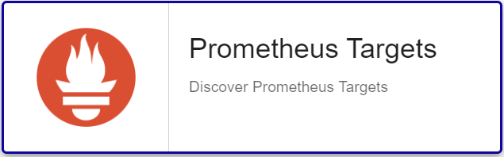

import Tabs from '@theme/Tabs';
import TabItem from '@theme/TabItem';

## Contenu du Pack

### Modèles

Le connecteur de supervision Centreon **Prometheus Server** apporte 2 modèles d'hôte différents :

* Cloud-Prometheus-Api-custom
* Cloud-Prometheus-Target-Name-Api-custom

Il apporte les modèles de service suivants :

| Alias              | Modèle de service                       | Description                                                  | Défaut |
| :----------------- | :-------------------------------------- | :----------------------------------------------------------- | :----- |
| Expression         | Cloud-Prometheus-Expression-Api         | Permet la supervision de n'importe quelle métrique collectée et stockée par Prometheus |        |
| Target-Name-Status | Cloud-Prometheus-Target-Name-Status-Api | Contrôle le status des targets Prometheus                     | X      |
| Target-Status      | Cloud-Prometheus-Target-Status-Api      | Contrôle le status de toutes les targets Prometheus           | X      |

### Règles de découverte

Le connecteur de supervision Centreon **Prometheus Server** inclut un fournisseur de découverte
d'hôtes nommé **Prometheus Targets**. Celui-ci permet de découvrir l'ensemble targets supervisés par un serveur Prometheus :



### Métriques & statuts collectés

<Tabs groupId="sync">
<TabItem value="Expression" label="Expression">

Mode générique pour exécuter des requêtes PromQL.

| Métrique | Unité |
| :------- | :---- |
| status   |       |

</TabItem>
<TabItem value="Target-Name-Status" label="Target-Name-Status">

| Métrique              | Unité |
| :-------------------- | :---- |
| targets.active.count  | count |
| targets.down.count    | count |
| targets.dropped.count | count |
| targets.unknown.count | count |
| targets.up.count      | count |
| *targets*#status      |       |

</TabItem>
<TabItem value="Target-Status" label="Target-Status">

| Métrique              | Unité |
| :-------------------- | :---- |
| targets.active.count  | count |
| targets.down.count    | count |
| targets.dropped.count | count |
| targets.unknown.count | count |
| targets.up.count      | count |
| *targets*#status      |       |

</TabItem>
</Tabs>

## Prérequis

Le Collecteur Centreon doit être en mesure d'executer des requêtes HTTP(S) vers le 
Serveur Prometheus.

## Installation

<Tabs groupId="sync">
<TabItem value="Online License" label="Online License">

1. Installez le plugin sur tous les collecteurs Centreon devant superviser des ressources **Prometheus Server** :

```bash
yum install centreon-plugin-Cloud-Prometheus-Api
```

2. Sur l'interface web de Centreon, installez le connecteur de supervision **Prometheus Server** depuis la page **Configuration > Packs de plugins**.

</TabItem>
<TabItem value="Offline License" label="Offline License">

1. Installez le plugin sur tous les collecteurs Centreon devant superviser des ressources **Prometheus Server** :

```bash
yum install centreon-plugin-Cloud-Prometheus-Api
```

2. Sur le serveur central Centreon, installez le RPM du connecteur de supervision **Prometheus Server** :

```bash
yum install centreon-pack-cloud-prometheus-api
```

3. Sur l'interface web de Centreon, installez le connecteur de supervision **Prometheus Server** depuis la page **Configuration > Packs de plugins**.

</TabItem>
</Tabs>

## Configuration

### Hôte

<Tabs groupId="sync">
<TabItem value="Cloud-Prometheus-Api-Custom" label="Cloud-Prometheus-Api-Custom">

Modèle permettant la supervision du serveur Prometheus.

* Ajoutez un hôte à Centreon depuis la page **Configuration > Hôtes**.
* Complétez les champs **Nom**, **Alias** & **IP Address/DNS** correspondant à votre serveur **Prometheus Server**.
* Appliquez le modèle d'hôte **Cloud-Prometheus-Api-custom**.
* Une fois le modèle appliqué, les macros ci-dessous indiquées comme requises (**Obligatoire**) doivent être renseignées.

| Obligatoire | Macro                 | Description                                                  |
| :---------- | :-------------------- | :----------------------------------------------------------- |
|             | EXTRAOPTIONS          | Options supplémentaires à ajouter à l'ensemble des commandes de l'hôte (ex: --verbose) |
| X           | PROMETHEUSAPIPORT     | (Défaut : '9090')                                            |
| X           | PROMETHEUSAPIPROTO    | (Défaut : 'http')                                            |
| X           | PROMETHEUSAPIURL      | (Défaut : '/api/v1')                                         |

</TabItem>

<TabItem value="Cloud-Prometheus-Target-Name-Api-Custom" label="Cloud-Prometheus-Target-Name-Api-Custom">

Modèle permettant la supervision de targets Prometheus.

* Ajoutez un hôte à Centreon depuis la page **Configuration > Hôtes**.
* Complétez les champs **Nom**, **Alias** & **IP Address/DNS** correspondant à votre target.
* Appliquez le modèle d'hôte **Cloud-Prometheus-Target-Name-Api-Custom**.
* Une fois le modèle appliqué, les macros ci-dessous indiquées comme requises (**Obligatoire**) doivent être renseignées.

| Obligatoire | Macro                 | Description                                                  |
| :---------- | :-------------------- | :----------------------------------------------------------- |
|             | EXTRAOPTIONS          | Options supplémentaires à ajouter à l'ensemble des commandes de l'hôte (ex: --verbose) |
| X           | FILTERLABEL           | Filter label to filter on a specific target. Example: 'instance,10.10.1.199:9182'                       |
| X           | PROMETHEUSAPIHOSTNAME | Prometheus server name or IP address                         |
| X           | PROMETHEUSAPIPORT     | (Défaut : '9090')                                            |
| X           | PROMETHEUSAPIPROTO    | (Défaut : 'http')                                            |
| X           | PROMETHEUSAPIURL      | (Défaut : '/api/v1')                                         |

</TabItem>
</Tabs>

## FAQ

### Comment tester le Plugin en ligne de commande et à quoi correspondent les options?

> Note: Le mode décrit ci-dessous ne fonctionne que lorsque le modèle est appliqué sur
un hôte étant un serveur Prometheus.

Une fois le Plugin installé, connectez-vous au Collecteur Centreon et utilisez l'utilisateur
*centreon-engine* pour lancer la commande suivante: 

```bash
/usr/lib/centreon/plugins//centreon_prometheus_api.pl \
    --plugin=cloud::prometheus::restapi::plugin \
    --mode=target-status \
    --hostname=amzprometheus.int.centreon.com \
    --url-path='/api/v1' --port='9090' --proto='http' \
    --filter-label='job,coredns' \
    --warning-status='' --critical-status='%\{health\} !~ /up/' 
```

La commande devrait retourner un message de sortie similaire à :

```bash
OK: Targets Active: 2, Dropped: 175, Up: 2, Down: 0, Unknown: 0 - All targets status are ok | 'targets.active.count'=2;;;0; 'targets.dropped.count'=175;;;0; 'targets.up.count'=2;;;0; 'targets.down.count'=0;;;0; 'targets.unknown.count'=0;;;0;
Target 'http://10.244.1.249:9153/metrics' health is 'up' [pod = coredns-74ff55c5b-g4hmt][namespace = kube-system][service = prometheus-operator-coredns][instance = 10.244.1.249:9153][job = coredns][endpoint = http-metrics]
Target 'http://10.244.2.5:9153/metrics' health is 'up' [pod = coredns-74ff55c5b-vh9zt][namespace = kube-system][service = prometheus-operator-coredns][instance = 10.244.2.5:9153][job = coredns][endpoint = http-metrics]
```

La commande ci-dessus vérifie l'état des targets (`--mode=target-status`) supervisées par un serveur Prometheus
(`--hostname=amzprometheus.int.centreon.com`) exposant son API en http et écoutant sur le port 9090 
(`--port='9090' --proto='http'`). 

Seules les targets ayant comme job label `coredns` sont vérifiées (`--filter-label='job,coredns'`). 

La commande renverra un état CRITICAL si une des targets a un état qui est différent de `up`. 

La liste de toutes les options complémentaires et leur signification peut être
affichée en ajoutant le paramètre `--help` à la commande :

```bash
/usr/lib/centreon/plugins//centreon_prometheus_api.pl \
    --plugin=cloud::prometheus::restapi::plugin \
    --mode=target-status \
    --help
```

Tous les modes disponibles peuvent être affichés en ajoutant le paramètre
`--list-mode` à la commande :

```bash
/usr/lib/centreon/plugins//centreon_prometheus_api.pl \
    --plugin=cloud::prometheus::restapi::plugin \
    --list-mode
```

### Comment utiliser le mode Expression (générique) ?

> Note : Ce mode peut être utilisé à la fois directement sur un hôte étant un 
serveur Prometheus et à la fois sur un hôte pour lequel Prometheus récupère des 
métriques. Dans les deux cas, l'hôte doit hérité du modèle *Cloud-Prometheus-Api-custom*
et le service doit être créé manuellement au moyen du modèle de service *Cloud-Prometheus-Expression-Api-custom*

Voici un exemple pour illustrer comment le mode *Expression* fonctionne : 

```bash
/usr/lib/centreon/plugins//centreon_prometheus_api.pl \
    --plugin=cloud::prometheus::restapi::plugin \
    --mode=expression \
    --hostname=amzprometheus.int.centreon.com \
    --url-path='/api/v1' --port='9090' --proto='http' \
    --query='cpu_requests,sum by (node) (kube_pod_container_resource_requests_cpu_cores) / sum by (node) (kube_node_status_capacity_cpu_cores) * 100' \
    --output='%\{instance\} CPU Requests: %\{cpu_requests\}%' --multiple-output='Nodes CPU Requests within bounds' \
    --instance='node' \
    --warning-status='%\{cpu_requests\} > 60' --critical-status='%\{cpu_requests\} > 70' \
    --use-new-perfdata --verbose 
```

#### Option `--query` et Macro QUERIES associée

L'option `--query` permet de définir deux paramètres : 

- le nom de la métrique pour Centreon (`cpu_requests`)
- la requête PromQL (`sum by (node) (kube_pod_container_resource_requests_cpu_cores) / sum by (node) (kube_node_status_capacity_cpu_cores) * 100`)

Dans la configuration du service, vous pouvez spécifier plusieurs requêtes c'est pour cette raison 
que la macro `QUERIES` inclut exceptionnellement la définition du nom de la métrique.
Dans le cas ci-dessus, la macro `QUERIES` vaudrait `--query='cpu_requests,sum by (node) (kube_pod_container_resource_requests_cpu_cores) / sum by (node) (kube_node_status_capacity_cpu_cores) * 100'`.

#### Option `--instance` et Macro associée

L'option `--instance` permet de préciser le label utilisé dans les graphs. La macro `MACRO`
dans cet exemple serait `node` grâce à l'option `--instance='node'`.

#### Options `--multiple-output`/`--output` et macros MULTIPLEOUTPUT/OUTPUT associées

Les options d'output permettent de personnaliser les messages de sortie dans les cas suivants : 

- Supervision d'une métrique sur plusieurs instances
- Check retournant une erreur 

Les valeurs peuvent être spécifiées via les macros correspondantes. Dans l'exemple ci-dessus la macro
`OUTPUT` vaudrait `"%{instance} CPU Requests: %{cpu_requests}%"`. Notez que le label Centreon défini dans l'option
`--query` est utilisée pour afficher la valeur obtenue. La variable `%{instance}` est aussi utilisée pour afficher le nom
du node.

La macro `MULTIOUTPUT` vaudrait `Nodes CPU Requests within bounds`.

#### Options `--\*-status` et macros *STATUS associées

Les options `--warning-status` et `--critical-status` permettent de définir les seuils d'alerte.

Toujours dans l'exemple ci-dessus, l'alerte **WARNING** sera déclenchée quand la valeur de `cpu_requests`
dépassera `60` et **CRITICAL** quand elle dépassera `70`.

La macro `WARNINGSTATUS` vaudrait `'%{cpu_requests} > 60'`.
La macro `CRITICALSTATUS` vaudrait `'%{cpu_requests} > 70'`.

Notez que le label Centreon spécifié dans l'option `--query` est utilisé à nouveau pour comparer les valeurs 
aux seuils. 

#### Sortie du Plugin et résumé des macros

Si tout fonctionne correctement, un message similaire au suivant devrait s'afficher:

```bash
OK: Nodes CPU Requests within bounds | 'amzkubemaster.int.centreon.com#cpu_requests'=37.5;;;; 'amzkubenode1.int.centreon.com#cpu_requests'=35;;;; 'amzkubenode2.int.centreon.com#cpu_requests'=30;;;;
amzkubemaster.int.centreon.com CPU Requests: 37.5%
amzkubenode1.int.centreon.com CPU Requests: 35%
amzkubenode2.int.centreon.com CPU Requests: 30%
```

Voici un résumé des macros à définir au niveau du Service:

| Nom               | Value                                                  |
|:----------------- |:------------------------------------------------------ |
| QUERIES           | --query='cpu_requests,sum by (node) (kube_pod_container_resource_requests_cpu_cores) / sum by (node) (kube_node_status_capacity_cpu_cores) * 100'                     |
| INSTANCE          | node                                                   |
| OUTPUT            | URL Path to reach API (Default: '/api/v1)              |
| MULTIPLEOUTPUT    | Nodes CPU Requests within bounds                       |
| WARNINGSTATUS     | %\{cpu_requests\} > 60                                   |
| CRITICALSTATUS    | %\{cpu_requests\} > 70                                   |
| EXTRAOPTIONS      | --verbose --use-new-perfdata                           |

## Troubleshooting

### UNKNOWN: 500 Can't connect to amzprometheus.int.centreon.com:9090 (\<error_text\>) |

Lorsque cette erreur est renvoyée, vérifier que les informations pour contacter 
le serveur Prometheus sont correctes (Port, Nom d'Hôte) et que la connexion est 
possible.

Le contenu de la balise \<error_text\> donne des indications supplémentaires sur la 
cause du dysfonctionnement.

### UNKNOWN: 400 Bad Request |

La requête PromQL contient probablement une erreur de syntaxe. Il est nécessaire
de valider son fonctionnement dans l'interface Prometheus.

### Diagnostic des erreurs communes

Rendez-vous sur la [documentation dédiée](../getting-started/how-to-guides/troubleshooting-plugins.md#http-and-api-checks)
des plugins basés sur HTTP/API.