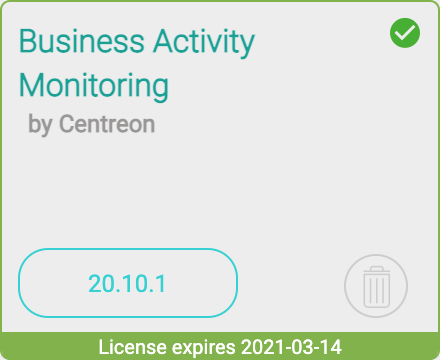

> Centreon BAM est une **extension** Centreon qui requiert une license valide. Pour plus d'information,
> contactez [Centreon](mailto:sales@centreon.com).

## Prerequisites

La version de Centreon nécessaire au fonctionnement de Centreon BAM est la version  **Centreon 20.04**

## Installation

### Installation du paquet

Ajouter le dépôt Centreon BAM, vous pouvez le trouver sur le 
[portail support](https://support.centreon.com/s/repositories).

Et installer le paquet en exécutant la commande ci-dessous :

```
yum install centreon-bam-server
```

### Uploder la license

Le fichier de licence "bam.license" est fourni par Centreon, pour
l'installer, rendez vous dans `Administration > Extensions > Manager` puis
télécharger la via l'interface.

### Installation sur l'interface

Se rendre dans le menu `Administration > Extensions > Gestionnaire` et cliquez
sur le bouton d'installation des modules suivantes :

- License Manager (si celui-ci n'est pas déjà installé)
- Business Activity Monitoring


Une fois installé et la licence ajoutée, le module sera encadré en vert et
indiquera la date de fin de validité de la licence :



> Si vous utilisez une réplication MariaDB pour vos bases de données de
> **monitoring**, lors de l'installation de Centreon BAM, une vue est
> créée. Il faut l'exclure de la réplication en rajoutant la ligne
> suivante dans le fichier my.cnf du slave
> ```
> replicate-ignore-table=centreon.mod_bam_view_kpi
> ```
> puis créer les vues sur le slave en lançant la commande:
>
> ````
> myqsl> centreon < view_creation.sql