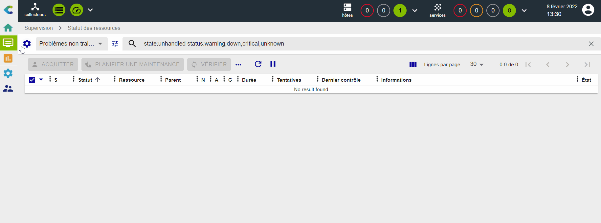

### Superviser une base de données MySQL ou MariaDB

### Prérequis

L'objectif de ce tutoriel est de superviser une base de données Mysql/MariaDB. Nous partons du principe que vous disposez d'une base de données à superviser.
Afin de pouvoir collecter les informations nécessaires à partir de la base de données, un utilisateur de la base de données disposant de privilèges spécifiques sera nécessaire :
```
# grant ALL PRIVILEGES on *.* to 'centreon'@'IP_POLLER' identified by 'password'
```

#### Ajout du Plugin Pack

La base de données sera supervisée à l'aide du Plugin Pack **MySQL/MariaDB**
Rendez-vous dans le menu **Configuration > Packs de plugins** et installez le Plugin Pack **MySQL/MariaDB** :


#### Configurer l'hôte et déployer la configuration 

Pour ajouter un hôte à la supervision, rendez-vous dans le menu **Configuration > Hôtes > Hôtes** et cliquez sur le bouton **Ajouter** :


Renseignez les informations suivantes :

* Le nom de votre serveur
* Une description de votre serveur
* Son adresse IP
* Sélectionner le collecteur approprié (laissez "Central" si vous n'avez pas d'autre collecteur)
* Cliquez sur le bouton **+ Ajouter une nouvelle entrée** pour le champ **Modèles** puis sélectionnez le modèle
**App-DB-MySQL-custom**.


Une liste de macros en correspondance avec le modèle va alors apparaître :


Renseignez la valeur des macros suivantes :

* **MYSQLUSERNAME** : le nom de l'utilisateur pour se connecter à la base de données.
* **MYSQLPASSWORD** : le mot de passe associé à l'utilisateur.
* **MYSQLPORT** : le port d'écoute de la base de données, par défaut 3306.

Puis, cliquez sur le bouton **Sauvegarder**.

Votre équipement a été ajouté à la configuration de la supervision :


Allez dans **Configuration > Services > Services par hôte**. Un ensemble d'indicateurs a été créé automatiquement.


Il est maintenant temps de [déployer la supervision](#déployer-une-configuration).

Rendez-vous dans le menu **Supervision > Status des ressources** et sélectionnez la valeur **Tous** pour le
filtre **Afficher les détails**. Après quelques minutes, les premiers résultats de la supervision apparaissent :

