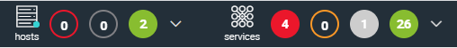
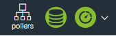

Vous pouvez donner des droits aux [utilisateurs](../monitoring/basic-objects/contacts) de Centreon :
- sur les ressources : quels hôtes, services, etc. l'utilisateur aura le droit de voir
- sur les menus de l'interface Centreon (à quelles pages il pourra accéder)
- sur les actions que l'utilisateur pourra réaliser sur les ressources ou sur un moteur de supervision (mettre une ressource en maintenance, exporter la configuration...).

Ces droits ne sont pas définis par utilisateur mais par [groupes d'accès](#créer-un-groupe-daccès). 

- Un même utilisateur peut appartenir à plusieurs groupes d'accès : il cumulera les droits de ces différents groupes. 
- Un utilisateur non administrateur n'appartenant à aucun groupe d'accès n'a aucun droit sur la plateforme de supervision (écran vide après connexion).
- Les utilisateurs définis comme [Administrateurs](../monitoring/basic-objects/contacts-create#onglet-authentification-centreon) ont tous les droits (même si vous ajoutez un utilisateur administrateur à un groupe d'accès aux droits limités). 

Les ACLs sont recalculées toutes les minutes, c'est pourquoi il est parfois
nécessaire de patienter quelques instants avant de voir appliquer la
modification sur le profil. Vous pouvez également [forcer le recalcul des ACL](#recalculer-les-acls).

> Les modules Centreon
> [MBI](../reporting/configure), BAM et [MAP](../graph-views/configure) ont leurs propres ACL.

## Donner des droits à un utilisateur

Pour donner des droits à un utilisateur :
1. [Créez l'utilisateur](../monitoring/basic-objects/contacts). 
2. [Créez un groupe d'accès](#créer-un-groupe-daccès).
3. Ajoutez l'utilisateur au groupe d'accès.
4. Créez des filtres d'accès aux [menus](#filtres-daccès-aux-menus), aux [ressources](#filtres-daccès-aux-ressources) et aux [actions](#filtres-daccès-sur-les-actions).
5. Définissez les droits désirés :
    - soit sur le groupe d'accès
    - soit au niveau des filtres d'accès aux menus, ressources et actions.

## Créer un groupe d'accès

Pour créer un groupe d'accès :

1. À la page **Administration > ACL > Gestion des groupes d'accès**, cliquez sur **Ajouter**.

3. Dans l'onglet **Informations générales**, renseignez le 
    **Nom du groupe** et son **Alias** (sa description).

4. Pour ajouter des utilisateurs (contacts) ou des groupes de contacts au groupe d'accès, utilisez le tableau **Contacts liés**/**Groupes de contacts liés**. (Sélectionnez le ou les utilisateurs désirés dans la colonne **Disponible** puis cliquez sur **Ajouter**. 
L'utilisateur ou le groupe d'utilisateurs passe dans la colonne **Sélectionné**.)

  > Les groupes de contacts peuvent être des groupes provenant de l'annuaire LDAP
  > connecté à l'interface Centreon.
  >
  > Les groupes créés dans Centreon ne doivent pas avoir le même nom que les groupes
  > LDAP. Si c'est le cas, les groupes dans Centreon devront être renommés.

5. Dans l'onglet **Autorisations**, définissez les droits désirés sur le groupe d'accès en choisissant les filtres d'accès aux [menus](#filtres-daccès-aux-menus), [ressources](#filtres-daccès-aux-ressources) et [actions](#filtres-daccès-sur-les-actions) (si vous les avez déjà créés).

6. Cliquez sur **Enregistrer**.

## Créer des filtres d'accès aux ressources, menus et actions

### Filtres d'accès aux ressources

Les filtres d'accès aux ressources permettent de définir quels
objets (hôtes, groupes d'hôtes, services, groupes de services) l'utilisateur pourra voir dans l'interface Centreon.

Pour créer un filtre d'accès aux ressources :

1. Rendez-vous dans le menu **Administration > ACL > Gestion des accès aux ressources**.

2. Cliquez sur **Ajouter**.

3. Remplissez les champs désirés (voir tableau ci-dessous).

5. Cliquez sur **Sauvegarder**.

> Une fois les filtres sur les ressources paramétrés, vous pouvez visualiser le
> résultat via le menu **Vérifier la vue de l'utilisateur** à côté de l'option
> d'ajout de filtre à la page **Administration > ACL > Gestion des accès aux ressources**.

#### Référence

| Onglet                 | Actions                                                                                                                                                                                                                                                                                                    |
|------------------------|------------------------------------------------------------------------------------------------------------------------------------------------------------------------------------------------------------------------------------------------------------------------------------------------------------------------------------------------------------------------------------------------------------------------------------------------------------------------------------------------------------------------------------------------------------------------------------------------|
| **Informations générales** | <ul> <li>Utilisez le tableau **Groupes liés** pour lier des groupes d'accès à ce filtre de ressources, c'est à dire leur appliquer les droits définis dans le filtre.</li><li>**Statut** et **Commentaires** permettent d'activer/désactiver le filtre ainsi que de le commenter.</li></ul>                                                                                                                                                                                                                |
| **Gestion des hôtes**    | <ul><li>Définissez quels hôtes et quels groupes d'hôtes l'utilisateur pourra voir dans l'interface Centreon</li><li>Si la case **Inclure tous les hôtes** ou **Inclure tous les groupes d'hôtes** est cochée, alors tout hôte ou groupe d'hôtes nouvellement créé sera automatiquement ajouté au filtre.</li></ul>   
Dans le cas où les options **Inclure tous les hôtes** ou **Inclure tous les groupes d'hôtes** sont cochées, il est possible d'exclure explicitement des hôtes du filtre (par exemple dans le cas où seulement 1 ou 2 hôtes ne doivent pas faire partie du filtre). 
                                                                       |
| **Gestion des services** | L'onglet **Gestion des services** permet de définir quels groupes de services l'utilisateur pourra voir.                                                                                                                                     |
| **Méta-Services**       | L'onglet **Méta-Services** permet de définir quels méta-services l'utilisateur pourra voir.                                                                                                                                     |
| **Filtres**                | <ul><li>La liste **Filtrer par collecteur** permet de sélectionner les hôtes en fonction des collecteurs de supervision (si aucun n'est sélectionné alors tous les collecteurs sont pris en compte)</li><li>La liste **Filtrer par catégorie d'hôte** permet de filtrer les hôtes par catégorie</li><li>La liste **Filtrer par catégorie de service** permet de filtrer les services par catégorie. Les filtres par collecteur ou par catégorie d'objet sont des filtres d'inclusion (UNION). Seuls les objets appartenant à ces filtres en plus des groupes d'objets (hôtes et services) seront visibles.</li></ul> |

### Filtres d'accès aux menus

Les filtres d'accès aux menus permettent de définir à quels menus de l'interface Centreon
l'utilisateur pourra accéder. 

> L’accès au menu d’édition des commandes, ainsi que l’accès au menu d’édition des
> traps SNMP peut être très dangereux. En effet, un utilisateur privilégié peut
> créer des commandes pouvant permettre la création de failles de sécurité (RCE).
> Ne donnez cet accès qu’à des personnes dignes de confiance.

Pour créer un filtre d'accès aux menus :

1. Rendez-vous dans le menu **Administration > ACL > Gestion des accès aux menus**.
2. Cliquez sur **Ajouter**.
3. Remplissez les champs :
    - **Nom de l'ACL** et **Alias**.
    - **Statut** : activer ou désactiver le filtre
    - **Commentaires** : donne des indications sur le filtre.

4. Pour appliquer les droits définis dans ce filtre à des [groupes d'accès](#créer-un-groupe-daccès), utilisez le tableau **Groupes liés**.

5. Dans la section **Pages disponibles**, définissez les menus auxquels le groupe d'accès aura accès.   

    - Le menu parent doit être coché pour pouvoir accéder au menu enfant.

    - Par défaut, l’accès est donné en lecture seule. Si vous
 souhaitez autoriser vos utilisateurs à modifier la configuration,
 sélectionnez l’option **Lecture/Écriture** pour chaque sous-menu.

    - Pour pouvoir accéder à un niveau de menu 'n-1', l'utilisateur doit avoir accès au menu
 de niveau 'n' sinon ce dernier ne pourra pas naviguer jusqu'au menu via
 l'interface. L'utilisateur devra accéder à la
 page concernée via un lien direct (autologin...).

    - À chaque ajout de nouveau module Centreon possédant une interface web accessible
 au travers d'un nouveau menu, ce dernier devra être ajouté au filtre afin que les utilisateurs puissent y accéder le cas échéant.

6. Cliquez sur **Sauvegarder**.

### Filtres d'accès sur les actions

Les filtres sur les actions permettent de définir quelles actions
l'utilisateur pourra réaliser sur les ressources (hôtes et services) et sur les moteurs de supervision.

Pour créer un filtre d'accès aux actions :

1. Rendez-vous dans le menu **Administration > ACL > Gestion des accès sur les actions**.
2. Cliquez sur **Ajouter**.

    - Les champs **Nom de l'action** et **Description** contiennent le nom du
    filtre ainsi que sa description
    - Dans la section **Relations**, utilisez le tableau **Groupes liés** pour attribuer aux utilisateurs des [groupes d'accès](#créer-un-groupe-daccès) les droits définis dans le filtre.

3. Cochez les cases correspondant aux options désirées (voir tableaux ci-dessous).

4. Cliquez sur **Sauvegarder**.

#### Accès aux fonctionnalités globales

| Champ                                                           | Actions associées                                                                                 |
| --------------------------------------------------------------- | ------------------------------------------------------------------------------------------------- |
| Afficher les statistiques des hôtes et services dans le bandeau | Affiche les statistiques de supervision sous forme de tableau présent dans le bandeau de Centreon   |
| Afficher les statistiques des collecteurs dans le bandeau       | Affiche les statistiques des collecteurs en haut à gauche  |
| Afficher la liste des collecteurs                               | Permet de filtrer selon le collecteur à la page **Supervision > Détail des statuts > Hôtes** ou  **Supervision > Détail des statuts > Services** (pages dépréciées)  |

#### Configuration des actions

| Champ                                   | Actions associées                                                                                                                             |
| --------------------------------------- | --------------------------------------------------------------------------------------------------------------------------------------------- |
| Générer les fichiers de configuration   | Permet de générer, tester et exporter la configuration des collecteurs et de redémarrer les moteurs de supervision                            |
| Générer la configuration des traps SNMP | Permet de générer et exporter la configuration des traps SNMP pour le processus Centreontrapd sur les collecteurs et de redémarrer ce dernier |

#### Actions globales du moteur de supervision (Commandes externes)

Ces champs ne sont plus utilisés.

#### Accès aux actions sur les services

| Champ                                                          | Actions associées                                                                |
| -------------------------------------------------------------- | -------------------------------------------------------------------------------- |
| Activer/Désactiver les vérifications pour un service           | Permettre à l'utilisateur d'activer/désactiver les vérifications pour un service à la page **Supervision > Détail des statuts > Services** (page dépréciée)                              |
| Activer/Désactiver les notifications pour un service           | Permettre à l'utilisateur d'activer/désactiver les notifications pour un service à la page **Supervision > Détail des statuts > Services** (page dépréciée)                             |
| Acquitter un service                     | Permettre à l'utilisateur [d'acquitter un service](../alerts-notifications/acknowledge)                                |
| Supprimer l'acquittement de l'incident du service                      | Permettre à l'utilisateur de supprimer un acquittement sur un service               |
| Re-planifier la prochaine vérification d'un service            | Permettre à l'utilisateur de [lancer la vérification d'un service](../alerts-notifications/resources-status#relancer-un-contrôle). La vérification est faite même si l'on se trouve hors de la période de contrôle du service.                              |
| Re-planifier la prochaine vérification d'un service (Forcé)    | Permettre à l'utilisateur de [lancer la vérification d'un service](../alerts-notifications/resources-status#relancer-un-contrôle). La vérification est faite même si l'on se trouve hors de la période de contrôle du service.                     |
| Planifier une plage de maintenance pour un service                     | Permettre à l'utilisateur de [planifier un temps d'arrêt](../alerts-notifications/downtimes) pour un service                                       |
| Ajouter/Supprimer un commentaire pour un service               | Autoriser l'utilisateur à ajouter des [commentaires](../alerts-notifications/other#ajouter-un-commentaire) pour un service                                |
| Activer/Désactiver le gestionnaire d'évènements pour un service | Permettre à l'utilisateur d'activer/désactiver le gestionnaire d'évènements pour un service à la page de détails d'un service accessible via le menu **Supervision > Détail des statuts > Services** (page dépréciée)                  |
| Activer/Désactiver la détection de bagotage d'un service       | Activer/Désactiver la détection du statut FLAPPING (ou bagotage) pour un service à la page de détails d'un service accessible via le menu **Supervision > Détail des statuts > Services** (page dépréciée)  |
| Activer/Désactiver le contrôle passif d'un service             | Activer/Désactiver le contrôle passif pour les services à la page de détails d'un service accessible via le menu **Supervision > Détail des statuts > Services** (page dépréciée)                        |
| [Soumettre un résultat](../alerts-notifications/submit) pour un service                          | Permettre à l'utilisateur de modifier manuellement le statut d'un service passif jusqu'au prochain contrôle                            |
| Afficher la commande exécutée par le moteur de supervision        | Pour l'utilisateur, affiche la commande exécutée pour un service dans le [panneau **Détails** du service](../alerts-notifications/resources-status#panneau-de-service)            |

#### Accès aux actions sur les hôtes

| Champ                                                       | Actions associées                                                             |
| ----------------------------------------------------------- | ----------------------------------------------------------------------------- |
| Activer/Désactiver les vérifications pour un hôte           | Activer/Désactiver les vérifications pour un hôte à la page **Supervision > Détail des statuts > Hôtes** (page dépréciée)                               |
| Activer/Désactiver les notifications pour un hôte           | Activer/Désactiver les notifications pour un hôte à la page **Supervision > Détail des statuts > Hôtes** (page dépréciée)                               |
| Acquitter un hôte                    | Permettre aux utilisateurs [d'acquitter un hôte](../alerts-notifications/acknowledge)                          |
| Supprimer l'acquittement de l'incident de l'hôte               | Permettre aux utilisateurs de supprimer un acquittement d'un hôte             |
| Planifier la vérification pour un hôte            | Permettre à l'utilisateur de [lancer la vérification](../alerts-notifications/resources-status#relancer-un-contrôle) d'un hôte                              |
| Planifier la vérification pour un hôte (Forcé)    | Permettre à l'utilisateur de [lancer la vérification](../alerts-notifications/resources-status#relancer-un-contrôle) d'un hôte                            |
| Planifier une plage de maintenance pour un hôte                    | Permettre à l'utilisateur de [planifier un temps d'arrêt](../alerts-notifications/downtimes) pour un hôte                                       |
| Ajouter/Supprimer un commentaire pour un hôte               | Autoriser l'utilisateur à ajouter des [commentaires](../alerts-notifications/other#ajouter-un-commentaire) pour un hôte                                |
| Activer/Désactiver le gestionnaire d'évènements pour un hôte | Activer/Désactiver le gestionnaire d'évènements pour un hôte à la page de détails d'un hôte accessible via le menu **Supervision > Détail des statuts > Hôtes** (page dépréciée)                            |
| Activer/Désactiver la détection de bagotage pour un hôte       | Activer/Désactiver la détection du statut FLAPPING (ou bagotage) pour un hôte à la page de détails d'un hôte accessible via le menu **Supervision > Détail des statuts > Hôtes** (page dépréciée)          |
| Activer/Désactiver les contrôles des services de l'hôte     | Activer/Désactiver les contrôles des services d'un hôte  à la page de détails d'un hôte accessible via le menu **Supervision > Détail des statuts > Hôtes** (page dépréciée)                                |
| Activer/désactiver les notifications de service de l'hôte   | Activer/Désactiver les notifications des services d'un hôte à la page de détails d'un hôte accessible via le menu **Supervision > Détail des statuts > Hôtes** (page dépréciée)  |
| [Soumettre le résultat](../alerts-notifications/submit) pour un hôte                          | Permettre à l'utilisateur de modifier manuellement le statut d'un hôte passif jusqu'au prochain contrôle                           |

- Le champ **Statut** permet d'activer ou de désactiver le filtre

## Recalculer les ACLs

Il est possible de recalculer manuellement les ACLs :

1. Rendez-vous dans le menu **Administration > ACL > Recharger les ACL**
3. Sélectionnez le ou les utilisateurs pour lesquels vous souhaitez recharger
les ACL.
4. Dans le menu **Plus d'actions**, cliquez sur **Recharger les ACL**.
