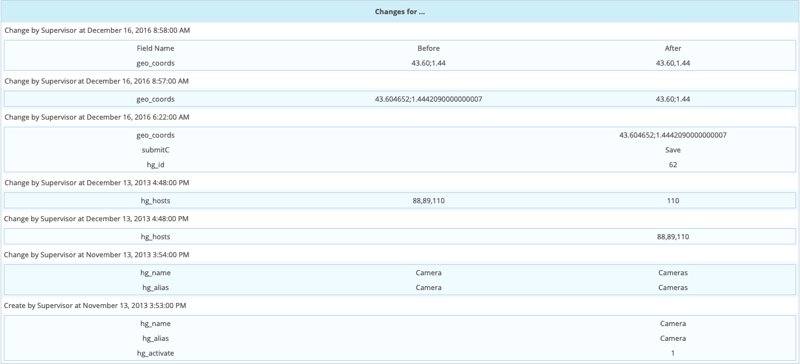
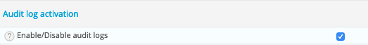

## Principe

Par défaut, Centreon conserve dans un journal toutes les actions utilisateurs
concernant la modification de la configuration de la supervision. Pour accéder à
ces informations, rendez-vous dans le menu `Administration > Logs`.

La barre de recherche grise vous permet de filtrer les informations présentées
via les filtres :

  - **Objet** permettant de filtrer sur le nom de l'objet (hôte, service,
    contact, définition de trap SNMP, groupe, ...)
  - **Utilisateur** permettant de filtrer par auteur de modification
  - **Type d'objet** permettant de filtrer par type d'objet modifié.

## Pratique

Exemple : Pour voir toutes les actions faites par l'utilisateur **admin**,
renseignez "admin" dans le champ **Utilisateur** puis cliquez sur
**Rechercher**.

Le tableau ci-dessous définit les colonnes du tableau de résultats :

<table>
<colgroup>
<col style="width: 17%" />
<col style="width: 82%" />
</colgroup>
<thead>
<tr class="header">
<th>Colonne</th>
<th>Description</th>
</tr>
</thead>
<tbody>
<tr class="odd">
<td>Heures</td>
<td>Indique la date et l'heure de l'évènement</td>
</tr>
<tr class="even">
<td>Type de modification</td>
<td>
Contient le type d'action effectuée. Il existe plusieurs types d'actions possibles :

<ul>
<li>Ajouté : Indique que l'objet a été ajouté</li>
<li>Modifié : Indique que l'objet a été modifié</li>
<li>Supprimé : Indique que l'objet a été supprimé</li>
<li>Changement massif : Indique un changement massif de configuration sur des objets</li>
<li>Activé : Indique que l'objet a été activé</li>
<li>Désactivé : Indique que l'objet a été désactivé</li>
</ul></td>
</tr>
<tr class="odd">
<td>Type</td>
<td>Indique le type d'objet concerné</td>
</tr>
<tr class="even">
<td>Objet</td>
<td>Indique le nom de l'objet concerné</td>
</tr>
<tr class="odd">
<td>Auteur</td>
<td>Indique l'utilisateur ayant effectué cette modification</td>
</tr>
</tbody>
</table>

En cliquant sur le nom d'un objet, vous pouvez visualiser l'historique des
modifications réalisées sur ce dernier.

Le tableau ci-dessous définit les colonnes du tableau des modifications :

<table>
<colgroup>
<col style="width: 27%" />
<col style="width: 72%" />
</colgroup>
<thead>
<tr class="header">
<th>Colonne</th>
<th>Description</th>
</tr>
</thead>
<tbody>
<tr class="odd">
<td>Date</td>
<td>Date et heure de la modification</td>
</tr>
<tr class="even">
<td>Nom de l'utilisateur</td>
<td>Nom de la personne ayant réalisé la modification</td>
</tr>
<tr class="odd">
<td>Type</td>
<td>Type de modification</td>
</tr>
<tr class="even">
<td></td>
<td>
La dernière colonne décrit la modification en elle-même :

<ul>
<li>Nom du champ : Décrit le champ du formulaire modifié</li>
<li>Avant : Indique l'ancienne valeur</li>
<li>Après : Indique la nouvelle valeur</li>
</ul></td>
</tr>
</tbody>
</table>

## Configuration

Pour activer la journalisation des actions utilisateurs, rendez-vous dans le
menu `Administration > Paramètres > Options` et cocher la case
**Activer/Désactiver les journaux d'audit**:

