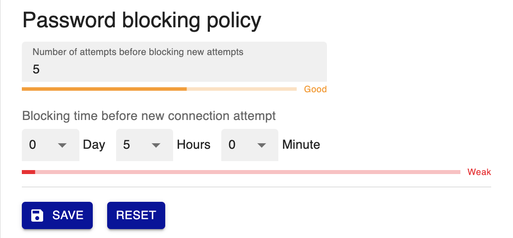
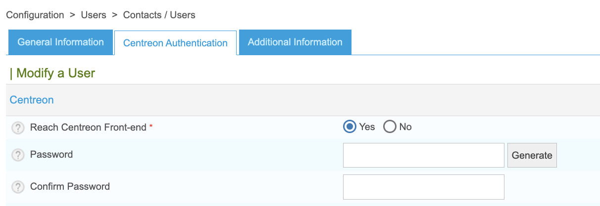

> Depuis Centreon 22.04, une **politique de sécurité par mot de passe** a été mise en place.

## Configurer la politique de sécurité de mot de passe

### Politique de complexité des mots de passe

Allez à la page **Administration > Authentication** et renseigner les valeurs **password minimum length** et
**password complexity** :

### Politique d'expiration du mot de passe

Configurer la politique d'expiration :

- **Password expiration**: Une fois le mot de passe expiré, l'utilisateur sera redirigé vers une page dédiée pour
  mettre à jour son mot de passe.
- **Time before setting a new password**: Délais entre deux changements de mots de passe.
- **Can reuse last 3 passwords**: Cette option permet à l'utilisateur de ne pas réutiliser l'un de ses 3 anciens mots
  de passe lors du renouvellement.
- **Excluded users**: Cette option permet d'exclure des comptes utilisateurs, notamment les comptes accédant aux API,
  de la politique d'expiration des mots de passe.

### Politique de blocage des mots de passe

Pour bloquer les attaques de type force brute, vous pouvez définir le nombre de tentatives infructueuses avant de
bloquer les utilisateurs avant toute nouvelle tentative de connexion :

## Autoriser les utilisateurs à accéder à Centreon

Pour autoriser un [utilisateur](../monitoring/basic-objects/contacts) à accéder à l'interface Centreon, allez à la page
**Configuration > Utilisateurs > Contacts/Utilisateurs** et cliquez sur l'utilisateur désiré.

Dans l'onglet **Authentification Centreon**, mettez le champ **Autoriser l'utilisateur à se connecter à l'interface web**
à **Oui**, puis renseignez les champs **Mot de passe** et **Confirmation du mot de passe**. Utilisez le bouton **Générer**
pour générer une chaîne de caractères aléatoires basée sur la **politique de sécurité par mot de passe**:

Les utilisateurs peuvent changer leur mot de passe en cliquant sur l'icône profil dans le coin supérieur droit de l'écran,
puis en cliquant sur **Éditer le profil**. De plus, le délai d'expiration du mot de passe est maintenant affiché :

